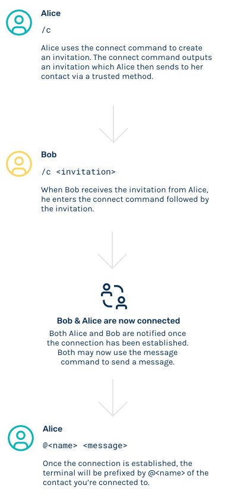

# SimpleX - the first chat platform that is 100% private by design - it has no access to your connection graph!

[](https://github.com/simplex-chat/simplex-chat/actions?query=workflow%3Abuild)
[](https://github.com/simplex-chat/simplex-chat/releases)
[](https://github.com/simplex-chat/simplex-chat/releases)
[](https://twitter.com/SimpleXChat)
[](https://www.reddit.com/r/SimpleXChat)

[](https://apps.apple.com/us/app/simplex-chat/id1605771084)
&nbsp;
[](https://play.google.com/store/apps/details?id=chat.simplex.app)
&nbsp;
[](https://app.simplex.chat)
&nbsp;
[](https://testflight.apple.com/join/DWuT2LQu)
&nbsp;
[](https://github.com/simplex-chat/website/raw/master/simplex.apk)

- 🖲 Protects your messages and metadata - who you talk to and when.
- 🔐 Double ratchet encryption.
- 📱 Mobile apps for Android ([Google Play](https://play.google.com/store/apps/details?id=chat.simplex.app), [APK](https://github.com/simplex-chat/website/raw/master/simplex.apk)) and [iOS](https://apps.apple.com/us/app/simplex-chat/id1605771084). [See the announcement here](https://github.com/simplex-chat/simplex-chat/blob/master/blog/20220308-simplex-chat-mobile-apps.md).
- 🚀 [TestFlight preview for iOS](https://testflight.apple.com/join/DWuT2LQu) with the new features 1-2 weeks earlier - **limited to 10,000 users**!
- 🖥 Available as a [terminal (console) app / CLI](#zap-quick-installation-of-a-terminal-app) on Linux, MacOS, Windows.

See [SimpleX overview](https://github.com/simplex-chat/simplexmq/blob/master/protocol/overview-tjr.md) for more information on platform objectives and technical design.

### :zap: Quick installation of a terminal app

```sh
curl -o- https://raw.githubusercontent.com/simplex-chat/simplex-chat/master/install.sh | bash
```

Once the chat client is installed, simply run `simplex-chat` from your terminal.


## Table of contents

- [Disclaimer](#disclaimer)
- [Network topology](#network-topology)
- [Terminal chat features](#terminal-chat-features)
- [Installation](#🚀-installation)
  - [Download chat client](#download-chat-client)
    - [Linux and MacOS](#linux-and-macos)
    - [Windows](#windows)
  - [Build from source](#build-from-source)
    - [Using Docker](#using-docker)
    - [Using Haskell stack](#using-haskell-stack)
- [Usage](#usage)
  - [Running the chat client](#running-the-chat-client)
  - [How to use SimpleX chat](#how-to-use-simplex-chat)
  - [Groups](#groups)
  - [Sending files](#sending-files)
  - [User contact addresses](#user-contact-addresses)
  - [Access chat history](#access-chat-history)
- [Roadmap](#Roadmap)
- [License](#license)

## Disclaimer

SimpleX Chat implements a new network topology for asynchronous communication combining the advantages and avoiding the disadvantages of federated and P2P networks.

[SimpleXMQ security model](https://github.com/simplex-chat/simplexmq/blob/master/protocol/overview-tjr.md) had many improvements in v1.0.0; the implementation has not been audited yet.

We use SimpleX Chat all the time, but you may find some bugs. We would really appreciate if you use it and let us know anything that needs to be fixed or improved.

## Network topology

SimpleX is a client-server network that uses redundant, disposable nodes to asynchronously pass messages via message queues, providing receiver and sender anonymity.

Unlike P2P networks, all messages are passed through one or several (for redundancy) servers, that do not even need to have persistence (in fact, the current [SMP server implementation](https://github.com/simplex-chat/simplexmq#smp-server) uses in-memory message storage, persisting only the queue records) - it provides better metadata protection than P2P designs, as no global participant ID is required, and avoids many [problems of P2P networks](https://github.com/simplex-chat/simplex-chat/blob/master/simplex.md#comparison-with-p2p-messaging-protocols).

Unlike federated networks, the participating server nodes **do not have records of the users**, **do not communicate with each other**, **do not store messages** after they are delivered to the recipients, and there is no way to discover the full list of participating servers. SimpleX network avoids the problem of metadata visibility that federated networks have and better protects the network, as servers do not communicate with each other. Each server node provides unidirectional "dumb pipes" to the users, that do authorization without authentication, having no knowledge of the the users or their contacts. Each queue is assigned two Ed448 keys - one for receiver and one for sender - and each queue access is authorized with a signature created using a respective key's private counterpart.

The routing of messages relies on the knowledge of client devices how user contacts and groups map at any given moment of time to these disposable queues on server nodes.

## Terminal chat features

- 1-to-1 chat with multiple people in the same terminal window.
- Group messaging.
- Sending files to contacts and groups.
- User contact addresses - establish connections via multiple-use contact links.
- Messages persisted in a local SQLite database.
- Auto-populated recipient name - just type your messages to reply to the sender once the connection is established.
- Demo SMP servers available and pre-configured in the app - or you can [deploy your own server](https://github.com/simplex-chat/simplexmq#using-smp-server-and-smp-agent).
- No global identity or any names visible to the server(s), ensuring full privacy of your contacts and conversations.
- Two layers of E2E encryption (double-ratchet for duplex connections, using X3DH key agreement with ephemeral Curve448 keys, and NaCl crypto_box for SMP queues, using Curve25519 keys) and out-of-band passing of recipient keys (see [How to use SimpleX chat](#how-to-use-simplex-chat)).
- Message integrity validation (via including the digests of the previous messages).
- Authentication of each command/message by SMP servers with automatically generated Ed448 keys.
- TLS 1.3 transport encryption.
- Additional encryption of messages from SMP server to recipient to reduce traffic correlation.

Public keys involved in key exchange are not used as identity, they are randomly generated for each contact.

See [Encryption Primitives Used](https://github.com/simplex-chat/simplexmq/blob/master/protocol/overview-tjr.md#encryption-primitives-used) for technical details.

<a name="🚀-installation"></a>

## 🚀 Installation

### Download chat client

#### Linux and MacOS

To **install** or **update** `simplex-chat`, you should run the install script. To do that, use the following cURL or Wget command:

```sh
curl -o- https://raw.githubusercontent.com/simplex-chat/simplex-chat/master/install.sh | bash
```

```sh
wget -qO- https://raw.githubusercontent.com/simplex-chat/simplex-chat/master/install.sh | bash
```

Once the chat client downloads, you can run it with `simplex-chat` command in your terminal.

Alternatively, you can manually download the chat binary for your system from the [latest stable release](https://github.com/simplex-chat/simplex-chat/releases) and make it executable as shown below.

```sh
chmod +x <binary>
mv <binary> ~/.local/bin/simplex-chat
```

(or any other preferred location on `PATH`).

On MacOS you also need to [allow Gatekeeper to run it](https://support.apple.com/en-us/HT202491).

#### Windows

```sh
move <binary> %APPDATA%/local/bin/simplex-chat.exe
```

### Build from source

> **Please note:** to build the app use source code from [stable branch](https://github.com/simplex-chat/simplex-chat/tree/stable).

#### Using Docker

On Linux, you can build the chat executable using [docker build with custom output](https://docs.docker.com/engine/reference/commandline/build/#custom-build-outputs):

```shell
$ git clone git@github.com:simplex-chat/simplex-chat.git
$ cd simplex-chat
$ git checkout stable
$ DOCKER_BUILDKIT=1 docker build --output ~/.local/bin .
```

> **Please note:** If you encounter `` version `GLIBC_2.28' not found `` error, rebuild it with `haskell:8.10.4-stretch` base image (change it in your local [Dockerfile](Dockerfile)).

#### Using Haskell stack

Install [Haskell stack](https://docs.haskellstack.org/en/stable/README/):

```shell
curl -sSL https://get.haskellstack.org/ | sh
```

and build the project:

```shell
$ git clone git@github.com:simplex-chat/simplex-chat.git
$ cd simplex-chat
$ git checkout stable
$ stack install
```

## Usage

### Running the chat client

To start the chat client, run `simplex-chat` from the terminal.

By default, app data directory is created in the home directory (`~/.simplex`, or `%APPDATA%/simplex` on Windows), and two SQLite database files `simplex_v1_chat.db` and `simplex_v1_agent.db` are initialized in it.

To specify a different file path prefix for the database files use `-d` command line option:

```shell
$ simplex-chat -d alice
```

Running above, for example, would create `alice_v1_chat.db` and `alice_v1_agent.db` database files in current directory.

Three default SMP servers are hosted on Linode - they are [pre-configured in the app](https://github.com/simplex-chat/simplex-chat/blob/master/src/Simplex/Chat/Options.hs#L42).

If you deployed your own SMP server(s) you can configure client via `-s` option:

```shell
$ simplex-chat -s smp://LcJUMfVhwD8yxjAiSaDzzGF3-kLG4Uh0Fl_ZIjrRwjI=@smp.example.com
```

Base64url encoded string preceding the server address is the server's offline certificate fingerprint which is validated by client during TLS handshake.

You can still talk to people using default or any other server - it only affects the location of the message queue when you initiate the connection (and the reply queue can be on another server, as set by the other party's client).

Run `simplex-chat -h` to see all available options.

### How to use SimpleX chat

Once you have started the chat, you will be prompted to specify your "display name" and an optional "full name" to create a local chat profile. Your display name is an alias for your contacts to refer to you by - it is not unique and does not serve as a global identity. If some of your contacts chose the same display name, the chat client adds a numeric suffix to their local display name.

The diagram below shows how to connect and message a contact:

<div align="center">
  
</div>

Once you've set up your local profile, enter `/c` (for `/connect`) to create a new connection and generate an invitation. Send this invitation to your contact via any other channel.

You are able to create multiple invitations by entering `/connect` multiple times and sending these invitations to the corresponding contacts you'd like to connect with.

The invitation can only be used once and even if this is intercepted, the attacker would not be able to use it to send you the messages via this queue once your contact confirms that the connection is established. See agent protocol for explanation of [invitation format](https://github.com/simplex-chat/simplexmq/blob/master/protocol/agent-protocol.md#connection-request).

The contact who received the invitation should enter `/c <invitation>` to accept the connection. This establishes the connection, and both parties are notified.

They would then use `@<name> <message>` commands to send messages. You may also just start typing a message to send it to the contact that was the last.

Use `/help` in chat to see the list of available commands.

### Groups

To create a group use `/g <group>`, then add contacts to it with `/a <group> <name>`. You can then send messages to the group by entering  `#<group> <message>`. Use `/help groups` for other commands.


> **Please note**: the groups are not stored on any server, they are maintained as a list of members in the app database to whom the messages will be sent.

### Sending files

You can send a file to your contact with `/f @<contact> <file_path>` - the recipient will have to accept it before it is sent. Use `/help files` for other commands.


You can send files to a group with `/f #<group> <file_path>`.

### User contact addresses

As an alternative to one-time invitation links, you can create a long-term address with `/ad` (for `/address`). The created address can then be shared via any channel, and used by other users as a link to make a contact request with `/c <user_contact_address>`.

You can accept or reject incoming requests with `/ac <name>` and `/rc <name>` commands.

User address is "long-term" in a sense that it is a multiple-use connection link - it can be used until it is deleted by the user, in which case all established connections would still remain active (unlike how it works with email, when changing the address results in people not being able to message you).

Use `/help address` for other commands.


### Access chat history

SimpleX chat stores all your contacts and conversations in a local SQLite database, making it private and portable by design, owned and controlled by user.

You can view and search your chat history by querying your database. Run the below script to create message views in your database.

```sh
curl -o- https://raw.githubusercontent.com/simplex-chat/simplex-chat/master/message_views.sql | sqlite3 ~/.simplex/simplex_v1_chat.db
```

Open SQLite Command Line Shell:

```sh
sqlite3 ~/.simplex/simplex_v1_chat.db
```

See [Message queries](./message_queries.md) for examples.

> **Please note:** SQLite foreign key constraints are disabled by default, and must be **[enabled separately for each database connection](https://sqlite.org/foreignkeys.html#fk_enable)**. The latter can be achieved by running `PRAGMA foreign_keys = ON;` command on an open database connection. By running data altering queries without enabling foreign keys prior to that, you may risk putting your database in an inconsistent state.

**Convenience queries**

Get all messages from today (`chat_dt` is in UTC):

```sql
select * from all_messages_plain where date(chat_dt) > date('now', '-1 day') order by chat_dt;
```

Get overnight messages in the morning:

```sql
select * from all_messages_plain where chat_dt > datetime('now', '-15 hours') order by chat_dt;
```

## Roadmap

1. Mobile and desktop apps (in progress).
2. SMP protocol improvements:
   - SMP queue redundancy and rotation.
   - Message delivery confirmation.
   - Support multiple devices.
3. Privacy-preserving identity server for optional DNS-based contact/group addresses to simplify connection and discovery, but not used to deliver messages:
   - keep all your contacts and groups even if you lose the domain.
   - the server doesn't have information about your contacts and groups.
4. Media server to optimize sending large files to groups.
5. Channels server for large groups and broadcast channels.

## License

[AGPL v3](./LICENSE)
