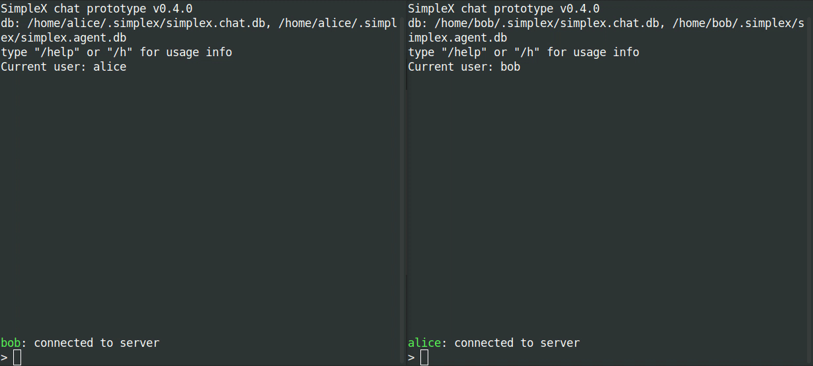

# SimpleX Chat

**The world's most private and secure chat** - open-source, decentralized, and without global identities of any kind.

[](https://github.com/simplex-chat/simplex-chat/actions?query=workflow%3Abuild)
[](https://github.com/simplex-chat/simplex-chat/releases)
[](https://github.com/simplex-chat/simplex-chat/releases)
[](https://twitter.com/simplexchat)
[](https://www.reddit.com/r/SimpleXChat)

SimpleX chat prototype is a thin terminal UI on top of [SimpleXMQ](https://github.com/simplex-chat/simplexmq) message broker that uses [SMP protocols](https://github.com/simplex-chat/simplexmq/blob/master/protocol). The motivation for SimpleX chat is [presented here](./simplex.md). See [simplex.chat](https://simplex.chat) website for chat demo and the explanations of the system and how SMP protocol works.

**NEW in v0.5.0: [user contact addresses](#user-contact-addresses-alpha)!**

**Please note**: v0.5.0 of SimpleX Chat works with the same database, but the connection links are not compatible with the previous version - please ask all your contacts to upgrade!

### :zap: Quick installation

```sh
curl -o- https://raw.githubusercontent.com/simplex-chat/simplex-chat/master/install.sh | bash
```

Once the chat client is installed, simply run `simplex-chat` from your terminal.

### :wave: Welcome

**We are building the world's most private and secure chat**. If you would like to support it, you can do so in the following ways:

- 🌟  **Star it on GitHub** - it helps us raise the visibility of the project.

- **Install the chat and try it out** - if you spot a bug, please [raise an issue](https://github.com/simplex-chat/simplex-chat/issues).

- :speech_balloon:  **Spread the word** - terminal chat is an [early-stage product](#disclaimer) while we stabilize the protocol - you can invite your friends for some fun chat inside your terminal. We're using it right inside our IDEs as we are coding it 👨‍💻

- **Make a donation** via [opencollective](https://opencollective.com/simplex-chat) - every donation helps, however large or small!

- **Make a contribution to the project** - we're constantly moving the project forward and there are always lots of things to do!

We appreciate all the help from our contributors, thank you!


## Table of contents

- [Disclaimer](#disclaimer)
- [Network topology](#network-topology)
- [Terminal chat features](#terminal-chat-features)
- [Installation](#🚀-installation)
  - [Download chat client](#download-chat-client)
    - [Linux and MacOS](#linux-and-macos)
      - [Troubleshooting on Unix](#troubleshooting-on-unix)
    - [Windows](#windows)
  - [Build from source](#build-from-source)
    - [Using Docker](#using-docker)
    - [Using Haskell stack](#using-haskell-stack)
- [Usage](#usage)
  - [Running the chat client](#running-the-chat-client)
  - [How to use SimpleX chat](#how-to-use-simplex-chat)
  - [Groups](#groups)
  - [Sending files](#sending-files)
  - [User contact addresses](#user-contact-addresses-alpha)
  - [Access chat history](#access-chat-history)
- [Roadmap](#Roadmap)
- [License](#license)

## Disclaimer

This is WIP implementation of SimpleX Chat that implements a new network topology for asynchronous communication combining the advantages and avoiding the disadvantages of federated and P2P networks.

If you expect software to be reliable most of the time, then this is probably not ready for you yet. We use it ourselves for terminal chat and it seems to work most of the time - we would really appreciate if you try SimpleX Chat and give us your feedback!

> :warning: **Please note:** The main differentiation of SimpleX network is the approach to internet message routing rather than encryption; for that reason no sufficient attention was paid to either TCP transport level encryption or to E2E encryption protocols - they are implemented in an ad hoc way based on RSA and AES algorithms. See [SMP protocol](https://github.com/simplex-chat/simplexmq/blob/master/protocol/simplex-messaging.md#appendix-a) on TCP transport encryption protocol (AEAD-GCM scheme, with an AES key negotiation based on RSA key hash known to the client in advance) and [this section](https://github.com/simplex-chat/simplexmq/blob/master/rfcs/2021-01-26-crypto.md#e2e-encryption) on E2E encryption protocol (an ad hoc hybrid scheme a la PGP). These protocols will change in a consumer ready version to something more robust.

## Network topology

SimpleX is a decentralized client-server network that uses redundant, disposable nodes to asynchronously pass messages via message queues, providing receiver and sender anonymity.

Unlike P2P networks, all messages are passed through one or several (for redundancy) servers, that do not even need to have persistence (in fact, the current [SMP server implementation](https://github.com/simplex-chat/simplexmq#smp-server) uses in-memory message storage, persisting only the queue records) - it provides better metadata protection than P2P designs, as no global participant ID is required, and avoids many [problems of P2P networks](https://github.com/simplex-chat/simplex-chat/blob/master/simplex.md#comparison-with-p2p-messaging-protocols).

Unlike federated networks, the participating server nodes **do not have records of the users**, **do not communicate with each other**, **do not store messages** after they are delivered to the recipients, and there is no way to discover the full list of participating servers. SimpleX network avoids the problem of metadata visibility that federated networks suffer from and better protects the network, as servers do not communicate with each other. Each server node provides unidirectional "dumb pipes" to the users, that do authorization without authentication, having no knowledge of the the users or their contacts. Each queue is assigned two RSA keys - one for receiver and one for sender - and each queue access is authorized with a signature created using a respective key's private counterpart.

The routing of messages relies on the knowledge of client devices how user contacts and groups map at any given moment of time to these disposable queues on server nodes.

## Terminal chat features

- 1-to-1 chat with multiple people in the same terminal window.
- Group messaging.
- Sending files to contacts and groups.
- User contact addresses - establish connections via multiple-use contact links.
- Auto-populated recipient name - just type your messages to reply to the sender once the connection is established.
- Demo SMP servers available and pre-configured in the app - or you can [deploy your own server](https://github.com/simplex-chat/simplexmq#using-smp-server-and-smp-agent).
- No global identity or any names visible to the server(s), ensuring full privacy of your contacts and conversations.
- E2E encryption, with RSA public key that has to be passed out-of-band (see [How to use SimpleX chat](#how-to-use-simplex-chat)).
- Message signing and verification with automatically generated RSA keys.
- Message integrity validation (via including the digests of the previous messages).
- Authentication of each command/message by SMP servers with automatically generated RSA key pairs.
- TCP transport encryption using SMP transport protocol.

RSA keys are not used as identity, they are randomly generated for each contact.

<a name="🚀-installation"></a>

## 🚀 Installation

### Download chat client

#### Linux and MacOS

To **install** or **update** `simplex-chat`, you should run the install script. To do that, use the following cURL or Wget command:

```sh
curl -o- https://raw.githubusercontent.com/simplex-chat/simplex-chat/master/install.sh | bash
```

```sh
wget -qO- https://raw.githubusercontent.com/simplex-chat/simplex-chat/master/install.sh | bash
```

Once the chat client downloads, you can run it with `simplex-chat` command in your terminal.

Alternatively, you can manually download the chat binary for your system from the [latest stable release](https://github.com/simplex-chat/simplex-chat/releases) and make it executable as shown below.

```sh
chmod +x <binary>
mv <binary> ~/.local/bin/simplex-chat
```

(or any other preferred location on `PATH`).

On MacOS you also need to [allow Gatekeeper to run it](https://support.apple.com/en-us/HT202491).

##### Troubleshooting on Unix

If you get `simplex-chat: command not found` when executing the downloaded binary, you need to add the directory containing it to the [`PATH` variable](https://man7.org/linux/man-pages/man7/environ.7.html) (find "PATH" in page). To modify `PATH` for future sessions, put `PATH="$PATH:/path/to/dir"` in `~/.profile`, or in `~/.bash_profile` if that's what you have. See [this answer](https://unix.stackexchange.com/a/26059) for the detailed explanation on the appropriate place to define environment variables for `bash` and other shells.

For example, if you followed the previous instructions, open `~/.profile` for editing:

```sh
vi ~/.profile
```

And add the following line to the end:

```sh
PATH="$PATH:$HOME/.local/bin"
```

Note that this will not automatically update your `PATH` for the remainder of the session. To do this, you should run:

```sh
source ~/.profile
```

Or restart your terminal to start a new session.

#### Windows

```sh
move <binary> %APPDATA%/local/bin/simplex-chat.exe
```

### Build from source

#### Using Docker

On Linux, you can build the chat executable using [docker build with custom output](https://docs.docker.com/engine/reference/commandline/build/#custom-build-outputs):

```shell
$ git clone git@github.com:simplex-chat/simplex-chat.git
$ cd simplex-chat
$ DOCKER_BUILDKIT=1 docker build --output ~/.local/bin .
```

> **Please note:** If you encounter `` version `GLIBC_2.28' not found `` error, rebuild it with `haskell:8.10.4-stretch` base image (change it in your local [Dockerfile](Dockerfile)).

#### Using Haskell stack

Install [Haskell stack](https://docs.haskellstack.org/en/stable/README/):

```shell
curl -sSL https://get.haskellstack.org/ | sh
```

and build the project:

```shell
$ git clone git@github.com:simplex-chat/simplex-chat.git
$ cd simplex-chat
$ stack install
```

## Usage

### Running the chat client

To start the chat client, run `simplex-chat` from the terminal. If you get `simplex-chat: command not found`, see [Troubleshooting on Unix](#troubleshooting-on-unix).

By default, app data directory is created in the home directory (`~/.simplex`, or `%APPDATA%/simplex` on Windows), and two SQLite database files `simplex.chat.db` and `simplex.agent.db` are initialized in it.

To specify a different file path prefix for the database files use `-d` command line option:

```shell
$ simplex-chat -d alice
```

Running above, for example, would create `alice.chat.db` and `alice.agent.db` database files in current directory.

Default SMP servers are hosted on Linode (London, UK and Fremont, CA) - they are [pre-configured in the app](https://github.com/simplex-chat/simplex-chat/blob/master/src/Simplex/Chat/Options.hs#L40). Base-64 encoded string after server host is the transport key digest.

If you deployed your own SMP server(s) you can configure client via `-s` option:

```shell
$ simplex-chat -s smp.example.com:5223#KXNE1m2E1m0lm92WGKet9CL6+lO742Vy5G6nsrkvgs8=
```

The base-64 encoded string in server address is the digest of RSA transport handshake key that the server will generate on the first run and output its digest.

You can still talk to people using default or any other server - it only affects the location of the message queue when you initiate the connection (and the reply queue can be on another server, as set by the other party's client).

Run `simplex-chat -h` to see all available options.

### How to use SimpleX chat

Once you have started the chat, you will be prompted to specify your "display name" and an optional "full name" to create a local chat profile. Your display name is an alias for your contacts to refer to you by - it is not unique and does not serve as a global identity. If some of your contacts chose the same display name, the chat client adds a numeric suffix to their local display name.

The diagram below shows how to connect and message a contact:

<div align="center">
  
</div>

Once you've set up your local profile, enter `/c` (for `/connect`) to create a new connection and generate an invitation. Send this invitation to your contact via any other channel.

You are able to create multiple invitations by entering `/connect` multiple times and sending these invitations to the corresponding contacts you'd like to connect with.

The invitation has the format `smp::<server>::<queue_id>::<rsa_public_key_for_this_queue_only>`. The invitation can only be used once and even if this is intercepted, the attacker would not be able to use it to send you the messages via this queue once your contact confirms that the connection is established.

The contact who received the invitation should enter `/c <invitation>` to accept the connection. This establishes the connection, and both parties are notified.

They would then use `@<name> <message>` commands to send messages. You may also just start typing a message to send it to the contact that was the last.

Use `/help` in chat to see the list of available commands.

### Groups

To create a group use `/g <group>`, then add contacts to it with `/a <group> <name>`. You can then send messages to the group by entering  `#<group> <message>`. Use `/help groups` for other commands.


> **Please note**: the groups are not stored on any server, they are maintained as a list of members in the app database to whom the messages will be sent.

### Sending files

You can send a file to your contact with `/f @<contact> <file_path>` - the recipient will have to accept it before it is sent. Use `/help files` for other commands.



You can send files to a group with `/f #<group> <file_path>`.

### User contact addresses (alpha)

As an alternative to one-time invitation links, you can create a long-term address with `/ad` (for `/address`). The created address can then be shared via any channel, and used by other users as a link to make a contact request with `/c <user_contact_address>`.

You can accept or reject incoming requests with `/ac <name>` and `/rc <name>` commands.

User address is "long-term" in a sense that it is a multiple-use connection link - it can be used until it is deleted by the user, in which case all established connections would still remain active (unlike how it works with email, when changing the address results in people not being able to message you).

Use `/help address` for other commands.

> :warning: **Please note:** This is an "alpha" feature - at the moment there is nothing to prevent someone who has obtained this address from spamming you with connection requests; countermeasures will be added soon!  (In the short term, you can simply delete the long-term address you created if it starts getting abused.)


### Access chat history

SimpleX chat stores all your contacts and conversations in a local database file, making it private and portable by design, owned and controlled by the user.

You can search your chat history via SQLite database file:

```
sqlite3 ~/.simplex/simplex.chat.db
```

Now you can query `direct_messages`, `group_messages` and `all_messages` (or simpler `direct_messages_plain`, `group_messages_plain` and `all_messages_plain`), for example:

```sql
-- you can put these or your preferred settings into ~/.sqliterc to persist across sqlite3 client sessions
.mode column
.headers on

-- simple views into direct, group and all_messages with user's messages deduplicated for group and all_messages
-- only 'x.msg.new' ("new message") chat events - filters out service events
-- msg_sent is 1 for sent, 0 for received
select * from direct_messages_plain;
select * from group_messages_plain;
select * from all_messages_plain;

-- query other details of your chat history with regular SQL
select * from direct_messages where msg_sent = 1 and chat_msg_event = 'x.file'; -- files you offered for sending
select * from direct_messages where msg_sent = 0 and contact = 'catherine' and msg_body like '%cats%'; -- everything catherine sent related to cats
select contact, count(1) as num_messages from direct_messages group by contact; -- aggregate your chat data
select * from group_messages where group_name = 'team' and contact = 'alice'; -- all correspondence with alice in #team
```

**Convenience queries**

Get all messages from today (`chat_dt` is in UTC):

```sql
select * from all_messages_plain where date(chat_dt) > date('now', '-1 day') order by chat_dt;
```

Get overnight messages in the morning:

```sql
select * from all_messages_plain where chat_dt > datetime('now', '-15 hours') order by chat_dt;
```

> **Please note:** SQLite foreign key constraints are disabled by default, and must be **[enabled separately for each database connection](https://sqlite.org/foreignkeys.html#fk_enable)**. The latter can be achieved by running `PRAGMA foreign_keys = ON;` command on an open database connection. By running data altering queries without enabling foreign keys prior to that, you may risk putting your database in an inconsistent state.

## Roadmap

1. Mobile and desktop apps (in progress).
2. SMP protocol improvements:
   - SMP queue redundancy and rotation.
   - Message delivery confirmation.
   - Support multiple devices.
3. Privacy-preserving identity server for optional DNS-based contact/group addresses to simplify connection and discovery, but not used to deliver messages:
   - keep all your contacts and groups even if you lose the domain.
   - the server doesn't have information about your contacts and groups.
4. Media server to optimize sending large files to groups.
5. Channels server for large groups and broadcast channels.

## License

[AGPL v3](./LICENSE)
