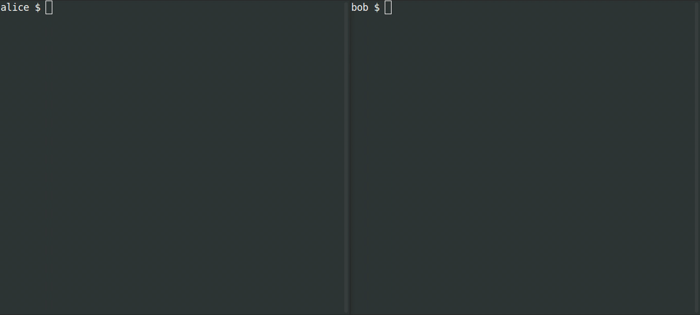

# SimpleX - the first messaging platform that has no user identifiers of any kind - 100% private by design!

[](https://github.com/simplex-chat/simplex-chat/actions?query=workflow%3Abuild)
[](https://github.com/simplex-chat/simplex-chat/releases)
[](https://github.com/simplex-chat/simplex-chat/releases)
[](https://twitter.com/SimpleXChat)
[](https://www.reddit.com/r/SimpleXChat)

[](https://apps.apple.com/us/app/simplex-chat/id1605771084)
&nbsp;
[](https://play.google.com/store/apps/details?id=chat.simplex.app)
&nbsp;
[](https://app.simplex.chat)
&nbsp;
[](https://testflight.apple.com/join/DWuT2LQu)
&nbsp;
[](https://github.com/simplex-chat/website/raw/master/simplex.apk)

- 🖲 Protects your messages and metadata - who you talk to and when.
- 🔐 Double ratchet end-to-end encryption, with additional encryption layer.
- 📱 Mobile apps for Android ([Google Play](https://play.google.com/store/apps/details?id=chat.simplex.app), [APK](https://github.com/simplex-chat/website/raw/master/simplex.apk)) and [iOS](https://apps.apple.com/us/app/simplex-chat/id1605771084).
- 🚀 [TestFlight preview for iOS](https://testflight.apple.com/join/DWuT2LQu) with the new features 1-2 weeks earlier - **limited to 10,000 users**!
- 🖥 Available as a terminal (console) app / CLI on Linux, MacOS, Windows.

## SimpleX unique approach to privacy and security

Everyone should care about privacy and security of their communications - even ordinary conversations can put you in danger.

### Full privacy of your identity, profile, contacts and metadata

**Unlike any other existing messaging platform, SimpleX, has no identifiers assigned to the users** - SimpleX does not use phone numbers (like Signal or WhatsApp), domain-based addresses (like XMPP or Matrix), usernames (like Telegram), public keys or even random numbers (like all other messengers) to identify its users - we do not even know how many people use SimpleX.

To deliver the messages instead of user identifiers that all other platforms use, SimpleX uses the addresses of unidirectional (simplex) message queues. Using SimpleX is like having a different email address or a phone number for each contact you have, but without the hassle of managing all these addresses. In the near future SimpleX apps will also change the message queues automatically, moving the conversations from one server to another, to provide even better privacy to the users.

This approach protects the privacy of who are you communicating with, hiding it from SimpleX platform servers and from any observers. You can further improve your privacy by configuring your network access to connect SimpleX servers via some overlay transport network, e.g. Tor.

### The best protection against spam and abuse

As you would have no identifier on SimpleX platform, you cannot be contacted unless you share a one-time invitation link or an optional temporary user address. Even with the optinal user addresses, while they make it possible to send spam contact requests, you can change or completely delete it without losing any of your connections.

### Complete ownership, control and security of your data

SimpleX stores all user data on client devices, the messages are only held temporarily on SimpleX relay servers until they are received.

We use portable database format that can be used on all supported devices - we will soon add the ability to export the database from mobile apps so it can be used on another device.

Unlike servers of federated networks (email, XMPP or Matrix), SimpleX servers do not store user accounts, they simply relay messages to the recipients, protecting the privacy of both parties. There are no identifiers or encrypted messages in common between sent and received traffic of the server, thanks to the additional encryption layer for delivered messages. So if anybody is observing server traffic, they cannot determine who is communicating with whom (other than by message time).

### Users own SimpleX network

You can use SimpleX with your own servers and still communicate with people using the servers that are pre-configured in the apps or any other SimpleX servers.

SimpleX platform uses an open public protocol, and provides SDK to create chat bots, allowing implementation of services that users can interact with via SimpleX mobile apps – we are really looking forward to see what SimpleX services will be built.

If you are considering developing on SimpleX platform, please get in touch - we will provide advice and support.

## News and updates

[Apr 04, 2022. Instant notifications for SimpleX Chat mobile apps](./blog/20220404-simplex-chat-instant-notifications.md). We would really appreciate any feedback on the design we are implementing.

[Mar 08, 2022 Mobile apps for iOS and Android released](./blog/20220308-simplex-chat-mobile-apps.md)

[Feb 14, 2022. SimpleX Chat: join our public beta for iOS](./blog/20220214-simplex-chat-ios-public-beta.md)

[All updates](./blog)

## Make a private connection

You need to share a link or scan a QR code (in person or during a video call) to make a connection and start messaging.

The channel through which you share the link does not have to be secure - it is enough that you can confirm who sent you the message and that your SimpleX connection is established.


## :zap: Quick installation of a terminal app

```sh
curl -o- https://raw.githubusercontent.com/simplex-chat/simplex-chat/stable/install.sh | bash
```

Once the chat client is installed, simply run `simplex-chat` from your terminal.



Read more about [installing and using the terminal app](./docs/CLI.md).

## SimpleX Platform design

SimpleX is a client-server network that uses redundant, disposable message relay nodes to asynchronously pass messages via unidirectional (simplex) message queues, providing recipient and sender anonymity.

Unlike P2P networks, all messages are passed through one or several servers, that do not even need to have persistence. In fact, the current [SMP server implementation](https://github.com/simplex-chat/simplexmq#smp-server) uses in-memory message storage, persisting only the queue records. SimpleX provides better metadata protection than P2P designs, as no global participant identifiers are required, and avoids many [problems of P2P networks](./docs/COMPARISON.md#comparison-with-p2p-messaging-protocols).

Unlike federated networks, the server nodes **do not have records of the users**, **do not communicate with each other** and **do not store messages** after they are delivered to the recipients. There is no way to discover the full list of participating servers. SimpleX network design avoids the problem of metadata visibility that all federated networks have and better protects the network, as servers do not communicate with each other.

The routing of messages relies on the data stored in client devices about which message queues are used for user's contacts and groups.

See [SimpleX whitepaper](https://github.com/simplex-chat/simplexmq/blob/master/protocol/overview-tjr.md) for more information on platform objectives and technical design.

## Roadmap

- ✅ Easy to deploy SimpleX server with in-memory message storage, without any dependencies - it can run on 256Mb Linux node.
- ✅ Terminal client with groups and files support.
- ✅ One-click SimpleX server deployment on Linode.
- ✅ End-to-end encryption using double-ratchet protocol with additional encryption layer.
- ✅ Mobile apps v1 for Android and iOS.
- ✅ Private instant notifications for Android, using background service.
- ✅ Haskell chat bot templates
- 🏗 Privacy preserving instant notifications for iOS using Apple Push Notification service (in progress).
- 🏗 Mobile app v2 - supporting files, images and groups etc. (in progress).
- 🏗 Chat server and TypeScript client SDK to develop chat interfaces, integrations and chat bots (in progress).
- Chat database portability and encryption.
- End-to-end encrypted audio and video calls via the mobile apps.
- Web widgets for custom interactivity in the chats.
- SMP protocol improvements:
  - SMP queue redundancy and rotation.
  - Message delivery confirmation.
  - Supporting the same profile on multiple devices.
- Privacy-preserving identity server for optional DNS-based contact/group addresses to simplify connection and discovery, but not used to deliver messages:
  - keep all your contacts and groups even if you lose the domain.
  - the server doesn't have information about your contacts and groups.
- Media server to optimize sending large files to groups.
- Channels server for large groups and broadcast channels.

## Disclaimer

[SimpleX protocols and security model](https://github.com/simplex-chat/simplexmq/blob/master/protocol/overview-tjr.md) was reviewed and had many improvements in v1.0.0; we are currently arranging for the independent implementation audit.

You are likely to discover some bugs - we would really appreciate if you use it and let us know anything that needs to be fixed or improved.

## License

[AGPL v3](./LICENSE)
