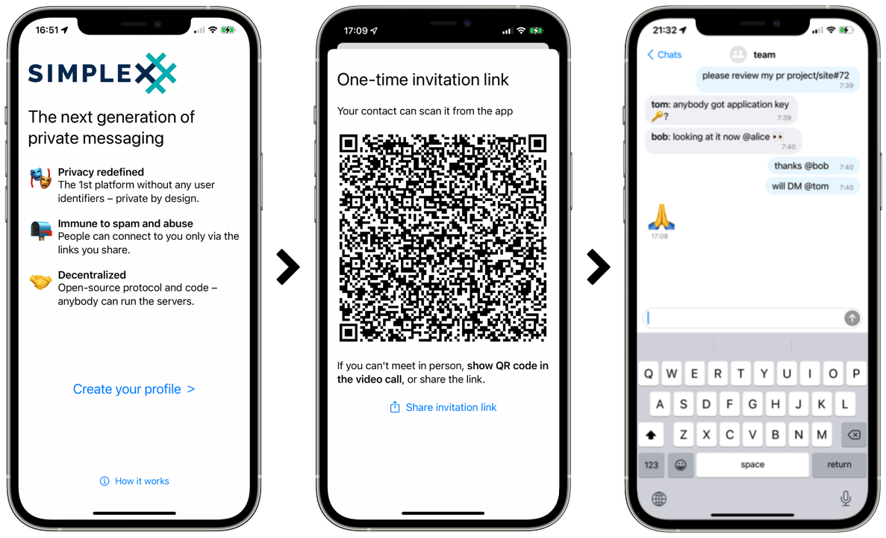

# SimpleX Chat v2.0 - sending images and files in mobile apps

**Published:** May 11, 2022

## New in version 2.0 - sending images and files privately

To send image and files SimpleX Chat uses privacy-preserving system components, both in iOS and Android apps. We do not ask for permission to access multiple or selected files, as, for example, Signal and Telegram do - it compromises either privacy or convenience.

How does it work? The gallery and files are accessed from a system provided dialogue that runs in a separate process, and provides a temporary URI to access only one file selected by the user, only until the app is restarted.

To make file and images work for mobile apps we made a breaking change in SimpleX Chat core. The current version can exchange files with the previous version 1.6 of the terminal app, but not with the version before that.

In the mobile app, to send and receive files both devices must have version 2.0 installed - so please check it with your contacts. Receiving images works in the previous version, so even if your contacts did not yet upgrade the app, they should be able to receive the images.

## The first messaging platform without user identifiers

To protect identities of users and their connections, SimpleX Chat has no user identifiers visible to the network – unlike any other messaging platform.

Many people asked: _if SimpleX has no user identifiers, how can it deliver messages?_

To deliver mesages, instead of user IDs used by all other platforms, SimpleX has identifiers for message queues, separate for each of your contacts. In the current version of the protocol each queue is used until the contact is deleted. Later this year we plan to add queue rotation to the client protocol, so that even conversations don't have long term identifiers visible to the network. This design prevents leaking any users metadata on the application level.

You define which server(s) to use **to receive** the messages, your contacts – the servers you use **to send** the messages to them. It means that every conversation is likely to use two different servers - one for each message direction.

Only client devices store user profiles, contacts, groups, and messages sent with **2-layer end-to-end encryption**.

Read more in [SimpleX whitepaper](https://github.com/simplex-chat/simplexmq/blob/master/protocol/overview-tjr.md).

## How to connect with your contacts in SimpleX Chat

Once you install the app, you can connect to anybody:

1. Create your local chat profile - it is not shared with SimpleX servers. It is local to your devices, and it will be shared with your contacts only when you connect.
2. To make a private connection, you need to create a one-time connection link or a QR code via the app. You can show the QR code to your contact in person or via a video call - this is the most secure way to create a connection - or you can share the link via any other channel. Only one user can connect via this link.
3. Once another user scans the QR code or opens the app via the link the connection will be created and you can send end-to-end encrypted messages privately, without anybody knowing you are connected.

