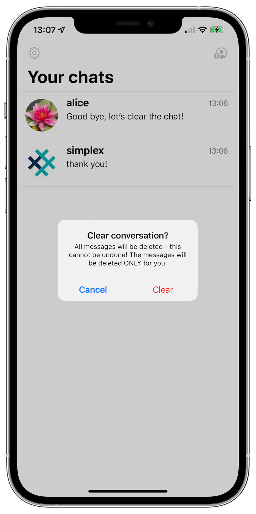

# SimpleX Chat v2.1 - better conversation privacy

**Published:** May 24, 2022

## New in version 2.1 - clearing conversations without deleting contacts

In this version you can irreversibly delete individual messages after they were deleted by a sender, and also completely clear the conversation.

The only way to do it before this version was by deleting the contact, now you can keep the connection when you clear the conversation.

 

See [v1 announcement](./20220112-simplex-chat-v1-released.md) for information on how SimpleX protects the security of the messages.

See [v2 announcement](./20220511-simplex-chat-v2-images-files.md) for more information about SimpleX platform and how it works.

Read about SimpleX design in [whitepaper](https://github.com/simplex-chat/simplexmq/blob/master/protocol/overview-tjr.md).
