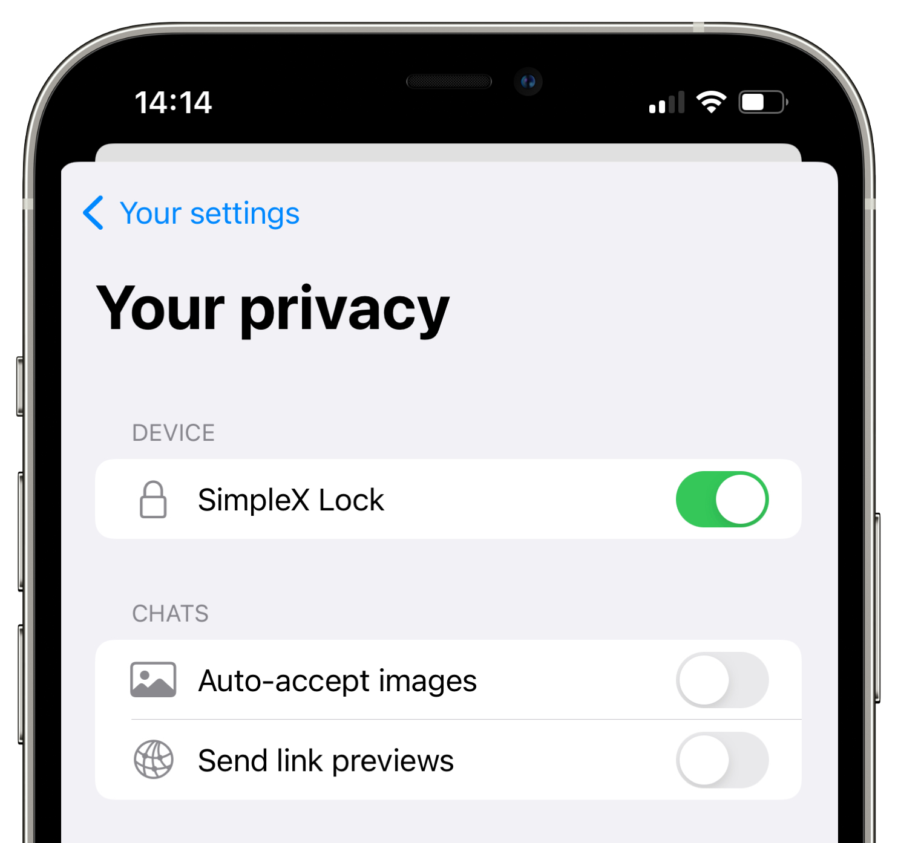

# SimpleX Chat v2.2 - the new privacy and security features

**Published:** June 4, 2022

See [v2 announcement](./20220511-simplex-chat-v2-images-files.md) for more information about SimpleX platform and how it protects your privacy by avoiding user identities of any kind in its design - SimpleX, unlike any other messaging platform, has no identity keys or any numbers that identify its users.

## New Privacy and Security settings in version 2.2

### Protect your chats

To protect your chats you can enable SimpleX Lock. Every time you open the chat after it was in the background for 30 second, you will need to pass biometric or pin code authentication to use the app (provided it is enabled for your device).

### Save data and avoid sharing you are online

In case you want to save your mobile data or to avoid showing to your contacts that you are online, you can disable automatic image downloads. For many users it is more convenient to have images downloaded automatically, so it is enabled by default.

Low resolution image previews would still be shown, the senders have no way to see if you received them or not.

### Avoid visiting websites of the links you send

When you receive the links that include link previews, it is fully private - these previews are generated by the sender, and they do not expose your IP address in any way.

When you send the links, the app automatically downloads the link description and the picture from the website of the link. While it is convenient, it exposes your IP address to the website. To avoid it you can disable sending link previews.

### Identify any lost messages in the chat

The app tracks the integrity of the messages you receive by cheching their sequential numbers and by validating that the hash of the previous message matches the hash included in the message – each conversation, effectively, is two blockchains that only you and your contact have access to.

In case some of the messages are lost, you would see it in the chat. It can happen because of one the following reasons:

- the messages have expired on the server after 30 days not being delivered.
- the messages were removed when the server was restarted. We will add server redundancy later this year to avoid message loss in this case, for now if you see an indication that some messages were lost in the chat, you can check with your contact what it was.
- some other app error. Please notify us via chat - we will investigate possible root causes.
- the connection is compromised. This is very unlikely, but not an impossible scenario.

### There is more

You can discover additional features we are currently testing in Experimental Features - they will be announced later!

## More information

See [v1 announcement](./20220112-simplex-chat-v1-released.md) for information on how SimpleX protects the security of the messages.

Read about SimpleX design in [whitepaper](https://github.com/simplex-chat/simplexmq/blob/master/protocol/overview-tjr.md).
