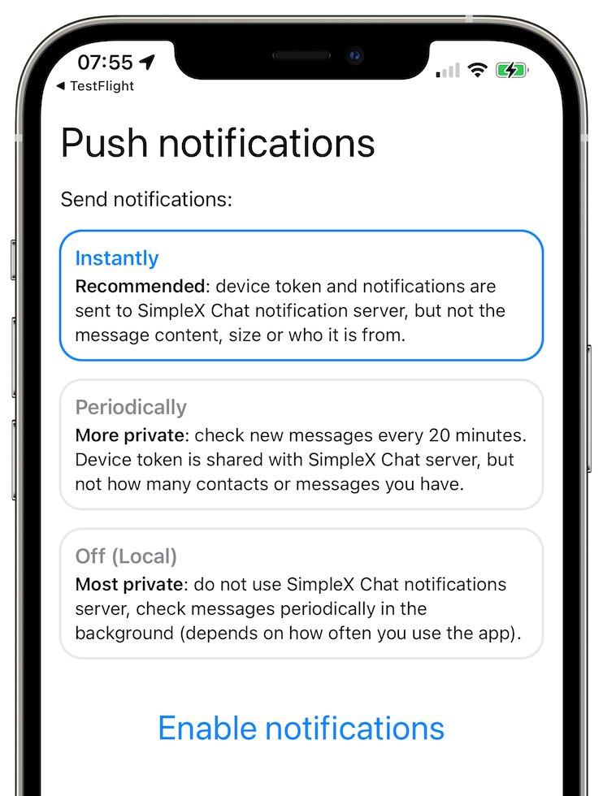
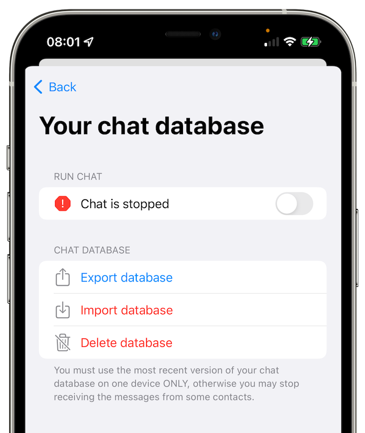

# SimpleX announces SimpleX Chat v3 - with encrypted calls and iOS push notifications

**Published:** Jul 11, 2022

## New in version 3

- [instant notifications for iOS](#instant-notifications-for-ios)
- [end-to-end encrypted audio/video calls](#end-to-end-encrypted-audiovideo-calls)
- [database export and import](#database-export-and-import)
- [protocol privacy and performance improvements](#protocol-privacy-and-performance-improvements)

### Instant notifications for iOS

I wrote previously about [our design for iOS notifications](./20220404-simplex-chat-instant-notifications.md#problem---users-expect-to-be-instantly-notified-when-messages-arrive) - this is now released. The app will offer to migrate the database when updated, and then you need to choose notifications mode – instant or periodic push notifications, or previously available periodic background refresh that does not use push notifications.

To deliver the notifications to iOS devices we use our notification server, as there is a single private key that Apple issues for the app. This server has minimal amount of information about your chat activity:

- it does not have the addresses of messaging queues used to send and receive messages - there is an additional address used for notification server to receive notifications from the messaging servers.
- notifications themselves do not include message content or contacts, even in encrypted form - they only contain end-to-end encrypted metadata about the server and the queue that has available messages - so Apple servers cannot access the information about how many contacts you have or how frequently each of them messages you - they can only see the total number of notifications your device receives.
- message senders do not connect to the notification server, so it cannot in any way correlate sent and received traffic across multiple devices.

**Please note**: for periodic notifications to work the app has to be in the background - if the app is completely stopped (removed from the recent apps), it will not check the new messages and you will not receive notifications. Instant notifications work even when the app is completely stopped.

### End-to-end encrypted audio/video calls

You can now call your contacts via WebRTC, connecting via SimpleX Chat relay servers or peer-to-peer, and in the near future you will be able to configure your own STUN/TURN servers used to establish the connection. The calls are end-to-end encrypted - the key is negotiated via the connection you already have with your contact in the chat, that is also used as a signalling layer for WebRTC - in most cases only three messages in total have to be sent by your and your contact's clients for the call to start, including the initial call invitation.

The calls are still quite limited, especially on iOS, - for example, you cannot continue the call while the app is in the background.

### Database export and import

Quite a few users asked - _how can I move my chat profile to a new device_? SimpleX Chat v3 has a solution for that - you can now export chat database from one device and import it into another - even to another platform, e.g. you can move chat database from Android phone to iOS or to the terminal (console) client.

Some important limitations:

- you cannot run the same chat profile from two devices, neither at the same time nor in turns. You should only use the latest database version - every time you want to move it to another device you need to export a new chat archive from the device that was the latest to use it, and import it to the device where you want to use it next.
- we plan to add internal database encryption soon, but currently it is stored on the device without encryption, and the exported archive is also not encrypted. You should store it securely, and encrypt it if you store it in the cloud or send via email.

This feature can be useful in some other scenarios:

- managing multiple chat profiles - it's not very convenient, and a better support of multiple profiles is coming soon.
- share access to the same profile with other people, as long as it is not used at the same time. For that use case it may be better to run SimpleX Chat terminal client in the cloud, as we do with our public account that you can connect to via the app.
- preserve chat profile when you need to temporarily delete the app from your device.

### Protocol privacy and performance improvements

Adding push notifications for iOS required SimpleX Messaging Protocol changes. We managed not just to keep the same level of meta-data privacy from passive observers, but to improve it - now all message meta-data that is passed from the server to the recipient is included into the same encrypted envelope as the message itself - as before, there is no identifiers or ciphertext in common inside TLS traffic between received and sent traffic of the server, and now there is no message timestamp inside TLS as well.

We also improved the protocol flow for establishing bidirectional connection between two users - it is substantially faster now, consuming much less network traffic and battery. It improves the time it takes to connect to your contacts and to start delivering images and files.

All these changes did not affect backward compatibility - if your contact has the previous version of the client, or you are connecting to a previous version of the server, the previous version of the protocol will be used - SimpleX has independent version negotiation in 4 protocol layers [since v1](./20220112-simplex-chat-v1-released.md#stable-protocol-implementation), allowing us to evolve the protocols without any disruption to the users.

## SimpleX platform

We are building a new platform for distributed Internet applications where privacy of the messages _and_ the network matter. [SimpleX Chat](https://github.com/simplex-chat/simplex-chat) is our first application, a messaging application built on the SimpleX platform.

### The first (and we believe the only) messaging platform without user identifiers of any kind - 100% private by design!

To protect identities of users and their connections, SimpleX Chat has no user identifiers visible to the servers and the network – unlike any other messaging platform. Not only SimpleX doesn't use phone numbers or emails, as Signal and many other platforms, it also does not have any persistent identifiers to identify users - unlike many other messengers considered private - Session, Cwtch, Ricochet, Briar, Jami, etc., - all these platforms have global user identifiers, uniquely identifying their users and creating the risks of de-anonymising the users.

### Why having users' identifiers is bad for the users?

When each user has a unique identifier on the platform, even if this is just a random number, e.g. as a Session ID, it creates risks that whoever gains access to the platform data can observe how the users are connected and how many messages are transmitted between them, and then correlate this information with the existing public social networks, determining the real identities of some users. Even with the most private messengers built on top of Tor network, having a persistent identity means that if you talk to two different users via the same profile they can prove that they communicate with the same person, as they would use the same address to send messages.

SimpleX platform avoids these risks by not having any user identity in its design - so even if you talk to two different people from the same chat profile, they would not be able to prove they are talking to the same person - only that user profiles look the same. And we are planning to add a feature allowing to have a different display name for each contact you connect to - quite a few users asked for it.

### How does it work

Many people asked: _if SimpleX has no user identifiers, how can it deliver messages?_

I wrote about it in [v2 release announcement](./20220511-simplex-chat-v2-images-files.md) and you can get more information about SimpleX platform objectives and technical design in [the whitepaper](https://github.com/simplex-chat/simplexmq/blob/master/protocol/overview-tjr.md).

## We ask you to help us pay for 3rd party security audit

I will get straight to the point: I ask you to support SimpleX Chat with donations.

We are prioritizing users privacy and security - it would be impossible without your support we were lucky to have so far.

We are planning a 3rd party security audit for the app, and it would hugely help us if some part of this $20000+ expense could be covered with donations.

Our pledge to our users is that SimpleX protocols are and will remain open, and in public domain, - so anybody can build the future implementations for the clients and the servers. We are building SimpleX platform based on the same principles as email and web, but much more private and secure.

If you are already using SimpleX Chat, or plan to use it in the future when it has more features, please consider making a donation - it will help us to raise more funds. Donating any amount, even the price of the cup of coffee, would make a huge difference for us.

It is possible to [donate via GitHub](https://github.com/sponsors/simplex-chat), which is commission-free for us, or [via OpenCollective](https://opencollective.com/simplex-chat), that also accepts donations in crypto-currencies, but charges a commission.

Thank you,

Evgeny

SimpleX Chat founder
