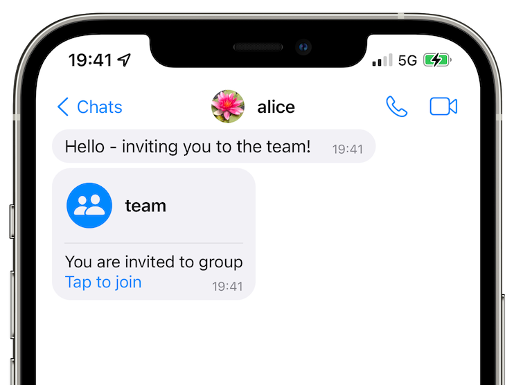
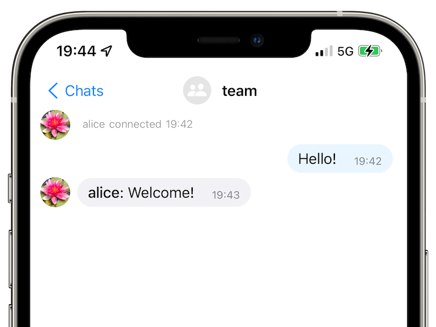

# SimpleX Chat v3.1-beta is released - improved battery/traffic usage

**Published:** Jul 23, 2022

## What's new

- terminal app: [access to messaging servers via SOCKS5 proxy](#terminall-app-access-to-messaging-servers-via-socks5-proxy--tor) (e.g., Tor).
- mobile apps: [join and leave chat groups](#mobile-apps-join-and-leave-chat-groups).
- [optimized battery and traffic usage - up to 90x reduction!](#optimized-battery-and-traffic-usage---up-to-90x-reduction).
- [two docker configurations for self-hosted SMP servers](#docker-configuration-for-self-hosted-smp-servers).

### Terminall app: access to messaging servers via SOCKS5 proxy / Tor


While SMP protocol is focussed on protecting application-level meta-data by using pairwise connection identifiers instead of user identifiers (that are used by all other messaging platforms), there are scenarios when it is important for the users to protect their IP addresses from the servers - quite a few users have been somewhat disappointed that we didn't add it earlier.

This release of terminal app supports accessing the servers via Tor, but the servers themselves are still available on their usual addresses. We are planning to add .onion addresses (v3 hidden service) to all messaging servers we provide, and the users who self-host the servers will also be able to have dual servers addresses - so that one party in the conversation can access the servers via .onion address without necessarily requiring that the other party uses Tor as well.

To access SimpleX servers via Tor you need to install Tor proxy and run simplex-chat with `-x` option. See [terminal app docs](https://github.com/simplex-chat/simplex-chat/blob/stable/docs/CLI.md#access-messaging-servers-via-tor-beta) for more information.

As this is a beta release, to install it you need to use this command:

```sh
curl -o- https://raw.githubusercontent.com/simplex-chat/simplex-chat/stable/install.sh | sh -s -- v3.1.0-beta.0
```

### Mobile apps: join and leave chat groups

  

Groups have been supported by SimpleX Chat core for a very long time, but there was no user interface in the mobile apps to use them - users had to use chat console to create groups, add members, and accept invitations.

This release allows accepting the invitations to join groups via mobile apps UI, making it much easier to create groups - only one user (a group owner) needs to use chat console, while all other groups members just need to tap a button in the UI to join or leave the group. Full group UI is coming in v3.1 in 1-2 weeks, but you can already start using groups today by installing beta-versions of mobile apps via [TestFlight](https://testflight.apple.com/join/DWuT2LQu), [Google PlayStore Beta](https://play.google.com/apps/testing/chat.simplex.app) and [APK download](https://github.com/simplex-chat/simplex-chat/releases/latest/download/simplex.apk).

To manage groups via terminal app or via chat console in the mobile apps you have to use these commands:

- to create group: `/g <group_name> [<description>]`
- to add member (admin by default): `/a <group_name> <contact_name> [owner/admin/member]`
- to remove member from the group: `/rm <group_name> <contact_name>`

Accepting group invitations, leaving and deleting groups no longer requires using console commands.

### Optimized battery and traffic usage - up to 90x reduction

To reduce battery and traffic usage this release updated SMP protocol to allow batching multiple server commands (up to 90!) into one traffic block – provided both the server and the client are upgraded. It means that if you have 90 contacts (or group members) on one server, to subscribe to all messaging queues you now need to send only one 16kb block instead of ~1.5Mb of traffic (90 blocks). It also hides how many contacts you have from any attackers who observe your network.

You might notice that sending commands to multiple queues in one block would allow the server to correlate that all these queues belong to the same user, even though the current server implementation we use does not do it. But even without batching, as the commands are sent via the same TCP connection, this correlation was already possible, so compared with the previous version it has no downsides.

To mitigate the risk of servers correlating your messaging queues we will soon add an option to access each queue via a separate TCP connection, which will have to be used together with access via Tor (as otherwise the servers would still see the same IP address). While it will increase battery and traffic consumption, it will also provide the highest level of privacy.

### Docker configuration for self-hosted SMP servers

When we released SimpleX Chat v3 two weeks ago many users wanted to host messaging servers in docker containers. So, we are now offering [two versions of docker configurations](https://github.com/simplex-chat/simplexmq/tree/stable/scripts/docker):

- fast and convenient - it downloads SMP server binary from GitHub.
- more secure - it builds SMP server from the source code.

Let us know how it works for you!

## SimpleX platform

We are building a new platform for distributed Internet applications where privacy of the messages _and_ the network matter. [SimpleX Chat](https://github.com/simplex-chat/simplex-chat) is our first application, a messaging application built on the SimpleX platform.

### The first (and the only?) messaging platform without user identifiers of any kind - 100% private by design!

To protect identities of users and their connections, instead of user identifiers visible to the servers and/or the network (that are used by all other messaging platforms), SimpleX Chat uses [pairwise identifiers](https://csrc.nist.gov/glossary/term/Pairwise_Pseudonymous_Identifier) of connections between the users – there are two queues in each connection, each queue having 2 different identifiers to send and to receive the messages. It increases the number of used identifiers to the square of the number of users, making it more difficult (or impossible) to determine who is talking to whom. I [wrote previously](./20220711-simplex-chat-v3-released-ios-notifications-audio-video-calls-database-export-import-protocol-improvements.md#why-having-users-identifiers-is-bad-for-the-users) why it is bad for the users' privacy to have any identifiers, even random numbers, associated with their profiles.

### If SimpleX has no user identifiers, how can it deliver messages?

I wrote about it in [v2 release announcement](./20220511-simplex-chat-v2-images-files.md) and you can get more information about SimpleX platform objectives and technical design in [the whitepaper](https://github.com/simplex-chat/simplexmq/blob/master/protocol/overview-tjr.md).

### Privacy: technical details and limitations

SimpleX design follows "defence in depth" security principles having multiple overlapping defensive mechanisms to protect users privacy and security:

- TLS transport with server identity validation and channel binding, limited to the most secure cryptographic algorithms.
- Three levels of encryption that both protect message content and meta-data, preventinc trafic correlation even if TLS is compromised:
  - end-to-end encryption in each messaging queue.
  - end-to-end encryption of the conversation using double-ratchet algorithms, that provides OTR messaging with forward secrecy and break-in recovery.
  - additional encryption layer between the server and message recipient, to prevent traffic correlation by ciphertext or any identifiers.
- Four levels of message padding to prevent any attack based on the content size - the TLS transport block is padded to a fixed 16kb size, and each of 3 encrypted envelopes is padded to a constant size before encryption as well.

What we plan to add soon to further improve privacy and security:

- message queue rotation, so that pairwise identifiers become temporary, and your conversations move from server to server automatically.
- access to the messaging servers via Tor v3 hidden services.
- message mixing - adding latencies to message delivery, to protect against traffic correlation by message time.
- using Tor v3 hidden service addresses for messaging servers.
- passphrase-based local database encryption.

SimpleX Chat [README page](https://github.com/simplex-chat/simplex-chat/blob/stable/README.md#privacy-technical-details-and-limitations) has more details about it.

## We ask you to help us pay for 3rd party security audit

I will get straight to the point: I ask you to support SimpleX Chat with donations.

We are prioritizing users privacy and security - it would be impossible without your support we were lucky to have so far.

We are planning a 3rd party security audit for the app, and it would hugely help us if some part of this $20000+ expense could be covered with donations.

Our pledge to our users is that SimpleX protocols are and will remain open, and in public domain, - so anybody can build the future implementations for the clients and the servers. We are building SimpleX platform based on the same principles as email and web, but much more private and secure.

If you are already using SimpleX Chat, or plan to use it in the future when it has more features, please consider making a donation - it will help us to raise more funds. Donating any amount, even the price of the cup of coffee, would make a huge difference for us.

It is possible to [donate via GitHub](https://github.com/sponsors/simplex-chat), which is commission-free for us, or [via OpenCollective](https://opencollective.com/simplex-chat), that also accepts donations in crypto-currencies, but charges a commission.

Thank you,

Evgeny

SimpleX Chat founder
