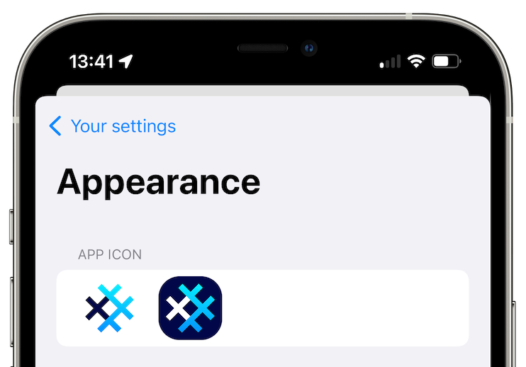

# SimpleX Chat v3.1 is released

**Published:** Aug 8, 2022

## What's new

- [secret chat groups](#secret-chat-groups)!
- [access to messaging servers via Tor](#access-to-messaging-servers-via-tor)
- [advanced network settings](#advanced-network-settings)
- [published chat protocol](#published-chat-protocol)
- [new app icons](#new-app-icons)
- [other changes since v3](#other-changes-since-v3)
  - optimized battery and traffic usage - up to 90x reduction!
  - two docker configurations for self-hosted SMP servers

### Secret chat groups

  

It's been [nearly a year](./20210914-simplex-chat-v0.4-released.md) since the users of the terminal app started experimenting with groups, and now it is available to mobile app users as well. Many bugs were fixed, and the stability was improved, but there are both the features we need to add and the bugs we need to fix to make groups more useful.

SimpleX network is decentralized, so how do groups work? Unlike Matrix or Signal that host the group profile and the list of group members on their servers, SimpleX servers have no information about groups existence - only the users do. SimpleX network does not assign any globally unique identifiers to the group, there is only a local database identifier and the list of members. To each member in a group a user would have an independent connection, and to send a message to the group users have to send this message independently to each member. You can read more in SimpleX Chat Protocol (TODO link) document.

But how can it scale, you might ask? It simply won't, and the current design for the groups is only suitable for relatively small groups of people who know each other well, definitely not larger than few hundred members. For example, to send each message to the group of 100 members a user would need to send a total of ~1.6mb of data (as each message uses a fixed size block of 16kb). And if you were to send a 1mb file then it would also require sending it 100 times (provided each member acceptsit).

What if you need to send many large files to group members? We will be developing a file hosting server where the users will be able to upload the file (or image) once, and only send the file link and credentials to all group members, without the need to send the actual file. A small hosting quota will be available to all users for free, paid for by donations, and for larger files or to increase the quota the users would either have to pay a small hosting cost or to self-host this server – it will be available as an open-source code.

What if you need to have a large group - e.g. 100,000 members? We will be introducing SimpleX channels later this year, that can be both public and private, and would require a server to host them, either provided by SimpleX Chat or self-hosted - same as for a website. If this is a public channel it would be optionally accessible via the web browser as well, and it will be possible to embed it into any webpage.

Other group improvements we will add soon:

- manage notifications in each group independently.
- search for messages - it is useful for direct conversations, but much more important for groups.

### Access to messaging servers via Tor

 &nbsp; 

SimpleX protocols are focussed on protecting application-level meta-data – it doesn't have any user identifiers used by all other messaging platforms, instead relying on pairwise connection identifiers.

But there are scenarios when users need to protect their IP addresses from the servers and any network observers – this is best done by using Tor to access any network services.

This release allows to access SimpleX messaging servers on all platforms:

- terminal app supported it for a couple weeks now: to access SimpleX servers via Tor you need to install Tor proxy and run simplex-chat with `-x` option. See [terminal app docs](../docs/CLI.md#access-messaging-servers-via-tor-beta) for more information.
- Android app supports access via Tor using Orbot SOCKS proxy. Once you install and start Orbot, you have to enable `Network & Servers / Use SOCKS proxy` setting in the app.
- iOS app can also be used with Tor via Orbot iOS app (that is used as a system-wide VPN provider). The only setting you might need to change is network timeouts in the app - to do that you have to enable `Developer tools`, and then chose `Network & Servers / Advanced network settings / Set timeouts for proxy`.

Currently all servers are accessed via their public Internet addresses, and while users can self-host messaging servers on .onion addresses (as v3 hidden services), it would require both connected contacts to use Tor. We are planning to add support for dual-server addresses very soon, where the same server can be accessed both via its public Internet address and via .onion address, so users can access servers without exiting Tor (via .onion address), but their contacts can access the same servers without using Tor.

### Advanced network settings

We have added the ability to configure server access settings in a very granular way that aims to help users on slow network accessing SimpleX servers without. To access this settings, you need to first enable `Developer tools` and then choose `Network & Servers / Advanced network settings`. Once there, you can should use the following options:

- if your connection to the server is unstable, and you frequently see the spinners in the list of chats, please increase the connection and protocol timeouts - it should reduce the traffic, but may make the app a bit slower when your connection is slow.
- if your connection to the servers appears stable, but the traffic usage is high, please try disabling TCP keep-alive setting or increasing keep-alive idle period (`TCP_KEEP_IDLE`) and interval (`TCP_KEEP_INTVL`).

We will either replace these options with something much simpler or even automate them completely, based on the network conditions, once we investigated how these settings affect traffic and user experience - huge thanks to everyone testing them.

### New app icons

Many users asked to allow customizing the app, this is just a start - you can now choose either light or dark icon option via `Appearance` settings.

More options to customize the app are coming - please let us know what are the most important.

### Published chat protocol

While low level protocols for SimpleX network were published very early, and updated to reflect the evolution of the protocols, the high level chat protocol was never published. The reason for that to allow us to iterate it quickly, without committing to any of the decisions. As we can now see it effectively working on different platforms, we have made SimpleX Chat Protocol public – it can be used to build alternative chat clients.

### Other changes since v3

Since v3 was release we also optimized battery and traffic usage - with up to 90x traffic reduction – and published two docker configurations for self-hosted SMP servers. Read more about it in the previous [beta version announcement](./20220723-simplex-chat-v3.1-tor-groups-efficiency.md).

## SimpleX platform

Some links here that answer the most common questions:

[How can SimpleX deliver messages without user identifiers](./20220511-simplex-chat-v2-images-files.md#the-first-messaging-platform-without-user-identifiers)

[What are the risks to have identifiers assigned to the users](./20220711-simplex-chat-v3-released-ios-notifications-audio-video-calls-database-export-import-protocol-improvements.md#why-having-users-identifiers-is-bad-for-the-users)

[Technical details and limitations](./20220723-simplex-chat-v3.1-tor-groups-efficiency.md#privacy-technical-details-and-limitations)

[How SimpleX is different from Session, Matrix, Signal, etc.](../README.md#frequently-asked-questions)

## We ask you to help us pay for 3rd party security audit

I will get straight to the point: I ask you to support SimpleX Chat with donations.

We are prioritizing users privacy and security - it would be impossible without your support we were lucky to have so far.

We are planning a 3rd party security audit for the app, and it would hugely help us if some part of this $20000+ expense could be covered with donations.

Our pledge to our users is that SimpleX protocols are and will remain open, and in public domain, - so anybody can build the future implementations for the clients and the servers. We are building SimpleX platform based on the same principles as email and web, but much more private and secure.

If you are already using SimpleX Chat, or plan to use it in the future when it has more features, please consider making a donation - it will help us to raise more funds. Donating any amount, even the price of the cup of coffee, would make a huge difference for us.

It is possible to donate via:

- [GitHub](https://github.com/sponsors/simplex-chat): it is commission-free for us.
- [OpenCollective](https://opencollective.com/simplex-chat): it also accepts donations in crypto-currencies, but charges a commission.
- Monero wallet: 8568eeVjaJ1RQ65ZUn9PRQ8ENtqeX9VVhcCYYhnVLxhV4JtBqw42so2VEUDQZNkFfsH5sXCuV7FN8VhRQ21DkNibTZP57Qt

Thank you,

Evgeny

SimpleX Chat founder
