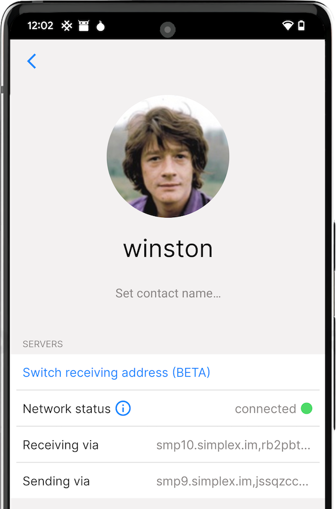
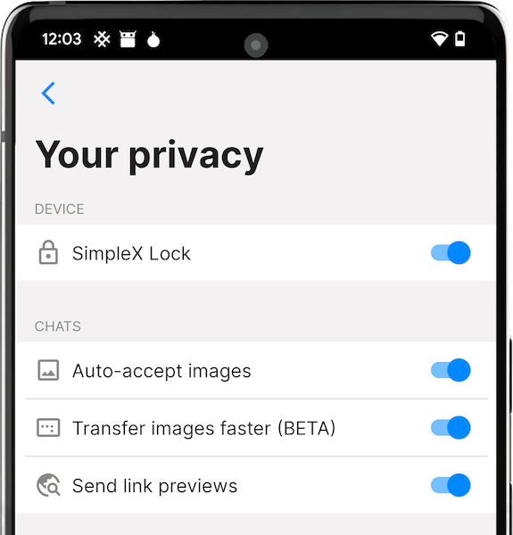

# Security assessment by Trail of Bits, the new website and v4.2 released

**Published:** Nov 8, 2022

## Security assessment by Trail of Bits

When we first launched the app in March the response on Reddit was: _"Have you been audited or should we just ignore you?"_.

We have a growing number of enthusiasts using SimpleX Chat who can accept the security risks of unaudited system, but the users who depend on their security were patiently waiting until some independent experts review our codebase.

[Trail of Bits](https://www.trailofbits.com/about), a US based security and technology consultancy whose clients include big tech companies, governmental agencies and major blockchain projects, had 2 engineers reviewing SimpleX Chat for one calendar week, specifically [simplexmq library](https://github.com/simplex-chat/simplexmq) that is responsible for all cryptography and networking of SimpleX platform.

2 medium and 2 low severity issues were identified, all of which require a high difficulty attack to exploit – the attacker would need to have a privileged access to the system, may need to know complex technical details, or must discover other weaknesses to exploit them. 3 of these issues are already fixed in v4.2.

In the course of the audit, Trail of Bits assessed the maturity of the [simplexmq library](https://github.com/simplex-chat/simplexmq) across eight categories and found five of them to be strong or satisfactory.

Explained below is our understanding of the issues, as well as fixes implemented by the SimpleX Chat team after project completion. The full security review is available via [Trail of Bits publications](https://github.com/trailofbits/publications/blob/master/reviews/SimpleXChat.pdf).

We are hugely thankful to Trail of Bits and their engineers for the work they did, helping us identify these issues and supporting the ongoing efforts to make SimpleX Chat more secure.

### Medium severity issues

#### X3DH key exchange for double ratchet protocol

We made a mistake implementing X3DH key exchange - the key derivation function was not applied to the result of concatenation of three DH operations. The attack to exploit this mistake has high difficulty, as it would require compromising one of private keys generated by the clients, and also it would only affect forward secrecy until break-in recovery happens (after both sides sent some messages).

Please note that SimpleX does not perform X3DH with long-term identity keys, as the SimpleX protocol does not rely on long-term keys to identify client devices. Therefore, the impact of compromising a key will be less severe, as it will affect only the secrets of the connection where the key was compromised.

This issue is fixed in version 4.2 in [this PR](https://github.com/simplex-chat/simplexmq/pull/548/files), and if both clients are updated the key exchange will not have this vulnerability. Also, previously created connections should be secure as long as both sides sent the messages, but if you believe that your private key(s) could have been compromised (for example, if you used SimpleX Chat since before we added database encryption), we recommend that you create the new connections with your contacts, at least with the security-critical ones. Simply rotating the connection queue (manual queue rotation is added in version 4.2) will not be sufficient, as this rotation does not re-initialize the ratchets - this is something we will be adding in the future.

#### Keys are stored in unpinned memory and not cleared after their lifetime

The problem here is that the memory with cryptographic keys can be swapped to the storage and potentially accessed by an attacker who has root-level access to the device (or the level of access required to access swap file of the application). So, if you are running SimpleX Chat on desktop you could improve its security by running it in an isolated container.

In our opinion, on mobile operating systems it is less severe as each application already runs in its own container, and applications do not share access to their swap areas (e.g., on Android swap is a [compressed area in RAM](https://developer.android.com/topic/performance/memory-management) not accessible to other applications).

To exploit this issue an attacker needs to have a privileged system access to the device. Also, we believe [Haskell generational garbage collection](https://www.microsoft.com/en-us/research/wp-content/uploads/1993/01/gen-gc-for-haskell.pdf) makes the lifetime of unused memory lower than in other languages.

We will be addressing this issue in the near future, possibly by using library [secure-memory](https://hackage.haskell.org/package/secure-memory-0.0.0.2) created by Kirill Elagin, an engineer at Serokell, or some other similar approach.

### Low severity issues

#### The string padding function is incorrect for long messages, and the string unpadding function throws exception for short messages

Both these issues are fixed in 4.2 in [this PR](https://github.com/simplex-chat/simplexmq/pull/547/files), with the additional unit tests, and we also validated that even before the fix the strings that would cause such exception were never passed to this function – The SimpleX Chat team could not find the possibility of the attack that would succeed because of this issue.

### What's next

There are areas of SimpleX Chat that were out of scope of this review, specifically:

- the chat protocol implementation and mobile UIs, as they includes no cryptography of networking (with the exception of Android app storing encrypted database passphrase and key exchange/encryption for WebRTC calls).
- push notifications server that is used by iOS clients.

We will be arranging to review these areas separately.

## The new website

Our [previous website](https://old-website.simplex.chat) was created 2 years ago to present SimpleX idea, there was no SimpleX Chat at the time - we only had a prototype implementation of SimpleX Messaging Protocol server then.

A lot of people told us that our website didn't explain well enough who SimpleX Chat is for, what problems it solves, and how it is different from the alternatives. So, while we love to be focused on the chat application, we decided to make the new one.

We hope that our [new website](https://simplex.chat) better answers these questions. If you think something should be added/removed/changed - please let us know. Thank you!

## SimpleX Chat v4.2 released!

New in this release:

- fixed 3 issues from the security audit!
- group links - group admins can create the links for new members to join
- auto-accept contact requests + configure whether to accept incognito and welcome message
- small things: change group member role, mark chat as unread, send stickers and GIFs from Android keyboards.

Beta features (enable Developer tools to try them):

- manually switch contact or member to another address / server (it has to be supported by both clients to work)
- receive files faster (enable it in Privacy & Security settings)

### Group links

 &nbsp;&nbsp; 

It's been requested by many users - to be able to join a group via link. Because SimpleX Chat groups are fully decentralised, and there is no server-side state, joining via these links requires the participation of the link creator who has to be online to accept the group joining request.

The way it works under the hood is similar to how contact addresses work:

1. Group admin or owner creates a long term address that is technically the same as a user address, but it is associated with a specific group.
2. The user that joins the group can identify that this link belongs to some group by an additional piece of data in the link - `{"type": "group", "groupLinkId": "some random string"}`. The ID in this link does not represent a group identity, every time any user creates a new link for the same group, this ID will be different. This ID is used by the joining client to identify the group and automatically accept the invitation when it is received.
3. When admin receives a connection request, they automatically accept it and send invitation link to join the group.
4. The joining user compares the ID in the invitation with the ID in the link, and if they match – automatically accepts the invitation.

After that it works as when joining via the manual invitation - the joining user will be establishing the connection with all existing members to be able to send messages to the group.

The link can be created via the group page, as shown on the picture.

We have several groups you can join to ask any questions or just to test the app:

- [#SimpleX-Group](https://simplex.chat/contact#/?v=1-2&smp=smp%3A%2F%2Fu2dS9sG8nMNURyZwqASV4yROM28Er0luVTx5X1CsMrU%3D%40smp4.simplex.im%2FWHV0YU1sYlU7NqiEHkHDB6gxO1ofTync%23%2F%3Fv%3D1-2%26dh%3DMCowBQYDK2VuAyEAWbebOqVYuBXaiqHcXYjEHCpYi6VzDlu6CVaijDTmsQU%253D%26srv%3Do5vmywmrnaxalvz6wi3zicyftgio6psuvyniis6gco6bp6ekl4cqj4id.onion&data=%7B%22type%22%3A%22group%22%2C%22groupLinkId%22%3A%22mL-7Divb94GGmGmRBef5Dg%3D%3D%22%7D): a general group with more than a 100 members where you can ask any questions.

- Several groups by countries/languages: [\#SimpleX-DE](https://simplex.chat/contact#/?v=1-2&smp=smp%3A%2F%2Fhpq7_4gGJiilmz5Rf-CswuU5kZGkm_zOIooSw6yALRg%3D%40smp5.simplex.im%2FmIorjTDPG24jdLKXwutS6o9hdQQRZwfQ%23%2F%3Fv%3D1-2%26dh%3DMCowBQYDK2VuAyEA9N0BZaECrAw3we3S1Wq4QO7NERBuPt9447immrB50wo%253D%26srv%3Djjbyvoemxysm7qxap7m5d5m35jzv5qq6gnlv7s4rsn7tdwwmuqciwpid.onion&data=%7B%22type%22%3A%22group%22%2C%22groupLinkId%22%3A%22S8aISlOgkTMytSox9gAM2Q%3D%3D%22%7D) (German), [\#SimpleX-US](https://simplex.chat/contact#/?v=1-2&smp=smp%3A%2F%2Fu2dS9sG8nMNURyZwqASV4yROM28Er0luVTx5X1CsMrU%3D%40smp4.simplex.im%2FlTWmQplLEaoJyHnEL1-B3f2PtDsikcTs%23%2F%3Fv%3D1-2%26dh%3DMCowBQYDK2VuAyEA-hMBlsQjNxK2vaVhqW_UyAVtuoYqgYTigK4B9dJ9CGc%253D%26srv%3Do5vmywmrnaxalvz6wi3zicyftgio6psuvyniis6gco6bp6ekl4cqj4id.onion&data=%7B%22type%22%3A%22group%22%2C%22groupLinkId%22%3A%22G0UtRHIn0TmPoo08h_cbTA%3D%3D%22%7D) (US/English), [\#SimpleX-France](https://simplex.chat/contact#/?v=1-2&smp=smp%3A%2F%2Fu2dS9sG8nMNURyZwqASV4yROM28Er0luVTx5X1CsMrU%3D%40smp4.simplex.im%2F11r6XyjwVMj0WDIUMbmNDXO996M_EN_1%23%2F%3Fv%3D1-2%26dh%3DMCowBQYDK2VuAyEAXDmc2Lrj9WQOjEcWa0DeQHF3HcYOp9b68s8M_BJ7gEk%253D%26srv%3Do5vmywmrnaxalvz6wi3zicyftgio6psuvyniis6gco6bp6ekl4cqj4id.onion&data=%7B%22type%22%3A%22group%22%2C%22groupLinkId%22%3A%22EZCeSYpeIBkaQwCcpcF00w%3D%3D%22%7D), [\#SimpleX-RU](https://simplex.chat/contact#/?v=1-2&smp=smp%3A%2F%2Fhpq7_4gGJiilmz5Rf-CswuU5kZGkm_zOIooSw6yALRg%3D%40smp5.simplex.im%2FZSYM278L5WoZiApx3925EAjSXcsAVNVu%23%2F%3Fv%3D1-2%26dh%3DMCowBQYDK2VuAyEA7RJ2wfT8zdfOLyE5OtWLEAPowj-q6F2HB0ExbATw8Gk%253D%26srv%3Djjbyvoemxysm7qxap7m5d5m35jzv5qq6gnlv7s4rsn7tdwwmuqciwpid.onion&data=%7B%22type%22%3A%22group%22%2C%22groupLinkId%22%3A%22fsVoklNGptt7n-droqJYUQ%3D%3D%22%7D) (Russian), [#SimpleX-NL](https://simplex.chat/contact#/?v=1-2&smp=smp%3A%2F%2FPQUV2eL0t7OStZOoAsPEV2QYWt4-xilbakvGUGOItUo%3D%40smp6.simplex.im%2FmP0LbswSbfxoVkkxiWE2NYnBCgZ9Snvj%23%2F%3Fv%3D1-2%26dh%3DMCowBQYDK2VuAyEAVwZuSsw4Mf52EaBNdNI3RebsLm0jg65ZIkcmH9E5uy8%253D%26srv%3Dbylepyau3ty4czmn77q4fglvperknl4bi2eb2fdy2bh4jxtf32kf73yd.onion&data=%7B%22type%22%3A%22group%22%2C%22groupLinkId%22%3A%22M9xIULUNZx51Wsa5Kdb0Sg%3D%3D%22%7D) (Netherlands/Dutch), [#SimpleX-IT](https://simplex.chat/contact#/?v=1-2&smp=smp%3A%2F%2FPQUV2eL0t7OStZOoAsPEV2QYWt4-xilbakvGUGOItUo%3D%40smp6.simplex.im%2FaZ_wjh6QAYHB-LjyGtp8bllkzoq880u-%23%2F%3Fv%3D1-2%26dh%3DMCowBQYDK2VuAyEA-_Wulzc3j16i7t77XJ5wgwxeW8_Ea8GxetMo7K4MgjI%253D%26srv%3Dbylepyau3ty4czmn77q4fglvperknl4bi2eb2fdy2bh4jxtf32kf73yd.onion&data=%7B%22type%22%3A%22group%22%2C%22groupLinkId%22%3A%22QWmXdrFzIeMd2OoEPMFkBQ%3D%3D%22%7D) (Italian).

You can join these groups either by opening these links in the app or by opening them in desktop browser and scanning QR code.

Let me know if you'd like to add some other countries to the list. Join via the apps to share what's going on and ask any questions!

### Auto-accept contact requests

 &nbsp;&nbsp; 

When somebody connects to you via your long-term address you have to manually accept a connection request (it shows in blue color in the list of chats). The feature that we added in this release allows to configure the app to accept contact requests automatically, and also choose whether this contact should receive your main profile or a random incognito profile (independent of the current app setting), and add an optional auto-reply message.

This feature is useful if you publish your address on your webpage or social profile, and do not want to screen people who want to connect to you. You may want to send a standard welcome message, for example, if it is an online store, and you need to share any information with everybody who contacts you.

Our @simplex account that you connect to when you choose "Connect to developers" in the app used this feature for a long time, and now it is available to mobile app users.

### Some small things

1. Changing group member role is a very basic feature, but it was only added in this release.

2. You can now mark a conversation as unread, for example if you accidentally marked all messages as read and you want to review it later.

3. Send stickers and GIFs from Android keyboards, and, finally, the bug with backspace button is resolved as well.

### Change your delivery address (BETA)

To manually switch any of your contacts (or a group member to a new server address) enable Developer tools and choose "Change receiving address" on the contact page. As long as they run a new version of the app and online, the switch should only take a few seconds.

That is a major improvement of metadata privacy of SimpleX protocols, because previously, while we didn't have user identifiers, the pairwise identifiers of messaging queues used to deliver messages were used for as long as the contact existed. Now these identifiers are temporary, and in a near future we will be adding automatic rotation of these delivery addresses.

It is also useful when you want to migrate message delivery to another server, for example, if you used SimpleX Chat default servers and now want to self-host your own. Or, maybe, you need to change the address of your server. Previously it would require creating new contacts and losing conversation histories, and now all you have to do is to change server configuration in the app, and when the change of the address is triggered (currently, only manually, and in the near future - automatically), your contacts will be migrated to a new server, without you doing anything - it only requires each party sending 2 messages to negotiate the reconnection, and it would also rotate the encryption keys used for the outer layer of E2E encryption.

### Receive images and small files faster (BETA)

From version 4.2 all files smaller than ~92kb (equal to 6 message blocks) will be sent in the same connection where you have the chat, and files smaller than ~231kb (the limit for image size) can also be optionally received via the same connection – the latter requires enabling "Transfer images faster" in Privacy & security settings (it will be available after you enable Developer tools). There are two reasons why it is not on by default yet: 1) we wanted to ensure it is stable; 2) there is a small effect on metadata privacy of having a burst of traffic in the same connection where you are having the main conversation.

This functionality was created for the future voice messages, as they need to be sent without acceptance, so that the recipients can listen to them even when the sender is offline.

## SimpleX platform

Some links to answer the most common questions:

[How can SimpleX deliver messages without user identifiers](./20220511-simplex-chat-v2-images-files.md#the-first-messaging-platform-without-user-identifiers).

[What are the risks to have identifiers assigned to the users](./20220711-simplex-chat-v3-released-ios-notifications-audio-video-calls-database-export-import-protocol-improvements.md#why-having-users-identifiers-is-bad-for-the-users).

[Technical details and limitations](./20220723-simplex-chat-v3.1-tor-groups-efficiency.md#privacy-technical-details-and-limitations).

[How SimpleX is different from Session, Matrix, Signal, etc.](https://github.com/simplex-chat/simplex-chat/blob/stable/README.md#frequently-asked-questions).

Please also see the information on our [new website](https://simplex.chat) - it also answers all these questions.

## Help us with donations

Huge thank you to everybody who donated to SimpleX Chat!

We are prioritizing users privacy and security - it would be impossible without your support.

Our pledge to our users is that SimpleX protocols are and will remain open, and in public domain, - so anybody can build the future implementations of the clients and the servers. We are building SimpleX platform based on the same principles as email and web, but much more private and secure.

Your donations help us raise more funds – any amount, even the price of the cup of coffee, makes a big difference for us.

It is possible to donate via:

- [GitHub](https://github.com/sponsors/simplex-chat) - it is commission-free for us.
- [OpenCollective](https://opencollective.com/simplex-chat) - it charges a commission, and also accepts donations in many crypto-currencies.
- Monero wallet: 8568eeVjaJ1RQ65ZUn9PRQ8ENtqeX9VVhcCYYhnVLxhV4JtBqw42so2VEUDQZNkFfsH5sXCuV7FN8VhRQ21DkNibTZP57Qt
- Bitcoin wallet: 1bpefFkzuRoMY3ZuBbZNZxycbg7NYPYTG
- please let us know, via GitHub issue or chat, if you want to make a donation in some other cryptocurrency - we will add the address to the list.

Thank you,

Evgeny

SimpleX Chat founder
