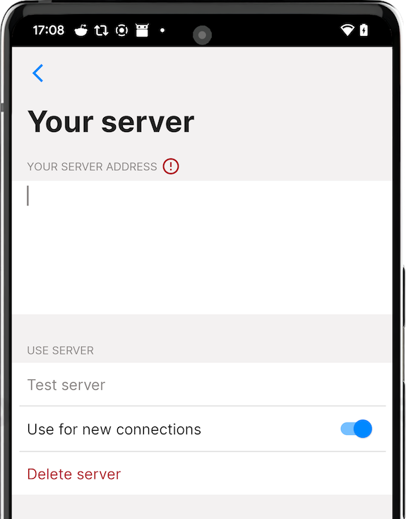

# SimpleX Chat reviews and v4.3 released – with instant voice messages, irreversible deletion of sent messages and improved server configuration.

**Published:** Dec 6, 2022

## SimpleX Chat reviews

Since we published [the security assessment of SimpleX Chat](https://simplex.chat/blog/20221108-simplex-chat-v4.2-security-audit-new-website.html) completed by Trail of Bits in November, several sites published the reviews and included it in their recommendations:

- Privacy Guides added SimpleX Chat to [the recommended private and secure messengers](https://www.privacyguides.org/real-time-communication/#simplex-chat).
- Mike Kuketz – a well-known security expert – published [the review of SimpleX Chat](https://www.kuketz-blog.de/simplex-eindruecke-vom-messenger-ohne-identifier/) and added it to [the messenger matrix](https://www.messenger-matrix.de).
- Supernova published [the review](https://supernovas.space/detailed_reviews.html#simplex) and increased [SimpleX Chat recommendation ratings](https://supernovas.space/messengers.html).

## What's new in v4.3

- [instant voice messages!](#instant-voice-messages)
- [irreversible deletion of sent messages for all recipients](#irreversible-message-deletion)
- [improved SMP server configuration and support for server passwords](#smp-servers-configuration-and-password)
- [privacy and security improvements](#privacy-and-security-improvements):
  - protect app screen in recent apps and prevent screenshots
  - improved privacy and security of SimpleX invitation links in the app
  - optional Android app data backup
  - optionally allow direct messages between group members

### Instant voice messages

Voice messages, unlike normal files, are sent instantly, in the existing connection with your contact and without acceptance from the recipient. For this reason we limited the size of voice messages to ~92.5kb (an equivalent of 6 messages), that limits the duration to 30 seconds on iOS and to ~42 seconds on Android (the size is different because of different encoders), with an average sound quality. The voice messages are sent in MP4AAC format that is natively supported both on iOS and on Android, and you can play voice message files outside of SimpleX Chat app.

Users who do not want to receive voice messages can disable them, either globally, for all contacts, or for each contact independently. Please note that the global preference change will only affect the contacts where you shared your main profile (not incognito contacts) and where you didn't change the preference for the particular contact. Groups have a separate policy that allows disabling voice messages for all members (they are allowed by default). The owner can set this policy when creating a group or later, via Group preferences page.

### Irreversible message deletion

 &nbsp;&nbsp; 

When you receive email, you have full confidence that the sender cannot delete their email from your mailbox after you received it. And it seems correct – in the end, this is your device, and nobody should be able to delete any data from it.

Most existing messengers made an opposite decision – the senders can irreversibly delete their messages from the recipients' devices after they were delivered, whether recipients agree to that or not. And it seems correct too - this is your message, you should be able to delete it, at least for a limited time; that the message is on the recipient device doesn't change your ownership of this message.

While both these statements appear correct, at least to some people, they simply cannot both be correct at the same time, as they contradict each other - either one or both of them must be wrong. This appears to be a very polarising subject, and [the polls](https://mastodon.social/@simplex/109461879089268041) [I made](https://www.reddit.com/r/SimpleXChat/comments/zdam11/poll_irreversible_message_deletion_by_sender_what/) [yesterday](https://twitter.com/epoberezkin/status/1599797374389727233) [show it](https://www.linkedin.com/feed/update/urn:li:activity:7005564342502842368/) - the votes are split evenly.

You may want to be able to delete your messages even after they are received to protect your privacy and security, and you want the communication product you use to enforce it. But you may also have many reason to disagree to the deletion of messages on your device for several different reasons:

- it may be a business context, and either your organisation policy or a compliance requirement is that every message you receive must be preserved for some time.
- these messages may contain threat or abuse and you want to keep them as a proof.
- you may have paid for the the message (e.g., it can be a consulting report), and you don't want it to suddenly disappear before you had a chance to store it outside of the conversation.

Instead of taking any side in this choice, we decided to allow to change this behaviour either globally or separately for each contact or group. That makes SimpleX Chat unique, being suitable both for the communication contexts where email is traditionally used and in informal or privacy sensitive contexts, that would allow the senders to delete messages irreversibly, provided that the recipients agree to that.

In any case, the senders can never be 100% certain that the message is deleted from the recipient's device - recipient can be running a modified client that does not honour the conversation setting, and there is no way to ascertain which code your contact runs on their device.

If irreversible message deletion is not allowed in the conversation, the senders can still mark their messages as deleted, and it would show "mark deleted" placeholder in the conversation. The recipients can then both reveal the content of the original message and fully delete it on their devices.

### SMP servers configuration and password

 &nbsp;&nbsp;  &nbsp;&nbsp; 

When you self-host your own SMP server you may want to make it public so that anybody can use it to receive messages. But many users want to host their private servers, so that only they and their friends can use them to receive the messages.

v4.0 of SMP server and the new version of the apps adds support for server passwords. It is chosen randomly when you initialize the new server, and if you already have a server you can change it. Anybody can still message you, it doesn't require knowing the password, and the links you share do not include it, but to be able to receive the messages you need to know a server address that includes the password. In a way, it is similar to how basic authentication works in HTTP, and how browsers support the URIs with included credentials.

The new server configuration section now allows to test your servers before you start using them, and you can also share your server address via QR code, so that your friends or your team can use them too, without the need to copy paste the addresses.

You can read how to install and configure SMP servers in [this guide](https://github.com/simplex-chat/simplex-chat/blob/stable/docs/SERVER.md).

### Privacy and security improvements

#### Protect app screen

It is now enabled by default, but you can disable it via settings.

iOS app only hides the app screen in the recent apps, Android app in addition to that also prevents the screenshots.

This is not the security measure for the senders, and we made it optional, as the recipient could circumvent it anyway – this is for you to protect your app screen when you give your phone to somebody.

#### Privacy and security of SimpleX invitation links

Previously, when you sent somebody an invitation link, a contact address or a group link, they would take half a screen in the chat and they could open in the browser in some cases. Also, as these links are quire large, it is not easy to see if the page domain is maliciously replaced, what SMP server the connection would go through or what kind of link it is.

This version instead of showing the full link shows a short description, and it replaces a public web address with an internal URI scheme that the app uses (simplex:/) – such links open directly in the app. There is an option to show the full link, if you need it, and even to open it in the browser from the app, but in this case if this link is not using https://simplex.chat website it will show as red to highlight it.

### Optional Android app data backup

The previous version always backed up app data in the way it was configured by the system. Now you can override it from inside the app, preventing the backup even if it's enabled by the system settings. This version requires disabling it manually, we will make it disabled by default in the next release (v4.3.1).

### Direct messages between group members

The new version does not allow them by default, but it can be enabled by group owners in the group settings when the group is created or at any later moment.

## SimpleX platform

Some links to answer the most common questions:

[How can SimpleX deliver messages without user identifiers](./20220511-simplex-chat-v2-images-files.md#the-first-messaging-platform-without-user-identifiers).

[What are the risks to have identifiers assigned to the users](./20220711-simplex-chat-v3-released-ios-notifications-audio-video-calls-database-export-import-protocol-improvements.md#why-having-users-identifiers-is-bad-for-the-users).

[Technical details and limitations](./20220723-simplex-chat-v3.1-tor-groups-efficiency.md#privacy-technical-details-and-limitations).

[How SimpleX is different from Session, Matrix, Signal, etc.](https://github.com/simplex-chat/simplex-chat/blob/stable/README.md#frequently-asked-questions).

Please also see the information on our [new website](https://simplex.chat) - it also answers all these questions.

## Help us with donations

Huge thank you to everybody who donated to SimpleX Chat!

We are prioritizing users privacy and security - it would be impossible without your support.

Our pledge to our users is that SimpleX protocols are and will remain open, and in public domain, - so anybody can build the future implementations of the clients and the servers. We are building SimpleX platform based on the same principles as email and web, but much more private and secure.

Your donations help us raise more funds – any amount, even the price of the cup of coffee, makes a big difference for us.

It is possible to donate via:

- [GitHub](https://github.com/sponsors/simplex-chat) - it is commission-free for us.
- [OpenCollective](https://opencollective.com/simplex-chat) - it charges a commission, and also accepts donations in many crypto-currencies.
- Monero address: 8568eeVjaJ1RQ65ZUn9PRQ8ENtqeX9VVhcCYYhnVLxhV4JtBqw42so2VEUDQZNkFfsH5sXCuV7FN8VhRQ21DkNibTZP57Qt
- Bitcoin address: 1bpefFkzuRoMY3ZuBbZNZxycbg7NYPYTG
- Ethereum address: 0x83fd788f7241a2be61780ea9dc72d2151e6843e2
- please let us know, via GitHub issue or chat, if you want to make a donation in some other cryptocurrency - we will add the address to the list.

Thank you,

Evgeny

SimpleX Chat founder
