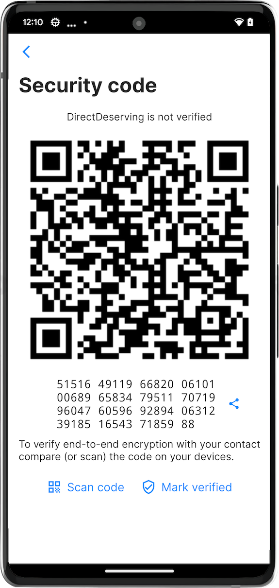

# SimpleX Chat v4.4 released – with disappearing messages, live messages, connection security verification and French language!

**Published:** Jan 3, 2023

## What's new in v4.4

- [disappearing messages](#disappearing-messages).
- ["live" messages](#live-messages).
- [connection security verification](#connection-security-verification).
- [animated images and stickers](#animated-images-and-stickers) – now on iOS too.

Also, we added [French language interface](#french-language-interface), thanks to the users' community and Weblate!

### Disappearing messages

 &nbsp;&nbsp; 

It is now possible to send the messages that will be deleted from both sender and recipient device after set time – for the sender from the time they were sent, and for the recipient - from the time they were read.

Unlike in most other messengers, it requires agreement of both sides, not just the sender decision. I [wrote previously](./20221206-simplex-chat-v4.3-voice-messages.md#irreversible-message-deletion) why we believe it is wrong to allow the senders to delete their messages without recipient consent, and the same logic applies here – if you want to send the message that will disappear after some time, your contact should be ok with that too.

In group conversations disappearing messages can be enabled by the group owners, by default they are disabled.

### "Live" messages

Pressing "bolt" button before you start typing the message will start a "live" message. Now, as you type it, it will be updated for all recipients every several seconds, including only complete words. To finish the message you need to press "checkmark" button.

You can also start a live message after you started typing or after you chose the image – long-press send button and then press "Send live message".

### Connection security verification

SimpleX Chat design prevents the possibility of messaging servers substituting the key during the initial connection (man-in-the-middle attack) by requiring that the invitation link is passed via another channel. I wrote more about how MITM attack works in [this post](https://www.poberezkin.com/posts/2022-12-07-why-privacy-needs-to-be-redefined.html). But this other channel, however unlikely, could still have been compromised by an attacker to replace the invitation link you sent. That is the reason why we recommend sharing QR code in a video call – this is very complex for an attacker to replace it in this case.

This new feature allows you to verify, via yet another channel, that the connection is secure and the keys were not replaced. You can either scan the security code from your contact's app, or compare codes visually, or even read it in a voice call – if your and your contact's app have the same security code for each other then the connection is secure.

If you are sending direct messages to some group members then it might also be important to verify security of these connections, as in this case the invitations were exchanged via the member who added you or another member, and if this member's client was modified, they could have replaced the keys and the addresses, and intercept the entire conversation.

Regardless how connection is established, verifying the connection proves its security. Technically, this security code is the hash of associated data used in the end-to-end encryption, which in turn is taken by combining public keys from the initial key exchange.

### Animated images and stickers

 &nbsp;&nbsp; 

Android app supported GIFs and stickers for some time, now you can view and send them from iOS app as well, e.g. using GIPHY keyboard - you no longer need to choose between privacy and stickers. Just bear in mind, that third party keyboards can be insecure, so you should not be using them for typing sensitive information.

### French language interface

Thanks to our users' community and to [Weblate](https://weblate.org/en-gb/) kindly providing a free hosting plan for SimpleX Chat translations we can now support more languages in the interface – this version adds French.

Please get in touch if you want to translate the interface into your language!

## SimpleX platform

Some links to answer the most common questions:

[How can SimpleX deliver messages without user identifiers](./20220511-simplex-chat-v2-images-files.md#the-first-messaging-platform-without-user-identifiers).

[What are the risks to have identifiers assigned to the users](./20220711-simplex-chat-v3-released-ios-notifications-audio-video-calls-database-export-import-protocol-improvements.md#why-having-users-identifiers-is-bad-for-the-users).

[Technical details and limitations](https://github.com/simplex-chat/simplex-chat#privacy-and-security-technical-details-and-limitations).

[How SimpleX is different from Session, Matrix, Signal, etc.](https://github.com/simplex-chat/simplex-chat/blob/stable/README.md#frequently-asked-questions).

Please also see our [website](https://simplex.chat).

## Help us with donations

Huge thank you to everybody who donated to SimpleX Chat!

We are prioritizing users privacy and security - it would be impossible without your support.

Our pledge to our users is that SimpleX protocols are and will remain open, and in public domain, - so anybody can build the future implementations of the clients and the servers. We are building SimpleX platform based on the same principles as email and web, but much more private and secure.

Your donations help us raise more funds – any amount, even the price of the cup of coffee, makes a big difference for us.

It is possible to donate via:

- [GitHub](https://github.com/sponsors/simplex-chat) - it is commission-free for us.
- [OpenCollective](https://opencollective.com/simplex-chat) - it charges a commission, and also accepts donations in crypto-currencies.
- Monero address: 8568eeVjaJ1RQ65ZUn9PRQ8ENtqeX9VVhcCYYhnVLxhV4JtBqw42so2VEUDQZNkFfsH5sXCuV7FN8VhRQ21DkNibTZP57Qt - Bitcoin address: 1bpefFkzuRoMY3ZuBbZNZxycbg7NYPYTG
- BCH address: 1bpefFkzuRoMY3ZuBbZNZxycbg7NYPYTG
- Ethereum address: 0x83fd788f7241a2be61780ea9dc72d2151e6843e2
- please let us know, via GitHub issue or chat, if you want to create a donation in some other cryptocurrency - we will add the address to the list.

Thank you,

Evgeny

SimpleX Chat founder
