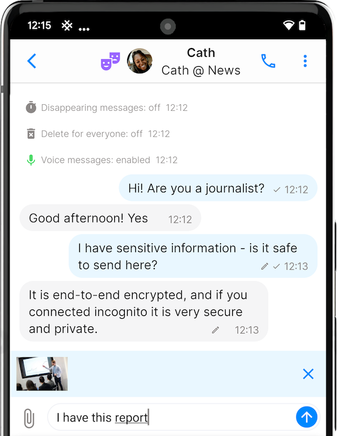

# SimpleX Chat v4.5 released – with multiple user profiles, message draft, transport isolation and Italian interface!

**Published:** Feb 4, 2023

## What's new in v4.5

- [multiple chat profiles](#multiple-chat-profiles).
- [message draft](#message-draft).
- [transport isolation](#transport-isolation).
- [reduced battery usage](#reduced-battery-usage).
- [private filenames](#private-filenames).

Also, we added [Italian interface](#italian-interface), thanks to the users' community and Weblate!

### Multiple chat profiles

 &nbsp;&nbsp; 

Incognito mode added in v3.2 allows to share a random profile name with your new contacts. It is quite popular - more than half of users connecting to our support profile use it. In case when you just want a throw-away profile name that doesn't share any information about you it is more convenient that creating a new profile for each contact manually.

But there are many cases when a disposable profile is not good enough enough, and you want to create separate profiles - one for your family, another for work, yet one more for your online contacts that only know your pseudonym rather than your real name.

Previously this was only possible by using separate chat databases. This version adds a chat profile manager that allows you to create unlimited number of profiles, and very quickly switch them. All these profiles are connected at the same time.

When you delete profile you no longer need you have two options - either delete both profile data on the device and any message queues that this profile created on SMP servers (e.g., when it is more important to leave as few meta-data on the servers), or delete only profile data without making any network requests (when it is more important to delete all data from the device quickly).

While most app settings apply to all profiles, several settings are profile-specific.

You can separately set which SMP servers are used to create the new contacts in each profile (via Network settings). Please note: changing SMP servers in one profile won't affect other profiles, and all new profiles are created with preset servers.

You can also separately set the retention time for messages in each profile (via Database settings).

Also, you have a different contact address in each profile, and different Chat preferences.

All other settings are used for all profiles. While you may want to have different settings for different security levels, it is much better to use different devices in this case.

### Message draft

 &nbsp;&nbsp; 

Previously, if you've closed the conversation with unsent message, this message was disappearing. While it might be better for privacy, there are several scenarios when it is very inconvenient:

- you need to compose the message from several parts that you copy from other conversations.
- some messages arrives that you need to answer urgently, so you can leave unfinished message to return to it later.

Both are now possible - the message you wrote, together with any attachments, and even a voice message you recorded, will remain available as draft until you either close the app or leave another message unfinished - while you can send the message in another chat without losing the current draft, there can be only one draft at a time.

### Transport isolation

Even when you create different chat profiles you are still connecting to your contacts via the same device. Transport isolation, by default, makes connections belonging to the same profile use different TCP sessions, so while the server sees the same IP address, it doesn't see it as the same client connection. If you are connecting via Tor using SOCKS proxy (e.g. Orbot app on Android) not only the app will use different TCP sessions, it will also use separate Tor circuits for connections from different profiles, preventing the servers and network observers seeing this as traffic coming from the same device.

There is an additional BETA option to use a separate transport connection for each contact and group member connection you have – it is available in Network settings if you enable dev tools. In case you have a large number of contacts or participate in large groups across all profiles in the app, you should not use this option, as it may create a lot of traffic and also can exceed the quota for TCP sockets. Also creating a lot of separate Tor circuits can be slow. We will be testing at which number of connections this option starts failing and by the time it's available without dev tools we will add some limits.

### Reduced battery usage

Battery usage is one of the biggest complaints of SimpleX Chat users. The main reason for excess traffic is inefficient retry strategies for Network operations in these cases:

- the message queue capacity is exceeded - the app will keep retrying to send the message until there will be capacity.
- the server is not available, e.g. if you connect to somebody via their server, and they later disable it. This case creates much less extra traffic than the first.

This version makes retries for exceeded queue capacity 10x less frequent and adds SMP protocol extension that will allow to reduce retries even further by the next version. It works in the following way:
- when the sender encounters "queue quota exceeded" error, the sender stops trying to send the message.
- the server also takes note of that error.
- once recipient receives all messages from this queue, the server will notify the recipient that the sender had "queue quota exceeded" error.
- the recipient will then send a special message to the sender client to instruct it that it can resume delivery.
- the sender can still occasionally try sending the message, e.g. once every hours, but it won't need to retry once every few minutes as it does now.

Reducing battery usage is our big priority - we expect to reduce it by at least 2-3x in the next few months.

### Private filenames

When you send an image or voice message they are sent as files with filenames including timestamp. We didn't see it as a problem, as files are sent together with the message, and messages have server-side timestamps anyway. But the users pointed out that the timestamp we used was in the local timezone, and therefore leaked the country (or continent) where the user is located. A simple workaround was to reset timezone to UTC, and that is what most users who need to protect their location do anyway. But this version resolves it - these filenames now include UTC timezones – no workarounds are needed.

### Italian interface

Thanks to our users' community and to Weblate providing a free hosting plan for SimpleX Chat translations we can now support more languages in the interface – this version adds Italian and many more is in progress - Chinese, Japanese, Czech, Dutch, etc.

You can [contribute the translation](https://github.com/simplex-chat/simplex-chat/tree/stable#translate-the-apps) of the apps to your language too!

## SimpleX platform

Some links to answer the most common questions:

[How can SimpleX deliver messages without user identifiers](./20220511-simplex-chat-v2-images-files.md#the-first-messaging-platform-without-user-identifiers).

[What are the risks to have identifiers assigned to the users](./20220711-simplex-chat-v3-released-ios-notifications-audio-video-calls-database-export-import-protocol-improvements.md#why-having-users-identifiers-is-bad-for-the-users).

[Technical details and limitations](https://github.com/simplex-chat/simplex-chat#privacy-and-security-technical-details-and-limitations).

[How SimpleX is different from Session, Matrix, Signal, etc.](https://github.com/simplex-chat/simplex-chat/blob/stable/README.md#frequently-asked-questions).

Please also see our [website](https://simplex.chat).

## Help us with donations

Huge thank you to everybody who donated to SimpleX Chat!

We are prioritizing users privacy and security - it would be impossible without your support.

Our pledge to our users is that SimpleX protocols are and will remain open, and in public domain, - so anybody can build the future implementations of the clients and the servers. We are building SimpleX platform based on the same principles as email and web, but much more private and secure.

Your donations help us raise more funds – any amount, even the price of the cup of coffee, makes a big difference for us.

See [this section](https://github.com/simplex-chat/simplex-chat/tree/master#help-us-with-donations) for the ways to donate.

Thank you,

Evgeny

SimpleX Chat founder
