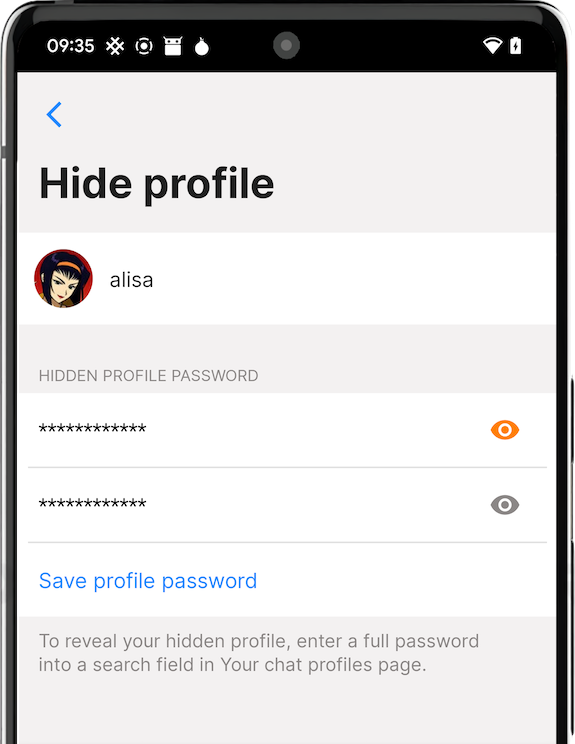

# SimpleX Chat v4.6 – with hidden profiles, community moderation, improved audio/video calls and reduced battery usage.

**Published:** Mar 28, 2023

## What's new in v4.6

- [ARMv7a and Android 8+ support](#armv7a-32-bit-and-android-8-support)
- [hidden chat profiles](#hidden-chat-profiles)
- [group / community moderation](#group--community-moderation)
- [group welcome message](#group-welcome-message)
- [improved audio/video calls](#improved-audiovideo-calls)
- [reduced battery usage](#reduced-battery-usage).
- [SMP server monitoring: status bot and page](#smp-server-monitoring)

Also, we added [Chinese and Spanish interface languages](#chinese-and-spanish-interface---you-can-choose-the-language-via-the-app), thanks to the users' community and Weblate!

### ARMv7a (32 bit) and Android 8+ support!

It increases the number of supported Android devices twice - now most of your friends should be able to install SimpleX Chat. SimpleX Chat still doesn't support Android 7 and erlier versions.

If you install the app from GitHub or F-Droid you need to choose the correct APK, Play Store will provide it automatically.

### Hidden chat profiles

 &nbsp;&nbsp;  &nbsp;&nbsp; 

For a long time the main way to protect SimpleX Chat app from people who have access to your phone was device authentication - it is requested when you open the app (and some of its sensitive functions).

Many users asked to allow setting the app password or PIN independently from the device PIN, as some other apps do. But it did not seem a good enough solution - if somebody has your device PIN, then in most cases they can also ask you to provide the app PIN as well.

So instead of having an app password, that reduces convenience and doesn't improve security too much, we did what we think could be better. You can now create hidden chat profiles, that are not visible anywhere in the app, and do not show any notifications, until you enter a correct passphrase. If multiple profiles are hidden with the same passphrase they will all show in the list when you enter it.

It's important to remember that these hidden profiles are still stored locally on your device, so if somebody has access to your chat database (they need to know database passphrase, that is independent from device PIN or profile passphrases) or to chat console in the app, they will be able to access these profiles data and reset their passwords. We are considering how chat console can be better protected - e.g., by requiring a separate password or by providing an option to remove it from the UI permanently - tell us what you think.

### Group / Community moderation

Initially we did not design SimpleX Chat to support communities - our focus has always been maximum privacy and security.

SimpleX Chat supports small and fully decentralized groups, that are not hosted anywhere. But many users want to participate in and to discover communities. Since we added support for group links, the groups we created to let users test the app started to grow, and many other communities of over 100 people emerged.

We are already observing some less-than-friendly messages and undesirable content that is not welcome in some communities. So this version adds features allowing to moderate groups.

Firstly, group admins and owners can revoke members rights to send messages to the group by assigning members an "observer" role, and also make this role default for users joining via a group link.

Secondly, group admins can now delete messages sent by other members (excluding the messages sent by the group owners). "Moderate" action in the message menu will either mark the message as deleted or delete it irreversibly for all members, as set in group preferences by the owners.

These features will allow group owners to decide their own rules. More robust moderation tools are coming later when we build support for large communities.

### Group welcome message

Group owners can now set a welcome message that will be shown to new members when they join the group via a group link.

### Improved audio/video calls

Prior to this version audio and video calls in iOS app were very limited – they only worked while the app was in foreground. This version fully re-implemented audio/video calls in iOS – it now uses native WebRTC library instead of web view. These calls are still end-to-end encrypted, and compatible with the calls in the previous versions of the app, both on iOS and on Android platforms.

Where allowed by App Store policy, the calls on iOS now use Apple's native interface for calls CallKit, that allows to accept calls from the lock screen, prevents call interruption by incoming phone calls and optionally allows to include calls in the phone call history - the last option needs to be enabled separately.

Calls on Android were also improved – they now support bluetooth headphones, allow changing volume in video calls and support proximity sensor during the audio call, to prevent accidental interruption when you hold the phone close to your ear.

### Reduced battery usage

We know that battery usage of SimpleX Chat is suboptimal, and we are committed to reduce it. Unfortunately, there is no simple change that we could make to solve this problem, it requires many systematic improvements and fixes.

One of the big issues, particularly in large groups, was inefficient retry strategy for sending messages in cases when the receiving message queue (mailbox) was out of capacity.

This version increases the maximum retry period for "out-of-capacity" scenario to 1 hour, and also preserves this retry period in the database. So, if previously before the message expired in 48 hours there were up to ~2800 delivery attempts and up to ~45Mb wasted traffic per recipient (depending on how frequently the app was restarted), now there will be only ~50 retries, resulting in not more than 0.8Mb of traffic - up to 56x traffic reduction when sending messages to the large groups.

This issue might not have affected you at all, and also solving it won't reduce overall traffic/battery usage by that factor - there are other inefficiences we will be addressing. But if you actively sent messages to large groups you should observe a substantial reduction of battery and traffic consumption.

Please share your experience. If the battery usage is still suboptimal, please share your usage statistics - they can be requested in chat console with `/get stats` command - it will return the aggregated number of network operations, per server, since the app was started. Please note that these statistics include the addresses of the servers you connect to, so if you want to keep them private, please redact them. You can also reset usage statistics with `/reset stats` command.

### SMP server monitoring

If you use preset servers in SimpleX Chat you can now see when we do any maintenance or when the server is down either by [connecting to status bot via the app](https://simplex.chat/contact#/?v=1-2&smp=smp%3A%2F%2Fu2dS9sG8nMNURyZwqASV4yROM28Er0luVTx5X1CsMrU%3D%40smp4.simplex.im%2FShQuD-rPokbDvkyotKx5NwM8P3oUXHxA%23%2F%3Fv%3D1-2%26dh%3DMCowBQYDK2VuAyEA6fSx1k9zrOmF0BJpCaTarZvnZpMTAVQhd3RkDQ35KT0%253D%26srv%3Do5vmywmrnaxalvz6wi3zicyftgio6psuvyniis6gco6bp6ekl4cqj4id.onion) or by visiting a [status page](https://status.simplex.chat). Status bot always sends automatic messages before the server is restarted for maintenance, but in case of downtime if the same server is down that you use to receive the messages from the bot, you may miss them - check the status page in this case.

### Chinese and Spanish interface - you can choose the language via the app!

Thanks to our users' community and to Weblate providing a free hosting plan for SimpleX Chat translations we can now support more languages in the interface – this version adds Chinese and Spanish and more are in progress.

You can [contribute the translation](https://github.com/simplex-chat/simplex-chat/tree/stable#translate-the-apps) of the apps to your language too!

The app now supports 8 languages in addition to English - Czech, German, Spanish, French, Italian, Dutch, Russian and Chinese. You can now choose the language via the app settings (Appearance page), independently from the system settings.

## SimpleX platform

Some links to answer the most common questions:

[SimpleX Chat security assessment](./20221108-simplex-chat-v4.2-security-audit-new-website.md).

[How can SimpleX deliver messages without user identifiers](https://simplex.chat/#how-simplex-works).

[What are the risks to have identifiers assigned to the users](https://simplex.chat/#why-ids-bad-for-privacy).

[Technical details and limitations](https://github.com/simplex-chat/simplex-chat#privacy-and-security-technical-details-and-limitations).

[How SimpleX is different from Session, Matrix, Signal, etc.](https://github.com/simplex-chat/simplex-chat/blob/stable/README.md#frequently-asked-questions).

Visit our [website](https://simplex.chat) to learn more.

## Help us with donations

Huge thank you to everybody who donated to SimpleX Chat!

We are prioritizing users privacy and security - it would be impossible without your support.

Our pledge to our users is that SimpleX protocols are and will remain open, and in public domain, - so anybody can build the future implementations of the clients and the servers. We are building SimpleX platform based on the same principles as email and web, but much more private and secure.

Your donations help us raise more funds – any amount, even the price of the cup of coffee, makes a big difference for us.

See [this section](https://github.com/simplex-chat/simplex-chat/tree/master#help-us-with-donations) for the ways to donate.

Thank you,

Evgeny

SimpleX Chat founder
