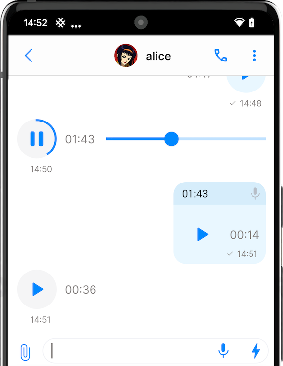
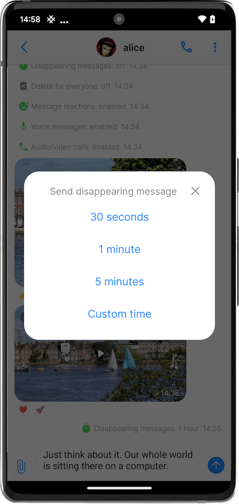
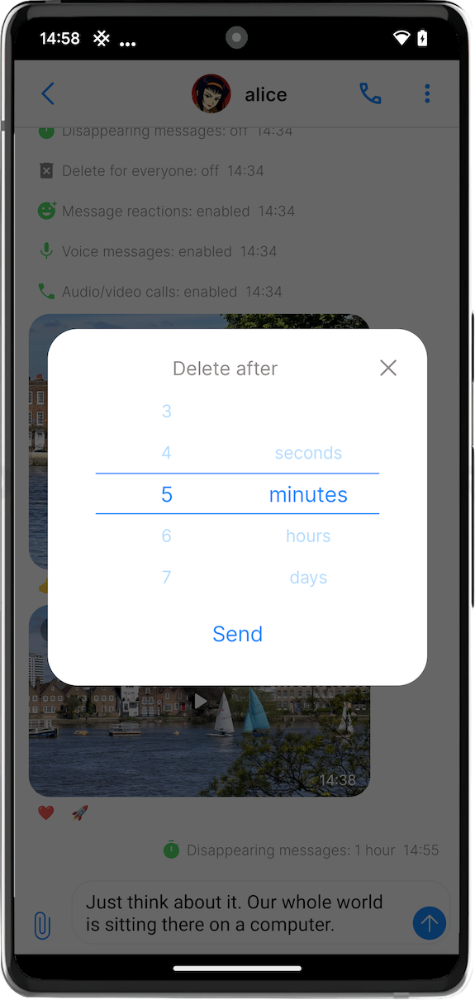
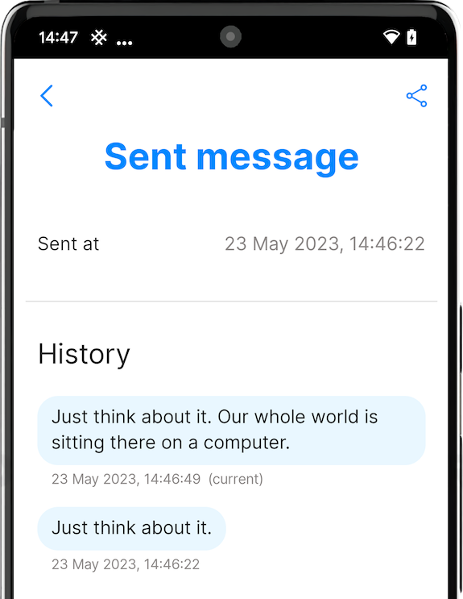
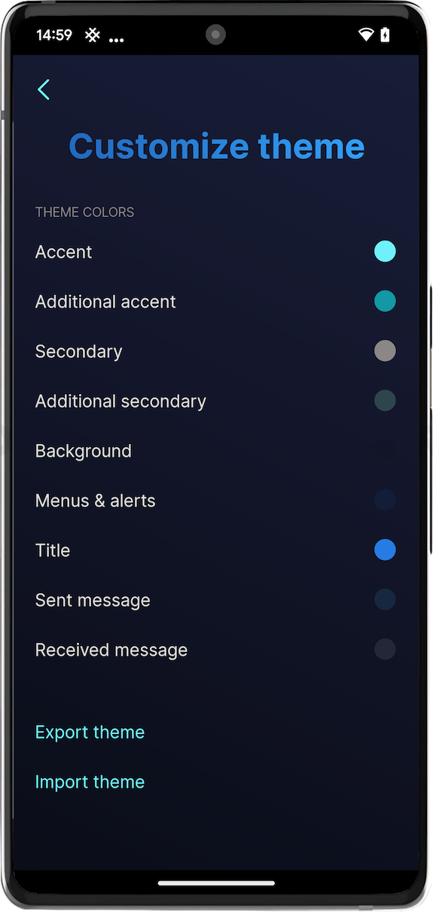
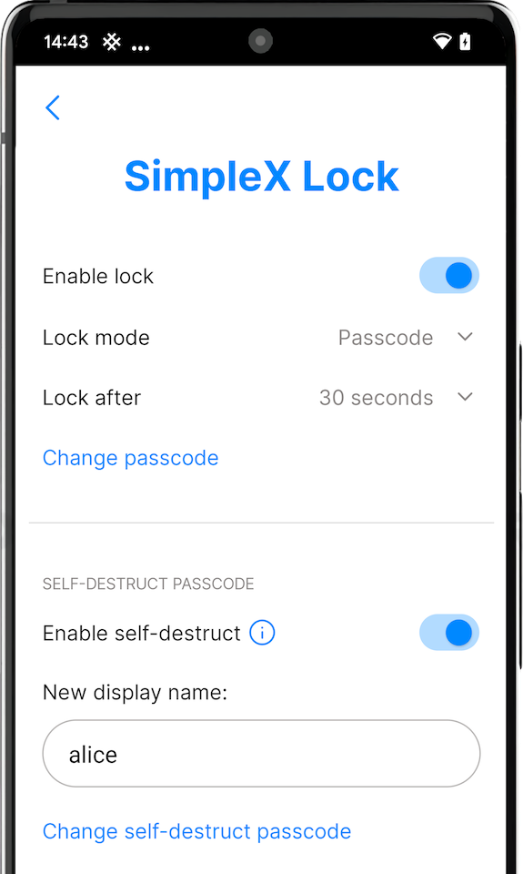

# SimpleX Chat v5.1 released: message reactions and self-destruct passcode

**Published:** May 23, 2023

What's new in v5.1:

- [message reactions](#message-reactions) 🚀
- [improved messages](#improved-messages):
  - [voice messages up to 5 minutes](#voice-messages-up-to-5-minutes-better-quality-playback-control).
  - [custom time to disappear](#disappearing-messages-choose-any-time).
  - [message editing history](#message-editing-history).
- new design and [customizable themes](#customize-and-share-color-themes) that you can share!*
- [self-destruct passcode](#self-destruct-passcode)

There are lots of small improvements and fixes in this release:
  - setting to disable audio/video calls per contact.
  - group welcome message visible in a group profile - add the link to join the group there.
  - fixes for sending files.
  - configurable SOCKS proxy host and port*.
  - improved calls on lock screen*.
  - locale-dependent formatting of time and date*.

Also, we added Japanese and Portuguese (Brazil)* interface languages, thanks to [our users and Weblate](https://github.com/simplex-chat/simplex-chat#help-translating-simplex-chat).

\* These features are available in the Android version only.

## Message reactions

No idea why it took us so long to add them – finally we have them, and they are great.

We didn't like the view of other messengers plagued by 40 different reactions on a message, and we were not quite sure what can be done about it, so we initially decided to limit available reactions to just 6: thumbs up 👍, down 👎, smile 😀, tear 😢, heart ❤️ and rocket 🚀. But unlike some other messengers, we don't limit the reactions to just one per message - you can put up to 3.

You can add them via the menu, or just by tapping the reaction already on the message.

The next app version will allow prohibiting the reactions per conversation, as you asked. Some groups work better with more substantive responses.

## Improved messages

### Voice messages: up to 5 minutes, better quality, playback control

Since [v4.3](./20221206-simplex-chat-v4.3-voice-messages.md#instant-voice-messages) voice messages were sent in small 16kb chunks, so we had to limit them to 30-40 seconds for better user experience, as sending larger files would require the sender to be online.

With the new XFTP protocol that allows sending files up to 1gb it is now possible to increase the message size - we decided to limit it at 5 min, increasing their quality 2x (the bitrate is increased from 16 to 32kbps). We also added a slider to control the playback.

### Disappearing messages: choose any time!

 &nbsp;&nbsp; 

Since [v4.4](./20230103-simplex-chat-v4.4-disappearing-messages.md#disappearing-messages) disappearing messages were only configurable for the whole conversation, with a limited choice of allowed times between 30 seconds and 1 month.

This version allows to configure the time for messages to disappear more granularly, in the range from 1 second to 3 months. You can also set a different time to disappear when you send the message (hold the Send button), as long as disappearing messages are enabled in the conversation.

### Message editing history

I [wrote previously](./20221206-simplex-chat-v4.3-voice-messages.md#irreversible-message-deletion) why we decided to require the recipient concent before the messages can be fully deleted by the sender - in short, it is to support recipient's data sovereignty and prevent the possibility of offensive messages being removed without any trace. By default, when the sender deletes the message it is marked as deleted, rather than fully deleted, and you can reveal the original message.

You've found the workaround for it of course - it's enough to simply edit the message to hide the original content. This version adds a visible message editing history, together with other detailed information about when the message was sent, received or deleted, that wasn't visible in the conversation.

## Customize and share color themes

Android app now allows choosing between three color themes - Light, Dark and SimpleX (a dark blue theme). You can customize any theme by setting 9 different colors used in the app, including titles, menus, accent colors and colors for sent and received messages.

You can share your theme with other users by exporting it to a file and sending to them. You can also [contribute your favorite themes](../docs/THEMES.md) to our GitHub repository.

## Self-destruct passcode

This is something many of you asked before - when asked to enter the app passcode under duress, to be able to enter a special self-destruct code that would remove the app data. This feature is offered in many security tools, and now you can configure it in SimpleX Chat as well.

To enable it:
- go to app Settings > Privacy & security > SimpleX Lock.
- switch lock mode to Passcode and, if necessary, enable lock – Self-destruct passcode will become available.
- enable it, enter the main passcode and then enter and confirm self-destruct passcode.
- optionally, you can set the new display name of the profile that will be created after the data was wiped. If it is left blank, a new empty profile will have a random name.

## SimpleX platform

Some links to answer the most common questions:

[SimpleX Chat security assessment](./20221108-simplex-chat-v4.2-security-audit-new-website.md).

[How can SimpleX deliver messages without user identifiers](https://simplex.chat/#how-simplex-works).

[What are the risks to have identifiers assigned to the users](https://simplex.chat/#why-ids-bad-for-privacy).

[Technical details and limitations](https://github.com/simplex-chat/simplex-chat#privacy-and-security-technical-details-and-limitations).

[How SimpleX is different from Session, Matrix, Signal, etc.](https://github.com/simplex-chat/simplex-chat/blob/stable/README.md#frequently-asked-questions).

Visit our [website](https://simplex.chat) to learn more.

## Help us with donations

Huge thank you to everybody who donated to SimpleX Chat!

We are prioritizing users privacy and security - it would be impossible without your support.

Our pledge to our users is that SimpleX protocols are and will remain open, and in public domain, - so anybody can build the future implementations of the clients and the servers. We are building SimpleX platform based on the same principles as email and web, but much more private and secure.

Your donations help us raise more funds – any amount, even the price of the cup of coffee, makes a big difference for us.

See [this section](https://github.com/simplex-chat/simplex-chat/tree/master#help-us-with-donations) for the ways to donate.

Thank you,

Evgeny

SimpleX Chat founder
