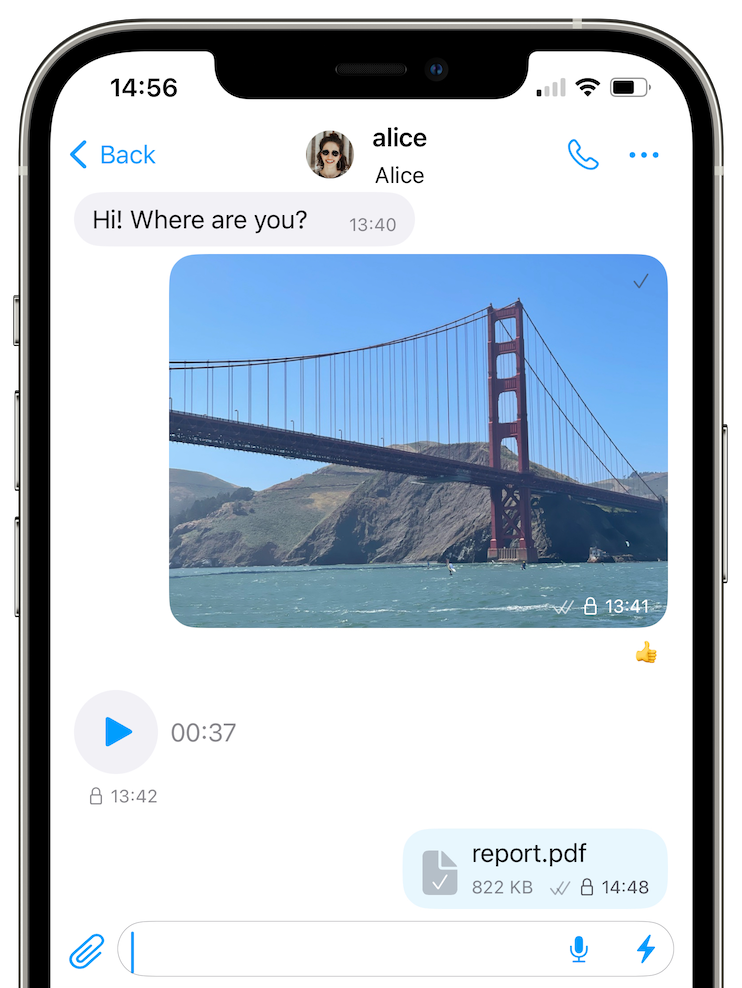
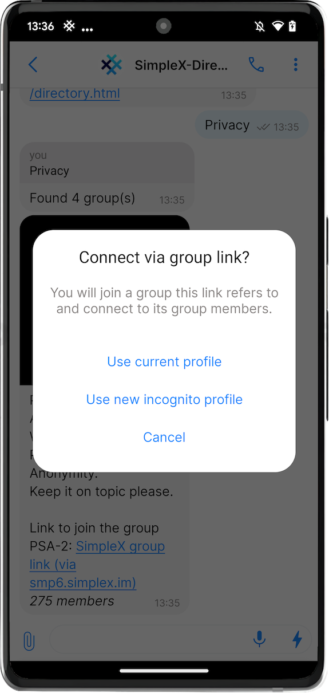

# SimpleX Chat v5.3 released: desktop app, local file encryption and improved groups

**Published:** September 25, 2023

**What's new in v5.3:**
- [new desktop app!](#multiplatform-desktop-app)!
- [directory service and other group improvements](#group-directory-service-and-other-group-improvements).
- [encrypted local files and media with forward secrecy](#encrypted-local-files-and-media-with-forward-secrecy).
- [simplified incognito mode](#simplified-incognito-mode).

There are a lot of other improvements and fixes in this release:
- improved app responsiveness and stability.
- app memory usage is reduced by 40%.
- new privacy settings: show last messages & save draft.
- fixes:
  - bug preventing group members connecting (it will only help the new connections).
  - playing videos on full screen**.
  - screen reader for messages**.
  - reduced background crashes**.

Also, we added 6 new interface languages: Arabic*, Bulgarian, Finnish, Hebrew*, Thai and Ukrainian - thanks to [our users and Weblate](https://github.com/simplex-chat/simplex-chat#help-translating-simplex-chat).

\* Android app.

\*\* iOS app.

## Multiplatform desktop app

Thanks a lot to everybody who was testing the desktop app since July – it really helped to make it stable!

To use desktop app you need to **create a new profile**. As SimpleX platform has no user accounts, it's not as simple as for centralized apps to access the same profile from two devices.

The next app version will allow using your mobile profile from desktop app. For now, as a workaround, you can join groups from both mobile and desktop devices, and use small groups instead of direct conversations.

When you start the app first time, you will be offered to **set database passphrase** – you have to memorize it, as there is no way to recover it. If you skip it, a random passphrase will be generated and stored on your desktop device as plaintext (unencrypted) – you can change it later.

Other limitations of the desktop app:
- you cannot send voice messages.
- there is no support for calls yet.

You can download the desktop app for Linux and Mac via [downloads page](../docs/DOWNLOADS.md). Windows version will be available soon.

## Group directory service and other group improvements

Directory service provides a way to search for public groups submitted by the users. To use it, you need to connect to it via SimpleX Chat, as you would connect to any other contact, and type some words to search.

You can also create and register your group, with some limitations explained [here](../docs/DIRECTORY.md).

Other group improvements in this release:

- you can send delivery receipts to the groups up to 20 members.

- if the group settings allow it, you can send direct messages to group members even after you deleted the contact.

- connections between members are made faster, and the bug that prevented the connections in some cases is fixed in this release.

The next release will reduce the time it takes to send messages to the group, especially when there are many members or when you have a slow device storage.

## Encrypted local files and media with forward secrecy

All messages, files and media sent via SimpleX Chat were always end-to-end encrypted from the very beginning. SimpleX Chat uses double-ratchet algorithm with encrypted message headers, for the best possible meta-data protection.

You contacts, groups and messages are stored in the local database on your device, and this database was encrypted from [v4.0 released a year ago](./20220928-simplex-chat-v4-encrypted-database.md).

But until this version all files and media in the app storage were not encrypted, and when you exported the chat archive, they were unencrypted there as well.

From v5.3 all files and media (except videos, for now) are encrypted with a random symmetric key - in many cases they are encrypted before they are written to the storage. Local file encryption can be disabled via Privacy & Security settings, for example, if you need to access the files from the storage outside of the app.

In addition to the videos that are stored unencrypted, there are other rare scenarios when the received files may be unencrypted in this release. Files have an open or closed lock icons to indicate whether they were encrypted locally. These limitations will be addressed in the next release. In any case, all files and media are always sent end-to-end encrypted, without any exceptions.

The keys used to encrypt files locally are associated with the messages and stored in the encrypted database. If you delete a message with the attached file or media, the key will be irreversibly deleted as well. Even if an attacker gains access to your database passphrase later and to the copy of the encrypted file, they won't be able to decrypt the file.

This approach provides forward secrecy for locally stored files, unlike file encryption schemes used in some other apps when the same passphrase is used for all files.

## Simplified incognito mode

Incognito mode was [added a year ago](./20220901-simplex-chat-v3.2-incognito-mode.md) to improve anonymity of your profile, but it was confusing for some users - it was a global setting, but it only affected the new connections.

It is now simpler to use - you can decide whether to connect to a contact or join a group using your main profile at a point when you create an invitation link or connect via a link or QR code.

When you are connecting to people you know you usually want to share your main profile, and when connecting to public groups or strangers, you may prefer to use a random profile.

## SimpleX platform

Some links to answer the most common questions:

[SimpleX Chat security assessment](./20221108-simplex-chat-v4.2-security-audit-new-website.md).

[How can SimpleX deliver messages without user identifiers](https://simplex.chat/#how-simplex-works).

[What are the risks to have identifiers assigned to the users](https://simplex.chat/#why-ids-bad-for-privacy).

[Technical details and limitations](https://github.com/simplex-chat/simplex-chat#privacy-technical-details-and-limitations).

[How SimpleX is different from Session, Matrix, Signal, etc.](https://github.com/simplex-chat/simplex-chat/blob/stable/README.md#frequently-asked-questions).

Visit our [website](https://simplex.chat) to learn more.

## Help us with donations

Huge thank you to everybody who donated to SimpleX Chat!

We are prioritizing users privacy and security - it would be impossible without your support.

Our pledge to our users is that SimpleX protocols are and will remain open, and in public domain, - so anybody can build the future implementations of the clients and the servers. We are building SimpleX platform based on the same principles as email and web, but much more private and secure.

Your donations help us raise more funds – any amount, even the price of the cup of coffee, makes a big difference for us.

See [this section](https://github.com/simplex-chat/simplex-chat/tree/master#help-us-with-donations) for the ways to donate.

Thank you,

Evgeny

SimpleX Chat founder
