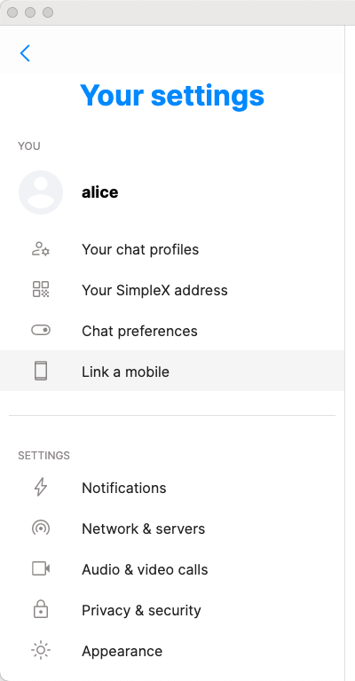
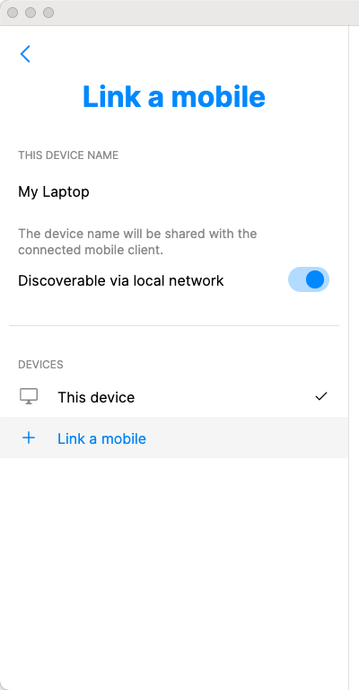
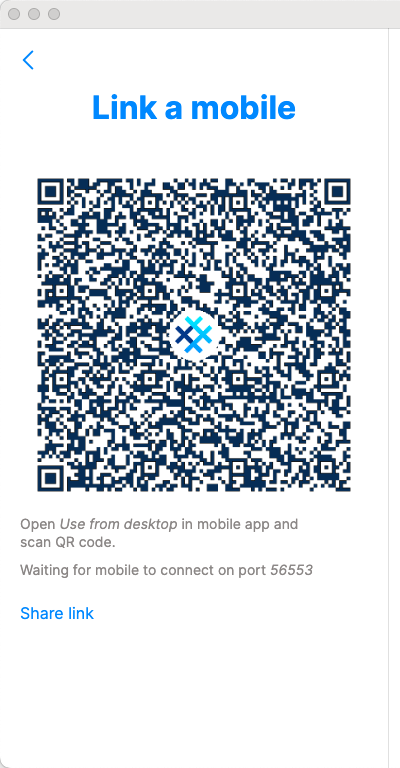
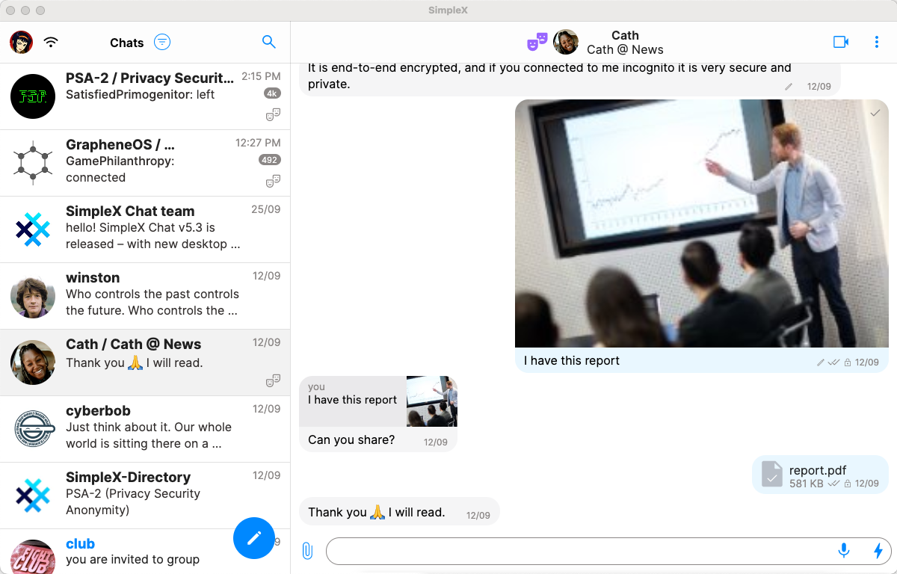
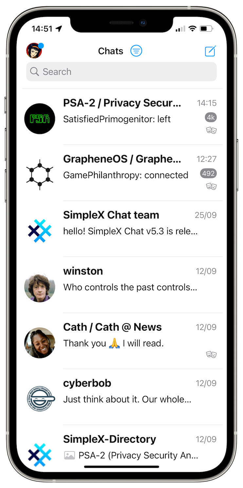
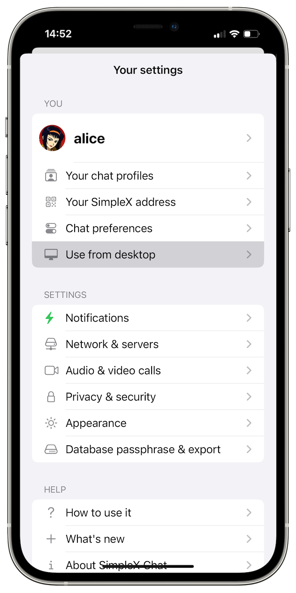
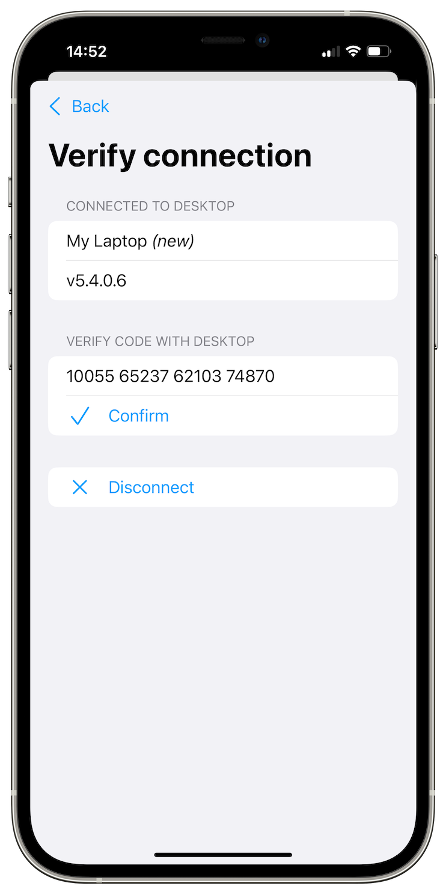
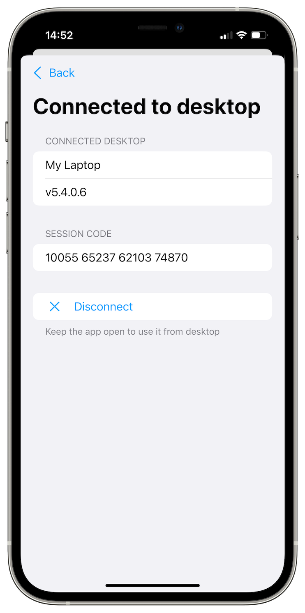
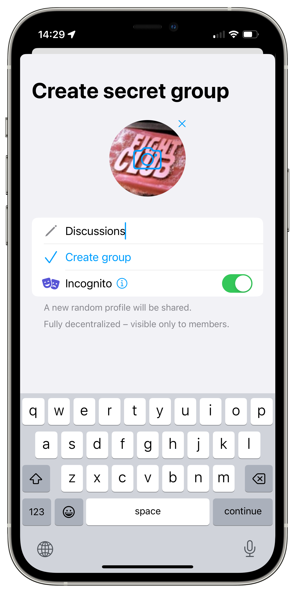
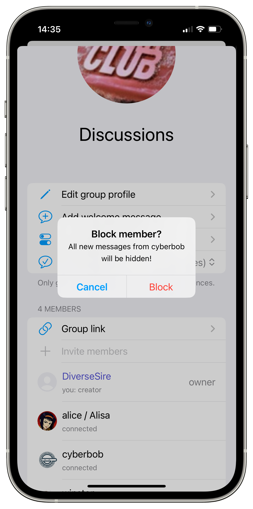

# SimpleX Chat v5.4 - link mobile and desktop apps via quantum resistant protocol, and much better groups.

**Published:** Nov 25, 2023

**What's new in v5.4:**
- [Link mobile and desktop apps via secure quantum-resistant protocol](#link-mobile-and-desktop-apps-via-secure-quantum-resistant-protocol).
  - ⚡️ Quick start - how to use it.
  - How does it work?
  - 🤖 Connecting to remote CLI.
- [Better groups](#better-groups).
  - [Faster to join and more reliable](#faster-to-join-with-more-reliable-message-delivery).
  - [New group features](#new-group-features):
    - create groups with incognito profile,
    - block group members to reduce noise,
    - prohibit files and media in a group.
- [Better calls](#better-calls): faster to connect, with screen sharing on desktop.

There are many [other improvements](#other-improvements) and fixes in this release:
  - profile names now allow spaces.
  - when you delete contacts, they are optionally notified.
  - previously used and your own SimpleX links are recognized by the app.
  - and more - see the [release notes](https://github.com/simplex-chat/simplex-chat/releases/tag/v5.4.0).

## Link mobile and desktop apps via secure quantum-resistant protocol

This release allows to use chat profiles you have in mobile app from desktop app.

This is only possible when both devices are connected to the same local network. To send and receive messages mobile app has to be connected to the Internet.

### ⚡️ Quick start - how to use it

**On desktop**

If you don't have desktop app installed yet, [download it](../docs/DOWNLOADS.md) and create any chat profile - you don't need to use it, and when you create it there are no server requests sent and no accounts are created. Think about it as about user profile on your computer.

Then in desktop app settings choose *Link a mobile* - it will show a QR code.

      

**On mobile**

In mobile app settings choose *Use from desktop*, scan the QR code and verify session code when it appears on both devices - it should be the same. Verifying session code confirms that the devices are connected directly via a secure encrypted connection. There is an option to verify this code on subsequent connections too, but by default it is only required once.

        

The devices are now paired, and you can continue using all mobile profiles from desktop.

If it is an Android app, you can move the app to background, but iOS app has to remain open. In both cases, while you are using mobile profiles from desktop, you won't be able to use mobile app.

The subsequent connections happen much faster - by default, the desktop app broadcasts its session address to the network, in encrypted form, and mobile app connects to it once you choose *Use from desktop* in mobile app settings.

### How does it work?

The way we designed this solution avoided any security compromises, and the end-to-end encryption remained as secure as it was - it uses [double-ratchet algorithm](../docs/GLOSSARY.md#double-ratchet-algorithm), with [perfect forward secrecy](../docs/GLOSSARY.md#forward-secrecy), [post-compromise security](../docs/GLOSSARY.md#post-compromise-security) and deniability.

This solution is similar to WhatsApp and WeChat. But unlike these apps, no server is involved in the connection between mobile and desktop. The connection itself uses a new SimpleX Remote Control Protocol (XRCP) based on secure TLS 1.3 and additional quantum-resistant encryption inside TLS. You can read XRCP protocol specification and threat model in [this document](https://github.com/simplex-chat/simplexmq/blob/master/rfcs/2023-10-25-remote-control.md). We will soon be [augmenting double ratchet](https://github.com/simplex-chat/simplex-chat/blob/master/docs/rfcs/2023-09-30-pq-double-ratchet.md) to be resistant to quantum computers as well.

The downside of this approach is that mobile device has to be connected to the same local network as desktop. But the upside is that the connection is secure, and you do not need to have a copy of all your data on desktop, which usually has lower security than mobile.

Please note, that the files you send, save or play from desktop app, and also images you view are automatically saved on your desktop device (encrypted by default except videos). To remove all these files you can unlink the paired mobile device from the desktop app settings – there will be an option soon allowing to remove the files without unlinking the mobile.

### 🤖 Connecting to remote SimpleX CLI

*Warning*: this section is for technically advanced users!

If you run SimpleX CLI on a computer in another network - e.g., in the cloud VM or on a Raspberry Pi at home while you are at work, you can also use if from desktop via SSH tunnel. Below assumes that you have remote machine connected via SSH and CLI running there - you can use `tmux` for it to keep running when you are not connected via ssh.

Follow these steps to use remote CLI from desktop app:
1. On the remote machine add the IP address of your desktop to the firewall rules, so that when CLI tries to connect to this address, it connects to `localhost` instead: `iptables -t nat -A OUTPUT -p all -d 192.168.1.100 -j DNAT --to-destination 127.0.0.1` (replace `192.168.1.100` with the actual address of your desktop, and make sure it is not needed for something else on your remote machine).
2. Also on the remote machine, run Simplex CLI with the option `--device-name 'SimpleX CLI'`, or any other name you like. You can also use the command `/set device name <name>` to set it for the CLI.
3. Choose *Link a mobile* in desktop app settings, note the port it shows under the QR code, and click "Share link".
4. Run ssh port forwarding on desktop computer to let your remote machine connect to desktop app: `ssh -R 12345:127.0.0.1:12345 -N user@example.com` where `12345` is the port on which desktop app is listening for the connections from step 3, `example.com` is the hostname or IP address of your remote machine, and `user` is some username on remote machine. You can run port forwarding in the background by adding `-f` option.
5. On the remote machine, run CLI command `/connect remote ctrl <link>`, where `<link>` is the desktop session address copied in step 3. You should run this command within 1 minute from choosing *Link a mobile*.
6. If the connection is successful, the CLI will ask you to verify the session code (you need to copy and paste the command) with the one shown in desktop app. Once you use `/verify remote ctrl <code>` command, CLI can be used from desktop app.
7. To stop remote session use `/stop remote ctrl` command.

## Better groups

### Faster to join, with more reliable message delivery

We improved the protocols for groups, by making joining groups much faster, and also by adding message forwarding. Previously, the problem was that until a new member connects directly with each existing group member, they did not see each other messages in the group. The problem is explained in detail in [this video](https://www.youtube.com/watch?v=7yjQFmhAftE&t=1104s) at 18:23.

With v5.4, the admin who added members to the group forwards messages to and from the new members until they connect to the existing members. So you should no longer miss any messages and be surprised with replies to messages you have never seen once you and new group members upgrade.

### New group features

 

**Create groups with incognito profile**

Previously, you could only create groups with your main profile. This version allows creating groups with incognito profile directly. You will not be able to add your contacts, they can only join via group link.

**Block group members to reduce noise**

You now can block messages from group members that send too many messages, or the messages you don't won't to see. Blocked members won't know that you blocked their messages. When they send messages they will appear in the conversation as one line, showing how many messages were blocked. You can reveal them, or delete all sequential blocked messages at once.

**Prohibit files and media in a group**

Group owners now have an option to prohibit sending files and media. This can be useful if you don't won't any images shared, and only want to allow text messages.

## Better calls

Calls in SimpleX Chat still require a lot of work to become stable, but this version improved the speed of connecting calls, and they should work for more users.

We also added screen sharing in video calls to desktop app.

## Other improvements

This version also has many small and large improvements to make the app more usable and reliable.

The new users and group profiles now allow spaces in the names, to make them more readable. To message these contacts in CLI you need to use quotes, for example, `@'John Doe' Hello!`.

When you delete contacts, you can notify them - to let them know they can't message you.

When you try to connect to the same contact or join the same group, or connect via your own link, the app will recognize it and warn you, or simply open the correct conversation.

You can find the full list of fixed bugs and small improvements in the [release notes](https://github.com/simplex-chat/simplex-chat/releases/tag/v5.4.0).

## SimpleX platform

Some links to answer the most common questions:

[How can SimpleX deliver messages without user identifiers](./20220511-simplex-chat-v2-images-files.md#the-first-messaging-platform-without-user-identifiers).

[What are the risks to have identifiers assigned to the users](./20220711-simplex-chat-v3-released-ios-notifications-audio-video-calls-database-export-import-protocol-improvements.md#why-having-users-identifiers-is-bad-for-the-users).

[Technical details and limitations](https://github.com/simplex-chat/simplex-chat#privacy-technical-details-and-limitations).

[How SimpleX is different from Session, Matrix, Signal, etc.](https://github.com/simplex-chat/simplex-chat/blob/stable/README.md#frequently-asked-questions).

Please also see our [website](https://simplex.chat).

## Help us with donations

Huge thank you to everybody who donated to SimpleX Chat!

We are prioritizing users privacy and security - it would be impossible without your support.

Our pledge to our users is that SimpleX protocols are and will remain open, and in public domain, - so anybody can build the future implementations of the clients and the servers. We are building SimpleX platform based on the same principles as email and web, but much more private and secure.

Your donations help us raise more funds – any amount, even the price of the cup of coffee, makes a big difference for us.

See [this section](https://github.com/simplex-chat/simplex-chat/tree/master#help-us-with-donations) for the ways to donate.

Thank you,

Evgeny

SimpleX Chat founder
