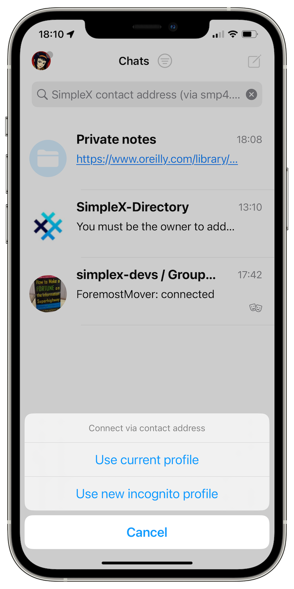

# SimpleX Chat: free infrastructure from Linode, v5.5 released with private notes, group history and a simpler UX to connect.

**Published:** Jan 24, 2024

[SimpleX Chat infrastructure on Linode](#simplex-chat-infrastructure-on-linode):
- Free infrastructure.
- SimpleX servers in Linode Marketplace.
- High capacity messaging servers.

What's new in v5.5:
- [private notes](#private-notes)
- [group history](#group-history)
- [simpler UX to connect to other users](#simpler-ux-to-connect-to-other-users)
- [message delivery stability and other improvements](#message-delivery-stability-and-other-improvements)

Also, we added Hungarian (only Android) and Turkish interface languages, thanks to [our users and Weblate](https://github.com/simplex-chat/simplex-chat#help-translating-simplex-chat).

SimpleX Chat Android app is now available in 20 languages!

## SimpleX Chat infrastructure on Linode

We chose Linode as our hosting provider as and they have been consistently reliable, cheaper than alternatives, with excellent support and great documentation.

When Linode was acquired by Akamai, we were a bit nervous about how it may affect service quality. So far it's been working out quite well.

As the usage of SimpleX network was growing, so did our hosting costs, and from being really small they started to become significant, particularly as we didn't yet manage to optimize the servers last year.

Linode helped - we're really excited to announce that Akamai decided to support SimpleX Chat growth by accepting it into their [Linode Rise startup program](https://www.linode.com/linode-for-startups/).

Thanks to this program:

- we received free infrastructure for the first year up to $10,000 per month, no strings attached. It already saved us some money, and gave us enough time to optimize the servers - the latest version of the servers are much less costly to operate with the current traffic, and can support a much larger traffic within this limit. In the year 2 of the program we will receive 50% discount with unlimited traffic, and in year 3 - 25% discount.

- Linode Marketplace now includes [SimpleX Chat messages and file servers](https://www.linode.com/marketplace/apps/simplex-chat/simplex-chat/) - you can get free $100 credits for the first 2 months and run your own servers in just a few clicks, and use them in SimpleX Chat apps. Anybody can submit their application to Linode marketplace, but dedicated support we have from Linode team via this program made it simpler.

- Akamai solution engineers are helping us to design high capacity server solution, free of charge, so that a single host can provide horizontally scalable capacity for messaging, allowing for a much larger number of concurrent users on a single server address. Initially we considered using HAProxy, and the latest proof of concept uses OpenResty - a fork of Nginx with Lua script engine - to route requests from a single host to multiple SMP relays, reducing an overhead for the clients that would be configured with a smaller number of higher capacity servers. This project is still in progress, there will be more details as we roll it out.

## What's new in v5.5

### Private notes

 

*"Where do I put notes for myself?"* was a very common support question. There was a workaround - you could create an empty group, just with yourself, and use it to save notes, but it was not very convenient, and you could accidentally add members there.

This version has a more convenient and private alternative - the Private notes. It looks like an ordinary conversation where you can put text messages, links with previews, and any media and files, but they are not sent anywhere - they are stored locally, only on your device, with encrypted files.

You can access the Private notes created in mobile app from desktop app too, by linking a mobile and desktop apps - the feature [added in the previous version](./20231125-simplex-chat-v5-4-link-mobile-desktop-quantum-resistant-better-groups.md). It allows to conveniently share files between the devices without sending them over the Internet.

### Group history

 

In the previous version, when users joined groups, they only saw an empty conversation, and the notifications of being connected to other members. This version allows group admins sending recent group history to the new members - this option is enabled by default for new groups, and can be enabled for the existing groups in the preferences. So now new members can join the conversation as soon as they join.

This does not mean that these messages are stored on any servers - the admin member that adds a new member to the group sends these messages directly when a new member joins. Groups are still fully decentralized, do not have any identity on the network, and fully private - only their members know they exist.

That is, unless a group owner decides to make it public. Groups can be registered in [SimpleX groups directory](https://simplex.chat/contact#/?v=1-4&smp=smp%3A%2F%2Fu2dS9sG8nMNURyZwqASV4yROM28Er0luVTx5X1CsMrU%3D%40smp4.simplex.im%2FeXSPwqTkKyDO3px4fLf1wx3MvPdjdLW3%23%2F%3Fv%3D1-2%26dh%3DMCowBQYDK2VuAyEAaiv6MkMH44L2TcYrt_CsX3ZvM11WgbMEUn0hkIKTOho%253D%26srv%3Do5vmywmrnaxalvz6wi3zicyftgio6psuvyniis6gco6bp6ekl4cqj4id.onion) to be discovered by the new members - group directory is also improved.

### Simpler UX to connect to other users

 

SimpleX platform has no user accounts or identities, and while it improves metadata privacy, it also makes it harder to understand how to connect to other people, particularly for the new users who are not invited by the existing users.

This version simplifies this interface by allowing to connect via the received link just by pasting the address into the search bar, as is common in many wallet apps and some other decentralized messengers. We also improved the interface of creating invitation links.

We will continue working on improving and simplifying user interface throughout the year. Please send us any feedback and suggestions to the team's address available in the app.

### Message delivery stability and other improvements

One of the long standing issues was that message reception could get stuck in some rare occasions, and only get resumed once the app is fully restarted. As Android app includes an always-on notification service that runs in background, full restart should be done via the app settings.

This version fixed many issues with message delivery stability and also added some diagnostics to identify any other cases when message delivery may stop. These fixes should also reduce battery usage, particularly on slow internet connections.

Other improvements in this version:
- you can now reveal secret messages by tapping. To send a secret message wrap in "#" characters, e.g. "\#password\#".
- you can delete the last user profile, simplifying account deletion. If you have [hidden user profiles](./20230328-simplex-chat-v4-6-hidden-profiles.md), they won't be deleted in this case, and will be accessible again once you create a new profile.

## SimpleX platform

Some links to answer the most common questions:

[How can SimpleX deliver messages without user identifiers](./20220511-simplex-chat-v2-images-files.md#the-first-messaging-platform-without-user-identifiers).

[What are the risks to have identifiers assigned to the users](./20220711-simplex-chat-v3-released-ios-notifications-audio-video-calls-database-export-import-protocol-improvements.md#why-having-users-identifiers-is-bad-for-the-users).

[Technical details and limitations](https://github.com/simplex-chat/simplex-chat#privacy-technical-details-and-limitations).

[How SimpleX is different from Session, Matrix, Signal, etc.](https://github.com/simplex-chat/simplex-chat/blob/stable/README.md#frequently-asked-questions).

Please also see our [website](https://simplex.chat).

## Help us with donations

Huge thank you to everybody who donated to SimpleX Chat!

We are prioritizing users privacy and security - it would be impossible without your support.

Our pledge to our users is that SimpleX protocols are and will remain open, and in public domain, - so anybody can build the future implementations of the clients and the servers. We are building SimpleX platform based on the same principles as email and web, but much more private and secure.

Your donations help us raise more funds – any amount, even the price of the cup of coffee, makes a big difference for us.

See [this section](https://github.com/simplex-chat/simplex-chat/tree/master#help-us-with-donations) for the ways to donate.

Thank you,

Evgeny

SimpleX Chat founder
