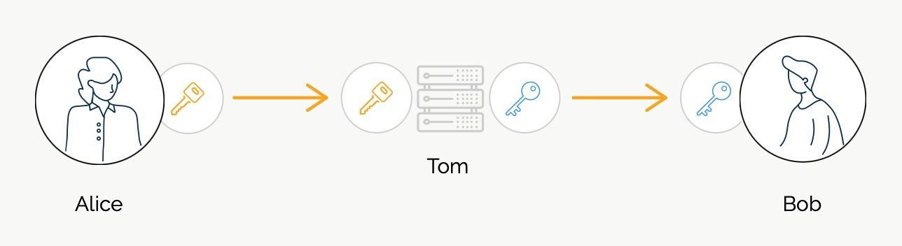
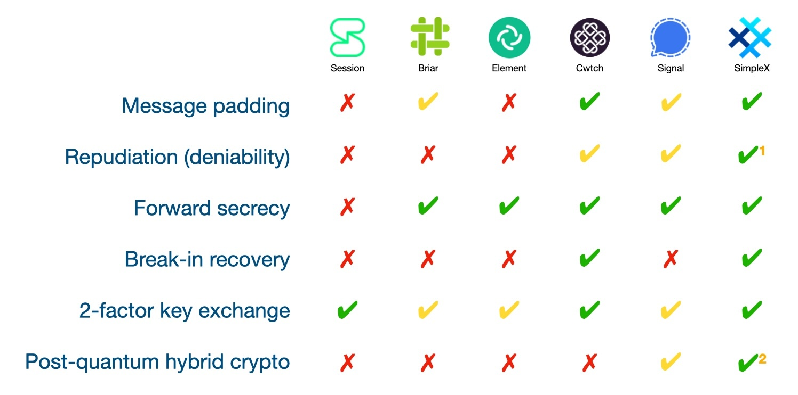

# SimpleX Chat v5.6 beta: adding quantum resistance to Signal double ratchet algorithm

**Published:** Mar 14, 2024

This is a major upgrade for SimpleX messaging protocols, we are really proud to present the results of the hard work of our whole team on the [Pi day](https://en.wikipedia.org/wiki/Pi_Day).

This post also covers various aspects of end-to-end encryption, compares different messengers, and explains why and how quantum-resistant encryption is added to SimpleX Chat:

- [Why do we need end-to-end encryption?](#why-do-we-need-end-to-end-encryption)
- [Why is encryption even allowed?](#why-is-encryption-even-allowed)
- [End-to-end encryption security: attacks and defense.](#end-to-end-encryption-security-attacks-and-defense)
  1. Compromised message size - mitigated by padding messages to a fixed block size.
  2. Compromised confidentiality - mitigated by repudiation (deniability).
  3. Compromised message keys - mitigated by forward secrecy.
  4. Compromised long-term or session - mitigated by break-in recovery.
  5. Man-in-the-middle attack - mitigated by two-factor key exchange.
  6. "Record now, decrypt later" attacks - mitigated by post-quantum cryptography.
- [How secure is encryption in different messengers?](#how-secure-is-end-to-end-encryption-in-different-messengers)
- [Adding quantum resistance to Signal double ratchet algorithm.](#adding-quantum-resistance-to-signal-double-ratchet-algorithm)
- [When can you start using quantum resistant chats?](#when-can-you-start-using-quantum-resistant-chats)
- [Next for post-quantum crypto - all direct chats, small groups and security audit.](#next-for-post-quantum-crypto---all-direct-chats-small-groups-and-security-audit)

## Why do we need end-to-end encryption?

The objective of end-to-end encryption is to make any potential attackers, such as traffic observers or communication providers who pass the messages between senders and recipients, unable to recover *any* message content or meaningful information about the messages, even if these attackers possess very advanced computing and mathematical capabilities.

While human eyes are unable to see any difference between simply scrambled and encrypted messages, the difference between unreadable scrambling and unbreakable encryption can be as huge as just a few seconds to unscramble a message on an average laptop and more time than the Universe existed required to break the encryption on the most powerful computer in the world.

Achieving the latter requires a lot of mathematical precision in both the cryptographic algorithms and in how they are used, and effectively makes encrypted messages indistinguishable from random noise, without any discoverable patterns or statistical irregularities that a computer could use to break the message encryption any faster than it it would take to try every possible combination of bits in the key.

End-to-end encryption is an important component of our individual and business security, privacy and sovereignty. Having our private communications protected from any observers is both the natural condition and our inalienable human right.

It's very sad to see the same people who keep their financial affairs private to protect from financial crimes, lock their doors to protect from thieves, and curtain their windows to protect from the occasional prying eyes, when it comes to protecting their personal lives from the data criminals say "we don't care about privacy, we have nothing to hide". Everybody's safety depends on keeping their affairs and relations private, not visible to a vast and ruthless data gathering machines, that abuse our data for commercial gain, without any regard to our interests or even [the safety of our families and children](https://nmdoj.gov/press-release/attorney-general-raul-torrez-files-lawsuit-against-meta-platforms-and-mark-zuckerberg-to-protect-children-from-sexual-abuse-and-human-trafficking/).

## Why is encryption even allowed?

If encryption is such a powerful tool to protect our lives, it also can be used to conceal crimes, so why the governments don't consider it similar to arms, and don't heavily regulate its use?

Prior to 1996 the cryptography was considered munition, and its export from the United States was controlled under this category, [alongside flamethrowers and B-1 bombers](https://cr.yp.to/export/1995/0303-eff.txt). When [Daniel J. Bernstein](https://en.wikipedia.org/wiki/Daniel_J._Bernstein) (DJB), then a student of Mathematics at University of California, Berkeley, wanted to publish the paper and the source code of his Snuffle encryption system, the Office of Defense Trade Controls of the Department of State (DOS) after more than a year of correspondence requested that DJB registers as the arms dealer.

In 1995 DJB represented by the Electronic Frontier Foundation brought a case against the DOS to overturn cryptography restrictions. The ruling in the case declared that the export control over cryptographic software and related technical data constitute [an impermissible infringement on speech in violation of the First Amendment](https://cr.yp.to/export/1996/1206-order.txt). This decision resulted in regulatory changes, reducing controls on encryption exports, particularly for open-source algorithms. The case continued until 2003, when it was put on hold after the commitment from the US government not to enforce any remaining regulations.

This case is very important for the whole industry, as to this day we can freely create and use open-source cryptography without export control restrictions. It also shows the importance of engaging with the system and challenging its views in an open dialogue, rather than either blindly complying or violating regulations.

DJB role for cryptography and open-source goes beyond this case – many cryptographic algorithms that are considered to be the most advanced, and many of which we use in SimpleX Chat, were designed and developed by him:

- Ed25519 cryptographic signature algorithm we use to authorize commands to the servers.
- NaCL library with cryptobox and secretbox constructions that combine X25519 Diffie-Hellman key agreement with Salsa20 encryption and Poly1305 authentication. We use cryptobox to encrypt messages in two of three encryption layers and secretbox to encrypt files.
- Streamlined NTRU Prime algorithm for quantum resistant key agreement that we used in the protocol for linking mobile app with desktop, and now added to Signal double ratchet algorithm, as explained below.

Without DJB's work the world would have been in a much worse place privacy- and security-wise.

Daniel, we are really grateful for the work you did and continue doing. Thank you, and congratulations on the International Mathematics Day!

## End-to-end encryption security: attacks and defense

End-to-end encryption is offered by many messaging apps and protocols, but the security of different implementations are not the same. While many users know about the importance of forward secrecy - the quality of end-to-end encryption that preserves security of the encryption of the past messages, even if the keys used to encrypt some of the messages were compromised - there are many other qualities that protect from different attacks. Below there is the overview of these attacks and the properties of end-to-end encryption schemes that mitigate these attacks.

### 1. Compromised message size - mitigated by padding messages to a fixed block size

While the content encryption is the most important, concealing the actual message size is almost as important for several reasons:

- attacker able to observe even approximate message sizes can use these sizes as an additional signal for machine learning to de-anonymise the users and to categorize the relationships between the users.
- if a messenger conceals the routing of the messages to hide the transport identities (IP addresses) of senders and recipients, message sizes can be used by traffic observers to confirm the fact of communication with a much higher degree of certainty.

The only effective mitigation to these attacks is to pad all messages to a fixed size. Using space-efficient schemes like Padme, or padding to encryption block size is ineffective for mitigating these attacks, as they still allow differentiating message sizes.

To the best of our knowledge, the only messengers other than SimpleX Chat that pad all messages to a fixed packet size are Cwtch and no longer developed [Pond](https://github.com/agl/pond) - SimpleX design can be seen as an evolution of Pond design.

### 2. Compromised confidential messages - mitigated by repudiation (deniability)

Many users are very interested in having ability to irreversibly delete sent messages from the recipients devices. But not only would this ability violate data sovereignty of device owners, it is also completely ineffective, as the recipients could simply put the device offline or use a modified client app to ignore message deletion requests. While SimpleX Chat provides such features as [disappearing messages](./20230103-simplex-chat-v4.4-disappearing-messages.md#disappearing-messages) and the ability to [irreversibly delete sent messages](./20221206-simplex-chat-v4.3-voice-messages.md#irreversible-message-deletion) provided both parties agree to that, these are convenience features, and they cannot be considered security measures.

The solution to that is well known to cryptographers - it is the quality of the encryption algorithms called "repudiation", sometimes also called "deniability". This is the ability of the senders to plausibly deny having sent any messages, because cryptographic algorithms used to encrypt allow recipients forging these messages on their devices, so while the encryption proves authenticity of the message to the recipient, it cannot be used as a proof to any third party.

Putting it all in a simpler language - a sender can claim that the recipient forged messages on their device, and deny ever having sent them. The recipient will not be able to provide any cryptographic proof. This quality makes digital conversation having the same qualities as private off-the-record conversation - that's why the family of algorithms that provide these qualities are called off-the-record (OTR) encryption.

Repudiation is still a rather new concept - the first off-the-record algorithms were proposed in 2004 and were only offered to a wide range of users in Signal messenger. This concept is still quite badly understood by users and society, and yet to have been used as the defense in any public court cases, as legal systems evolve much slower than technology. In high profile cases repudiation can be used as an effective evidence for the defense.

Repudiation in messaging systems can be undermined by adding cryptographic signature to the protocol, and many messengers that use OTR encryption algorithms do exactly that, unfortunately. SimpleX Chat does not use signature in any part of client-client protocol, but the signature is currently used when authorizing sender's messages to the relays. v5.7 will improve deniability by enabling a different authorization scheme that will provide full-stack repudiation in all protocol layers.

### 3. Compromised message keys - mitigated by forward secrecy

The attacker who obtained or broke the keys used to encrypt individual messages, may try to use these keys to decrypt past or future messages. This attack is unlikely to succeed via message interception, and it is likely to require breaking into the device storage. But in any case, if the key was broken or obtained in some other way it's important that this key cannot be used to decrypt other messages - this is achieved by forward secrecy.

This property is well understood by the users, and most messengers that focus on privacy and security, with the exception of Session, provide forward secrecy as part of their encryption schemes design.

### 4. Compromised long-term or session - mitigated by break-in recovery

This attack is much less understood by the users, and forward secrecy does not protect from it. Arguably, it's almost impossible to compromise individual message keys without compromising long-term or session keys. So the ability of the encryption to recover from break-in (attacker making a copy of the device data without retaining the ongoing access) is both very important and pragmatic - break-in attacks are simpler to execute on mobile devices during short-term device access than long-term ongoing compromise.

Out of all encryption algorithms known to us only _Signal double ratchet algorithm_ (also referred to as _Signal algorithm_ or _double ratchet algorithm_, which is not the same as Signal messaging platform and protocols) provides the ability for the encryption security to recover after break-ins attacks. This recovery happens automatically and transparently to the users, without them doing anything special or even knowing about break-in, by simply sending messages. Every time one of the communication parties replies to another party message, new random keys are generated and previously stolen keys become useless.

Double ratchet algorithm is used in Signal, Cwtch and SimpleX Chat. But Signal app by allowing to use the same profile on multiple devices compromises the break-in recovery function of Signal algorithm, as explained in [this paper](https://eprint.iacr.org/2021/626.pdf). Because of break-in recovery you cannot use SimpleX Chat profile on more than one device at the same time - the encryption scheme rotates the long term keys, randomly, and keys on another device become useless, as they would become useless for the attacker who stole them. Security always has some costs to the convenience.

### 5. Man-in-the-middle attack - mitigated by two-factor key exchange

Many people incorrectly believe that security of end-to-end encryption cannot be broken by communication provider. But end-to-end encryption is only as secure as key exchange. While any intermediary passing the keys between senders and recipients cannot recover the private keys from the public keys, they can simply replace the passed public keys with their own and then proxy all communication between the users having full access to the original messages. So instead of having an end-to-end encrypted channel, users would have two half-way encrypted channels - between users and their communication intermediary.

Pictures below illustrate how this attack works for RSA encryption.

#### 1) Alice sends the key to Bob (e.g. via p2p network or via the messaging server).

#### 2) Now Bob can send encrypted messages to Alice - he believes they are secure!

#### 3) But the key could have been intercepted and substituted by Tom (the attacker, or a service provider).

#### 4) Now the attacker can read the messages without Alice and Bob knowing.

The attack on Diffie-Hellman (or on quantum-resistant) key exchange, when both parties send their public keys (or public key and ciphertext), requires the attacker to intercept and replace both keys, but the outcome remains the same - if all communication is passed via a single channel, as it is usually the case with communication services, then any attacker that has inside access to the service can selectively compromise some of the conversations. Two years ago I wrote the post about this [vulnerability of end-to-end encryption to MITM attacks](https://www.poberezkin.com/posts/2022-12-07-why-privacy-needs-to-be-redefined.html#e2e-encryption-is-not-bulletproof).

All known mitigations of this attack require using the secondary communication channel to ensure that the keys have not been substituted. The most secure approach is to make user's key (or key fingerprint) a part of the user's address or connection link, thus making two-factor key exchange non-optional. This approach is used in Session, Cwtch and SimpleX Chat.

A less secure approach is to provide users an optional way to compare security codes - this is what is done by Signal, Element and many other messengers. The problem with this post-key-exchange verification is that it is optional, and is usually skipped by the majority of the users. Also, this security code can change because the user changed the device, or as a result of the attack via the service provider. When you see in the client app the notification that the security code changed, it's pointless to ask in the same messenger whether the device was changed, as if it were an attack, the attacker would simply confirm it. Instead, the security code needs to be re-validated again via another channel. A good security practice for the users would be to warn their communication partners about the intention to switch the device in advance, before the security code is changed.

### 6. "Record now, decrypt later" attacks - mitigated by post-quantum cryptography.

This is the idea based on the assumption that commercially viable quantum computers will become available during the next 10 years, and then they can use time-efficient [Shor's algorithm](https://en.wikipedia.org/wiki/Shor%27s_algorithm) developed in 1994 to break asymmetric encryption with quantum computer (symmetric encryption is not vulnerable to this algorithm).

Post-quantum cryptography, or encryption algorithms that are resistant to quantum computers, has been the area of ongoing research for several decades, and there are some algorithms that _might_ protect from quantum computers. It's important to account for these limitations:

- _none of the post-quantum algorithms are proven to be secure_ against quantum or conventional computers. They are usually referred to as "believed to be secure" by the researchers and security experts. There is continuous research to break post-quantum algorithms, and to prove their security, and many of these algorithms are broken every year, often by conventional computers.
- because of the lack of proofs or guarantees that post-quantum cryptography delivers on its promise, these algorithms can only be used in hybrid encryption schemes to augment conventional cryptography, and never to replace it, contrary to some expert recommendations, as DJB explains in this [blog post](https://blog.cr.yp.to/20240102-hybrid.html).
- they are much more computationally expensive and less space efficient, and the encryption schemes have to balance their usability and security.
- many of post-quantum algorithms have known patent claims, so any system deploying them accepts the risks of patent litigation.
- the silver lining to these limitations is that the risk of appearance of commercially viable quantum computers in the next decade may be exaggerated.

So, to say it provocatively, post-quantum cryptography can be compared with a remedy against the illness that nobody has, without any guarantee that it will work. While there is a reasonable hope that it _might_ work, so it's not exactly a _snake oil_, these limitations and risks have to be much better communicated to the end users than they are.

Does it mean that post-quantum cryptography is useless and should be ignored? Absolutely not. The risks of "record now, decrypt later" attacks are real, particularly for high profile targets, including millions of people - journalists, whistle-blowers, freedom-fighters in oppressive regimes, and even some ordinary people who may become targets of information crimes. Large scale collection of encrypted communication data is ongoing, and this data may be used in the future. So having the solution that _may_ protect you (post-quantum cryptography), as long as it doesn't replace the solution that is _proven_ to protect you (conventional cryptography), is highly beneficial in any communication solution, and has already been deployed in many tools and in some messengers.

## How secure is end-to-end encryption in different messengers?

This comparison may be incorrect in some of the columns. We apologize if some of the points are incorrect, please let us know about any mistakes so we can amend them!

The main objective here is to establish the framework for comparing the security of end-to-end encryption schemes, and to highlight any areas for improvement, not to criticize any implementations.

1 Repudiation in SimpleX Chat will include client-server protocol from v5.7 or v5.8. Currently it is implemented but not enabled yet, as its support requires releasing the relay protocol that breaks backward compatibility.

2 Post-quantum cryptography is available in beta version, as opt-in only for direct conversations. See below how it will be rolled-out further.

Some columns are marked with a yellow checkmark:
- when messages are padded, but not to a fixed size (Briar pads messages to the size rounded up to 1024 bytes, Signal - to 160 bytes).
- when repudiation does not include client-server connection. In case of Cwtch it appears that the presence of cryptographic signatures compromises repudiation (deniability), but it needs to be clarified.
- when 2-factor key exchange is optional (via security code verification).
- when post-quantum cryptography is only added to the initial key agreement and does not protect break-in recovery.

## Adding quantum resistance to Signal double ratchet algorithm

We have been exploring post-quantum cryptography since early 2022, when SimpleX Chat was first released, and we did not want to be pioneers here - cryptography is critically important to make it right.

We hoped to adopt the algorithm that will be standardized by NIST, but the standardization process turned out to be hugely disappointing, and the ML-KEM (Kyber) algorithm that was accepted as a standard was modified to remove an important hashing step (see the lines 304-314 in [the published spec](https://nvlpubs.nist.gov/nistpubs/FIPS/NIST.FIPS.203.ipd.pdf))), that mitigates the attacks via a compromised random numbers generator, ignoring strong criticism from many expert cryptographers, including DJB (see [this discussion](https://groups.google.com/a/list.nist.gov/g/pqc-forum/c/WFRDl8DqYQ4) and [the comments NIST received](https://csrc.nist.gov/files/pubs/fips/203/ipd/docs/fips-203-initial-public-comments-2023.pdf)). To make it even worse, the calculation of security levels of Kyber appears to have been done incorrectly, and overall, the chosen Kyber seems worse than rejected NTRU according to [the analysis by DJB](https://blog.cr.yp.to/20231003-countcorrectly.html).

We also analyzed the encryption schemes proposed in Tutanota in 2021, and another scheme adopted by Signal last year, and published the design of [quantum resistant double ratchet algorithm](https://github.com/simplex-chat/simplex-chat/blob/stable/docs/rfcs/2023-09-30-pq-double-ratchet.md) that we believe provides better security than these schemes:

- unlike Tutanota design, it augments rather than replaces conventional cryptography, and also avoids using signatures when the new keys are agreed (ratchet steps).
- unlike other messengers that adopted or plan to adopt ML-KEM, we used Streamlined NTRU Prime algorithm (specifically, strnup761) that has no problems of ML-KEM, no known patent claims, and seems less likely to be compromised than other algorithms - it is exactly the same algorithm that is used in SSH. You can review the comparison of [the risks of various post-quantum algorithms](https://ntruprime.cr.yp.to/warnings.html).
- unlike Signal design that only added quantum resistance to the initial key exchange by replacing X3DH key agreement scheme with post-quantum [PQXDH](https://signal.org/docs/specifications/pqxdh/), but did not improve Signal algorithm itself, our design added quantum-resistant key agreements inside double algorithm, making its break-in recovery property also quantum resistant.

The we could make break-in recovery property of Signal algorithm quantum-resistant, and why, probably, Signal didn't, is because irrespective of the message size SimpleX Chat uses a fixed block size of 16kb to provide security and privacy against any traffic observers and against messaging relays. So we had an extra space to accommodate additional ~2.2kb worth of keys in each message without any additional traffic costs.

In case when the message is larger than the remaining block size, e.g. when the message contains image or link preview, or a large text, we used [zstd compression](https://en.wikipedia.org/wiki/Zstd) to provide additional space for the required keys without reducing image preview quality or creating additional traffic - our previously inefficient JSON encoding of chat messages was helpful in this case.

<image src="./images/20240314-kem.jpg" alt="Double KEM agreement" width="500" class="float-to-right">

The additional challenge in adding sntrup761 was that unlike Diffie-Hellman key exchange, which is symmetric (that is, the parties can share their public keys in any order and the shared secret can be computed from two public keys), sntrup761 is interactive key-encapsulation mechanism (KEM) that requires that one party shares its public key, and another party uses it to encapsulate (which is a fancy term for "encrypt" - that is why it has asterisks in the image) a random shared secret, and sends it back - making it somewhat similar to RSA cryptography. But this asymmetric design does not fit the symmetric operation of Signal double ratchet algorithm, where both sides need to generate random public keys and to compute new shared secrets every time messaging direction changes for them. So to achieve that symmetry we had to use two KEM key agreements running in parallel, in a lock-step fashion, as shown on the diagram. In this case both parties generate random public keys and also use the public key of another party to encapsulate the random shared secret. Effectively, this design adds a double quantum-resistant key agreement to double ratchet algorithm steps that provide break-in recovery.

## When can you start using quantum resistant chats?

  

Quantum resistant double ratchet algorithm is already available in v5.6 (beta) of SimpleX Chat as an optional feature that can be enabled for the new and, separately, for the existing direct conversations.

The reason it is released as opt-in is because once the conversation is upgraded to be quantum resistant, it will no longer work in the previous version of the app, and we see this ability to downgrade the app if something is not working correctly as very important for the users who use the app for critical communications.

**To enable quantum resistance for the new conversations**:
- open the app settings (tap user avatar in the top left corner).
- scroll down to _Developer tools_ and open them.
- enable _Show developer options_ toggle.
- now you will see _Post-quantum E2EE_ toggle - enable it as well.

Now all new contacts you add to the app will use quantum resistant double ratchet algorithm.

Once you have enabled it for the new contacts, you can also **enable it for some of the existing contacts**:
- open the chat with the contact you want to upgrade to be quantum resistant.
- tap contact name above the chat.
- tap Allow PQ encryption.
- exchange several messages back and forth with that contact - the quantum resistant double ratchet will kick in after 3-5 messages (depending on how many messages you send in each direction), and you will see the notice in the chat once it enables.

## Next for post-quantum crypto - all direct chats, small groups and security audit

We will be making quantum resistance default for all direct chats in v5.7, and we plan that all existing direct chats will be automatically upgraded when both contacts install v5.7.

We will also be adding quantum resistance to small groups up to 10-20 members. Computing cryptographic keys is much slower, in comparison, and it would be very inefficient (and completely unnecessary) for large public groups.

We have also arranged a 3rd party cryptographic review of our protocol and encryption schemes design for June/July 2024 - it will cover the additions to SimpleX protocols since [the previous security audit](./20221108-simplex-chat-v4.2-security-audit-new-website.md) in November 2022, including [XFTP protocol](./20230301-simplex-file-transfer-protocol.md) we use for file transfers and quantum resistant Signal double ratchet algorithm we just released in this beta version.

In November 2024 we will be conducting further implementation audit, with double the scope of our 2022 audit.

Security audits are very expensive, as they require employing exceptionally competent engineers and cryptographers, and it does stretch our budgets - so any donations to help us cover the costs would be hugely helpful. 

That's it for now!

Thank you for helping us improve the app, and look forward to your feedback.

## SimpleX network

Some links to answer the most common questions:

[How can SimpleX deliver messages without user identifiers](./20220511-simplex-chat-v2-images-files.md#the-first-messaging-platform-without-user-identifiers).

[What are the risks to have identifiers assigned to the users](./20220711-simplex-chat-v3-released-ios-notifications-audio-video-calls-database-export-import-protocol-improvements.md#why-having-users-identifiers-is-bad-for-the-users).

[Technical details and limitations](https://github.com/simplex-chat/simplex-chat#privacy-and-security-technical-details-and-limitations).

[How SimpleX is different from Session, Matrix, Signal, etc.](https://github.com/simplex-chat/simplex-chat/blob/stable/README.md#frequently-asked-questions).

Please also see our [website](https://simplex.chat).

## Help us with donations

Huge thank you to everybody who donates to SimpleX Chat!

As I wrote, we are planning a 3rd party security audit for the protocols and cryptography design, and also for an app implementation, and it would hugely help us if some part of this $50,000+ expense is covered with donations.

We are prioritizing users privacy and security - it would be impossible without your support.

Our pledge to our users is that SimpleX protocols are and will remain open, and in public domain, - so anybody can build the future implementations of the clients and the servers. We are building SimpleX network based on the same principles as email and web, but much more private and secure.

Your donations help us raise more funds – any amount, even the price of the cup of coffee, makes a big difference for us.

See [this section](https://github.com/simplex-chat/simplex-chat/tree/master#help-us-with-donations) for the ways to donate.

Thank you,

Evgeny

SimpleX Chat founder
