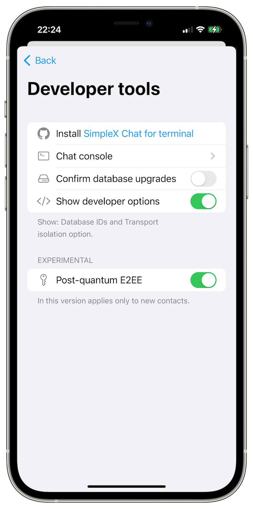

# SimpleX network: real privacy and stable profits, non-profits for protocols, v5.6 released with quantum resistant e2e encryption and simple profile migration

**Published:** Mar 23, 2024

SimpleX network: deliver real privacy via a profitable business and non-profit protocol governance:
- [community and business interests are aligned](#community-and-business-interests-are-aligned).
- [the journey to the decentralized non-profit protocol governance](#the-journey-to-the-decentralized-non-profit-protocol-governance).
- [welcome, Esra’a](#welcome-esraa)!

What's new in v5.6:
- [quantum resistant end-to-end encryption](#quantum-resistant-end-to-end-encryption-beta) (BETA) – enable it for the new contacts.
- [use the app during the audio and video calls](#use-the-app-during-the-audio-and-video-calls).
- [migrate all app data to another device via QR code](#migrate-all-app-data-to-another-device-via-qr-code).

There are many other improvements and fixes in this release:
- group admins can block a member for all other members.
- filtering chats no longer includes muted chats with unread messages.
- and more - see the [release notes](https://github.com/simplex-chat/simplex-chat/releases/tag/v5.6.0).

## SimpleX network: deliver real privacy via a profitable business and non-profit protocol governance

### Community and business interests are aligned

Some people in our users' community believe that there is a conflict between the business and the community interests. This view fails to see a bigger picture of how these interests are aligned. I wrote a blog post about it [here](https://www.poberezkin.com/posts/2023-10-31-why-privacy-impossible-without-venture-funding.html). Our goal is to grow the network and the ecosystem while enriching all stakeholders involved, both the community and the business shareholders. This strategy relies on the strengths and opportunities of both the business and the decentralized network we build, with its vibrant community of individuals and organizations. It positions the business not as a controller but as a supporter of the community growth, resilience and sustainability.

By leveraging access to investment resources, its ability to provide stock-based incentives beyond salaries, operating as a business will satisfy users' and community needs more effectively, ensuring the long-term viability and growth of the network, while remaining true to the mission. A purely nonprofit model with no avenue to sustain this growth is simply not possible. Sustainability requires profits, that is simply spending less than earning, as every responsible individual and organization should aim for, and these profits must be based on users' payments, and not on some other sources of revenue or funds. And building the software product that customers are willing to pay for requires substantial business investments. We will accomplish it while maintaining transparency and the commitment to keep SimpleX network and its protocols open and free to use.

### The journey to the decentralized non-profit protocol governance

At the current early stage of network growth the protocols will benefit most from the rapid evolution and centralized design. Many protocols that decentralized their evolution too early failed to evolve and to adapt to the product requirements of the majority of users, causing them to stall in growth. Even the open web became possible only thanks to Netscape, a venture funded company, that developed browsers and web server software taking it upon themselves to rapidly evolve web specification to make it into a robust application platform as we now know it. It is very unlikely that it would have happened if it was managed by a nonprofit or community, in a decentralized way.

Once SimpleX network protocols stabilize and reach the required maturity, we plan to transition its governance to several new nonprofit entities, ensuring its continued evolution aligns more closely with our vision of community-driven, independent and transparent governance. We and our investors believe that this is a win-win strategy. It both maximizes the business value, by creating a product built on protecting privacy and users' trust - a model that we see as the only viable path forward. It also maximizes the value created for the user community.

### Welcome, Esra’a!

To help us deliver these goals, Esra’a Al Shafei joined SimpleX Chat team - we are excited to welcome her!

Esra'a is a longtime privacy and human rights advocate from Bahrain. She is the founder of [Majal.org](http://majal.org), a network of platforms that amplify under-reported and marginalized voices in the Middle East and North Africa. She is also the co-founder of the [Numun Fund](https://numun.fund/), the first dedicated fund for women-led tech in the Global South. Esra’a is currently the Vice Chair of the Board at the [Wikimedia Foundation](https://wikimediafoundation.org/), the nonprofit which hosts Wikipedia. She is also on the Board of the [Tor Project](https://www.torproject.org/), developers of one of the world’s strongest tools for privacy and freedom online. Previously, she served on the Board of [Access Now](https://www.accessnow.org/), an international nonprofit dedicated to an open and free Internet.

In her own words: *"Privacy and security have been the center of my work as a human rights advocate for the last 20 years in one of the most surveilled countries in the world where staying safe remains a burden. Our privacy is our dignity. It is something that belongs to us and something we should treasure - as people, as companies, as governments. Despite messaging being the most intimate aspect of our digital lives, the leading protocols in this space are centralized and we deserve a web that operates on the core principles of genuine privacy and security in a fully decentralized framework. SimpleX network will play a critical role towards that vision."*

Executing the plan towards decentralized nonprofit protocol governance will be Esra’a’s primary responsibility. Our primary objective with this plan is to ensure that no single entity can control or have unrestricted ownership of the protocols, so it can maintain its integrity.

## What's new in v5.6

### Quantum resistant end-to-end encryption (BETA)

Adding post-quantum resistance to the double ratchet end-to-end encryption algorithm in SimpleX Chat is a major upgrade to messaging protocols, and it creates the security against the future quantum computers.

I wrote in detail in the previous post about various properties of end-to-end encryption and how exactly quantum resistance is implemented in SimpleX Chat - currently SimpleX Chat has [the most secure end-to-end encryption design](./20240314-simplex-chat-v5-6-quantum-resistance-signal-double-ratchet-algorithm.md#how-secure-is-end-to-end-encryption-in-different-messengers) against the present and future attacks.

We plan to perform a security audit of this design and implementation later this year.

Post-quantum encryption is currently added as opt-in and has to be separately enabled to be active for the new contacts, and, additionally, can be enabled for the existing contacts.

  

**To enable quantum resistance for the new conversations**:
- open the app settings (tap user avatar in the top left corner).
- scroll down to _Developer tools_ and open them.
- enable _Show developer options_ toggle.
- now you will see _Post-quantum E2EE_ toggle - enable it as well.

Now all new contacts you add to the app will use quantum resistant Signal double ratchet algorithm.

Once you have enabled it for the new contacts, you can also **enable it for some of the existing contacts**:
- open the chat with the contact you want to upgrade to be quantum resistant.
- tap contact name above the chat.
- tap Allow PQ encryption.
- exchange several messages back and forth with that contact - the quantum resistant double ratchet will kick in after 3-5 messages (depending on how many messages you send in each direction), and you will see the notice in the chat once it enables.

We will be making quantum resistance default for all direct chats in v5.7, and we plan that all existing direct chats will be automatically upgraded when both contacts install v5.7.

### Use the app during the audio and video calls

 

Since we added the audio and video calls in 2022 a lot of work was done to improve the stability of calls. One of the usability downsides until this release was that it was impossible to use the app during the call.

This version solved this problem - now you can return back to the app without interrupting the call and use any of the app functions - for example, you can send the messages or files to the person you are in the call with. If this is a video call, you will continue seeing your contact in a small picture-in-picture view.

### Migrate all app data to another device via QR code

We always believed that cross-platform data portability is very important for any software. Users own their data, and they should have a way to export it from any software they use. So from the version of SimpleX Chat [released in July 2022](./20220711-simplex-chat-v3-released-ios-notifications-audio-video-calls-database-export-import-protocol-improvements.md#database-export-and-import) it was possible to export the database as a self-contained file, including all contacts, messages and files, and import it on a new device.

_"How can I migrate my data to another device?"_ was one of the most frequent user questions, but until this release this process was [quite complex](), requiring too many steps, and most non-technical users were not willing to try it, as even though it was reliable, it appeared risky.

This release made the app data migration very simple, see the steps below.

**Start the migration on the source device**

        

On the device you migrate your app data from, follow these steps:
- choose _Migrate to another device_,
- if necessary, set the database passphrase (initially, the database is encrypted with a random passphrase), or, if it's already set, verify it - for security and to ensure that the archive will be usable on the new device,
- tap _Archive and upload_ to and upload the app data in chunks to the XFTP servers configured in the app,
- the app will show the QR code that should be scanned from the new device.

**Migrate data to the target device**

        

On the device you migrate your data to, follow these steps:
- on the first app page choose _Migrate from another device_,
- scan the QR code shown on the source device,
- once the archive downloads, enter the database passphrase and tap _Open chat_,

**Finalize migration on the source device**

When the chat starts on the target device, make sure to tap _Finalize migration_ and then _Delete database_ on the source device.

The database cannot be used on two devices at the same time, doing so would make it impossible to decrypt the received messages. This is a security measure - the break-in recovery property of double ratchet algorithm.

## SimpleX network

Some links to answer the most common questions:

[How can SimpleX deliver messages without user identifiers](./20220511-simplex-chat-v2-images-files.md#the-first-messaging-platform-without-user-identifiers).

[What are the risks to have identifiers assigned to the users](./20220711-simplex-chat-v3-released-ios-notifications-audio-video-calls-database-export-import-protocol-improvements.md#why-having-users-identifiers-is-bad-for-the-users).

[Technical details and limitations](https://github.com/simplex-chat/simplex-chat#privacy-technical-details-and-limitations).

[How SimpleX is different from Session, Matrix, Signal, etc.](https://github.com/simplex-chat/simplex-chat/blob/stable/README.md#frequently-asked-questions).

Please also see our [website](https://simplex.chat).

## Help us with donations

Huge thank you to everybody who donates to SimpleX Chat!

As I wrote, we are planning a 3rd party security audit for the protocols and cryptography design, and also for an app implementation, and it would hugely help us if some part of this $50,000+ expense is covered with donations.

We are prioritizing users privacy and security - it would be impossible without your support.

Our pledge to our users is that SimpleX protocols are and will remain open, and in public domain, - so anybody can build the future implementations of the clients and the servers. We are building SimpleX network based on the same principles as email and web, but much more private and secure.

Your donations help us raise more funds – any amount, even the price of the cup of coffee, makes a big difference for us.

See [this section](https://github.com/simplex-chat/simplex-chat/tree/master#help-us-with-donations) for the ways to donate.

Thank you,

Evgeny

SimpleX Chat founder
