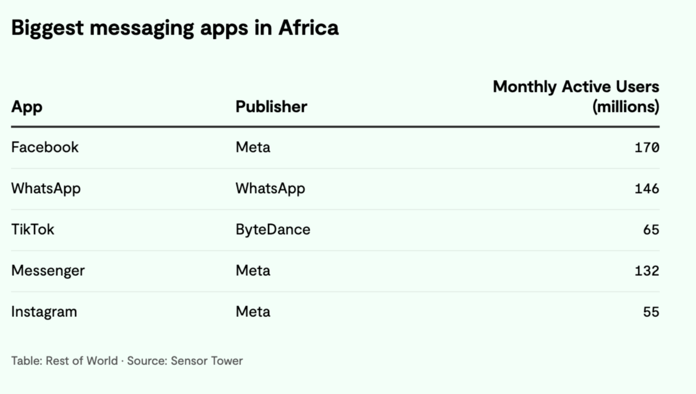

# Why I joined SimpleX Chat

**Published:** Apr 4, 2024

_By [Esra'a al Shafei](https://mastodon.social/@alshafei)_

Transitioning from a lifelong career dedicated to nonprofits, including Board roles at organizations like the Wikimedia Foundation, Access Now and Tor, my decision to join SimpleX Chat may come as a surprise to some. But, as I step into this new chapter, I want to share the insights and convictions that have guided me here, shedding light on what I think sets SimpleX Chat apart and why this move feels like an essential learning opportunity.

The nonprofit world has been my primary focus for decades. My team and I ran the platforms at Majal.org with an extremely limited budget. We had to navigate many complexities and challenges that shadow the nonprofit model. And because we worked primarily in creating applications and tools, a recurring theme has been financial sustainability. Being a Bahrain-based entity for most of these years meant that the many communities we served were not in a position to provide contributions and we were not eligible for most foundation grants. This drastically limited our growth and the reliability of our apps. When we failed to raise sufficient funds or meet our target budgets, we often had to shutter certain applications, sometimes after spending more than 10 years building them. 

With secure and private messaging, the stakes are even graver. Any failure to commit and resource/fund ongoing development, security patches, etc means lives can be at risk. I still believe in nonprofit models, and it’s why I continue to serve them through various volunteer roles. I do also believe that there is room for a mixture of models that, in the case of something as unique as SimpleX Chat, can serve as a fully open and transparent public interest technology while also having a profitable values-aligned company that can keep the lights on to continue developing, expanding, and improving the protocol, network and their reach.

I’m no stranger to writing about some VC models being [corrupt](https://mastodon.social/@alshafei/112125959080515656). Frankly, I also hold the view that some tech VCs are amongst the [most complicit](https://responsiblestatecraft.org/defense-tech/) in egregious war crimes worldwide, or enabling the [intrusive surveillance](https://mastodon.social/@alshafei/112140566088322925) we’re fighting against. So being part of a VC-funded venture is not a decision I take lightly. However, I have been following SimpleX Chat’s growth since early 2022 when I first met Evgeny at the Mozilla Festival. I appreciated the drive and Evgeny’s firm refusal to settle for the current models of private messaging. We share the belief that messaging is something we need to keep improving and that we must continue pushing its boundaries to make it even more private, secure, usable for groups, and, most importantly - fully decentralized. This is a major undertaking, and it requires funding to achieve. Candidly, I did worry about funding and sustainability because, at the time, SimpleX was still primarily funded by user contributions. 

But even knowing this, I scrutinized SimpleX Chat for taking VC funding ($350K) from Village Global and questioned the individuals featured on its frontpage. I had to speak with Evgeny directly to learn who exactly from this fund was involved, how much power they wielded, if any, and if this changes the ethos of the company - all of which he is already making public. It was only after these discussions that I was comfortable to take a leap of faith and continue to use the app and vouch for its current and future offerings. It required me to question my own views on whether a VC-funded company can actually have major positive contributions to privacy as well as the open ecosystem. 

The web has a long history of [trading privacy](https://www.engadget.com/from-its-start-gmail-conditioned-us-to-trade-privacy-for-free-services-120009741.html) for “free” services. Traditionally, these services have also been centralized, closed-source, non-transparent, and profit-oriented. The companies behind these apps and services became prolific because of their disregard of privacy rights, which normalized lucrative surveillance capitalism. There is such an extensive global monopoly that in Africa, only 1 of the 5 biggest messaging apps in Africa isn't owned by Meta, notoriously known for spying not just through its own apps but even through [its competitors](https://qz.com/project-ghostbusters-facebook-meta-wiretap-snapchat-1851366814), – relentless, massive data harvesting that stretches far beyond its own walled gardens:

Some of the world’s top engineers often go to these companies because of the benefits and financial opportunities. We can question their ethics all day long, but we also need to question if the web would look significantly different if there were as many opportunities at privacy-first companies with purpose and strong, proven moral boundaries, set up in a way that can guarantee operational independence from any shareholders and VCs.

SimpleX could have taken the route of other companies in the privacy space, whether it’s Skiff which rushed to take a large amount of [VC money](https://techcrunch.com/2022/03/30/skiff-series-a-encrypted-workspaces/) only to [shutter its doors](https://www.techradar.com/computing/cyber-security/skiff-gets-bought-by-notion-raising-privacy-concerns) after an acquisition, leaving its users hanging with many unanswered questions, or giving up control of the company, which would puts its future solely in the hands of VCs with majority ownership. SimpleX aims to prevent this, and in fact has left money on the table to ensure that it does not occur. Had it not been for this information, I would not have joined, and I would have remained a user of the product, albeit a very cautious one, constantly wondering whether it will be sold or corrupted. 

It’s worth noting that some private foundations operate on the VC model in supporting nonprofits, either by requiring Board seats or requesting that their funding be used towards very specific objectives not always in alignment with the organization’s values and mission. It’s also worth noting that [some nonprofits](https://www.engadget.com/2019-05-31-sex-lies-and-surveillance-fosta-privacy.html) actually operate on the models of surveillance and censorship. Therefore, whether an organization or company is VC-backed or a nonprofit should not be the sole factor in deciding whether or not it is trustworthy. Actions are important, with full transparency being one of the most critical factors, and being fully open source being another to attract valid criticisms and audits to ensure any product or protocol lives up to its privacy and security promise. SimpleX Chat prides itself on being both transparent and open, on top of also being fully decentralized. If you’re new to it and eager to know more, you can start with [this overview](https://github.com/simplex-chat/simplexmq/blob/stable/protocol/overview-tjr.md).

Another important consideration is that the SimpleX network does have a plan that would rely on users' payments for specific or tailored services, and not on some other sources of revenue or funds (ads, etc.). Building anything that users would be willing to pay for requires substantially more time and resources, hence the VC route to establish a business model that doesn’t translate to the user being the product. But any business services need to be separate from SimpleX as a public interest technology. As outlined in this [recent post](./20240323-simplex-network-privacy-non-profit-v5-6-quantum-resistant-e2e-encryption-simple-migration.md), I’ll be using my background in nonprofit governance structures to ensure that the SimpleX network protocols evolve under the stewardship of nonprofit entities in various jurisdictions, so that its continued evolution aligns more closely with the vision of community-driven, independent and decentralized governance. This would help create a necessary balance between different structures, in the same way many tech nonprofits also have for-profit subsidiaries to attract fee-for-service agreements to sustain their operations.

In summary: My decision to join Simplex Chat, despite my deep-rooted beliefs and skepticism towards VC funding, reflects a broader realization: that the fight for privacy, security, and decentralization in today’s web is multifaceted and sometimes requires us to depart from our comfort zones to explore sustainable paths for continuous growth and impact so that open source privacy tools and protocols are no longer “niche”, but universally accessible standards. As long as nothing in this journey compromises our moral principles and integrity, this will remain a very worthwhile goal to pursue.
