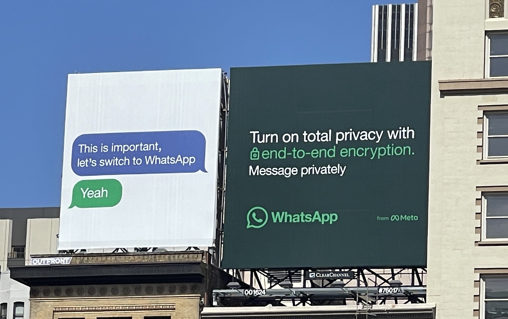
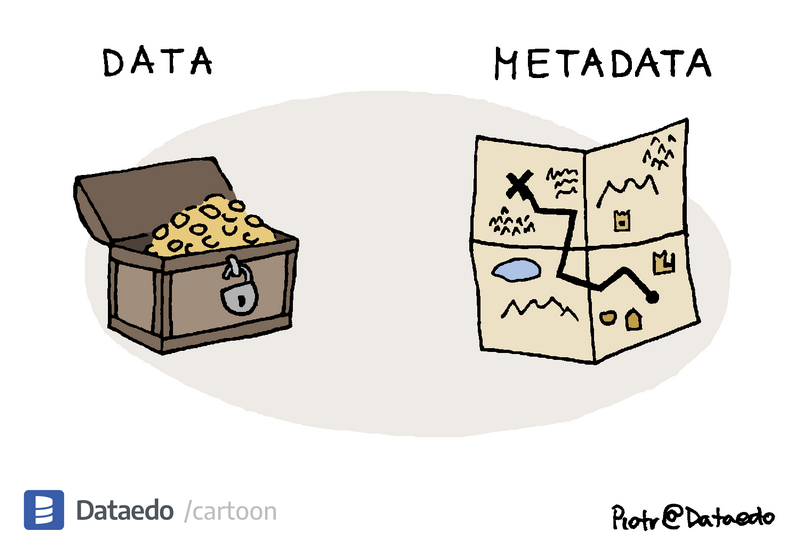

# The dangers of metadata in messengers 

**Published:** Apr 16, 2024

_By [Esra'a al Shafei](https://mastodon.social/@alshafei)_

In many countries around the world, phone numbers are attached to biometrics data and personal IDs. Telecommunications companies are either government owned or are heavily regulated, privately owned monopolies who comply with most government requests for backdoors or user data. The idea that today, we still need to give out our phone numbers as primary identifiers to be able to use the leading messaging apps should be frowned upon and actively challenged. It’s necessary to advocate for private alternatives in messaging that do not rely on user IDs of any kind - and yes, it’s possible. 

Messaging is still not where it needs to be. Privacy is confused with security, when both are not synonymous, and there are major gaps in helping users understand the fundamental differences. 

For example, while WhatsApp messages are [end-to-end encrypted](https://faq.whatsapp.com/820124435853543), let’s consider what you give up when you use it, per its own listings in app stores:

- App activity (app interactions, in-app search history, and other user-generated content)
- Location
- Financial information (user payment info and payment history)
- Contacts and their phone numbers
- Groups you’re a member of
- When you use the app and how often you use it 
- Device and other IDs
- Personal info (email address, user IDs, phone number)

This is called [metadata](https://en.wikipedia.org/wiki/Metadata). It reveals a wealth of information about you and your connections, and in the hands of a centralized monopoly, this can and does get misused in incredibly dangerous ways. Once such metadata is logged, it can create very detailed profiles about who you are, everywhere you’ve been, and everyone you’ve ever spoken to. In settling for apps that normalize this while giving you the illusion of privacy in their marketing, we are doing ourselves a disservice by accepting this as the default. Collectively, we aren’t doing enough to protect ourselves and our social graph from this invasive overreach. 

When stored, aggregated and analyzed, this metadata provides ample information that could potentially incriminate someone or be submitted to authorities. When WhatsApp and Facebook Messenger enabled end-to-end encryption for messages, of course it was a welcome and widely celebrated change. But it’s important to remember that not all end-to-end encryption utilizes the same standards, [some implementations are more secure](./20240314-simplex-chat-v5-6-quantum-resistance-signal-double-ratchet-algorithm.md#how-secure-is-end-to-end-encryption-in-different-messengers) than others, so it’s something that shouldn’t necessarily be accepted at face value. More importantly: collecting and storing an obscene amount of metadata should invite global scrutiny, considering this data is often combined with whatever other information companies like Meta harvest about your identity (which is [a lot](https://www.vox.com/recode/23172691/meta-tracking-privacy-hospitals).)

This is one of the many reasons why we need to resist giving out our phone numbers just to access an app, especially to do something as personal and intimate as private messaging. Even though users can sometimes mask their numbers with a username, their identity on the app is still fundamentally tied to their phone number. App operators have access to this, as well as user contacts. Additionally, with a simple modification to the app's source code, the contacts may also gain access in some cases. This should raise more concerns about privacy, and it makes the need for anonymity difficult to achieve. 

Everyone has a different threat model (and if you don’t yet, now is a good time to [create one](https://www.privacyguides.org/en/basics/threat-modeling/#creating-your-threat-model)). For many users today, WhatsApp and other apps may be sufficient for their specific needs, especially in connecting with families and friends who are already on the app and unlikely to migrate elsewhere. If that suits your life and needs, and if you’re aware and consciously accept the risks, great. 

But we also need to acknowledge that the world is becoming increasingly dangerous in the way AI is being used to [supercharge surveillance](https://www.forbes.com/sites/forbestechcouncil/2024/02/02/artificial-intelligence-the-new-eyes-of-surveillance/?sh=cd57bc214f27), and we need to be educated and aware of the risks this is already having on our lives and what it subjects others in your network to when you choose metadata-heavy apps as your primary form of communication. Having alternatives will always be important, even if it’s not what you default to for everyday messaging. Recognize who in your social circles might require the extra privacy, anonymity and security, so that you can play a role in protecting vulnerable individuals who need it most. The messaging app you choose implicates others as well, not just yourself, and while you personally may not require complete privacy, others might have their lives depend on it.

End-to-end encryption is a solid start, but it's just the beginning of our pursuit for true privacy and security. True privacy means that even when legal demands come knocking, there's no useful metadata to hand over. It's not enough to just protect the content of messages; we need consistent innovation in protecting metadata too.

Changing ingrained habits is tough, but your privacy is always worth the fight. Although giants like WhatsApp and Telegram may dominate global messaging for now, increasing concerns about data harvesting and AI-driven surveillance are fueling demand for alternatives. SimpleX Chat aims to be one of those strong alternatives, hence its radical focus on a decentralized framework with no user identifiers (in other words, nothing that uniquely identifies users on the protocol level to their contacts or to the relays) and extra optionality (self-hosting an [SMP server](../docs/server.md) or [XFTP server](../docs/xftp-server.md), access via Tor, [chat profiles](../docs/guide/chat-profiles.md) with incognito mode, etc.)

As of today, most messaging alternatives, including SimpleX, will have some limitations. But with the limited resources we have, we are committed to daily progress towards creating a truly private messenger that anyone can use while maintaining the features that users have come to know and love in messaging interfaces. We want to be the prime example of a messenger that achieves genuine privacy without compromising it for convenience. We need to be able to reliably move away from small and niche use cases to endorsing and enforcing global standards for privacy and making it accessible for all users regardless of their technical expertise. 

We’re grateful for the users and [donors](https://github.com/simplex-chat/simplex-chat#help-us-with-donations) who have been following along on this journey thus far and helping with feedback, anything from bug reports to identifying potential risks. Building in the open has always been a necessity for transparency and ongoing [auditability](./20221108-simplex-chat-v4.2-security-audit-new-website.md), because we don’t want anyone to just take our word for it. [See for yourself](https://github.com/simplex-chat) and engage in the discussions. We fully expect you to hold us accountable to our word. 
