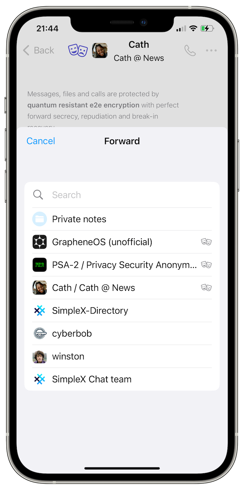

# SimpleX network: legally binding transparency, v5.7 released with better calls and messages

**Published:** Apr 26, 2024

What's new in v5.7:
- [quantum resistant end-to-end encryption](#quantum-resistant-end-to-end-encryption) with all contacts.
- [forward and save messages](#forward-and-save-messages) without revealing the source.
- [in-call sounds and switching sound sources](#in-call-sounds-and-switching-sound-sources).
- [better network connection management](#network-management).
- [customizable profile images](#customizable-shape-of-profile-images)

Also, we added Lithuanian interface language to the Android and desktop apps, thanks to [our users and Weblate](https://github.com/simplex-chat/simplex-chat#help-translating-simplex-chat).

## Legally binding transparency

We are committed to open-source, privacy and security. Here are the recent changes we made:

- We now have a [Transparency Reports](../docs/TRANSPARENCY.md) page.
- We updated our [Privacy Policy](../PRIVACY.md) to remove undefined terms "impermissible" and "acceptable", which would allow us to remove anything we don't like, without any clarity on what that is. You can see the edits [here](https://github.com/simplex-chat/simplex-chat/pull/4076/files).
- We published a new page with [Frequently Asked Questions](../docs/FAQ.md), thanks to the guidance from users.
- We also have a new [Security Policy](../docs/SECURITY.md) – we welcome your feedback on it.

What do we mean by “legally binding transparency?”. It includes these principles:
- Accountability: an empty promise or commitment to transparency that is not legally binding is just marketing, and can provide opportunities for the organizations to be misleading or not disclose important information that can affect their users privacy and security.
- Consistency: often, there's a disconnect between marketing claims and legally binding policies. Our approach is to ensure that promises made in marketing materials or any external communications align with our legally binding documents, so that users can rely on our promises, and know exactly what to expect from us. 

For example:
- we use open-source code, and we made a legally binding commitment to use the published code in all released apps and deployed preset servers.
- we use precise and technical language in the Privacy Policy defining what data and metadata can be accessed via the preset relays.

If you see any inconsistency between technical parameters of SimpleX Network and what is promised in our Privacy Policy please raise it with us.

## What's new in v5.7

This release focus is improving the app usability, and preparing the foundation for v5.8 that will provide an in-built protection of user IP addresses when connecting to unknown file and messaging servers, reducing the need to use Tor (which would still remain supported via SOCKS proxy, for additional privacy).

### Quantum resistant end-to-end encryption

We [wrote before](./20240314-simplex-chat-v5-6-quantum-resistance-signal-double-ratchet-algorithm.md) about how quantum resistant encryption was added to SimpleX Chat and also about other properties of end-to-end encryption, possible attacks on its security and known mitigations.

Quantum resistant encryption will now be enabled by default in all direct chats. For the new conversations it will be enabled from the beginning, and for the existing conversations it will be agreed after you exchange several messages with your contacts - you will see a notice in the conversation when it happens.

You can still safely downgrade the app to an earlier version if needed, as v5.6 already supports quantum resistant encryption.

With the users who have an earlier version, the app will work using the conventional encryption, which is still very secure. It's important that we augmented the conventional encryption with post-quantum cryptographic algorithm rather than replaced it, using a hybrid construction as recommended by the cryptography experts.

The groups currently do not support quantum resistant encryption yet - we plan to add it in the future to small groups.

### Forward and save messages

You can now save received messages to private notes and forward them to your contacts and groups. This is both more convenient than copy-pasting the messages, and also more private - you can forward files and preserve a disappearing file in your private notes without saving them outside of the app.

You can see and navigate to the original source of the message via the message information, but the recipient of the message can only see that it was forwarded, but not from which conversation - in this way you can show that the message was quoted from another source without revealing the source ([Chatham House Rule](https://en.wikipedia.org/wiki/Chatham_House_rule)).

  

### In-call sounds and switching sound sources

This was the most frequent request of the users who use SimpleX Chat for audio and video calls - to add sound indication to the connection progress, as happens in all other apps. This release added these sounds and also vibration when call connects and disconnects.

You can also switch between bluetooth headphones, speakerphone and earpiece via the new button in the call.

### Network management

To reduce traffic and battery usage, this release made connection timeouts dependent on which network your device uses - timeouts will be larger when you are on mobile connection and smaller when on WiFi. It also makes connection attempts very infrequent when the device is not connected to network.

### Customizable shape of profile images

To customizable the interface, you can now change the shapes of profile images to anything from squares with sharp corners to circles, as before, via the Appearance menu in the app Settings. The default shape of profile images is changed to squares with rounded corners.

  

## SimpleX network

Some links to answer the most common questions:

[How can SimpleX deliver messages without user identifiers](./20220511-simplex-chat-v2-images-files.md#the-first-messaging-platform-without-user-identifiers).

[What are the risks to have identifiers assigned to the users](./20220711-simplex-chat-v3-released-ios-notifications-audio-video-calls-database-export-import-protocol-improvements.md#why-having-users-identifiers-is-bad-for-the-users).

[Technical details and limitations](https://github.com/simplex-chat/simplex-chat#privacy-technical-details-and-limitations).

[Frequently asked questions](../docs/FAQ.md).

Please also see our [website](https://simplex.chat).

## Help us with donations

Huge thank you to everybody who donates to SimpleX Chat!

We are planning a 3rd party security audit for the protocols and cryptography design in July 2024, and also the security audit for an implementation in December 2024/January 2025, and it would hugely help us if some part of this $50,000+ expense is covered with donations.

We are prioritizing users privacy and security - it would be impossible without your support.

Our pledge to our users is that SimpleX protocols are and will remain open, and in public domain, - so anybody can build the future implementations of the clients and the servers. We are building SimpleX network based on the same principles as email and web, but much more private and secure.

Your donations help us raise more funds – any amount, even the price of the cup of coffee, makes a big difference for us.

See [this section](https://github.com/simplex-chat/simplex-chat/tree/master#help-us-with-donations) for the ways to donate.

Thank you,

Evgeny

SimpleX Chat founder
