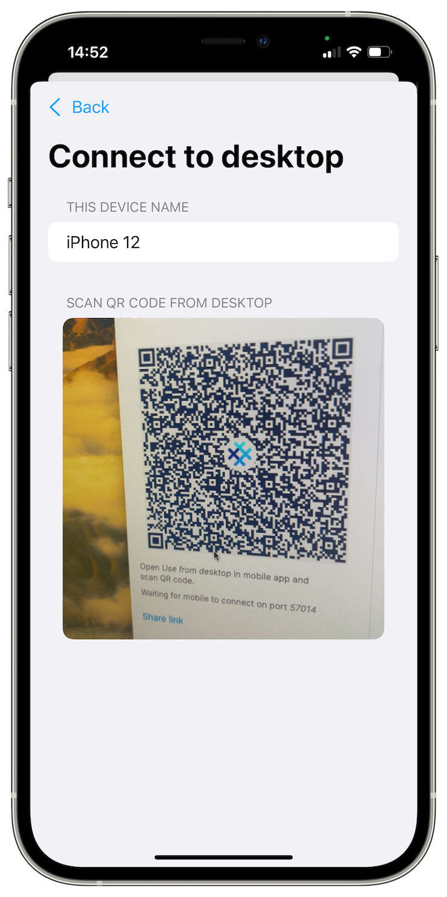
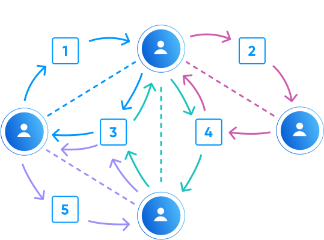

# SimpleX: Redefining Privacy by Making Hard Choices

**Published:** May 16, 2024

When it comes to open source privacy tools, the status quo often dictates the limitations of existing protocols and structures. However, these norms need to be challenged to radically shift how we approach genuinely private communication. This requires doing some uncomfortable things, like making hard choices as it relates to funding, alternative decentralization models, doubling down on privacy over convenience, and more.

There will always be questions on why the SimpleX Chat and network makes the choices it makes, and that’s good! It’s important to question us and to understand the reasoning behind each decision, whether it’s technical, structural, financial or any other.

In this post we explain a bit more about why SimpleX operates and makes decisions the way it does.

## No user accounts

Within SimpleX network there are no user accounts, and more importantly, no user profile identifiers whatsoever at the protocol level, not even random numbers or cryptographic keys used to identify the users. This means there is absolutely nothing that uniquely links users to their contacts or to the network relays. While it's accurate to say, "You need an address to send something," it's crucial to understand that this "address" serves merely as a transient delivery destination, and not as a user profile identifier in any sense.

You can read more about how SimpleX works [here](https://simplex.chat/#how-simplex-works).

## Privacy over convenience

One of the main considerations often ignored in security and privacy comparisons between messaging applications is multi-device access. For example, in Signal’s case, the Sesame protocol used to support multi-device access has the vulnerability that is [explained in detail here](https://eprint.iacr.org/2021/626.pdf):

_"We present an attack on the post-compromise security of the Signal messenger that allows to stealthily register a new device via the Sesame protocol. [...] This new device can send and receive messages without raising any ‘Bad encrypted message’ errors. Our attack thus shows that the Signal messenger does not guarantee post-compromise security at all in the multi-device setting"_.

Solutions are possible, and even the quoted paper proposes improvements, but they are not implemented in any existing communication solutions. Unfortunately this results in most communication systems, even those in the privacy space, having compromised security in multi-device settings due to these limitations. That's the reason we are not rushing a full multi-device support, and currently only provide [the ability to use mobile app profiles via the desktop app](./20231125-simplex-chat-v5-4-link-mobile-desktop-quantum-resistant-better-groups.md#link-mobile-and-desktop-apps-via-secure-quantum-resistant-protocol), while they are on the same network.

Another choice that compromises privacy for convenience and usability is 3rd party push notifications. At SimpleX, we take a slow path of optimizing the network and battery consumption in the app, rather than simply hiding inefficiencies behind the quick fix solution of 3rd party push notifications that [increases vulnerability](https://www.wired.com/story/apple-google-push-notification-surveillance/), a path Signal and others chose. Like other choices, it has usability and optimization trade offs, but ultimately it’s the right thing to continue progressing towards a better solution as we explain [here](https://simplex.chat/blog/20220404-simplex-chat-instant-notifications.html).

Whenever possible, we strive to achieve significantly higher levels of privacy and security. For example, unlike most, if not all, applications (including Signal), [we encrypt application files with per-file unique key](https://simplex.chat/blog/20230925-simplex-chat-v5-3-desktop-app-local-file-encryption-directory-service.html#encrypted-local-files-and-media-with-forward-secrecy). Consequently, once a message is deleted, there's no means to open a file that someone may have stolen in hopes of acquiring the key later. Similarly, apps like Session have done away with forward secrecy, a decision which caused them [not to be recommended](https://www.privacyguides.org/en/real-time-communication/#additional-options) for "long-term or sensitive communications". And [misinformation](https://simplifiedprivacy.com/spain-has-banned-telegram-defending-session/) around this makes it dangerous and irresponsible to recommend without such necessary disclosures for people’s awareness.

Session’s decision was based on [the incorrect statements](https://getsession.org/blog/session-protocol-explained) about double ratchet being impossible in decentralized networks, and underplayed importance of forward secrecy, break-in recovery and deniability - the absence of these crucial qualities makes Session a much weaker choice for private messaging. For transparency, this was something that was debated with their team [here](https://twitter.com/SimpleXChat/status/1755216356159414602). We also made [a separate post](./20240314-simplex-chat-v5-6-quantum-resistance-signal-double-ratchet-algorithm.md#end-to-end-encryption-security-attacks-and-defense) about these qualities of end-to-end encryption and their presence in different messengers, to show that not all end-to-end encrypted apps offer the same level of protections.

## Network decentralization

It's important to recognize that a model of decentralization where all servers are openly known and accessible to all clients, that some users ask for, actually results in a less decentralized network, and as the network grows it often requires an introduction of a central authority to protect from bad actors with malicious intent. Therefore, we've deliberately opted for a slower path towards achieving a higher degree of decentralization where there is no central server registry or network authority. For example, p2p designs may offer higher initial decentralization but often compromise on privacy and eventual decentralization. In essence, our approach prioritizes a balance between initial decentralization, privacy, and higher degree of decentralization down the line.

Additionally, while it's true that we haven't yet established a model to incentivize other network operators, it's certainly on the roadmap. We see the decentralization of network operators offered within the app as a top priority. 

Where it stands today, users have the freedom to select their preferred servers within the SimpleX network by configuring the app, with thousands of self-hosted servers in operation. Moreover, numerous third-party applications rely on our code for their in-app communications, operating independently of our servers, many of which we may not even be aware of.

Decentralization is an ongoing journey, and we strive to proceed at a measured pace to ensure its proper implementation. While the immediate results may not always appear ideal, prioritizing a careful approach ensures that in the long run, the decisions made in this area align with our ultimate objectives of a private, efficient, reliable and fully decentralized network.

## Funding and profitability

We explain our rationale for funding [here](../docs/FAQ.md#funding-and-business-model). Funding sources is always one of the most difficult choices to make, and it’s important to underline that VC models don’t necessarily translate to a quest for control, interference of any kind, or overall influence on product roadmap and strategy. The vast majority of investors seek profitability. Irrespective of the organization type profitability is essential for a sustainable operation, and it can and should be done while adhering to the highest possible standards for privacy. For-profit vs. nonprofit is also not an accurate metric to measure a commitment towards privacy and open standards, which is further explained [here](./20240404-why-i-joined-simplex-chat-esraa-al-shafei.md).  

To make a profit, satisfying customers is the key. Unlike the many companies that profit from selling customer data, we put user privacy first. Doing this at scale requires investments. If the investors don’t own or control a company, their participation becomes merely about profit for them, and not about how this profit is obtained. With the investors we have, we are completely aligned on this - they are betting on the future where privacy is the norm. They do not dictate on anything related to our model. We build SimpleX chat, protocols and network the way Internet should have been built if we as developers always put the privacy and empowerment of users first.

## Company jurisdiction

With regards to jurisdictions, nowhere is perfect. For that reason we plan to establish the foundations for protocol governance in [various jurisdictions](https://simplex.chat/blog/20240323-simplex-network-privacy-non-profit-v5-6-quantum-resistant-e2e-encryption-simple-migration.html#the-journey-to-the-decentralized-non-profit-protocol-governance).

But we’d like to clarify some misconceptions about the UK, where SimpleX Chat Ltd. is registered, and the UK legislation.

For example, the Online Safety Act (OSA). Some people believe that it applies only to UK companies. But the OSA applicability isn’t determined by the company’s jurisdiction - it applies based on the nature and characteristics of the business and its services, as well as the number of its users in the UK. In case of SimpleX network, the OSA doesn’t apply for both of these reasons.

The UK’s position on communication encryption, and more specifically, on end-to-end encrypted messaging, remains the subject of political debates. But with the OSA, the legislative intent was to propose technical measures to block CSAM, and it was trying to explore ways to do this via client-side scanning, which of course would undermine the encryption. However, and thanks to the hard work of privacy experts, researchers, academics and rights organizations throughout the UK and the rest of the world, the Online Safety Bill did not prohibit end-to-end encrypted apps without such scanners. It is an open question whether such technology will ever be possible, and the UK government made a public commitment that client-side scanning won't be required until it is.

For now, strong end-to-end encryption remains permissible and protected, and we hope to also add to the privacy advocacy and debates as a UK-based company to keep it legally protected.

Overall, we view the UK as being better jurisdiction for privacy than many alternatives - there are some trade-offs everywhere.

## Looking ahead 

The future of the Internet should be based on decentralized infrastructure operated by commercially viable organizations. These operators need to possess minimal user data, so that users have genuine control over their identities, and free from lock-in by the operators, to support fair competition. This requires a drastic re-imagining of the current norms and newer, more privacy-minded protocols. All in all, private messaging is surrounded by very difficult challenges but it’s worth it to keep pushing the industry forward and not settle for the status quo and current trade offs, protocol limitations and vulnerabilities. The Internet deserves better standards, and so do users.
