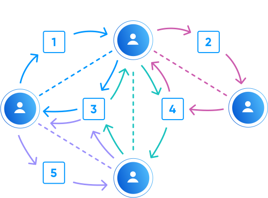

# SimpleX network: private message routing, v5.8 released with IP address protection and chat themes

**Published:** June 4, 2024

What's new in v5.8:
- [private message routing](#private-message-routing).
- [server transparency](#server-transparency).
- [protect IP address when downloading files & media](#protect-ip-address-when-downloading-files--media).
- [chat themes](#chat-themes) for better conversation privacy - in Android and desktop apps.
- [group improvements](#group-improvements) - reduced traffic and additional preferences.
- improved networking, message and file delivery.

Also, we added Persian interface language to the Android and desktop apps, thanks to [our users and Weblate](https://github.com/simplex-chat/simplex-chat#help-translating-simplex-chat).

## Private message routing

### What's the problem?



SimpleX network design has always been focussed on protecting user identity on the messaging protocol level - there is no user profile identifiers of any kind in the protocol design, not even random numbers or cryptographic keys.

Until this release though, SimpleX network had no built-in protection of user transport identities - IP addresses. As previously the users could only choose which messaging relays to use to receive messages, these relays could observe the IP addresses of the senders, and if these relays were controlled by the recipients, the recipients themselves could observe them too - either by modifying server code or simply by tracking all connecting IP addresses.

To work around this limitation, many users connected to SimpleX network relays via Tor or VPN - so that the recipients' relays could not observe IP addresses of the users when they send messages. Still, it was the most important and the most criticized limitation of SimpleX network for the users.

### Why didn't we just embed Tor in the app?

Tor is the best transport overlay network in existence, and it provides network anonymity for millions of Internet users.

SimpleX Chat has many integration points with Tor:
- it allows [dual server addresses](./20220901-simplex-chat-v3.2-incognito-mode.md#using-onion-server-addresses-with-tor), when the same messaging relay can be reached both via Tor and via clearnet.
- it utilises Tor's SOCKS proxy "isolate-by-auth" feature to create a new Tor circuit for each user profile, and with an additional option - for each contact. Per-contact [transport isolation](./20230204-simplex-chat-v4-5-user-chat-profiles.md#transport-isolation) is still experimental, as it doesn't work if you connect to groups with many members, and it's only available if you enable developer tools.

Many SimpleX network design ideas are borrowed from Tor network design:
- mitigation of [MITM attack](../docs/GLOSSARY.md#man-in-the-middle-attack) on client-server connection is done in the same way as Tor relays do it - the fingerprint of offline certificate is included in server address and validated by the client.
- the private routing itself uses the approach similar to onion routing, by adding encryption layers on each hop.
- we are also considering to implement Tor's [Proof-of-work DoS defence](https://blog.torproject.org/introducing-proof-of-work-defense-for-onion-services/) mechanism.

So why didn't we just embed Tor into the messaging clients to provide IP address protection?

We believe that Tor may be the wrong solution for some users for one of the reasons:
- much higher latency, error rate and resource usage.
- people who want to use Tor are better served by specialized apps, such as [Orbot](https://guardianproject.info/apps/org.torproject.android/).
- Tor usage is restricted in some networks, so it would require complex configuration in the app UI.
- some countries have legislative restrictions on Tor usage, so embedding Tor would require supporting multiple app versions, and it would leave the original problem unsolved in these countries.

Also, while Tor solves the problem of IP address protection, it doesn't solve the problem of meta-data correlation by user's transport session - the messaging relays can still observe which messaging queues a user sends messages to via a single TCP connection, and while the client could create a new TCP connection and Tor circuit for each conversation, it would use too much traffic and battery for most users.

So we believed we would create more value to the users by adding an approach to message routing in SimpleX network that provides IP address and transport session protection out of the box, when initially released, and that can also be extended to support delayed delivery and other functions, improving both usability and transport privacy in the future.

At the same time, we plan to continue supporting Tor and other overlay networks. Any overlay network that supports SOCKS proxy with "isolate-by-auth" feature will work with SimpleX Chat app.

### What is private message routing and how does it work?

Private message routing is a major milestone for SimpleX network evolution. It is a new message routing protocol that protects both users' IP addresses and transport sessions from the messaging relays chosen by their contacts. Private message routing is, effectively, a 2-hop onion routing protocol inspired by Tor design, but with one important difference - the first (forwarding) relay is always chosen by message sender and the second (destination) - by the message recipient. In this way, neither side of the conversation can observe IP address or transport session of another.

At the same time, the relays chosen by the sending clients to forward the messages cannot observe to which connections (messaging queues) the messages are sent, because of the additional layer of end-to-end encryption between the sender and the destination relay, similar to how onion routing works in Tor network, and also thanks to the protocol design that avoids any repeated or non-random identifiers associated with the messages, that would otherwise allow correlating the messages sent to different connections as sent by the same user. Each message forwarded to the destination relay is additionally encrypted with one-time ephemeral key, to be independent of messages sent to different connections.

The routing protocol also prevents the possibility of MITM attack by the forwarding relay, which provides the certificate the session keys of the destination server to the sending client that are cryptographically signed by the same certificate that is included in destination server address, so the client can verify that the messages are sent to the intended destination, and not intercepted.

The diagram below shows all the encryption layers used in private message routing:

```
-----------------             ----------------- --- TLS --- -----------------             -----------------
|               |  -- TLS --  |               |  -- f2d --  |               |  -- TLS --  |               |
|               |  -- s2d --  |               |  -- s2d --  |               |  -- d2r --  |               |
|    Sending    |  -- e2e --  |    sender's   |  -- e2e --  |  recipient's  |  -- e2e --  |   Receiving   |
|    client     |  message -> |  Forwarding   |  message -> |  Destination  |  message -> |    client     |
|               |  -- e2e --  |     relay     |  -- e2e --  |     relay     |  -- e2e --  |               |
|               |  -- s2d --  |               |  -- s2d --  |               |  -- d2r --  |               |
|               |  -- TLS --  |               |  -- f2d --  |               |  -- TLS --  |               |
-----------------             ----------------- --- TLS --- -----------------             -----------------
```

**e2e** - two end-to-end encryption layers between **sending** and **receiving** clients, one of which uses double ratchet algorithm. These encryption layers are present in the previous version of message routing protocol too.

**s2d** - encryption between the **sending** client and recipient's **destination** relay. This new encryption layer hides the message metadata (destination connection address and message notification flag) from the forwarding relay.

**f2d** - additional new encryption layer between **forwarding** and **destination** relays, protecting from traffic correlation in case TLS is compromised - there are no identifiers or cyphertext in common between incoming and outgoing traffic of both relays inside TLS connection.

**d2r** - additional encryption layer between destination relay and the recipient, also protecting from traffic correlation in case TLS is compromised.

**TLS** - TLS 1.3 transport encryption.

For private routing to work, both the forwardig and the destination relays should support the updated messaging protocol - it is supported from v5.8 of the messaging relays. It is already released to all relays preset in the app, and available as a self-hosted server. We updated [the guide](../docs/SERVER.md) about how to host your own messaging relays.

Because many self-hosted relays did not upgrade yet, private routing is not enabled by default. To enable it, you can open *Network & servers* settings in the app and change the settings in *Private message routing* section. We recommend setting *Private routing* option to *Unprotected* (to use it only with unknown relays and when not connecting via Tor) and *Allow downgrade* to *Yes* (so messages can still be delivered to the messaging relays that didn't upgrade yet) or to *When IP hidden* (in which case the messages will fail to deliver to unknown relays that didn't upgrade yet unless you connect to them via Tor).

Read more about the technical design of the private message routing in [this document](https://github.com/simplex-chat/simplexmq/blob/stable/rfcs/2023-09-12-second-relays.md).

## Server transparency


Even with very limited information available to the messaging relays, there are [several things](https://github.com/simplex-chat/simplexmq/blob/stable/protocol/overview-tjr.md#simplex-messaging-protocol-server) that would reduce users' privacy that a compromised relay can do.

We [wrote previously](https://github.com/simplex-chat/simplexmq/blob/master/rfcs/2024-03-20-server-metadata.md) that it is important that server operators commit to running unmodified server code or disclose any code modifications, and also disclose server ownership and any other relevant information.

While we cannot require the operators of self-hosted and private servers to disclose any information about them (apart from which server code they use - this is the requirement of the AGPLv3 license to share this information with users connecting to the server), as we add other server operators to the app, it is important for the users to have all important information about these operators and servers location.

This server release adds server information page where all this information can be made available to the users. For example, this is <a href="https://smp8.simplex.im" target="_blank">the information</a> about one of the servers preset in the app.

The updated server guide also includes [the instruction](../docs/SERVER.md#) about how to host this page for your server. It is generated as a static page when the server starts. We recommend using Caddy webserver to serve it.

## More new things in v5.8

### Protect IP address when downloading files & media

This version added the protection of your IP address when receiving files from unknown file servers without Tor. Images and voice messages won't automatically download from unknown servers too until you tap them, and confirm that you trust the file server where they were uploaded.

### Chat themes

 

In Android and desktop app you can now customize how the app looks by choosing wallpapers with one of the preset themes or choose your own image as a wallpaper.

But this feature is not only about customization - it allows to set different colors and wallpaper for different user profiles and even specific conversations. You can also choose different themes for different chat profiles.

In case you use different identities for different conversations, it helps avoiding mistakes.

### Group improvements

This version adds additional group configuration options to allow sending images, files and media, and also SimpleX links only to group administrators and owners. So with this release group owners can have more control over content shared in the groups.

We also stopped unnecessary traffic caused by the members who became inactive without leaving the groups - it should substantially reduce traffic and battery consumption to the users who send messages in large groups.

## SimpleX network

Some links to answer the most common questions:

[How can SimpleX deliver messages without user identifiers](./20220511-simplex-chat-v2-images-files.md#the-first-messaging-platform-without-user-identifiers).

[What are the risks to have identifiers assigned to the users](./20220711-simplex-chat-v3-released-ios-notifications-audio-video-calls-database-export-import-protocol-improvements.md#why-having-users-identifiers-is-bad-for-the-users).

[Technical details and limitations](https://github.com/simplex-chat/simplex-chat#privacy-technical-details-and-limitations).

[Frequently asked questions](../docs/FAQ.md).

Please also see our [website](https://simplex.chat).

## Help us with donations

Huge thank you to everybody who donates to SimpleX Chat!

We are planning a 3rd party security audit for the protocols and cryptography design in July 2024, and also the security audit for an implementation in December 2024/January 2025, and it would hugely help us if some part of this $50,000+ expense is covered with donations.

We are prioritizing users privacy and security - it would be impossible without your support.

Our pledge to our users is that SimpleX protocols are and will remain open, and in public domain, - so anybody can build the future implementations of the clients and the servers. We are building SimpleX network based on the same principles as email and web, but much more private and secure.

Your donations help us raise more funds – any amount, even the price of the cup of coffee, makes a big difference for us.

See [this section](https://github.com/simplex-chat/simplex-chat/tree/master#help-us-with-donations) for the ways to donate.

Thank you,

Evgeny

SimpleX Chat founder
