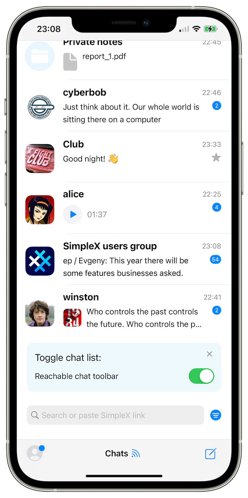
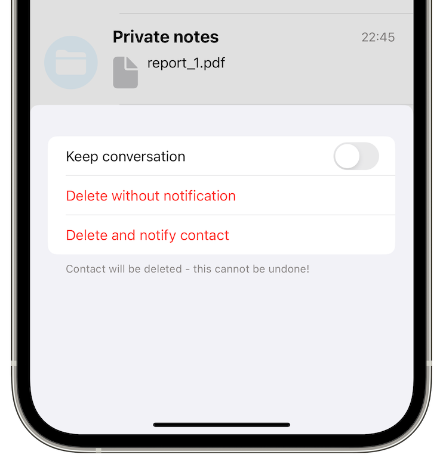
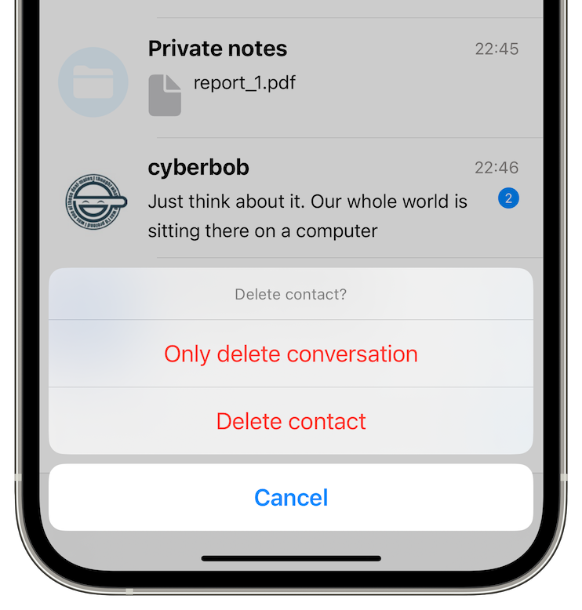
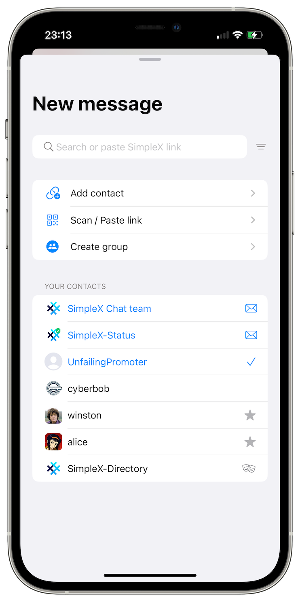
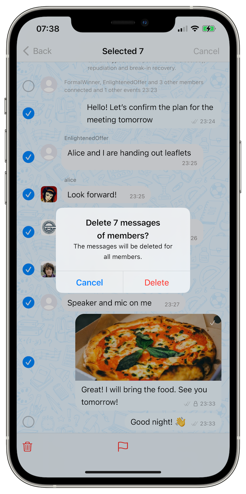
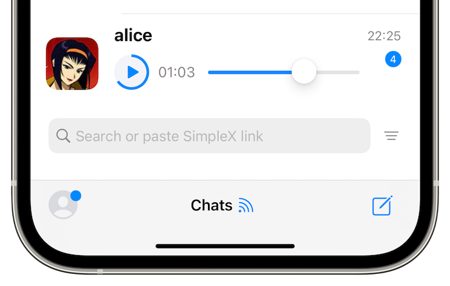
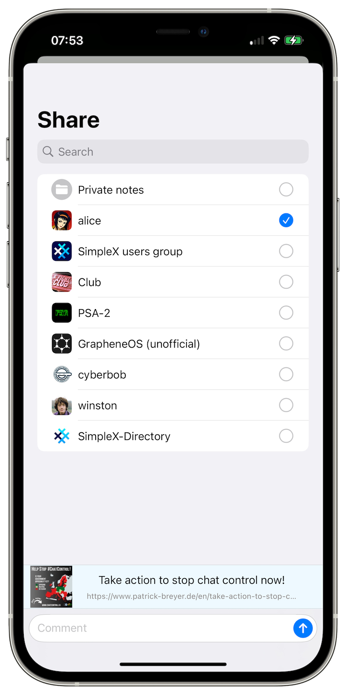

# SimpleX network: the investment from Jack Dorsey and Asymmetric, v6.0 released with the new user experience and private message routing.

**Published:** Aug 14, 2024

[SimpleX Chat: vision and funding 2.0](#simplex-chat-vision-and-funding-20):
- [The past](#the-past-investment-from-village-global): investment from Village Global.
- [The present](#the-present-announcing-the-investment-from-jack-dorsey-and-asymmetric): announcing the investment from Jack Dorsey and Asymmetric Capital Partners.
- [The future](#the-future-faster-development-and-transition-to-non-profit-governance): faster development and the path to non-profit governance.

[What's new in v6.0](#whats-new-in-v60):
- Private message routing &mdash; now enabled by default.
- [New chat experience](#new-chat-experience):
  - connect to your friends faster.
  - [new reachable interface](#new-reachable-interface).
  - archive contacts to chat later.
  - new way to start chat.
  - [moderate like a pro](#moderate-like-a-pro): delete many messages at once.
  - new chat themes*
  - increase font size**.
- [New media options](#new-media-options):
  - play from the chat list.
  - blur for better privacy.
  - [share from other apps](#share-from-other-apps)*.
- [Improved networking and reduced battery usage](#improved-networking-and-reduced-battery-usage)

\* New for iOS app.

\*\* Android and desktop apps.

## SimpleX Chat: vision and funding 2.0

### The past: investment from Village Global

Last year [we announced](https://simplex.chat/blog/20230422-simplex-chat-vision-funding-v5-videos-files-passcode.html#how-is-it-funded-and-what-is-the-business-model) pre-seed funding from several angel investors and Village Global. Some of our users were very excited that we have funds to continue developing SimpleX network. But as some of Village Global LPs (Limited Partners) are [the founders of very large technology companies](https://www.villageglobal.vc), some of our users were worried about any negative influence this investment might have on the project.

[Ben Casnocha](https://www.villageglobal.vc/team/ben-casnocha), the founder and general partner of Village Global, commented on their investment: 

> I believe in SimpleX Chat vision and team’s ability to execute it. The growing number of Internet users who demand privacy of their data and contacts will make SimpleX Chat profitable, which is critically important for any sustainable organization.
>
> We are fortunate to have LPs who founded many iconic Internet ventures. But they don’t have any influence on the 400+ companies we invested in. They are financial investors in our fund and exert no control or influence on any of the underlying portfolio companies.
>
> What's more, we believe that founders should lead their ventures, as it yields better results – our investment in SimpleX Chat has no control provisions. We are happy to help, but we don’t control any decisions nor have a board seat. Evgeny runs the company independently.

Ben, thank you for believing in our vision – without it SimpleX Chat would simply not exist, as most other investors at the time did not believe that privacy could ever escape the niche of privacy enthusiasts – and we already see the first signs of it happening. 

### The present: announcing the investment from Jack Dorsey and Asymmetric

The Android app recently hit [100,000 downloads on Google Play Store](https://play.google.com/store/apps/details?id=chat.simplex.app), and our users naturally ask for improved reliability, privacy, security, better user experience and design – all at the same time, and as soon as possible. This requires more funding.

We are very happy to announce that we now have funds to move faster – we raised a $1.3 million pre-seed round led by [Jack Dorsey](https://en.wikipedia.org/wiki/Jack_Dorsey), with participation of [Asymmetric Capital Partners](https://www.acp.vc) (ACP) VC fund. 

When Jack discovered SimpleX Chat last year, he [posted on Twitter](https://x.com/jack/status/1661681076983529479): 

> Better than Signal? Looks promising.
> A few bugs and UX issues but great foundation. Love that it’s public domain.

And [on Nostr](https://primal.net/e/note1txz9xmmc456kwcg7zrsrtqrhn7as29ptuz0qulu452k8n85hsshqq6uh6q): 

> A full day with @SimpleX Chat. Solid overall. TestFlight is not recommended. There are some scaling issues today. And not the most intuitive onboarding for everyone. Name still reminds everyone of herpes. All fixable. It’s fast and doesn’t require a phone number or email and I do believe people will eventually see the value of that. Finally, some competition for Signal, and in a permissionless way. And def a solid path so apps don’t have to build their own DM experiences.

Jack, we are super lucky to have your support and investment – thank you for believing in our ability to build a better messaging network! It is a hard work, and we’ve made a lot of progress since your note was written, and a lot of work is ongoing! 

The ACP investment is strategically important – it is a fund that only invests in B2B startups, and SimpleX Chat currently is mostly used by individual users. Making a private communication network sustainable requires its adoption by businesses, and we already see a growing usage by the small teams. 

[Rob Biederman](https://www.acp.vc/team/rob-biederman) and [Sam Clayman](https://www.acp.vc/team/sam), the partners of ACP, commented: 

> We believe that SimpleX Chat network can grow into a de facto Internet standard for private and secure communications for both businesses and individual users, unifying instant and email-like messaging into a single product.
>
> Emails no longer provide privacy and security that businesses require, particularly given the emerging threat of AI-led phishing and social engineering attacks. We look forward to SimpleX network providing a secure alternative.

I was lucky to have met Rob, Sam and the ACP team when I was presenting SimpleX Chat in London – thank you all for your support and believing that the future of communication requires a single product, both for businesses and individual users. 

### The future: faster development and the path to non-profit governance

Jack Dorsey and ACP support enable us to make huge product improvements, thanks to a bigger team, and provide us with medium-term funding to get to the next stage of product and business evolution. Like with Village Global, this is a financial investment, without control or board seat provisions – so the users can be certain that SimpleX remains true to our vision of privacy first communication network.

We already added two great engineers to the team and are about to hire a UX/UI designer.

[Trail of Bits](https://www.trailofbits.com/about/) has just completed the protocols design security review and will be doing implementation security review in the end of the year. We will publish the first report soon.

This year we will launch group improvements that we presented in the [live-stream last year](https://www.youtube.com/watch?v=7yjQFmhAftE). While the main problem explained in this video was solved with the current design, the issue of group scalability remains – to send a message to a group your client needs to send it to each member, creating substantial traffic. 

We will also launch long-form email-like messaging over SimpleX network this year, together with optional short public addresses that show profile you are connecting to before the connection – this is important for any public users and businesses.

The last but not the least, we started the work with [Heather Meeker](https://www.techlawpartners.com/heather), a great legal expert on intellectual property matters and one of the earliest advocates of the open-source software development in businesses, to setup open-source governance model, to some extent similar to how Matrix did it. We believe, and our investors agree, that it would both increase the company value and also create more value for the users community.

## What's new in v6.0

v6.0 is one of our biggest releases ever, with a lot of focus on UX and stability improvements, and the new features the users asked for. 

The private message routing [we announced before](./20240604-simplex-chat-v5.8-private-message-routing-chat-themes.md) is now enabled for all users by default – it protects users IP addresses and sessions from the destination servers.

### New chat experience

#### Connect to your friends faster 

This version includes messaging protocol improvements that reduce twice the number of messages required for two users to connect. Not only it means connecting faster and using less traffic, this change allows to start sending messages sooner, so you would see "connecting" in the list of the chats for a much shorter time than before.

It will be improved further in the next version: you will be able to send messages straight after using the invitation link, without waiting for your contact to be online.

#### New reachable interface

Like with the most innovative mobile browsers (e.g., Safari and Firefox), SimpleX Chat users now can use the app with one hand by moving the toolbar and search bar to the bottom of the screen, and ordering the chats with the most recent conversations in the bottom too, where they can be more easily reached on a mobile screen. 

This layout is enabled by default, and you can disable it right from the list of chats when you install the new version if you prefer to use conventional UI.

Give it a try – our experience is that that after less than a day of using it, it starts feeling as the only right way. You can always toggle it in the Appearance settings.

#### Archive contacts to chat later

 &nbsp; 

Now you have two new options when deleting a conversation:
- only delete conversation, and archive contact. We will add archiving conversation without clearing it in the next version, as some users of our beta version asked.
- delete contact but keep the conversation.

Also, deleting a contact now requires double confirmation, so you are less likely to delete the contact accidentally. This deletion is irreversible, and the only way to re-connect would be using a new link.

#### New way to start chat

When you tap pencil button, you will see a large *New message* sheet, that adds new functions to the options you had before.

Old options:
- *Add contact* to create a new 1-time invitation link,
- *Scan / paste link*: to use the link you received. It can be 1-time invitation, a public SimpleX address, or a link to join the group.
- *Create group*

New options:
- Open archived chats.
- Accept pending contact requests.
- Connect to preset public addresses (we will add an option to add your own addresses here too).
- Search for your contacts.

#### New chat themes

We released the new themes [for Android and desktop apps](./20240604-simplex-chat-v5.8-private-message-routing-chat-themes.md) in the previous version, and now they are available for iOS too.

You can set different themes for different chat profiles you have, and for different conversations – it can help avoid mistakes about which conversation you are in.

Also, these themes are compatible between platforms, so you can import the theme created on Android into iOS app and vice versa.

#### Moderate like a pro

As much as we disagree with the attacks on the freedom of speech on the society level – all people must be able to express their opinions – we also believe that the small community owners should have full control over which content is allowed and which is not. But as communities grow, bad actors begin to join in order to disrupt, subvert and troll the conversations. So, the moderation tools are critical for small public communities to thrive.

SimpleX Chat already has several moderation tools available for community owners:
- Moderate individual messages.
- Set the default role of the new members to "observer" &mdash; they won't be able to send messages until you allow it. In addition to that, by enabling default messages for admins and owners only you can reach out to the new members and ask some questions before allowing to send messages.
- Block messages of a member for yourself only.
- Block a member for all other members &mdash; only admins and group owners can do that.

With this version you can now select multiple messages at once and delete or moderate them, depending on your role in the community. The current version limits the number of messages that can be deleted to 20 &mdash; this limit will be increased to 200 messages in the next version.

Also, this version makes profile images of the blocked members blurred, to prevent the abuse via inappropriate profile images.

#### Increase font size

Android and desktop apps now allow to increase font size inside the app, without changing the system settings. Desktop app also allows to zoom the whole screen &mdash; it can be helpful on some systems with a limited support of high density displays.

These settings can be changed via Appearance settings.

### New media options

#### Play from the chat list

Now you can interact with the media directly from the list of the chats.

This is very convenient – when somebody sends you a voice message or a video, they can be played directly from the list of chats, without opening a conversation. Similarly, an image can be opened, a file can be saved, and the link with preview can be opened in the browser.

And, in some circumstances, this is also more private, as you can interact with the media, without opening the whole conversation.

We will add the option to return missed calls from the chat list in the next version.

#### Blur for better privacy

You can set all images and videos to blur in your app, and unblur them on tap (or on hover in desktop app). The blur level can be set in Privacy and security settings.

#### Share from other apps

Not much to brag about, as most iOS messaging apps allow it, and users expected it to be possible since the beginning.

But iOS makes it much harder to develop the capability to share into the app than Android, so it's only in this version you can share images, videos, files and links into SimpleX Chat from other apps.

### Improved networking and reduced battery usage

This version includes the statistics of how your app communicates with all servers when sending and receiving messages and files. This information also includes the status of connection to all servers from which you receive messages &mdash; whether the connection is authorized to push messages from server to your device, and the share of these active connections.

Please note, that when you send a message to a group, your app has to send it to each member separately, so sent message statistics account for that &mdash; it may seem to be quite a large number if you actively participate in some large groups. Also, message counts not only include visible messages you receive and send, but also any service messages, reactions, message updates, message deletions, etc. &mdash; this is the correct reflection of how much traffic your app uses.

This information is only available to your device, we do NOT collect this information, even in the aggregate form.

While the main reason we added this information is to reduce traffic and battery usage, to be able to identify any cases of high traffic, this version already reduced a lot battery and traffic usage, as reported by several beta-version users.

## SimpleX network

Some links to answer the most common questions:

[How can SimpleX deliver messages without user identifiers](./20220511-simplex-chat-v2-images-files.md#the-first-messaging-platform-without-user-identifiers).

[What are the risks to have identifiers assigned to the users](./20220711-simplex-chat-v3-released-ios-notifications-audio-video-calls-database-export-import-protocol-improvements.md#why-having-users-identifiers-is-bad-for-the-users).

[Technical details and limitations](https://github.com/simplex-chat/simplex-chat#privacy-technical-details-and-limitations).

[Frequently asked questions](../docs/FAQ.md).

Please also see our [website](https://simplex.chat).

## Please support us with your donations

Huge thank you to everybody who donated to SimpleX Chat!

You might ask: *Why do you need donations if you've just raised the investment?*

Prioritizing users privacy and security, and also raising the investment, would have been impossible without your support and donations.

Also, funding the work to transition the protocols to non-profit governance model would not have been possible without the donations we received from the users.

Our pledge to our users is that SimpleX protocols are and will remain open, and in public domain, so anybody can build the future implementations of the clients and the servers. We are building SimpleX platform based on the same principles as email and web, but much more private and secure.

Your donations help us raise more funds &mdash; any amount, even the price of the cup of coffee, makes a big difference for us.

See [this section](https://github.com/simplex-chat/simplex-chat/tree/master#help-us-with-donations) for the ways to donate.

Thank you,

Evgeny

SimpleX Chat founder
