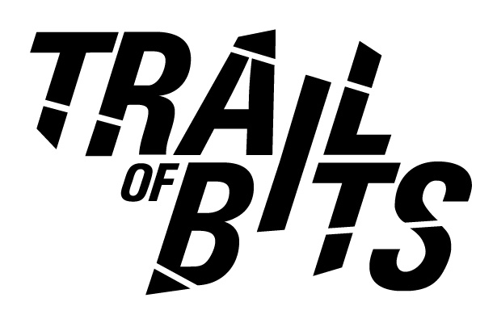
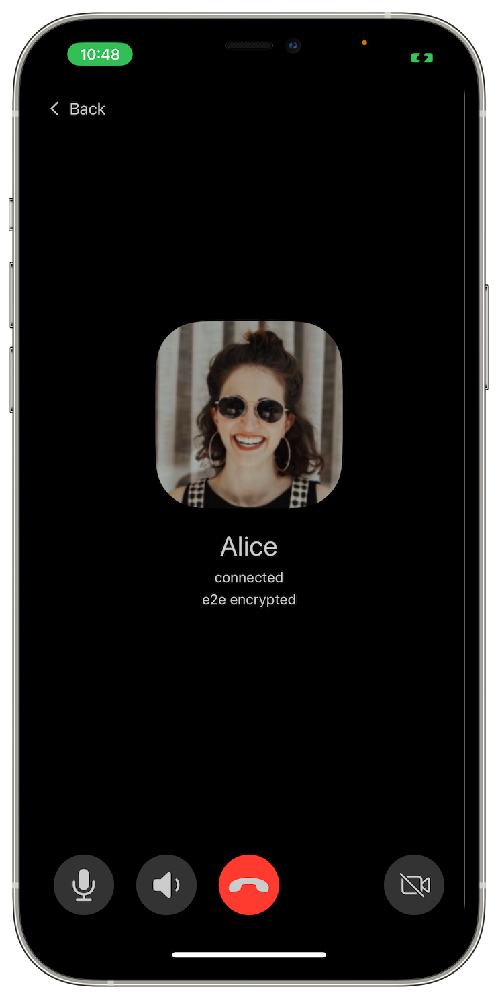

# SimpleX network: security review of protocols design by Trail of Bits, v6.1 released with better calls and user experience.

**Published:** Oct 14, 2024

[New security audit](#simplex-cryptographic-design-review-by-trail-of-bits):
- [review findings](#review-findings-our-comments-and-improvements), our comments and improvements.
- [next](#next-security-audit-in-2025): security audit in early 2025.

[What's new in v6.1](#whats-new-in-v61):
- [better calls](#better-calls).
- [better iOS notifications](#better-ios-notifications).
- [better user experience](#better-user-experience).

## SimpleX cryptographic design review by Trail of Bits

It's been almost two years since Trail of Bits did the first security assessment of SimpleX Chat.

Since then SimpleX Chat grew a lot, both in the number of users and in its functionality. We added XFTP — a protocol for sending files, — and XRCP — the protocol for using a mobile app profile from a desktop app. Messaging protocols also evolved a lot, adding private message routing and quantum resistant encryption.

Trail of Bits reviewed the design of protocols used in SimpleX network and applications in July 2024. Even though there are no critical issues, we made some security improvements based on this report.

[Trail of Bits](https://www.trailofbits.com/about) is a US based security and technology consultancy whose clients include big tech companies, governmental agencies and major blockchain projects. Its engineers reviewed the cryptographic design of the protocols used in SimpleX network and applications over a week:
- SimpleX Messaging Protocol (SMP), including a formal verification of currently used message queue negotiation protocol,
- the SMP agent protocol,
- the push notification system,
- the file transfer protocol (XFTP),
- the remote control protocol (XRCP),
- and the chat protocol.

There are 3 medium and 1 low severity findings, all of which require a high difficulty attack to exploit — the attacker would need to have a privileged access to the system, may need to know complex technical details, or must discover other weaknesses to exploit them. Additionally, there are 3 informational findings.

3 of these issues are improved in v6.1, and the remaining issues are accepted. Below we are commenting on these findings in detail, and also on the released improvements. 

The full cryptographic design review is available [here](https://github.com/simplex-chat/simplex-chat/blob/stable/docs/SimpleX_Design_Review_2024_Summary_Report_12_08_2024.pdf).

We are very thankful to Trail of Bits and their engineers for their work identifying these issues and helping us make SimpleX Chat more secure.

### Review findings, our comments and improvements

#### Protocols specifications (informational)

The review finding #1 is that the protocols specification is informal. We addressed [reported](https://github.com/simplex-chat/simplexmq/commit/7b6c86c6c1093cdae5ad2ee566655828076bc25c) [inconsistencies](https://github.com/simplex-chat/simplex-chat/commit/1cb3c25478db0f2a42c943f7469f5f9f75752a27), and we accept that we need to improve specification beyond verbose descriptions and ABNF syntax specification, and add algebraic notations and sequence diagrams. Having said that, the current specification correctly describes the implemented protocol, without any contradictions.

#### User-correlating attacks via introduced latency or via GET command of messaging protocol (medium and low severity)

These two findings #7 and #2 of the report relate to the attacks confirming that two known users communicate via observing their internet traffic.

The first attack is possible for a party that can introduce the latency in the network traffic. This attacker has to control some network node that passes the traffic of the sender — for example, it could be the sender's ISP, VPN provider, Tor entry node operator, the operator of the forwarding SMP server or a server hosting provider, etc. Such attacker can correlate delays in sender's traffic and the suspected recipient's traffic to confirm that they communicate.

The second attack relates to GET command used by iOS clients receiving notifications — depending on whether the server has the message, there will be a different number of packets sent, allowing the observer to determine if there was the message. While this comment is correct, in practice iOS clients only send GET commands when they receive notification, which also happens only when there is a message on the server, so in absolute majority of cases the number of packets will be the same.

These are not new findings — this type of attacks is covered in [threat model](https://github.com/simplex-chat/simplexmq/blob/stable/protocol/overview-tjr.md#a-passive-adversary-able-to-monitor-a-set-of-senders-and-recipients): _a passive adversary able to monitor a set of senders and recipients **can** perform traffic correlation attacks against senders and recipients and correlate senders and recipients within the monitored set, frustrated by the number of users on the servers_.

As threat model states, this attack is more likely to be successful with the less busy servers, and also for the users with few connections.

The recommendation of the review is to add optional randomized latency to message delivery that would reduce the opportunities for traffic correlation attacks — we consider adding it in the future.

#### A compromised transport protocol allows more efficient correlation attacks (medium severity)

The finding #3 is about the incorrect statement in threat model for SMP and XFTP protocols: _a passive adversary, able to monitor a set of senders and recipients, **cannot**, even in case of a compromised transport protocol perform traffic correlation attacks with any increase in efficiency over a non-compromised transport protocol_.

For protocols prior to v6.1 it is only partially correct, as responses to the commands that create a messaging queue or a file chunk include the identifiers both for senders and for the recipients, so if any observers were to compromise transport protocol (TLS) and record these identifiers, then they were able to correlate message senders with the recipients (and file recipients with the file senders).

The solution to make this correlation impossible even in case of compromised TLS is to encrypt these identifiers, as proposed in the review, or, better, encrypt the whole transmission inside TLS.

However unlikely is TLS being compromised, we added additional [transport encryption layer in SMP protocol](https://github.com/simplex-chat/simplexmq/pull/1317/files), where it can be more important, and we are going to add the same layer of encryption in XFTP protocol later, where we [amended the threat model](https://github.com/simplex-chat/simplexmq/commit/7b6c86c6c1093cdae5ad2ee566655828076bc25c).

#### XRCP protocol recommendations (informational)

XRCP protocol is used for connecting desktop and mobile. There are two findings in the review:

- SHA256 was used as a KDF in XRCP (#4).
- there was no forward secrecy or break-in recovery between sessions (#5).

SHA256 is now [replaced with SHA3-256](https://github.com/simplex-chat/simplexmq/pull/1302/files), as was [recommended](https://www.ietf.org/archive/id/draft-josefsson-ntruprime-hybrid-01.html) by the internet draft about hybrid key agreement that XRCP uses.

Even though XRCP sessions are short lived, and usually the connection happens over local network, we added forward secrecy to XRCP sessions [here](https://github.com/simplex-chat/simplexmq/pull/1328/files) and [here](https://github.com/simplex-chat/simplex-chat/pull/4926/files) — each request from desktop app to mobile app is now encrypted with a new key derived from chain ratchets. This improves security of this connection.

We believe that it is unnecessary to have in-session break-in recovery in XRCP protocol, as there is break-in recovery between the sessions.

#### Device compromise can be hidden in some scenarios (medium)

The finding #6 in the report is about an attacker who was not only able to break into the device and get a copy of the database, which would be mitigated by break-in recovery in [double ratchet protocol](../docs/GLOSSARY.md#double-ratchet-algorithm), but also was able to modify the state of the app database and to substitute the addresses and cryptographic keys of the messaging queues used with some contact with other message queues that the attacker controls.

Even though this is a very hard attack, if successful, it would allow the attacker intercepting all messages with this contact.

Effectively, it is a [man-in-the-middle attack](../docs/GLOSSARY.md#man-in-the-middle-attack), where an intermediary is inserted via the app database modification. Such attack can be mitigated by periodic verification of security codes. Although, the attacker who was able to modify the state of the device, could have also modified the app itself, making it show the same security code as the compromised contact has, thus avoiding detection.

We accept that such an attack is possible, and we don't believe there is any viable defense against the attacker who can modify the device state. We may consider adding the measures to validate the database integrity, but they may be ineffective in case the app and/or operating system are compromised.

### Next: security audit in 2025

We are planning the implementation security assessment with Trail of Bits in the beginning of 2025. It will be a twice bigger assessment than we did in 2022 — it will cover both the core of the app and the handling of cryptographic secrets in the mobile applications.

## What's new in v6.1

This release has many user experience and stability improvements.

### Better calls

This release improves reliability and usability of the calls. Now you can enable the camera and share the screen from the desktop app even if the call started as a voice call. We've also fixed several issues that prevented calls from connecting.

This is a substantial change, and some issues may have been introduced - please report them.

We will be further improving the calls interface in the app in the next versions.

### Better iOS notifications

iOS notifications were added [more than 2 years ago](./20220711-simplex-chat-v3-released-ios-notifications-audio-video-calls-database-export-import-protocol-improvements.md), based on this [system design](./20220404-simplex-chat-instant-notifications.md). Until recently we made almost no improvements to them. As the number of iOS users is growing, their reliability is insufficient. In addition to that, once we started the work on improving them, we have found several important issues, one of which was introduced recently, when we improved the speed of creating new connections.

This release fixes many important issues with iOS notifications delivery in iOS app, improves app performance and reduces traffic required to manage notifications.

We also fixed several notification server issues, made change that almost completely prevents losing notifications when notification servers are restarted, and added real-time monitoring to diagnose any issues with iOS notifications delivery.

This work is not over – iOS notifications in a decentralized network are complex and require more work. We will be further improving both client apps and servers to make their delivery stable.

### Better user experience

#### New conversation layout and customizable messages

Messages are now grouped when they are sent sequentially, with less than 60 seconds between them. We also made message shapes configurable, and separated the messages in different days. When you scroll conversation quickly, there will be a floating date indication, allowing to find messages faster.

#### Improved switching between user profiles

 

Another improvement relates to switching between chat profiles. Previously, when you added multiple chat profiles to the app, there were two problems:
- you had to tap twice to get to some important functions in the app,
- anybody who could see your screen, could also see all your chat profiles.

We changed this design by making important functions available after tapping profile image once, and by only showing the previously used profile image to switch to it quickly, while switching to other profiles now requires scrolling to them or opening *Your chat profiles* screen.

You also can switch chat profile when creating a one-time invitation link.

#### Faster deletion, moderation and forwarding of messages

You now can forward multiple messages at once - up to 20. If you are forwarding messages with files or media, and they were not received, the app will offer you to download them, and it will also allow forwarding messages without files. These messages will be "packed" into the smallest number of sent messages as possible. If there are no images and messages are not too large, it will be just one sent message containing all forwarded messages.

The previous version allowed deleting and moderating multiple messages. As most users now upgraded the app, we increased the maximum number of messages that can be deleted or moderated to 200 messages - in most cases all these deletions will be packed into one sent message.

## SimpleX network

Some links to answer the most common questions:

[How can SimpleX deliver messages without user identifiers](./20220511-simplex-chat-v2-images-files.md#the-first-messaging-platform-without-user-identifiers).

[What are the risks to have identifiers assigned to the users](./20220711-simplex-chat-v3-released-ios-notifications-audio-video-calls-database-export-import-protocol-improvements.md#why-having-users-identifiers-is-bad-for-the-users).

[Technical details and limitations](https://github.com/simplex-chat/simplex-chat#privacy-and-security-technical-details-and-limitations).

[Frequently asked questions](../docs/FAQ.md).

Please also see our [website](https://simplex.chat).

## Please support us with your donations

Huge *thank you* to everybody who donated to SimpleX Chat!

Prioritizing users privacy and security, and also raising the investment, would have been impossible without your support and donations.

Also, funding the work to transition the protocols to non-profit governance model would not have been possible without the donations we received from the users.

Our pledge to our users is that SimpleX protocols are and will remain open, and in public domain, so anybody can build the future implementations of the clients and the servers. We are building SimpleX platform based on the same principles as email and web, but much more private and secure.

Your donations help us raise more funds — any amount, even the price of the cup of coffee, makes a big difference for us.

See [this section](https://github.com/simplex-chat/simplex-chat/tree/master#help-us-with-donations) for the ways to donate.

Thank you,

Evgeny

SimpleX Chat founder
