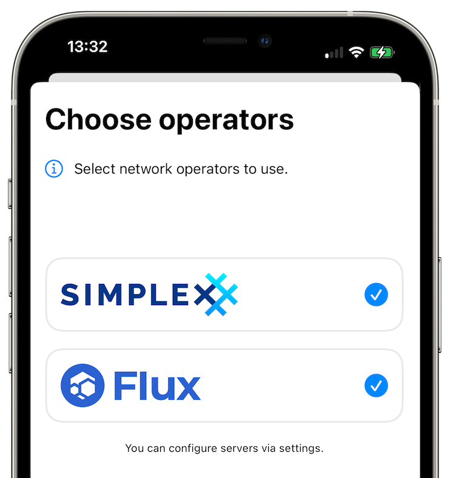
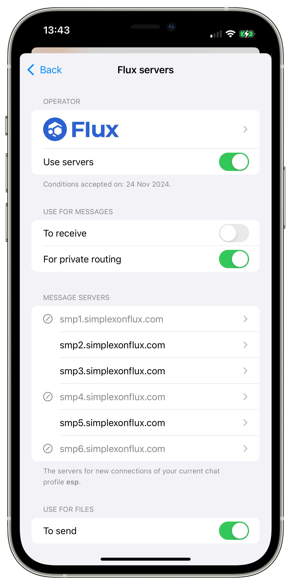
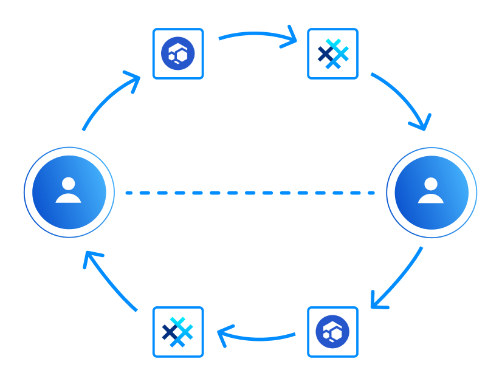

# Servers operated by Flux &mdash; true privacy and decentralization for all users

**Published:** Nov 25, 2024

- [Welcome, Flux](#welcome-flux--the-new-servers-in-v62-beta1) &mdash; the new servers in v6.2-beta.1!
- [What's the problem](#whats-the-problem)?
- [Using two operators improves connection privacy](#using-two-operators-improves-connection-privacy).
- [SimpleX decentralization](#simplex-decentralization-compared-with-matrix-session-and-tor) compared with Matrix, Session and Tor.
- [What's next](#whats-next-for-simplex-network-decentralization) for SimpleX network decentralization?

## Welcome, Flux – the new servers in v6.2-beta.1!

[Flux](https://runonflux.com) is a decentralized cloud infrastructure that consists of user-operated nodes [1]. With this beta release all SimpleX Chat users can use pre-configured Flux servers to improve metadata privacy and decentralization.

We are very grateful to [Daniel Keller](https://x.com/dak_flux), CEO and co-founder of Flux, for supporting SimpleX network, and betting on our vision of extreme decentralization of communication. Flux investing their infrastructure in our vision is a game changer for us and our users.

Download new mobile and desktop SimpleX apps from [TestFlight](https://testflight.apple.com/join/DWuT2LQu) (iOS), [Play Store](https://play.google.com/store/apps/details?id=chat.simplex.app), our [F-Droid repo](https://simplex.chat/fdroid/) or [GitHub](https://github.com/simplex-chat/simplex-chat/releases/tag/v6.2.0-beta.1).

Read on to learn why it is important and how using several operators improves metadata privacy.

## What's the problem?

SimpleX network is fully decentralized, without any central component or bootstrap nodes &mdash; you could use your own servers from day one. While there is no full list of SimpleX network servers, we see many hundreds of servers in public groups.

But a large number of SimpleX app users use the servers pre-configured in the app. Even though the app randomly chooses 4 servers in each connection to improve privacy and security, prior to v6.2 for these users the servers were operated by the same company &mdash; ourselves.

Our open-source code that we are [legally bound to use](./20240426-simplex-legally-binding-transparency-v5-7-better-user-experience.md#legally-binding-transparency) doesn't provide any metadata that could be used to learn who connects to whom. But the privacy of users' connections still depends on us honouring our promises and [privacy policy](../PRIVACY.md). Flux servers in the app improve that.

## Using two operators improves connection privacy

To ensure that the users' metadata from different servers cannot be combined to discover who talks to whom, the servers in each connection have to be operated by different independent organizations.

Before this version the app was choosing servers randomly. Now, when both SimpleX Chat and Flux servers are enabled it will always choose servers of different operators in each connection to receive messages and for [private message routing](./20240604-simplex-chat-v5.8-private-message-routing-chat-themes.md), increasing metadata privacy for all users.

Flux servers are configured as opt-in, and the privacy policy and conditions of use that apply to Flux servers are the same as for SimpleX Chat servers, to make it simple for the users.

To improve connection privacy by using Flux servers all you have to do is to enable Flux once the app offers it, or later, via Network & servers settings, and accept that the same conditions apply.

By default, if both Flux and SimpleX servers are enabled in this version, you will be using SimpleX Chat servers to receive messages, Flux servers to forward messages to SimpleX Chat servers, and the servers of both to forward messages to unknown servers. We will enable Flux to receive messages by default a bit later, or you can change it now via settings.

Any additional servers you add to app configuration are treated as belonging to another operator, so they will also be used to improve connection privacy, together with pre-configured servers, unless you disable them.

## SimpleX decentralization compared with Matrix, Session and Tor

SimpleX network decentralization model is different from other decentralized networks in several important aspects.

| Communication network        | SimpleX | Matrix | Session | Tor-based |
|:-----------------------------|:-------:|:------:|:-------:|:---------:|
| Full decentralization        | ✅      | -      | -       | -         |
| No user profile identity     | ✅      | -      | -       | -         |
| Connection privacy           | ✅      | -      | ✅      | ✅        |
| Server operator transparency | ✅      | ✅     | -       | -         |

**Full decentralization**

Fully decentralized networks do not have a central component, bootstrap nodes or any global shared state, like in cryptocurrency/blockchain-based communication networks. The presence of any central component or shared state introduces an attack vector that undermines privacy and security of the network.

**No user profile identity**

User profile identities, even if it is only a random number or a long-term key, undermine privacy of users connections, because in some cases they may allow network operators, observers and users to find out who talks to whom.

Most communication networks rely on fixed user profile identities. It includes Matrix and communication networks with onion routing.

SimpleX network design avoids the need for profile identities or keys, while still allowing optional long-term addresses for users and groups for convenience. It protects users from being discovered and approached by malicious parties, and many family users chose to use SimpleX with children because of it.

**Connection privacy**

SimpleX network has [private message routing](./20240604-simplex-chat-v5.8-private-message-routing-chat-themes.md) (2-hop onion routing) &mdash; it prevents server operators from discovering who connects to whom via network traffic metadata. Onion routing used in Tor-based messengers and in Session also hides it. But because neither Tor nor Session users have knowledge about who operates servers, in some cases the clients may connect via the servers controlled by one entity, that may learn the IP addresses of both parties.

Statistically, if traffic metadata from 2% of onion network servers is available to an attacker, and the client chooses servers randomly, after about 1750 of such choices the probability of choosing attacker's servers as both entry and exit nodes, and connection privacy being compromised becomes over 50% [2].

Matrix network does not provide connection privacy, as not only user identity exists, it is tied to a specific server that knows all user connections and a part of user's contacts connections. What is worse, Element &mdash; the most widely used Matrix app &mdash; offers the servers of only one organization to create an account, resulting in some degree of network centralization.

**Server operator transparency**

Operator transparency means that network users know who operates the servers they use. 

You may argue that when the operators are known, the servers data can be requested by the authorities. But such requests, in particular when multiple operators are used by all users, will follow a due legal process, and will not result in compromising the privacy of all users.

With Tor and Session networks such legal process becomes impossible, and some users may see it as advantage. But nothing prevents the attackers, both criminal and corporate- or state-funded, to compromise the privacy of Tor or Session users by running many servers, or by purchasing traffic metadata from the existing server owners &mdash; there are no legal conditions that prohibit server owners of these networks to share or sell traffic data.

Because of that, we see operator transparency in SimpleX network as a better trade-off for privacy of most users than operator anonymity provided by Session and Tor. You can see privacy of network participants as a zero sum game &mdash; for the end users to have it, server operators should be known.

## What's next for SimpleX network decentralization

SimpleX network is designed for extreme decentralization &mdash; not only users are distributed across network operators, as happens with federated networks, but each conversation will be relying on servers of 4-6 independent operators, and these operators will be regularly and automatically changed in the near future.

We believe that the only viable commercial model is freemium &mdash; a small share of paying users, who have better service quality and additional features, sponsors free users. This model doesn't have downsides of exploitative "provide service, sell data" approaches, that technology monopolies practice, and it also doesn't have problems of cryptocurrency blockchains, that have shared and immutable state, and also have regulatory problems.

To provide this extreme decentralization with freemium model we will create the system of payments allowing server operators to receive money for infrastructure certificates that will be used with any other participating network operators without compromising privacy of the paying users. You can read about this model [here](https://github.com/simplex-chat/simplex-chat/blob/stable/docs/rfcs/2024-04-26-commercial-model.md). We will be writing more about it as this development progresses.

## SimpleX network

Some links to answer the most common questions:

[How can SimpleX deliver messages without user identifiers](./20220511-simplex-chat-v2-images-files.md#the-first-messaging-platform-without-user-identifiers).

[What are the risks to have identifiers assigned to the users](./20220711-simplex-chat-v3-released-ios-notifications-audio-video-calls-database-export-import-protocol-improvements.md#why-having-users-identifiers-is-bad-for-the-users).

[Technical details and limitations](https://github.com/simplex-chat/simplex-chat#privacy-and-security-technical-details-and-limitations).

[Frequently asked questions](../docs/FAQ.md).

Please also see our [website](https://simplex.chat).

## Please support us with your donations

Huge *thank you* to everybody who donated to SimpleX Chat!

Prioritizing users privacy and security, and also raising the investment, would have been impossible without your support and donations.

Also, funding the work to transition the protocols to non-profit governance model would not have been possible without the donations we received from the users.

Our pledge to our users is that SimpleX protocols are and will remain open, and in public domain, so anybody can build the future implementations of the clients and the servers. We are building SimpleX platform based on the same principles as email and web, but much more private and secure.

Your donations help us raise more funds &mdash; any amount, even the price of the cup of coffee, makes a big difference for us.

See [this section](https://github.com/simplex-chat/simplex-chat/#please-support-us-with-your-donations) for the ways to donate.

Thank you,

Evgeny

SimpleX Chat founder

[1] You can also to self-host your own SimpleX servers on [Flux decentralized cloud](https://home.runonflux.io/apps/marketplace?q=simplex).

[2] The probability of connection being de-anonymized and the number of random server choices follow this equation: `(1 - s ^ 2) ^ n = 1 - p`, where `s` is the share of attacker-controlled servers in the network, `n` is the number of random choices of entry and exit nodes for the circuit, and `p` is the probability of both entry and exit nodes, and the connection privacy being compromised. Substituting `0.02` (2%) for `s`, `0.5` (50%) for `p`, and solving this equation for `n` we obtain that `1733` random circuits have 50% probability of privacy being compromised.

Also see [this presentation about Tor](https://ritter.vg/p/tor-v1.6.pdf), specifically the approximate calculations on page 76, and also [Tor project post](https://blog.torproject.org/announcing-vanguards-add-onion-services/) about the changes that made attack on hidden service anonymity harder, but still viable in case the it is used for a long time.
