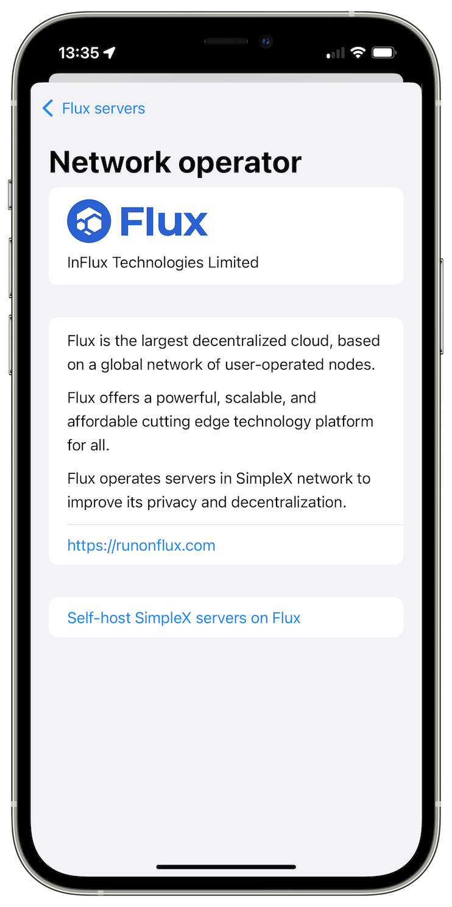
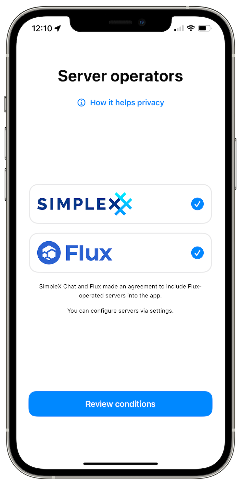
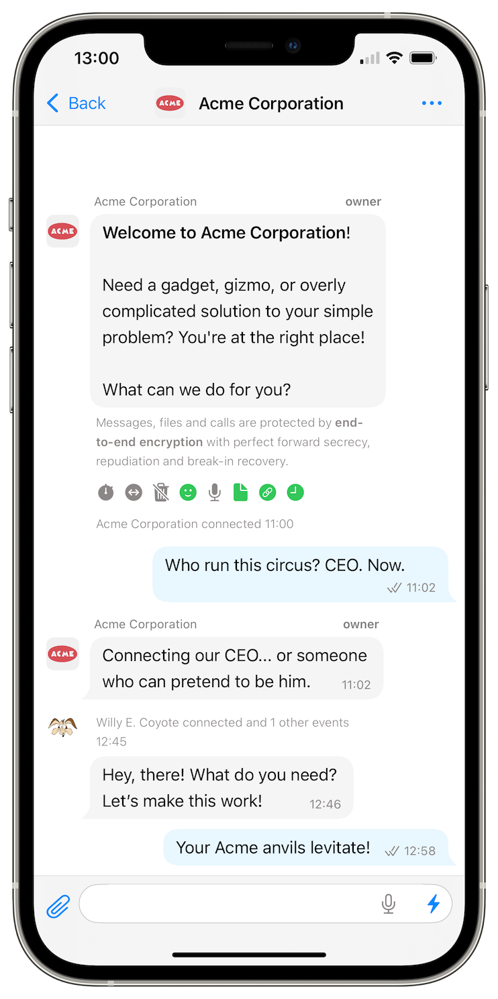
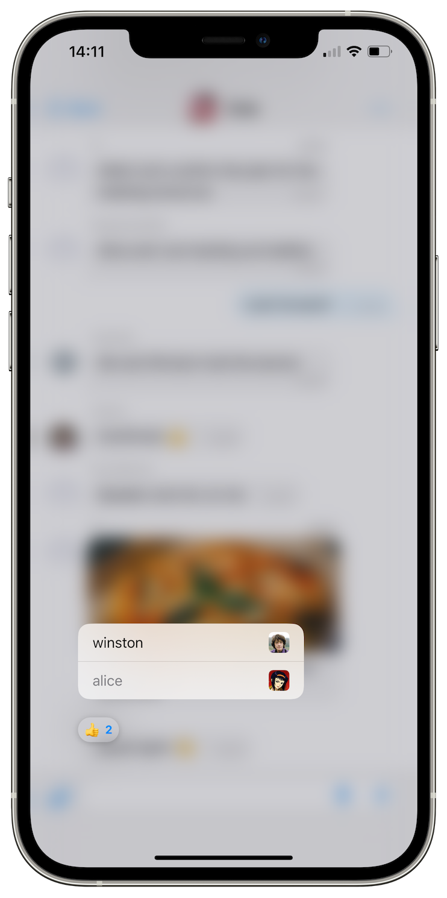

# SimpleX network: preset servers operated by Flux, business chats and more with v6.2 of the apps

**Published:** Dec 10, 2024

What's new in v6.2:

- [SimpleX Chat and Flux](#simplex-chat-and-flux-improve-metadata-privacy-in-simplex-network) improve metadata privacy in SimpleX network.
- [Business chats](#business-chats) to provide support from your business to users of SimpleX network.
- [Better user experience](#better-user-experience): open on the first unread, jump to quoted messages, see who reacted.
- [Improving notifications in iOS app](#improving-notifications-in-ios-app).

## What's new in v6.2

### SimpleX Chat and Flux improve metadata privacy in SimpleX network

 

SimpleX Chat and [Flux](https://runonflux.com) (Influx Technology Limited) made an agreement to include messaging and file servers operated by Flux into the app.

SimpleX network is decentralized by design, but in the previous versions users had to find other servers online or host servers themselves to use servers other than operated by us.

Now all users can choose between servers of two companies, use both of them, and continue using any other servers.

To use Flux servers you have to enable them when the app offers them or at any point later via Network & servers settings in the app.

When both SimpleX Chat and Flux servers are enabled, the app will choose servers of different operators in each connection to receive messages and for [private message routing](./20240604-simplex-chat-v5.8-private-message-routing-chat-themes.md), increasing metadata privacy for all users.

Read more about why SimpleX network has to have multiple operators in [our previous post](./20241125-servers-operated-by-flux-true-privacy-and-decentralization-for-all-users.md).

You can also readabout our plan [how network operators will make money](https://github.com/simplex-chat/simplex-chat/blob/stable/docs/rfcs/2024-04-26-commercial-model.md), while continuing to protect users privacy, based on network design rather than on trust to operators, and without any cryptocurrency emission.

### Business chats

We use SimpleX Chat to provide support to SimpleX Chat users, and we also see some other organizations offering SimpleX Chat as a support channel.

The problem of providing support via general purpose messaging platforms is that the customers prefer knowing when they talk to a bot, and when to a human, and also who they are talking with.

It is not possible to achieve with the usual contact address in SimpleX Chat, as it creates a new one-to-one conversation with every new contact.

Business chats solve this problem: all you have to do is to enable the toggle under the contact address in your chat profile.

Once you do it, the application will be creating a new business conversation with each customer where multiple people can participate. Business conversation is a hybrid of one-to-one and group conversation. In the list of chats you will see customer name and avatar, and the customer will see business name and avatar. But inside it works as a group, allowing cuatomer to see who sent the message, and allowing you to add other participants from the business side, for delegation and escalation of customer questions.

This can be done manually, and you can automate these conversations using bots that can answer some customer questions and then add a human to the conversation when appropriate or requested by the customer. The current capabilities for bots are limited, but we will be offering more bot-related features and a simpler way to program bots very soon - watch our announcements.

### Better user experience

**Chat navigation**

This has been a long-standing complaint from the users: *why does the app opens conversations on the last message, and not on the first unread message*.

This is how it works now in Android and desktop apps, and will soon be done in the iOS app too. 

Also, the app can scroll to the replied message when you tap it anywhere in the conversation, even if it was sent a very long time ago

**See who reacted!**

This is a small but important change - you can now see who reacted to your messages!

### Improving notifications in iOS app

iOS notifications in a decentralized network is a complex problems. We [support iOS notifications](./20220404-simplex-chat-instant-notifications.md#our-ios-approach-has-one-trade-off) from early versions of the app, focussing on preserving privacy as much as possible. But the reliability of notifications was not good enough.

We solved several problems of notification delivery in this release:
- messaging servers no longer nowlose notificaitons while notification servers are restarted.
- even though Apple can drop notifications while your device is offline (about 15-20% of notifications are dropped because of it), the servers and the new version of the app work around this problem by always delivering several last notifications for different contacts or group connections - the app may show several contact names in the notification in some cases.
- the app would also receive multiple messages from one contact when you device missed some notifications.

With all these changes the iOS notificaitons remained as private and secure as before. The notifications only contain metadata, without the actual messages, and even the metadata is end-to-end encrypted between SimpleX notification servers and the client device, inaccessible to Apple push notification servers.

There are two remaining problems we will solve soon:
- iOS only allows to use 25mb of device memory when processing notifications in the background. This limit didn't change for many years, and it is challenging for decentralized design. If the app uses more memory, iOS kills it and the notification is not shown.
- for notifications to work, the app has to communicate with the notification server about every contact and group connection it needs to enable notifications for. If the user puts the app into the background too quickly, the app may fail to enable notification for the new contacts. We plan to change clients and servers to delegate this task to messaging servers, to remove the need for this additional communication entirely. This will happen early next year.

## SimpleX network

Some links to answer the most common questions:

[How can SimpleX deliver messages without user identifiers](./20220511-simplex-chat-v2-images-files.md#the-first-messaging-platform-without-user-identifiers).

[What are the risks to have identifiers assigned to the users](./20220711-simplex-chat-v3-released-ios-notifications-audio-video-calls-database-export-import-protocol-improvements.md#why-having-users-identifiers-is-bad-for-the-users).

[Technical details and limitations](https://github.com/simplex-chat/simplex-chat#privacy-and-security-technical-details-and-limitations).

[Frequently asked questions](../docs/FAQ.md).

Please also see our [website](https://simplex.chat).

## Please support us with your donations

Huge *thank you* to everybody who donated to SimpleX Chat!

Prioritizing users privacy and security, and also raising the investment, would have been impossible without your support and donations.

Also, funding the work to transition the protocols to non-profit governance model would not have been possible without the donations we received from the users.

Our pledge to our users is that SimpleX protocols are and will remain open, and in public domain, so anybody can build the future implementations of the clients and the servers. We are building SimpleX platform based on the same principles as email and web, but much more private and secure.

Your donations help us raise more funds &mdash; any amount, even the price of the cup of coffee, makes a big difference for us.

See [this section](https://github.com/simplex-chat/simplex-chat/#please-support-us-with-your-donations) for the ways to donate.

Thank you,

Evgeny

SimpleX Chat founder
