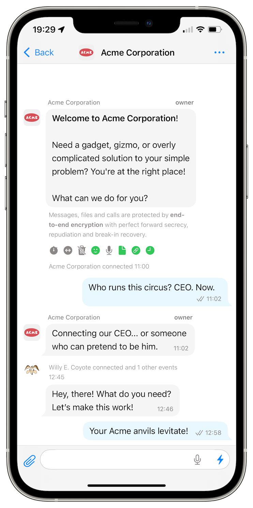

# SimpleX network: preset servers operated by Flux, business chats and more with v6.2 of the apps

**Published:** Dec 10, 2024

What's new in v6.2:

- [SimpleX Chat and Flux](#simplex-chat-and-flux-improve-metadata-privacy-in-simplex-network) improve metadata privacy in SimpleX network.
- [Business chats](#business-chats) to provide support from your business to users of SimpleX network.
- [Better user experience](#better-user-experience): open on the first unread, jump to quoted messages, see who reacted.
- [Improving notifications in iOS app](#improving-notifications-in-ios-app).

## What's new in v6.2

### SimpleX Chat and Flux improve metadata privacy in SimpleX network

 

SimpleX Chat and [Flux](https://runonflux.com) (Influx Technology Limited) made an agreement to include messaging and file servers operated by Flux into the app.

SimpleX network is decentralized by design, but in the users of the previous app versions had to find other servers online or host servers themselves to use any other servers than operated by us.

Now all users can choose between servers of two companies, use both of them, and continue using any other servers they host or available online.

To use Flux servers enable them when the app offers it, or at any point later via Network & servers settings in the app.

When both SimpleX Chat and Flux servers are enabled, the app will use servers of both operators in each connection to receive messages and for [private message routing](./20240604-simplex-chat-v5.8-private-message-routing-chat-themes.md), increasing metadata privacy for all users.

Read more about why SimpleX network benefits from multiple operators in [our previous post](./20241125-servers-operated-by-flux-true-privacy-and-decentralization-for-all-users.md).

You can also read about our plan [how network operators will make money](https://github.com/simplex-chat/simplex-chat/blob/stable/docs/rfcs/2024-04-26-commercial-model.md), while continuing to protect users privacy, based on network design rather than on trust to operators, and without any cryptocurrency emission.

### Business chats

We use SimpleX Chat to provide support to SimpleX Chat users, and we also see some other companies offering SimpleX Chat as a support channel.

One of the problem of providing support via general purpose messengers is that the customers don't see who they talk to, as they can in all dedicated support systems.

It is not possible in most messengers, including SimpleX Chat prior to v6.2 - every new customer joins a one-to-one conversation, where the customers see that they talk to a company, not knowing who they talk to, and if it's a bot or a human.

The new business chats in SimpleX Chat solve this problem: to use them enable the toggle under the contact address in your chat profile. It is safe to do, and you can always toggle it off, if needed - the address itself does not change.

Once you do it, the app will be creating a new business chat with each connecting customer where multiple people can participate. Business chat is a hybrid of one-to-one and group conversation. In the list of chats you will see customer names and avatars, and the customer will see your business name and avatar, like with one-to-one conversations. But inside it works as a group, allowing customer to see who sent the message, and allowing you to add other participants from the business side, for delegation and escalation of customer questions.

This can be done manually, or you can automate these conversations using bots that can answer some customer questions and then add a human to the conversation when appropriate or requested by the customer. We will be offering more bot-related features to the app and a simpler way to program bots very soon - watch our announcements.

### Better user experience

**Chat navigation**

This has been a long-standing complaint from the users: *why does the app opens conversations on the last message, and not on the first unread message*?

Android and desktop apps now open the chat on the first unread message. It will soon be done in the iOS app too.

Also, the app can scroll to the replied message anywhere in the conversation (when you tap it), even if it was sent a very long time ago.

**See who reacted!**

This is a small but important change - you can now see who reacted to your messages!

### Improving notifications in iOS app

iOS notifications in a decentralized network is a complex problem. We [support iOS notifications](./20220404-simplex-chat-instant-notifications.md#ios-notifications-require-a-server) from early versions of the app, focussing on preserving privacy as much as possible. But the reliability of notifications was not good enough.

We solved several problems of notification delivery in this release:
- messaging servers no longer lose notifications while notification servers are restarted.
- Apple can drop notifications while your device is offline - about 15-20% of notifications are dropped because of it. The servers and the new version of the app work around this problem by delivering several last notifications, to show notifications correctly even when Apple drops them.

With these changes the iOS notifications remained as private and secure as before. The notifications only contain metadata, without the actual messages, and even the metadata is end-to-end encrypted between SimpleX notification servers and the client device, inaccessible to Apple push notification servers.

There are two remaining problems we will solve soon:
- iOS only allows to use 25mb of device memory when processing notifications in the background. This limit didn't change for many years, and it is challenging for decentralized design. If the app uses more memory, iOS kills it and the notification is not shown – approximately 10% of notifications can be lost because of that.
- for notifications to work, the app communicates with the notification server. If the user puts the app in background too quickly, the app may fail to enable notification for the new contacts. We plan to change clients and servers to delegate this task to messaging servers, to remove the need for this additional communication entirely, without any impact on privacy and security. This will happen early next year.

## SimpleX network

Some links to answer the most common questions:

[How can SimpleX deliver messages without user identifiers](./20220511-simplex-chat-v2-images-files.md#the-first-messaging-platform-without-user-identifiers).

[What are the risks to have identifiers assigned to the users](./20220711-simplex-chat-v3-released-ios-notifications-audio-video-calls-database-export-import-protocol-improvements.md#why-having-users-identifiers-is-bad-for-the-users).

[Technical details and limitations](https://github.com/simplex-chat/simplex-chat#privacy-and-security-technical-details-and-limitations).

[Frequently asked questions](../docs/FAQ.md).

Please also see our [website](https://simplex.chat).

## Please support us with your donations

Huge *thank you* to everybody who donated to SimpleX Chat!

Prioritizing users privacy and security, and also raising the investment, would have been impossible without your support and donations.

Also, funding the work to transition the protocols to non-profit governance model would not have been possible without the donations we received from the users.

Our pledge to our users is that SimpleX protocols are and will remain open, and in public domain, so anybody can build the future implementations of the clients and the servers. We are building SimpleX platform based on the same principles as email and web, but much more private and secure.

Your donations help us raise more funds — any amount, even the price of the cup of coffee, makes a big difference for us.

See [this section](https://github.com/simplex-chat/simplex-chat/#please-support-us-with-your-donations) for the ways to donate.

Thank you,

Evgeny

SimpleX Chat founder
