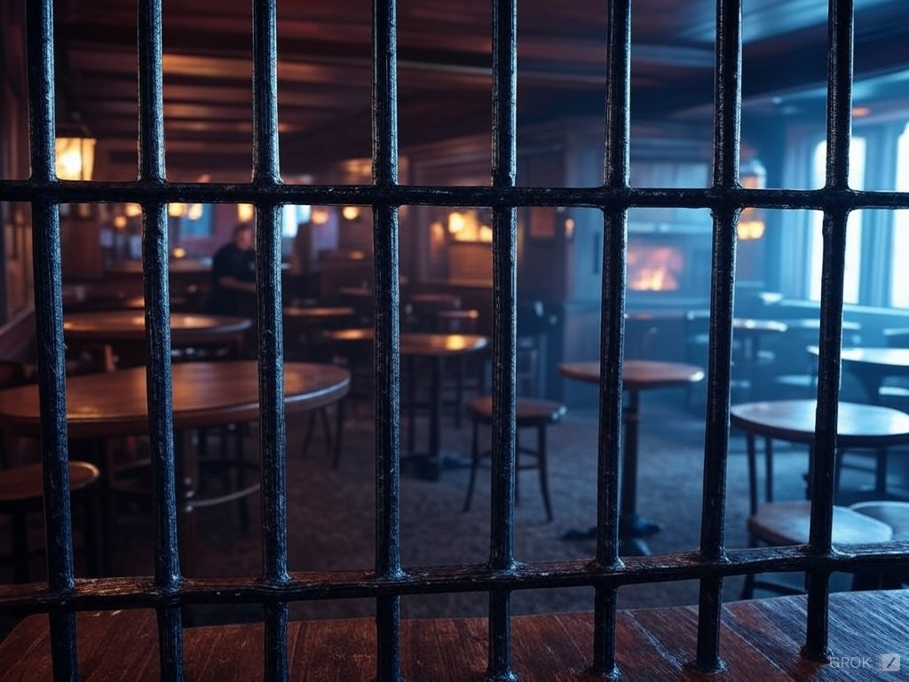

# Oppose digital IDs – they break the law and lead to mass scale surveillance

**Published:** Dec 18, 2024

Starting next year, the UK government plans to introduce [digital ID cards](https://www.telegraph.co.uk/politics/2024/12/08/digital-id-to-be-introduced-for-pubs-and-clubs/) for the young people to prove their age when visiting pubs. While officials claim this system will remain optional, it's part of a broader government initiative to move more state functions online so that people can prove their identity for everything from paying taxes to opening a bank account using the government-backed app. This will be a step toward a society where every pub visit, purchase, and social interaction becomes a permanent digital record linked to a government-issued ID – a step to normalizing mass surveillance at scale.

Digital IDs are promoted as a way to fight law violations, and some politicians support them as [a way to tackle illegal immigration](https://www.telegraph.co.uk/politics/2024/07/10/id-cards-inevitable-tackle-immigration-lord-blunkett-labour/). But digital IDs themselves break the law. Article 8 of the European Convention of Human Rights says: “Everyone has the right to respect for his private and family life”. It means that not only our right to privacy is enshrined in the law, but the right to have our privacy respected is also part of the law. Asking to present a digital ID when visiting a pub, even if it is optional, disrespects our privacy, and is therefore illegal.

Digital IDs would not stop people who decide to break laws. Pubs already can refuse to serve alcohol to young people and require the ID in case the age is in doubt. And illegal immigration can also be reduced without any digital IDs. But introducing digital IDs and collecting our actions, names and locations in one government-controlled database will result in making this information easier to access for criminals, and being exploited for financial and identity crimes.

What starts as a "convenient option" is likely to end as a mandatory requirement. The digital ID systems being pushed by governments and corporations aren't about making our lives easier. They're about tracking, monitoring, and controlling every move we make. And we can see [where this road leads in China](https://www.wired.com/story/china-social-credit-system-explained/), when IDs and social scores created for convenience are used to prevent access to basic services and bank accounts as a punishment for legal social media posts that the government disagrees with. What started as a convenience, is now trialed [to track the duration of public toilet visits](https://www.thesun.ie/news/13154812/china-installs-toilet-timers-to-broadcast-time-spent/).

The United Kingdom is a democratic country, and the law protects our right to privacy and freedom of speech. If we accept digital IDs as something required for simple things, like buying a drink, it leaves the door wide open to a range of privacy violations.

We call on everyone to oppose the digital ID systems. Do not use them. Do not install these systems in your pub, for as long as it is not legally required. Support local businesses that don’t use them. Protect your privacy and freedom by using software that respects them. Demand that your privacy is respected, as required by law.

To make your voice heard, email your MP expressing your rejection of digital IDs as a violation of European Convention of Human Rights in three simple steps:

1. **Copy the text below** or [click this link](mailto:?subject=Please%20oppose%20the%20plan%20for%20Digital%20IDs&body=Dear%20%E2%80%A6%2C%0A%0AI%20object%20to%20the%20introduction%20of%20digital%20IDs%20in%20pubs%20or%20any%20other%20public%20places%20for%20these%20reasons%3A%0A%0A1.%20It%20violates%20the%20European%20Convention%20of%20Human%20Rights%2C%20article%208%3A%20%E2%80%9CEveryone%20has%20the%20right%20to%20respect%20for%20his%20private%20and%20family%20life%E2%80%9D%20(https%3A%2F%2Ffra.europa.eu%2Fen%2Flaw-reference%2Feuropean-convention-human-rights-article-8-0).%0AAsking%20to%20present%20digital%20IDs%20when%20proof%20of%20identity%20is%20not%20legally%20required%2C%20even%20if%20it%20is%20optional%2C%20disrespects%20our%20privacy%2C%20and%20is%20therefore%20illegal.%0A%0A2.%20It%20will%20not%20be%20an%20effective%20measure%20in%20reducing%20the%20violations%20of%20the%20law.%20People%20who%20want%20to%20circumvent%20it%2C%20will%20find%20a%20way.%0A%0A3.%20It%20will%20increase%20crime%2C%20because%20combining%20a%20large%20amount%20of%20private%20information%20in%20a%20single%20system%20increases%20the%20risks%20of%20this%20information%20becoming%20available%20to%20criminals%2C%20who%20will%20exploit%20it%20for%20financial%20crimes%20and%20identity%20theft.%0A%0AI%20kindly%20ask%20you%20to%20oppose%20this%20plan%2C%20both%20publicly%20and%20during%20any%20discussions%20in%20the%20UK%20Parliament.%0A%0ASincerely%20yours%2C%0A%E2%80%A6) to copy it into email app:

*Dear …,*

*I object to the introduction of digital IDs in pubs or any other public places for these reasons:*

1. *It violates the European Convention of Human Rights, article 8: “Everyone has the right to respect for his private and family life” (https://fra.europa.eu/en/law-reference/european-convention-human-rights-article-8-0).*
*Asking to present digital IDs when proof of identity is not legally required, even if it is optional, disrespects our privacy, and is therefore illegal.*
2. *It will not be an effective measure in reducing the violations of the law. People who want to circumvent it, will find a way.*
3. *It will increase crime, because combining a large amount of private information in a single system increases the risks of this information becoming available to criminals, who will exploit it for financial crimes and identity theft.*

*I kindly ask you to oppose this plan, both publicly and during any discussions in the UK Parliament.*

*Sincerely yours,*
*…*

2. [**Find the email address of your MP**](https://members.parliament.uk/members/Commons) and copy it to the email.

3. Fill in the blanks, edit the text if needed, and **send it**!

Public opposition changed government decisions in many cases.

It is your opportunity to tell the government which country you want to live in &mdash; please use it!
