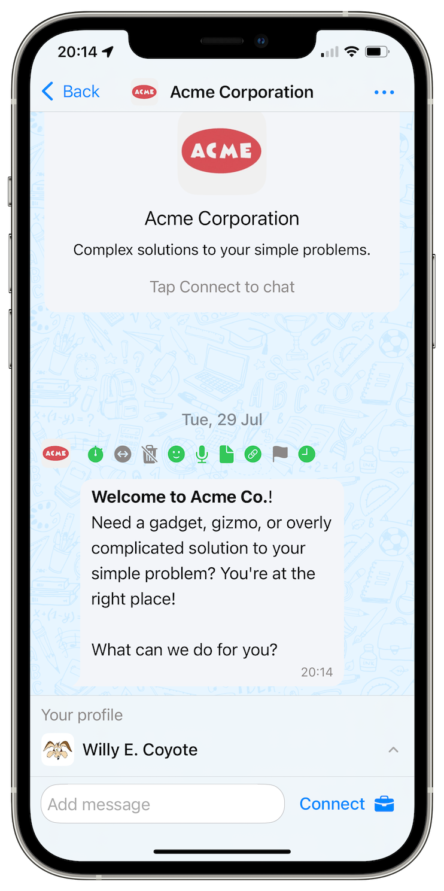
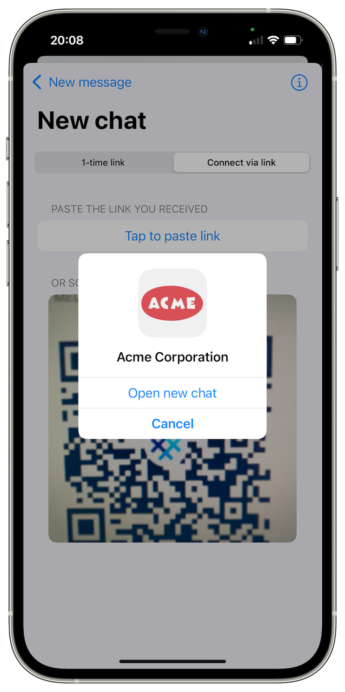
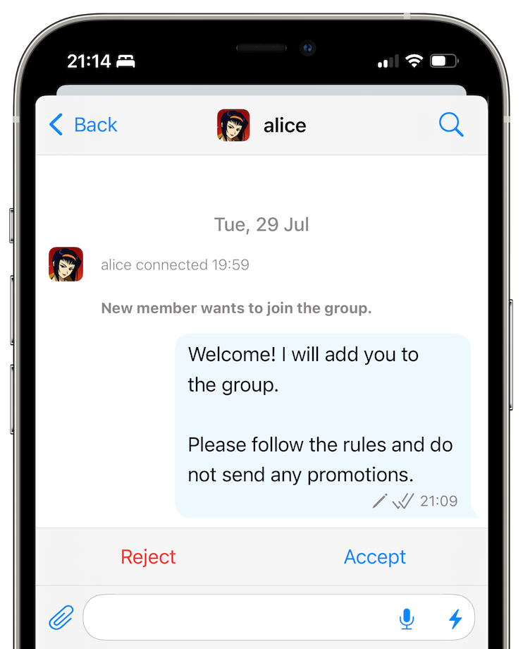
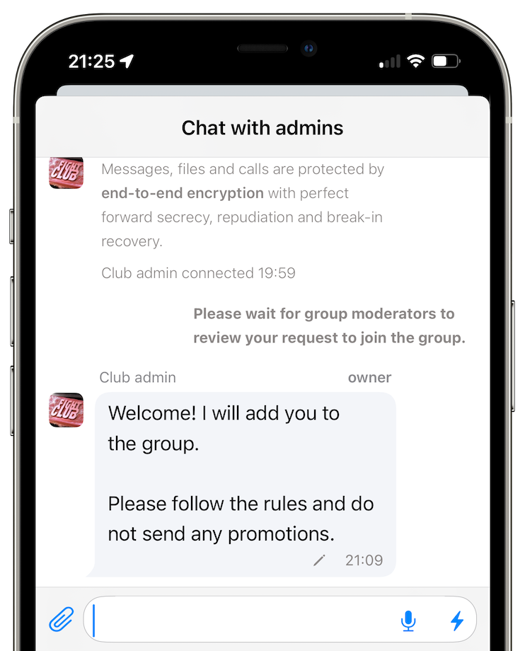

# SimpleX Chat v6.4.1: welcome your contacts, review members to protect groups, and more.

**Published:** Jul 29, 2025

**What's new in v6.4.1**:

- [welcome your contacts](#welcome-your-contacts-the-new-experience-of-making-connections): set your profile bio and welcome message.
- [protect your communities](#protect-your-groups) from spam and abuse:
  - review new members ("knocking"),
  - moderator role to delegate message moderation to trusted members,
  - receive direct feedback from your group members.
- [other improvements](#other-improvements): set default time to delete messages for new contacts.
- [improved app integrity](#improved-app-integrity).

Also, we added 3 new interface languages to Android and desktop apps: Indonesian, Romanian and Vietnamese.

Huge thanks to our users who [contributed translations](https://github.com/simplex-chat/simplex-chat#help-translating-simplex-chat).

## What's new in v6.4.1

### Welcome your contacts: the new experience of making connections

 

The new simple way to connect to your friends is fully available in this version.

We received many compliments from our users who started using it in beta versions and in v6.4 about how it simplifies connecting with friends. We agree - this is the biggest UX revolution since the app was released.

Instead of connecting blindly, and waiting until your contact is online, as it was before, you can now see profile and welcome message of the person you connect to, before you connect.

When you tap Open new chat you can decide which profile to use to connect or if you want to connect incognito, and in some cases you can include a message with your connection request.

This way, the conversation with your friends starts even before they connect to you!

For previously created SimpleX addresses and group links you have an option to upgrade. The links will become short, and will include profile information into link data. Old long links will continue to work, so you won't lose any contacts or members during the upgrade.

These links are now short enough to be shared in your social media profiles - they are less than 80 characters.

And as before, it is as secure - servers cannot see you profiles, unless they have the link, and cannot modify them even if they somehow get the link. You can read more about security property and other technical details in our [post about SimpleX protocols extension](./20250703-simplex-network-protocol-extension-for-securely-connecting-people.md) supporting this new user experience.

Thank you for bringing your friends to SimpleX network!

### Protect your groups

 

**Review new members**

Since v6.4 there are some major improvements in your ability to protect your group from spam and abuse.

You can enable an option to review all new group members. It is also commonly called "knocking". It allows you to:
- ask prospective members any questions,
- explain the group rules,
- make sure their profile is appropriate for the group,
- decide whether to allow them joining the group, and whether they should be able to send messages in the group.

Some small groups may enable member review permanently, while larger public groups may enable it temporarily during spam/troll attacks.

**New role for group moderators**

In addition to that, there is a new group role - moderator.

This role allows:
- to approve members in review,
- moderate messages,
- block members for all.

Unlike admins, moderators can't add new members or permanently remove members from the group. This allows you to delegate group moderation to your community members without risking that they may disrupt the group.

**Receive direct feedback from group members**

Your group members now can send messages to group admins. Each conversation with a group member is a mini-group where all group owners, admins and moderators can talk to a member. Reports that members can send [since v6.3](./20250308-simplex-chat-v6-3-new-user-experience-safety-in-public-groups.md) are also added to chat with member, allowing you to discuss the report.

### Other improvements

**Enable disappearing messages for new contacts**

Now you can enable disappearing messages for all new contacts automatically. Tap your profile image in the corner, then tap Chat preferences and set time for messages to disappear.

**Improved message delivery**

We improved networking layer by increasing request timeouts for all background requests. It substantially reduces traffic on slow networks.

### Improved app integrity

**Supply chain security**

The app security depends on security of its components and its build process, and many of these components are created by third parties. In this version we improved the build process to control the upgrades of these components:
- all 3rd party GitHub actions used during the build are now moved to [the forks we control](https://github.com/simplex-chat?q=action&type=fork&sort=name) - it prevents supply chain attacks via build actions.
- we now build VLC library for all platforms from the source code ourselves, in [this repository](https://github.com/simplex-chat/vlc).
- SQLCipher and [Haskell dependencies](https://github.com/simplex-chat/simplex-chat/blob/stable/docs/dependencies/HASKELL.md) versions were already "locked" prior to this version.

**Automatic virus scanning**

We now run automatic daily virus scanning of all apps released via GitHub using [VirusTotal.com](https://www.virustotal.com/).

You can see the scan results [here](https://github.com/simplex-chat/simplex-virutstotal-scan).

**Reproducible builds**

In addition to [server builds](https://github.com/simplex-chat/simplexmq/releases/tag/v6.4.1) that were reproducible since v6.3, the builds of Linux CLI and desktop apps are now reproducible too. You can build Linux apps from source using [this script](https://github.com/simplex-chat/simplex-chat/blob/master/scripts/simplex-chat-reproduce-builds.sh).

*Please note*: Linux package upgrades may change the build.

Stable builds of Linux apps are now independently reproduced and [signed by our and Flux teams](https://github.com/simplex-chat/simplex-chat/releases/tag/v6.4.1) - it verifies the integrity of GitHub builds.

Huge thanks to [Flux](https://runonflux.com/) for doing that and for providing their servers via the app.

## SimpleX network

Some links to answer the most common questions:

[How can SimpleX deliver messages without user identifiers](./20220511-simplex-chat-v2-images-files.md#the-first-messaging-platform-without-user-identifiers).

[What are the risks to have identifiers assigned to the users](./20220711-simplex-chat-v3-released-ios-notifications-audio-video-calls-database-export-import-protocol-improvements.md#why-having-users-identifiers-is-bad-for-the-users).

[Technical details and limitations](https://github.com/simplex-chat/simplex-chat#privacy-and-security-technical-details-and-limitations).

[Frequently asked questions](../docs/FAQ.md).

Please also see our [website](https://simplex.chat).

## Please support us with your donations

Huge *thank you* to everybody who donated to SimpleX Chat!

Prioritizing users privacy and security, and also raising the investment, would have been impossible without your support and donations.

Also, funding the work to transition the protocols to non-profit governance model would not have been possible without the donations we received from the users.

Our pledge to our users is that SimpleX protocols are and will remain open, and in public domain, so anybody can build the future implementations of the clients and the servers. We are building SimpleX platform based on the same principles as email and web, but much more private and secure.

Your donations help us raise more funds &mdash; any amount, even the price of the cup of coffee, makes a big difference for us.

See [this section](https://github.com/simplex-chat/simplex-chat/#please-support-us-with-your-donations) for the ways to donate.

Thank you,

Evgeny

SimpleX Chat founder
