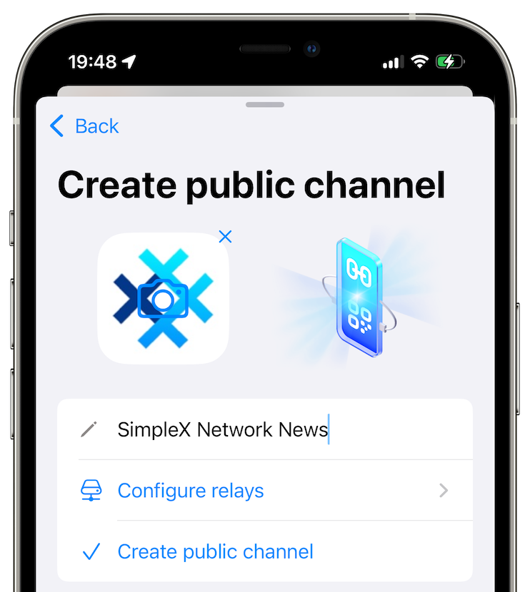

# SimpleX Channels, SimpleX Network Consortium and Community Crowdfunding &mdash; to Preserve Freedom of Speech

**Published:** Apr 30, 2026

Freedom of speech needs infrastructure that protects it by design &mdash; not only the protocols and servers, but the governance and funding to support them.

## SimpleX Channels &mdash; more public, more freedom, more private

v6.5 release[^release] brings SimpleX Channels: a new model for online publishing built for participation privacy.

Channel content is visible to chat relay operators. And each channel uses multiple relays, so no single relay can block the channel[^preset].

But the real identities of channel owners and subscribers are unknown to relay operators, to each other, and to the network. This is important for freedom of speech and for our ability to say the truth[^wilde].

This is the opposite of the usual approach: instead of trying (and failing [^public]) to hide publicly available content from operators while exposing participants, we designed the protocols to protect people. Anybody can join a public channel via its link and see what is sent, but not who sent it, and not who else is reading. This is win-win for both users and chat relays operators. Users' privacy is protected, operators can decide what content to deliver in public spaces, and anybody can run chat relays.

This is only possible because SimpleX network was built without user profile identifiers of any kind. You can't add participation privacy to a network that identifies its users &mdash; as you can't add privacy to a messenger built on phone numbers.

v6.5 is the first beta version of channels:
- channel owners hold their own channel keys,
- each channel uses multiple relays for reliability,
- publishers can run their own chat relays,
- channels can be added to our [SimpleX Directory](https://simplex.chat/directory/).

This release is a beginning of a very important new layer of SimpleX Network. Read more about channels in [whitepaper](https://github.com/simplex-chat/simplex-chat/blob/master/docs/protocol/channels-overview.md): their purpose, architecture, security model and planned future work.

## SimpleX Network Consortium &mdash; to preserve network independence

No single company should control protocols and network that people depend on to speak freely. If a network is run by a single company, the network has a risk that business and users interests diverge &mdash; if it happens, users lose.

To protect network neutrality and make sure its protocols and intellectual property are available to the users, we're launching [SimpleX Network Consortium](https://simplexnetwork.org) within a few months &mdash; the agreement between the new SimpleX Network Foundation and SimpleX Chat company that will govern protocols and licensing &mdash; perpetual, irrevocable, surviving if any party is sold or shut down. Other organizations will join.

We are currently forming the board for SimpleX Network Foundation &mdash; initially, [Heather Meeker](https://heathermeeker.com/about-me/), who drafted the Consortium agreement, and several other people will join. We will announce the board soon.

As the power over the network protocols moves away from the company, it cannot move back[^ulysses]. It is a structural guarantee &mdash; the same principle we applied to privacy.

## Community Crowdfunding

We've seen open-source privacy-focussed projects die without funding, or worse &mdash; being captured by their sponsors. We've seen "don't be evil" companies get lured off course by growth and board pressure. Neither pure ideology nor pure commerce survives the long run alone.

So we're building both: a governance structure and a real business. The governance protects the network neutrality. The commercial model funds the network and makes our and other businesses on the network profitable, ensuring their independence. Neither works without the other.

We recently published [a preliminary design of commercial model](https://simplex.chat/credits/) &mdash; private Community Credits that fund servers, development, and governance without surveillance or speculation. The full investment case will be published when crowdfunding launches.

You can *register your interest* to participate in crowdfunding here: https://simplexchat.typeform.com/crowdfunding

Join the channel for updates [here](https://smp10.simplex.im/c#q09nMBmWFGz1m2TvgfZFaEOG5D2a7Ma9mSkl6pHXEsg) &mdash; you must install v6.5 to join it &mdash; or you can join a [read-only group](https://smp12.simplex.im/g#gJzy7ETpuvltqARIB73TQUpJ11Lz4Xpl9xeH9qNoGCg) from the previous app versions.

_Disclaimer: SimpleX Chat is testing the waters for a possible Reg CF offering. We’re not asking for or accepting any money right now, and we won’t accept any if sent. We can’t accept any offers to buy securities or take any payments until the official filing is done and it’s live through a regulated platform. Our testing the waters and your possible indications of interest doesn’t create any obligation or commitment of any kind._

[^release]: v6.5 release also improved how new users make the first connection, increased security of sending web links, and has many other improvements &mdash; see *What's new* in the app or full release notes.

[^preset]: Currently there is only one preset operator of chat relays in the app. It will change in the next release.

[^wilde]: Oscar Wilde wrote: *"Man is least himself when he talks in his own person. Give him a mask, and he will tell you the truth"*. Privacy is essential for our ability to say the truth, and without truth we cannot survive as society.

[^public]: From whitepaper: any channel joinable via a public link, whether encrypted or not, must be considered completely public &mdash; the cost of joining through automated means has collapsed with large language models. End-to-end encrypting such content provides no privacy; it only undermines users' security by creating false expectations and increases infrastructure operators' risks by making them unable to see what they deliver.

[^ulysses]: Ulysses pact &mdash; adding constraints to reduce future options. Sé Reed used this analogy for the WordPress Foundation: tying the project to the mast before the siren songs of commercial capture (https://www.wpwatercooler.com/wpwatercooler/ep484-whose-wordpress-is-it-anyway/).
