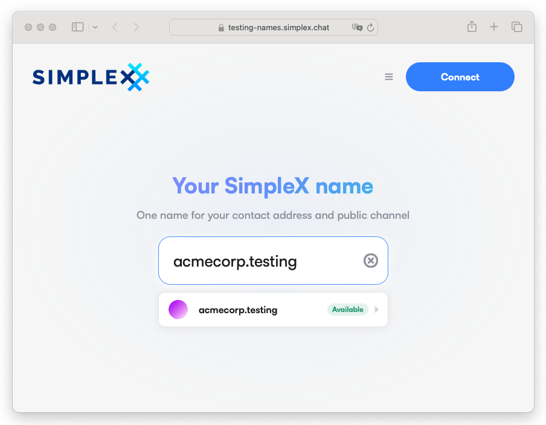
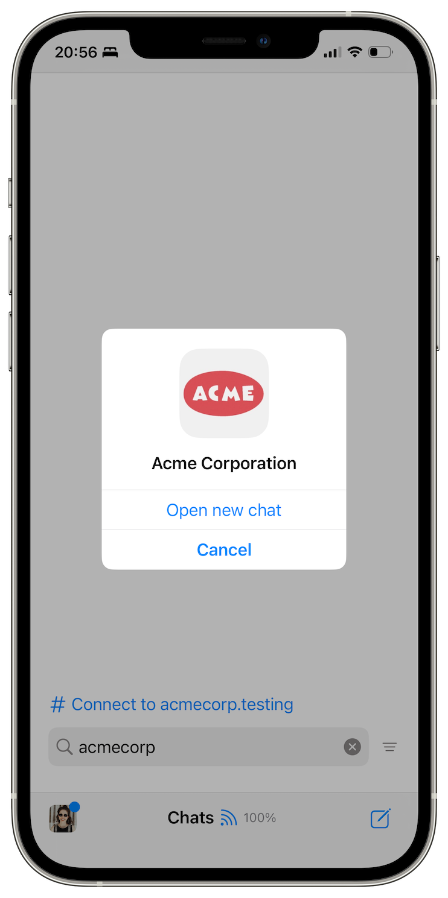

# SimpleX Public Names &mdash; a Name Nobody Can Take From You

**Published:** Jul 22, 2026

You can now give your channel or business a test SimpleX name that people can remember. Test names are free in v7-beta[^testing].

## Public names for channels and businesses &mdash; without user IDs

Before names, the only way to bring people to your channel or business on SimpleX Network was a link &mdash; but you cannot use a link in a podcast or a poster: nobody would remember it.

Every place where you could get a name so far belongs to someone else: Telegram can revoke your username, a registrar can suspend your domain.

So we designed SimpleX names for no one to own the registry &mdash; on the Ethereum blockchain. If you register `example.simplex`, people type `#example` to join your channel, or `@example.simplex` to message you. If a server operator deletes your link, you can point the name to a new one. Only you control the name with the key in your wallet[^ens].

And we did not add user identifiers to do it. Names are only for those who want to be found &mdash; channels, businesses, communities &mdash; and servers still cannot see who joined your channel or wrote to you.

We plan to launch `.simplex` names later this year, and to provide the first names to [crowdfunding investors](#community-crowdfunding) as perks.

## How to register a name

To register a test name you need an Ethereum wallet, such as MetaMask, and your SimpleX address or channel link from the app.

Setting up a name takes two steps. On the SimpleX Name Service [test webpage](https://testing-names.simplex.chat), search for the name you want &mdash; currently 6 characters or more &mdash; paste your address or channel link into the page, and complete the registration.

In the app, you need to claim the name for your channel or contact address &mdash; it prevents connecting to your channel or address via any other name. Open your SimpleX address or channel page, tap **Get SimpleX name**, enter the name, and tap Save.

See [this guide](../docs/guide/register-simplex-name.md) for more details.

## How to connect via names

Type the name into the search bar &mdash; `#example.testing` to join the channel, `@example.testing` to send direct messages. You can also send names in messages &mdash; they work as links.

Connecting via a name is private. Unlike most applications accessing the chain through a centralized RPC service, SimpleX Chat app resolves names via two independent servers of SimpleX Network, so that no server can see both the name and the user's IP address.

Read more about names in the [whitepaper](https://github.com/simplex-chat/simplex-chat/blob/master/docs/protocol/names-overview.md): their purpose, architecture, security model and planned future work.

## Community Crowdfunding

To ensure the long term success of SimpleX Network we established [SimpleX Network Consortium](https://simplexnetwork.org/consortium.html) &mdash; an agreement between a non-profit foundation created for protocol licensing and governance and SimpleX Chat, Inc.

The commercial model for the network that we are building aims to make both our and other businesses on the network profitable. We recently [presented the technology design](https://www.youtube.com/watch?v=UhW8AuoRgxg) for this commercial model at Web3 Summit.

The planned crowdfunding will fund this development. You can [register your interest](https://simplexchat.typeform.com/crowdfunding), and join the [SimpleX Crowdfunding News channel](https://smp10.simplex.im/c#q09nMBmWFGz1m2TvgfZFaEOG5D2a7Ma9mSkl6pHXEsg) for updates.

_Disclaimer: SimpleX Chat, Inc. is testing the waters for a possible Reg CF offering. We’re not asking for or accepting any money right now, and we won’t accept any if sent. We can’t accept any offers to buy securities or take any payments until the official filing is done and it’s live through a regulated platform. Our testing the waters and your possible indications of interest doesn’t create any obligation or commitment of any kind._

[^testing]: Test names are free to register; you only need to pay the blockchain fee. The `.testing` namespace is temporary &mdash; test names will stop working in the app one month after `.simplex` name sales launch.

[^ens]: SimpleX Name Service (SNS) is a fork of Ethereum Name Service (ENS), but without its centralized dependencies. ENS depends on an off-chain indexer and a hosted metadata service. SNS is fully decentralized &mdash; names are indexed and hosted on the blockchain. See [Differences from ENS](https://github.com/simplex-chat/simplex-chat/blob/master/docs/protocol/names-overview.md#differences-from-ens).
