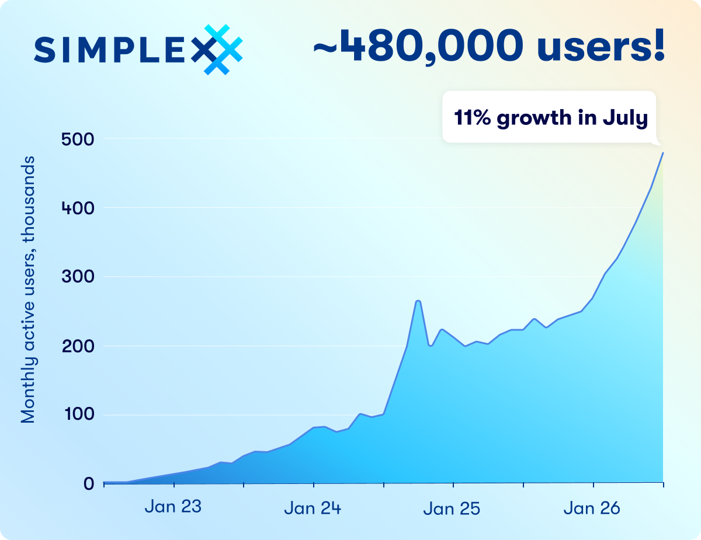
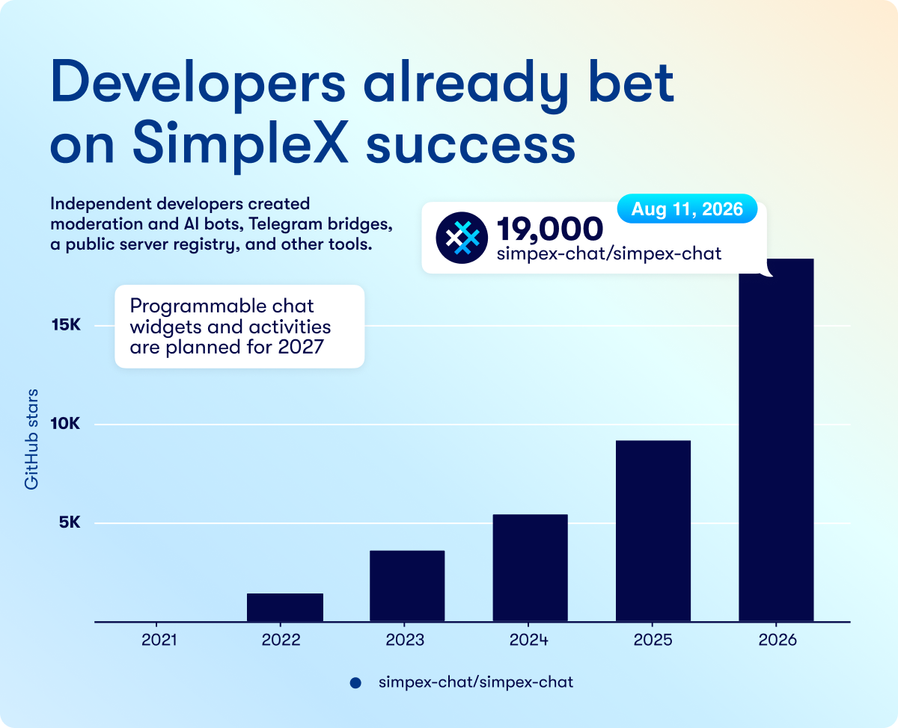
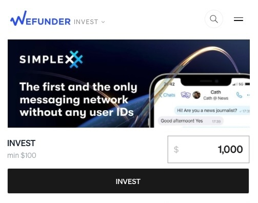

# Equity Crowdfunding Launched &mdash; You Can Get a Stake in SimpleX Chat

**Published:** Aug 20, 2026

SimpleX is the first and the only messaging network without user identifiers of any kind. Our equity crowdfunding round is now launched on Wefunder, so network users, and anybody else, can get a stake in SimpleX Chat.

## A network that cannot know who you are, or who you talk to

People found SimpleX without any paid marketing &mdash; the community spread it via hundreds of posts, videos, podcasts and talks.[^links] The app was downloaded more than 3 million times. About 480,000 people use it every month. Users, including Vitalik Buterin, donated $650,000. There are more than 1,000 community-run servers on the network. Trail of Bits audited it in 2022, 2024, and 2026 (to be published).

SimpleX Network assigns no identifiers to users &mdash; no phone numbers, usernames, or even random numbers. Instead, random identifiers are assigned to conversations, and only users know who they talk to. This cannot be added to a network that already has identifiers; it has to be built this way from the start, as SimpleX Network was.

All other messengers, even private ones, may hide your name but still tag you with some number or key. That identifier links your conversations together, and the pattern of who you talk to can reveal who you are, even without names, as a 2009 study showed.[^deanon]

## Why it matters now

There are three trends that increase the demand for identity-free messaging that no other existing network can provide.

**Surveillance of private life**. Big centralized platforms are increasingly scanning private messages to train AI models. More people would move to use private messaging that can't know who they talk to.

**Accelerating deplatforming**. Creators are removed from centralized platforms without due process, and an audience built over years can disappear with one policy change. Telegram alone blocked 44 million groups and channels in 2025.

**AI agents**. Agents are beginning to act for people, handling logins and money. Whoever controls an agent's identity can shut it down, or turn it against the person it works for. The same AI can fake a real person too.[^arup] User-controlled IDs are a basic security for the agentic Internet.

On SimpleX Network the users, not the network, control their identities, and it solves all three problems &mdash; users cannot be surveilled or deplatformed by the network, or attacked by somebody who they have no connection with.[^address] The only keys to user connections are held by the users themselves.

## SimpleX is not just a messenger &mdash; it's a network to build on

SimpleX is used for private messaging, but it also brings together communities, creators, businesses, developers and server operators. Each group makes the network more valuable to the others.

Most people want more from a messenger than to connect and send texts &mdash; they want to share experiences, and every messenger builds its own. That user experience is what prevents messaging apps from converging to one protocol, the way other networks did.[^network]

The web solved this by letting anyone build any experience on one open platform. SimpleX Network is evolving into that kind of platform, and developers already build on it: moderation and AI bots, bridges, and more, with over 19,000 stars on GitHub. Soon it will be possible to build custom interfaces inside a chat. Every service developers build on SimpleX makes the network more useful and brings new people in, without locking them into a single provider.

## Now you can get a stake

SimpleX Chat is the company that builds SimpleX Network, and now you can invest from $100 and get a stake in the company.

If you invest $500 or more, you receive [a public SimpleX name](./20260722-simplex-public-names.md) on SimpleX Network:
- for 7 years, if you invest by September 22,
- for 5 years for early bird investors,
- for 3 years after that.

You may benefit from the company's growth, and you would help build a network that people own &mdash; where the communities and audiences you build stay yours, and no company can take them away.

Read about how we plan to make SimpleX Chat and the network profitable, and about all the investment terms, on Wefunder: [https://wefunder.com/simplex.chat](https://wefunder.com/simplex.chat?utm_source=blog)

[^links]: https://simplex.chat/links/

[^deanon]: Narayanan & Shmatikov, *De-anonymizing Social Networks* (2009): a third of the users with accounts on both Twitter and Flickr were re-identified in the anonymised Twitter graph, from its structure alone, at a 12% error rate. Sources: [arXiv 0903.3276](https://arxiv.org/pdf/0903.3276), [Narayanan, 33 Bits of Entropy](https://33bits.wordpress.com/2009/03/19/de-anonymizing-social-networks/), [Princeton listing](https://collaborate.princeton.edu/en/publications/de-anonymizing-social-networks/).

[^arup]: In 2024, a video call of deepfakes cost Arup $25 million.

[^address]: SimpleX Network supports public addresses, for users who want to accept connections from anybody, e.g. for a business, but these addresses are opt-in. When users use only one-time connection links, nobody can connect to them.

[^network]: All networks converged to a single protocol, starting from railroads, and ending to a World Wide Web. A single unified network can create more value that several disconnected networks.
