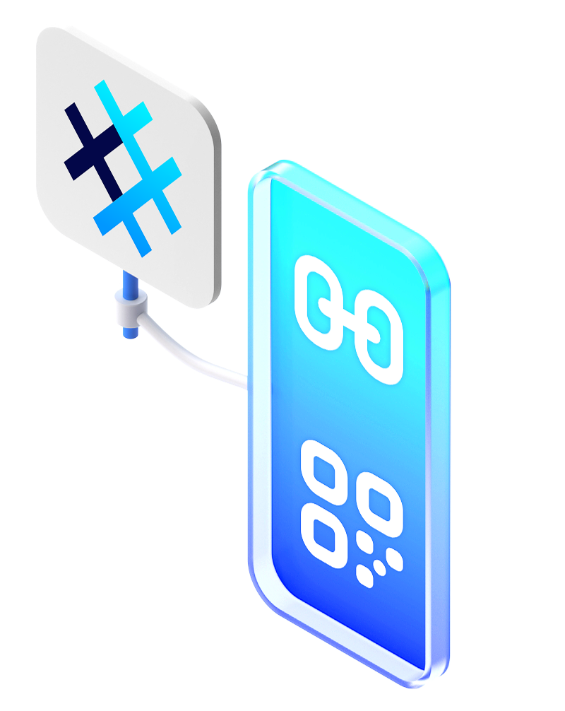
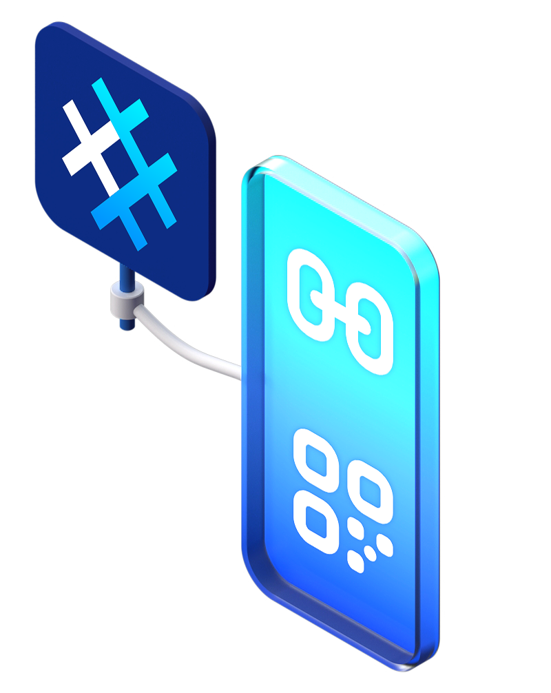
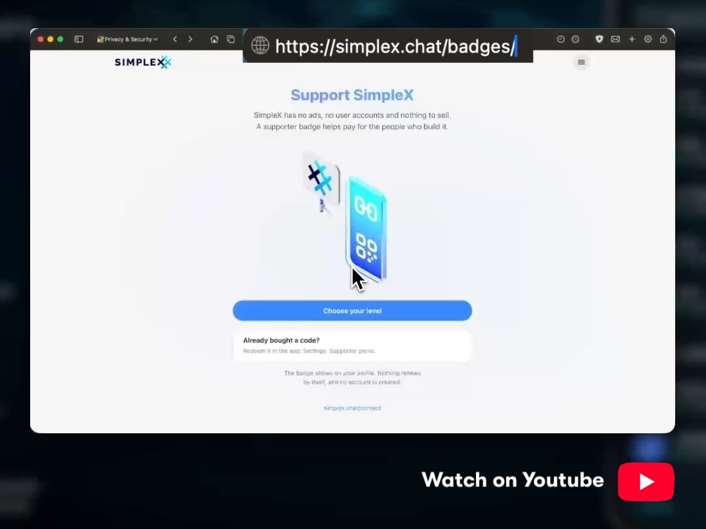

# SimpleX Supporter Badges &mdash; Send Larger Files That Stay Available Longer, Without Being Identified

**Published:** Sep 19, 2026

You can now support SimpleX Chat and get a supporter badge, larger files and longer file storage &mdash; from v7.1 beta[^beta]. Watch <a href="https://youtu.be/7D1tI5sQWFU" target="_blank">how to buy a badge</a>.

## A paid feature that cannot identify you

A supporter badge is shown on your profile to your contacts, group members and channel subscribers. With a badge you can send files up to 2GB, or 5GB with a legend badge, instead of 1GB, and servers keep your files for longer &mdash; 7 days with a supporter badge and 21 days with a legend badge.

A badge is a credential stored in your profile on your device. The credential itself is not sent to anyone: to show the badge to a contact or to present it to a server, the app generates a new zero-knowledge proof that reveals only the badge type and the expiry date, and no two proofs can be linked to each other or to the purchase, by the badge service, your contacts or servers. Credentials are issued for one month at a time, and all badges expire on the same day of the week, so a badge places you among all supporters of that week and nothing more.

This is only possible because the network has no user identifiers &mdash; in other messengers a paid feature is attached to the account, so the operator knows who paid and what they do with the feature.

Read more about badges in the [whitepaper](https://github.com/simplex-chat/simplex-chat/blob/master/docs/protocol/badges-overview.md): what they grant, how they are issued and presented, and their privacy and security model.

## How to get a badge

Buy a code on [simplex.chat/badges](https://simplex.chat/badges/), paying by card, Bitcoin or Monero, and redeem it in the app: open Settings, tap **Supporter perks**, and enter the code. The badge appears on your profile. The badge does not renew by itself, and no account is created.

The v7.1 release will add purchases in the app: via the app store, or by card or cryptocurrency if you downloaded the app from GitHub or F-Droid.

## What badges will do next

The same mechanism will be used for other resources that cost the network more than the default. Two uses are coming:

- **Backups.** A backup will be a link whose content the app updates in place, so the same link restores the latest state. A badge will extend how long the backup is kept on the servers &mdash; that is, how long the app can stay offline before the backup is lost.
- **Better limits on servers.** Servers that verify the badge will apply higher rate limits for creating messaging queues, uploading file chunks, and registering notification tokens.

## Community Crowdfunding

Investors in our [equity crowdfunding on Wefunder](https://wefunder.com/simplex.chat?utm_source=blog) receive badges as perks:

| Investment | Badge |
|---|---|
| $100 | supporter, 1 month |
| $250 | supporter, 3 months |
| $1,000 | supporter, 12 months, or legend, 1 month |
| $2,500 | supporter, 12 months, or legend, 3 months |
| $10,000 | legend, 12 months |

If you invest $500 or more by September 22, you will also receive [a public SimpleX name](https://simplex.domains?utm_source=blog) for 7 years[^name].

Learn more and invest on Wefunder: [https://wefunder.com/simplex.chat](https://wefunder.com/simplex.chat?utm_source=blog)

[^name]: After September 22, investors of $500 or more receive a name for 5 years as early bird investors, and for 3 years after that &mdash; ahead of the public launch of names on December 12.

[^beta]: v7.1 beta is available via [Play Store](https://play.google.com/store/apps/details?id=chat.simplex.app) (Android beta), [TestFlight](https://testflight.apple.com/join/DWuT2LQu) (iOS), our [F-Droid repo](https://simplex.chat/fdroid/) and [GitHub](https://github.com/simplex-chat/simplex-chat/releases) (Android and desktop).
