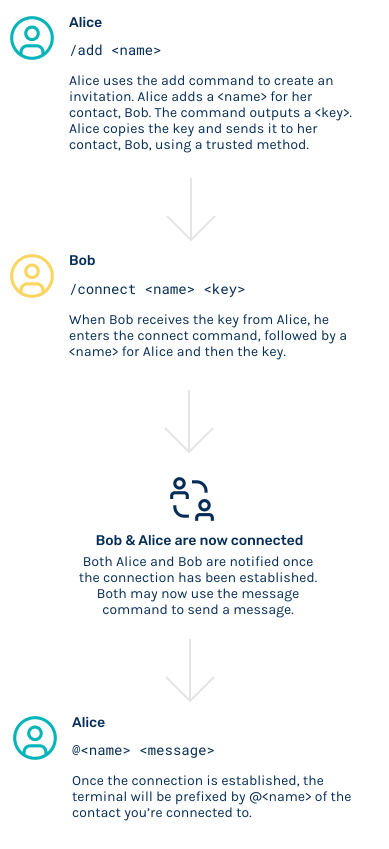
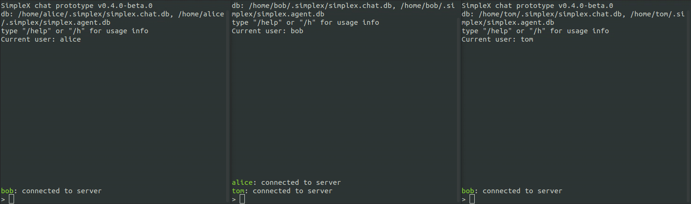
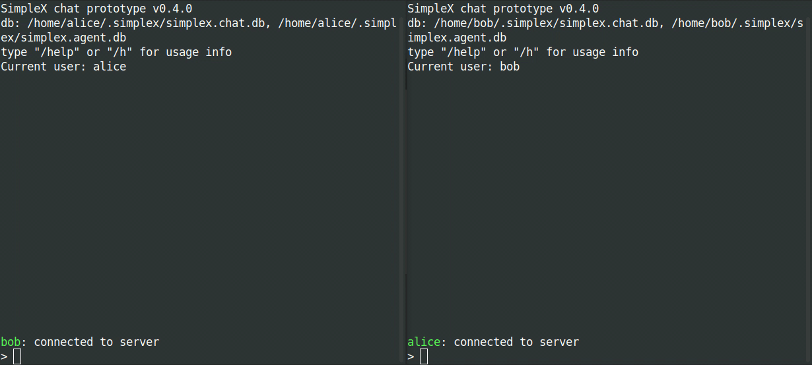

| Updated 31.01.2023 | Languages: EN, [FR](/docs/lang/fr/CLI.md), [CZ](/docs/lang/cs/CLI.md) |

# SimpleX Chat terminal (console) app for Linux/MacOS/Windows

## Table of contents

- [Terminal chat features](#terminal-chat-features)
- [Installation](#🚀-installation)
  - [Download chat client](#download-chat-client)
    - [Linux and MacOS](#linux-and-macos)
    - [Windows](#windows)
  - [Build from source](#build-from-source)
    - [Using Docker](#using-docker)
    - [Using Haskell in any OS](#in-any-os)
- [Usage](#usage)
  - [Running the chat client](#running-the-chat-client)
  - [Access messaging servers via Tor](#access-messaging-servers-via-tor-beta)
  - [How to use SimpleX chat](#how-to-use-simplex-chat)
  - [Groups](#groups)
  - [Sending files](#sending-files)
  - [User contact addresses](#user-contact-addresses)
  - [Access chat history](#access-chat-history)

## Terminal chat features

- 1-to-1 chat with multiple people in the same terminal window.
- Group messaging.
- Sending files to contacts and groups.
- User contact addresses - establish connections via multiple-use contact links.
- Messages persisted in a local SQLite database.
- Auto-populated recipient name - just type your messages to reply to the sender once the connection is established.
- Demo SMP servers available and pre-configured in the app - or you can [deploy your own server](https://github.com/simplex-chat/simplexmq#using-smp-server-and-smp-agent).
- No global identity or any names visible to the server(s), ensuring full privacy of your contacts and conversations.
- Two layers of E2E encryption (double-ratchet for duplex connections, using X3DH key agreement with ephemeral Curve448 keys, and NaCl crypto_box for SMP queues, using Curve25519 keys) and out-of-band passing of recipient keys (see [How to use SimpleX chat](#how-to-use-simplex-chat)).
- Message integrity validation (via including the digests of the previous messages).
- Authentication of each command/message by SMP servers with automatically generated Ed448 keys.
- TLS 1.3 transport encryption.
- Additional encryption of messages from SMP server to recipient to reduce traffic correlation.

Public keys involved in key exchange are not used as identity, they are randomly generated for each contact.

See [Encryption Primitives Used](https://github.com/simplex-chat/simplexmq/blob/master/protocol/overview-tjr.md#encryption-primitives-used) for technical details.

<a name="🚀-installation"></a>

## 🚀 Installation

### Download chat client

#### Linux and MacOS

To **install** or **update** `simplex-chat`, you should run the install script. To do that, use the following cURL or Wget command:

```sh
curl -o- https://raw.githubusercontent.com/simplex-chat/simplex-chat/stable/install.sh | bash
```

```sh
wget -qO- https://raw.githubusercontent.com/simplex-chat/simplex-chat/stable/install.sh | bash
```

Once the chat client downloads, you can run it with `simplex-chat` command in your terminal.

Alternatively, you can manually download the chat binary for your system from the [latest stable release](https://github.com/simplex-chat/simplex-chat/releases) and make it executable as shown below.

```sh
chmod +x <binary>
mv <binary> ~/.local/bin/simplex-chat
```

(or any other preferred location on `PATH`).

On MacOS you also need to [allow Gatekeeper to run it](https://support.apple.com/en-us/HT202491).

#### Windows

```sh
move <binary> %APPDATA%/local/bin/simplex-chat.exe
```

### Build from source

> **Please note:** to build the app use source code from [stable branch](https://github.com/simplex-chat/simplex-chat/tree/stable).

#### Using Docker

On Linux, you can build the chat executable using [docker build with custom output](https://docs.docker.com/engine/reference/commandline/build/#custom-build-outputs):

```shell
git clone git@github.com:simplex-chat/simplex-chat.git
cd simplex-chat
git checkout stable
DOCKER_BUILDKIT=1 docker build --output ~/.local/bin .
```

> **Please note:** If you encounter `` version `GLIBC_2.28' not found `` error, rebuild it with `haskell:8.10.7-stretch` base image (change it in your local [Dockerfile](Dockerfile)).

#### In any OS

1. Install [Haskell GHCup](https://www.haskell.org/ghcup/), GHC 9.6.3 and cabal 3.10.1.0:

```shell
curl --proto '=https' --tlsv1.2 -sSf https://get-ghcup.haskell.org | sh
```

You can use `ghcup tui` to check or add GHC and cabal versions.

2. Clone the source code:

```shell
git clone git@github.com:simplex-chat/simplex-chat.git
cd simplex-chat
git checkout stable
# or to build a specific version:
# git checkout v5.3.0-beta.8
```

`master` is a development branch, it may containt unstable code.

3. Prepare the system:

On Linux:

```shell
apt-get update && apt-get install -y build-essential libgmp3-dev zlib1g-dev
cp scripts/cabal.project.local.linux cabal.project.local
```

On Mac:

```
brew install openssl@1.1
cp scripts/cabal.project.local.mac cabal.project.local
```

You may need to amend cabal.project.local to point to the actual openssl location.

4. Build the app:

```shell
cabal update
cabal install simplex-chat
```

## Usage

### Running the chat client

To start the chat client, run `simplex-chat` from the terminal.

By default, app data directory is created in the home directory (`~/.simplex`, or `%APPDATA%/simplex` on Windows), and two SQLite database files `simplex_v1_chat.db` and `simplex_v1_agent.db` are initialized in it.

To specify a different file path prefix for the database files use `-d` command line option:

```shell
$ simplex-chat -d alice
```

Running above, for example, would create `alice_v1_chat.db` and `alice_v1_agent.db` database files in current directory.

Three default SMP servers are hosted on Linode - they are [pre-configured in the app](https://github.com/simplex-chat/simplex-chat/blob/stable/src/Simplex/Chat/Options.hs#L42).

If you deployed your own SMP server(s) you can configure client via `-s` option:

```shell
$ simplex-chat -s smp://LcJUMfVhwD8yxjAiSaDzzGF3-kLG4Uh0Fl_ZIjrRwjI=@smp.example.com
```

Base64url encoded string preceding the server address is the server's offline certificate fingerprint which is validated by client during TLS handshake.

You can still talk to people using default or any other server - it only affects the location of the message queue when you initiate the connection (and the reply queue can be on another server, as set by the other party's client).

Run `simplex-chat -h` to see all available options.

### Access messaging servers via Tor

Install Tor and run it as SOCKS5 proxy on port 9050, e.g. on Mac you can:

```
brew install tor
brew services start tor
```

Use `-x` option to access servers via Tor:

```
simplex-chat -x
```

You can also use option `--socks-proxy=ipv4:port` or `--socks-proxy=:port` to configure host and port of your SOCKS5 proxy, e.g. if you are running it on some other host or port.

### How to use SimpleX chat

Once you have started the chat, you will be prompted to specify your "display name" and an optional "full name" to create a local chat profile. Your display name is an alias for your contacts to refer to you by - it is not unique and does not serve as a global identity. If some of your contacts chose the same display name, the chat client adds a numeric suffix to their local display name.

The diagram below shows how to connect and message a contact:

<div align="center">
  
</div>

Once you've set up your local profile, enter `/c` (for `/connect`) to create a new connection and generate an invitation. Send this invitation to your contact via any other channel.

You are able to create multiple invitations by entering `/connect` multiple times and sending these invitations to the corresponding contacts you'd like to connect with.

The invitation can only be used once and even if this is intercepted, the attacker would not be able to use it to send you the messages via this queue once your contact confirms that the connection is established. See agent protocol for explanation of [invitation format](https://github.com/simplex-chat/simplexmq/blob/master/protocol/agent-protocol.md#connection-request).

The contact who received the invitation should enter `/c <invitation>` to accept the connection. This establishes the connection, and both parties are notified.

They would then use `@<name> <message>` commands to send messages. You may also just start typing a message to send it to the contact that was the last.

Use `/help` in chat to see the list of available commands.

### Groups

To create a group use `/g <group>`, then add contacts to it with `/a <group> <name>`. You can then send messages to the group by entering `#<group> <message>`. Use `/help groups` for other commands.



> **Please note**: the groups are not stored on any server, they are maintained as a list of members in the app database to whom the messages will be sent.

### Sending files

You can send a file to your contact with `/f @<contact> <file_path>` - the recipient will have to accept it before it is sent. Use `/help files` for other commands.



You can send files to a group with `/f #<group> <file_path>`.

### User contact addresses

As an alternative to one-time invitation links, you can create a long-term address with `/ad` (for `/address`). The created address can then be shared via any channel, and used by other users as a link to make a contact request with `/c <user_contact_address>`.

You can accept or reject incoming requests with `/ac <name>` and `/rc <name>` commands.

User address is "long-term" in a sense that it is a multiple-use connection link - it can be used until it is deleted by the user, in which case all established connections would still remain active (unlike how it works with email, when changing the address results in people not being able to message you).

Use `/help address` for other commands.


