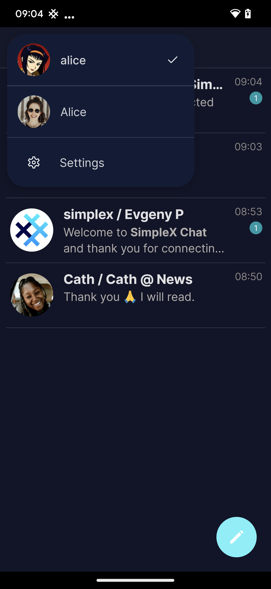
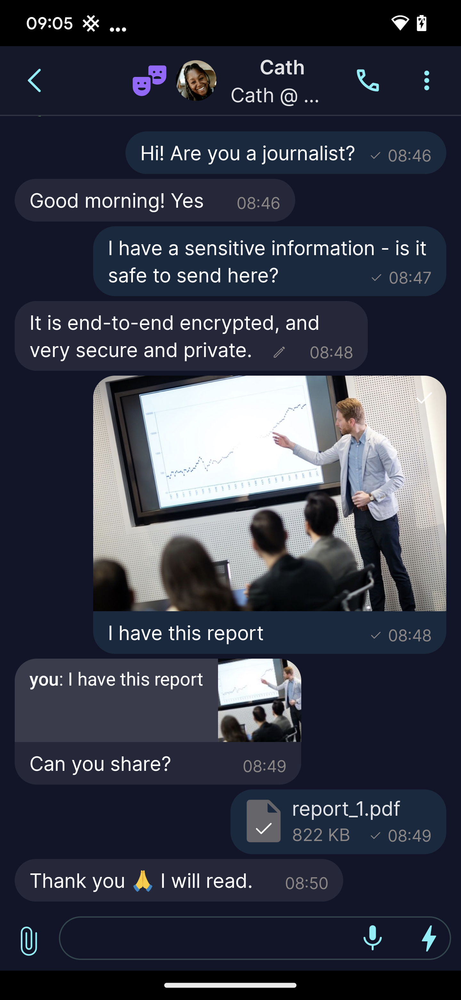
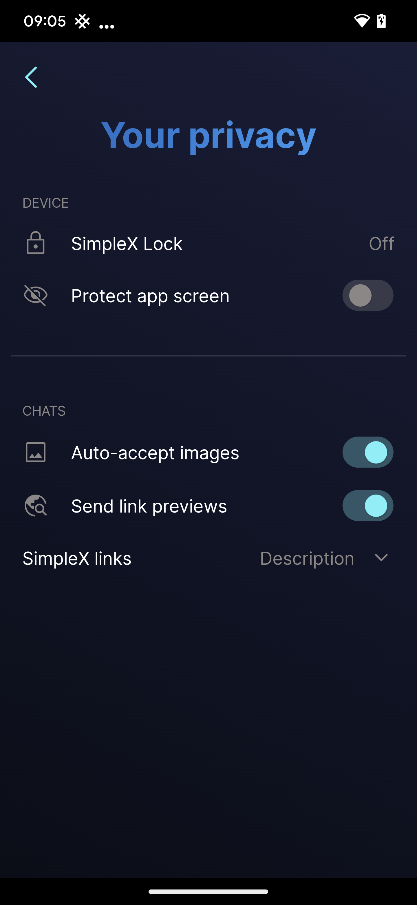

# App color themes

Mobile apps allow to configure, export and import color themes. Currently this is only supported in Android app.

You can contribute your themes to the repository by creating a pull request.

## How to contribute a theme

1. Once you have configured your theme in the app, export it to a file and give it a descriptive name – e.g., `example.theme`

2. Export your app database, and import a [sample chat database](./themes/simplex-chat.sample.zip) - the passphrase is `passphrase`.

3. Make three screenshots - the list of conversations with opened profile picker, conversation and privacy settings.

4. Create PR that includes these files and amends this THEMES.md file, following the example below.

5. Restore your database from the backup.

## Color themes

### SimpleX - included dark blue theme

Download [SimpleX theme](./themes/example.theme)

 &nbsp;&nbsp;  &nbsp;&nbsp;  &nbsp;&nbsp;
