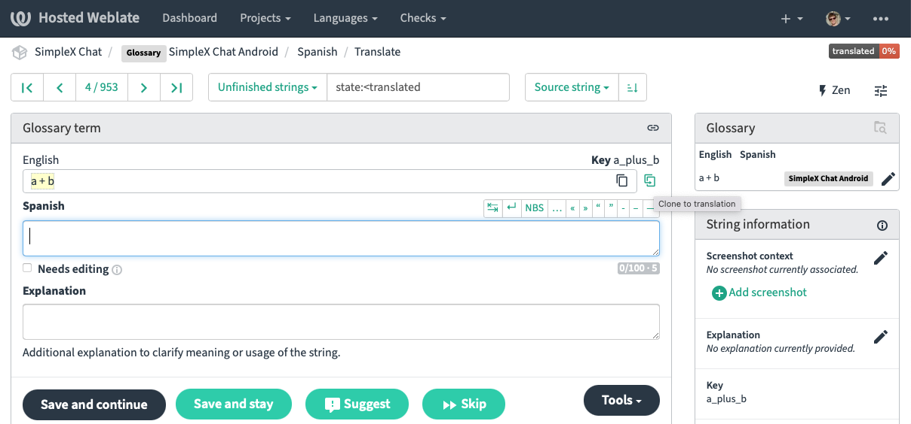

| 19.03.2023 | EN, [CZ](/docs/lang/cs/TRANSLATIONS.md), [FR](/docs/lang/fr/TRANSLATIONS.md), [PL](/docs/lang/pl/TRANSLATIONS.md) |

# Contributing translations to SimpleX Chat

Huge thanks for your interest in translating SimpleX Chat - it helps a lot to make it accessible to a wider range of users, and we really appreciate your help.

It requires a substantial time investment - most people underestimate it initially - and ongoing maintenance as we develop the application.

This document is created to speed up this process, and share some important "gotchas" we've discovered while working with Weblate - the platform we use for interface translations.

## Before you start translation

1. Create an account in Weblate, using the same email that you use in GitHub - it will make your contributions associated with your GitHub account, and might help you in some cases. Once translation is released to the users we will add your account name to the [list of translators](https://github.com/simplex-chat/simplex-chat#translate-the-apps), unless you ask us not to do it.

2. Before you start the translation there is a simple contributor license agreement to sign via Weblate - this is to avoid any conflicts around IP rights. The copy of this agreement is also [available here](https://github.com/simplex-chat/cla/blob/master/CLA.md).

3. We can also add you to the group of translators for any questions and updates - please connect to the developers via chat (when you just install the app or later, via "Send questions and ideas" in the app settings).

## Translation process

It's easier to translate Android app first, and then iOS app, as Android app strings are set up as a glossary for iOS.

The steps are:

1. [You translate Android app](#translating-android-app) in Weblate.
2. [We review and release Android app translations](#releasing-android-app-translations).
3. You review translations in the app and correct any mistakes.
4. [You translate iOS app in Weblate](#translating-ios-app)
5. We review and release iOS app translations.

### Translating Android app

1. Please start from [Android app](https://hosted.weblate.org/projects/simplex-chat/android/), both when you do the most time-consuming initial translation, and add any strings later. Firstly, iOS strings can be a bit delayed from appearing in Weblate, as it requires a manual step from us before they are visible. Secondary, Android app is set up as a glossary for iOS app, and 2/3 of all strings require just to clicks to transfer them from Android to iOS (it still takes some time, Weblate doesn't automate it, unfortunately).

2. Some of the strings do not need translations, but they still need to be copied over - there is a button in weblate UI for that:

3. Weblate also has automatic suggestions that can speed up the process. Sometimes they can be used as is, sometimes they need some editing - click to use them in translations.

4. Also, please note the string Key (it's on the right of the screen) - it may give you a hint about what this string means when unclear. E.g., the key for "Additional accent" (not clear) is "color_primary_variant" (a bit more clear that it refers to a color used in the app).

5. Once all strings in Android app are translated, please review it to ensure consistent style and language, so that the same words are consistently used for similar user actions, same as in English. Sometimes, you will have to use different words in cases when English has just one, please try to use these choices consistently in similar contexts, to make it easier for the end users.

Please also review reverse translations using Chrome browser and *Translate to English* feature in the _Browse_ mode of weblate - this is what we will be reviewing before translations are released. Fix any mistakes, and please add comments in cases when a sufficiently different translations are justified - it will make review much faster.

### Releasing Android app translations

Once Android app is translated, please let us know.

We will then:
  - review all the translations and suggest any corrections - it also takes a bit of time :)
  - merge them to the source code - while we do it weblate will be locked for changes.
  - create beta releases of both iOS and Android apps - we can also add you to the internal tester groups, so you can install the apps before anybody else.
  - release it to our beta users - it's more than a thousand people who use our beta versions.
  - release the app and include the new language in the announcement.

### Translating iOS app

1. When you translate [iOS app](https://hosted.weblate.org/projects/simplex-chat/ios/), a large part of the strings are exactly the same - they can be copied over in one click in glossary section. The visual hint that it can be done is that the whole source string is highlighted in yellow. Many other strings are very similar, they only differ in interpolation syntax or how bold font is used - they require minimal editing. There are some strings that are unique to iOS platform - they need to be translated separately

2. Please review iOS translations in the same way as Android and let us know when it's ready for review - we will repeat the same process for iOS app.

Thanks a lot! This is a huge effort and a huge help for SimpleX Network to grow.

## Common translation mistakes

1. The word "chat" is used in several meanings, depending on the context. It can mean either "SimpleX Chat app" (e.g. in Start/stop chat) or "a single conversation". Please ask when it is not clear, and we will be adding more translation notes.

2. Please use plural and singular as in the original strings, this may change the meaning otherwise. E.g., some settings apply to all contacts, and some to just one contact, it will be confusing if you use plural in both cases.

3. The app uses "Passcode" to provide access, not "password" - in many languages it is translated as "access code". The database uses "Passphrase" - in many languages it is translated as "Password". Please use these words consistently.

4. Member "role". This word refers to the set of permissions the user has, it can be "owner", "admin", "member" or "observer" (the lowest permission that only allows to read messages and add message reactions). Translating it as "identity" or as "function" may be incorrect.

5. "Moderate" / "moderated". These words means "to delete message of another member" and "deleted by admin" respectively. This feature is used when a member sends the message that is not appropriate for the group. Many languages have similar words.

## How we review the translations

To validate the correctness of the translations we review reverse translations by browsing Weblate pages in Google Chrome browser in "Translate to English" mode. E.g., to review the German translations of Android interface somebody from our team scrolled through [these 68 pages](https://hosted.weblate.org/browse/simplex-chat/android/de/).

We are not looking for reverse translation being exactly the same as the original, it is rarely the case, only that it is generally correct.

You would make the review much easier if you could review it in advance in the same way, and comment on any cases where reverse translations are completely different (there may be valid cases for that).

## What is next

1. As we update the app, we post the updates in the group of translators. You are absolutely under no obligation to translate these additional strings. We hugely appreciate if you do though, as it makes the users experience so much better when they depend on your translations, than if some new part of the app is not translated.

2. You can further help SimpleX adoption in your country / language group by translating [our website](https://simplex.chat) (also [via weblate](https://hosted.weblate.org/projects/simplex-chat/website/)) and/or [GitHub documents](https://github.com/simplex-chat/simplex-chat/tree/master/docs/lang) (this is only possible via git)!

3. Also, if you want to be a moderator/admin of the users group in your language, once the app is translated we can host such group - we are preparing community guidelines and adding some moderation tools to the app to be released in v4.6 in March.

Thank you very much again for helping us grow SimpleX Chat!

Evgeny, SimpleX Chat founder.
