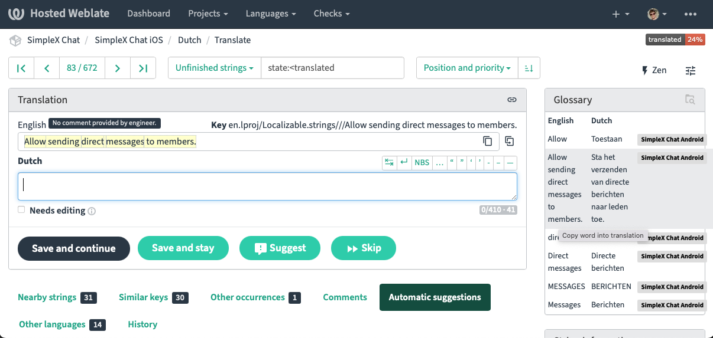

| Updated 26.02.2023 | Languages: EN, [CZ](/docs/lang/cs/TRANSLATIONS.md) |

# Contributing translations to SimpleX Chat

Huge thanks for your interest in translating SimpleX Chat - it helps a lot to make it accessible to a wider range of users, and we really appreciate your help.

It requires a substantial time investment - most people underestimate it initially - and ongoing maintenance as we develop the application.

This document is created to speed up this process, and share some important "gotchas" we've discovered while working with Weblate - the platform we use for interface translations.

## Before you start translation

1. Create an account in Weblate, using the same email that you use in GitHub - it will make your contributions associated with your GitHub account, and might help you in some cases. Once translation is released to the users we will add your account name to the [list of translators](https://github.com/simplex-chat/simplex-chat#translate-the-apps).

2. Before you start the translation there is a simple contributor agreement to sign via Weblate - this is to avoid any conflicts around IP rights.

3. We can also add you to the group of translators for any questions and updates - please connect to me via chat.

## Translation progress

1. Please start from [Android app](https://hosted.weblate.org/projects/simplex-chat/android/), both when you do the most time-consuming initial translation, and add any strings later. Firstly, iOS strings can be a bit delayed from appearing in Weblate, as it requires a manual step from us before they are visible. Secondary, Android app is set up as a glossary for iOS app, and 2/3 of all strings require just to clicks to transfer them from Android to iOS (it still takes some time, Weblate doesn't automate it, unfortunately).

2. Some of the strings do not need translations, but they still need to be copied over - there is a button in weblate UI for that:

3. Weblate also has automatic suggestions that can speed up the process. Sometimes they can be used as is, sometimes they need some editing - click to use them in translations.

4. Once all strings in Android app are translated, please review it to ensure consistent style and language, so that the same words are consistently used for similar user actions, same as in English. Sometimes, you will have to use different words in cases when English has just one, please try to use these choices consistently in similar contexts, to make it easier for the end users.

5. When you translate [iOS app](https://hosted.weblate.org/projects/simplex-chat/ios/), a large part of the strings are exactly the same - they can be copied over in one click in glossary section. The visual hint that it can be done is that the whole source string is highlighted in yellow. Many other strings are very similar, they only differ in interpolation syntax or how bold font is used - they require minimal editing. There are some strings that are unique to iOS platform - they need to be translated separately.

## Once translation is completed

Once both Android and iOS apps are translated, please let us know.

We will then:
  - review all the translations and suggest any corrections - it also takes a bit of time :)
  - merge them to the source code - while we do it weblate will be locked for changes.
  - create beta releases of both iOS and Android apps - we can also add you to the internal tester groups, so you can install the apps before anybody else.
  - release it to our beta users - it's more than a thousand people who use our beta versions.
  - release the app and include the new language in the announcement.

*Please note*: we aim to keep app functions consistent between Android and iOS platforms, when possible, so we will release and announce a new language once both platforms have been translated. It doesn't mean you have to do it, but we will have to wait until somebody else translates the second platform. But if you start from Android, iOS usually takes 3-4x less time to add.

## What is next

1. As we update the app, we post the updates in the group of translators. You are absolutely under no obligation to translate these additional strings. We hugely appreciate if you do though, as it makes the users experience so much better when they depend on your translations, than if some new part of the app is not translated.

2. You can also help adoption in your country / language group by translating our documents - we have just started it - and also our website content. There have been many requests to do it and we are currently adding the translation framework for the website.

3. Also, if you want to be a moderator/admin of the users group in your language, once the app is translated we can host such group - we are preparing community guidelines and adding some moderation tools to the app to be released in v5 in March.

Thank you very much again for helping us grow SimpleX Chat!

Evgeny, SimpleX Chat founder.
