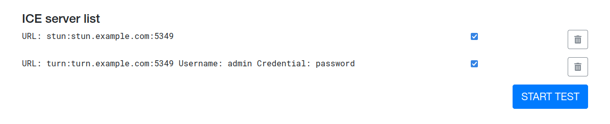
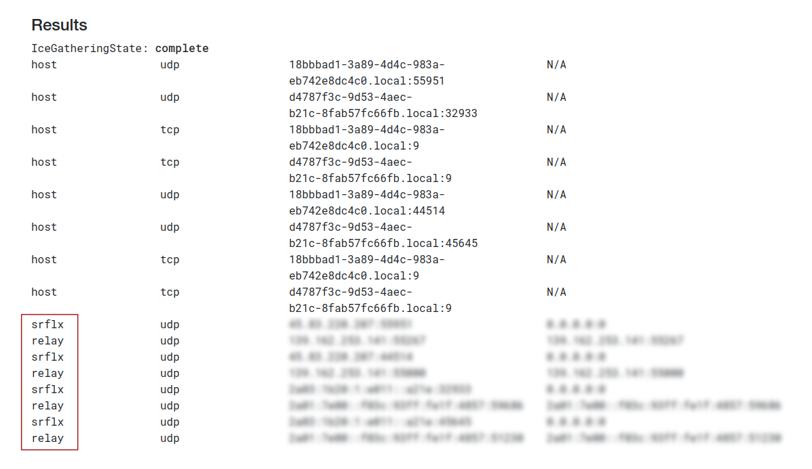

| Updated 31.01.2023 | Languages: EN, [FR](/docs/lang/fr/WEBRTC.md), [CZ](/docs/lang/cs/WEBRTC.md), [PL](/docs/lang/pl/WEBRTC.md) |

# Using custom WebRTC ICE servers in SimpleX Chat

## Deploy STUN/TURN server

For this guide, we'll be using the most featureful and battle-tested STUN/TURN server implementation – [`coturn`](https://github.com/coturn/coturn) and [`Ubuntu 20.04 LTS`](https://ubuntu.com/download/server) Linux distribution.

0. Obtain `stun.$YOUR_DOMAIN` and `turn.$YOUR_DOMAIN` certificates.

   We're using [Let's Encrypt](https://letsencrypt.org/getting-started/).

1. Install `coturn` package from the main repository.

```sh
apt update && apt install coturn`
```

2. Uncomment `TURNSERVER_ENABLED=1` from `/etc/default/coturn`:

```sh
sed -i '/TURN/s/^#//g' /etc/default/coturn
```

3. Configure `coturn` in `/etc/turnserver.conf`:

   Also, please see comments for each individual option.

```sh
# Also listen to 443 port for tls
alt-tls-listening-port=443
# Use fingerprints in the TURN messages
fingerprint
# Use long-term credentials mechanism
lt-cred-mech
# Your credentials
user=$YOUR_LOGIN:$YOUR_PASSWORD
# Your server domain
server-name=$YOUR_DOMAIN
# The default realm to be used for the users when no explicit origin/realm relationship was found
realm=$YOUR_DOMAIN
# Path to your certificates. Make sure they're readable by cotun process user/group
cert=/var/lib/turn/cert.pem
pkey=/var/lib/turn/key.pem
# Use 2066 bits predefined DH TLS key
dh2066
# Log to journalctl
syslog
# User/group which will be running coturn service
proc-user=turnserver
proc-group=turnserver
# Disable weak encryption
no-tlsv1
no-tlsv1_1
no-tlsv1_2
```

4. Start and enable `coturn` service:

```sh
systemctl enable coturn && systemctl start coturn
```

5. Optionally, if using `ufw` firewall, open relevant ports:

- **3478** – "plain" TURN/STUN;
- **5349** – TURN/STUN over TLS;
- **443** – TURN/STUN over TLS, which can bypass firewalls;
- **49152:65535** – port range that Coturn will use by default for TURN relay.

```sh
# For Ubuntu
sudo ufw allow 3478 && \
sudo ufw allow 443 && \
sudo ufw allow 5349 && \
sudo ufw allow 49152:65535/tcp && \
sudo ufw allow 49152:65535/udp

# For Fedora
sudo firewall-cmd --permanent --add-port=443/tcp && \
sudo firewall-cmd --permanent --add-port=443/udp && \
sudo firewall-cmd --permanent --add-port=5349/tcp && \
sudo firewall-cmd --permanent --add-port=5349/udp && \
sudo firewall-cmd --permanent --add-port=49152:65535/tcp && \
sudo firewall-cmd --permanent --add-port=49152:65535/udp && \
sudo firewall-cmd --reload
```

## Configure mobile apps

To configure your mobile app to use your server:

1. Open `Settings / Network & Servers / WebRTC ICE servers` and switch toggle `Configure ICE servers`.

2. Enter all server addresses in the field, one per line, for example if you servers are on the port 5349:

```
stun:stun.example.com:5349
turn:username:password@turn.example.com:5349
```

This is it - you now can make audio and video calls via your own server, without sharing any data with our servers (other than the key exchange with your contact in E2E encrypted messages).

## Troubleshoot

- **Determine if server is available**:

  Run this command in your terminal:

  ```sh
  ping <your_ip_or_domain>
  ```

  If packets being transmitted, server is up!

- **Determine if ports are open**:

  Run this command in your terminal:

  ```sh
  nc -zvw10 <your_ip_or_domain> 443 5349
  ```

  You should see:

  ```
  Connection to <your_ip_or_domain> 443 port [tcp/https] succeeded!
  Connection to <your_ip_or_domain> 5349 port [tcp/*] succeeded!
  ```

- **Test STUN/TURN connectivity**:

  1. Go to [IceTest](https://icetest.info/).

  2. In **Build up ICE Server List** section, add:

     

     - `STUN: stun:<your_ip_or_domain>:<port>` and hit `Add STUN`
     - `TURN: turn:<your_ip_or_domain>:<port>`, `Username: <your_login>`, `Credential: <your_pass>` and hit `Add TURN`

     Where `<port>` is 443 or 5349.

  3. You should see your servers in **ICE server list** section. If everything is set up correctly, hit `Start test`:

     

  4. In **Results** section, you should see something like this:

     

     If results show `srflx` and `relay` candidates, everything is set up correctly!

