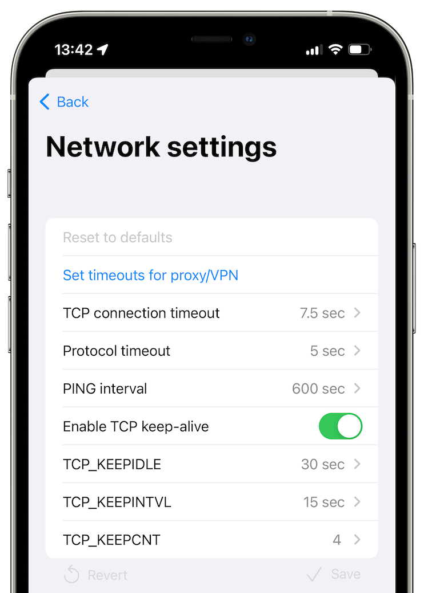

# App settings

## Opening the app settings

To open app settings:

- Open the app.
- Tap on your user profile image in the upper left-hand of the screen.  
Another option is to open the app settings by swiping to the right.
- If you have more than one profile, tap the current profile again or choose Settings.

## Your profile settings

This section is labelled **"You"** in the app settings.

### Your active profile

Tap on your avatar/name to update your current profile names and avatar.

Display name cannot have any spaces and it is recommended to use latin characters and numbers to make it easier to type these names to the users who use [SimpleX Chat for the terminal](../CLI.md) (CLI).

**Please note**: When you save your profile, the update will be sent to all your contacts (excluding the contacts with whom your incognito profiles were shared). If you have a large number of contacts it can take several seconds.

### Your chat profiles

This page allows adding and configuring your chat profiles. Please see [Your chat profiles](./chat-profiles.md) for more details.

### Incognito

This feature is unique to SimpleX Chat – it is independent from chat profiles.

When "Incognito” is turned on, your current profile name and image are NOT shared with your new contacts. It allows connections with other people without any shared data – when you make new connections or join groups via a link a new random profile name will be generated for each contact or group.

Please read more in [this post](../../blog/20220901-simplex-chat-v3.2-incognito-mode.md#incognito-mode).

### Your SimpleX contact address

 &nbsp;&nbsp; 

This page allows you to create a long term address that can be used by other people to connect with you. Unlike 1-time invitation links, these addresses can be used many times, that makes them good to share online, e.g. on other social media platforms.

When people connect to you via this address, you will receive a connection request that you can accept or reject. You can configure an automatic acceptance of connection request and an automatic welcome message that will be sent to the new contacts.

If you start receiving too many requests via this address it is always safe to remove it – all the connections you created via this address will remain active, as this address is not used to deliver the messages.

See the comparison with [1-time invitation links](./making-connections.md#comparison-of-1-time-invitation-links-and-simplex-contact-addresses).

Read more in [this post](../../blog/20221108-simplex-chat-v4.2-security-audit-new-website.md#auto-accept-contact-requests).

### Chat preferences

This page allows to configure the chat preferences that would apply to all contacts - they can be changed separately for each contact:

- _disappearing messages_ - to allow disappearing messages in the conversations with you, only if your contacts allow them.
- _delete for everyone_ - to allow irreversible message deletion (by default messages are marked as deleted, not fully deleted). "Yes" setting would allow it only if they allow it for you, and "Always" - even if they don't allow.
- _voice messages_ - to allow sending voice messages.

To set chat preferences in each contact, tap contact name on top of the conversation and then choose "Contact preferences".

Group owners can set similar preferences for their groups, when the group is created or later: tap group name on top of the conversation and then choose "Group preferences".

## Your app settings

This section is labelled **"Settings"** in the app settings.

### Notifications

This page allows to configure the notifications mode: instant, periodic or only when the app is running. There are some differences in how these options work on iOS and Android. Please read more in [this post](../../blog/20220404-simplex-chat-instant-notifications.md) about how notifications work.

You can also configure whether the message preview is shown when the message arrives.

**Please note**: For instant and periodic notifications to work on Android, you need to disable power optimization when prompted by the app, or later via the settings. Also, some variants of Android system require additional settings, for example MIU system on Xiaomi phones requires to enable "Auto start" for the app for the notification service to work. Please read [Don't kill my app](https://dontkillmyapp.com/) guide for any settings that may be required on your device.

Also, currently instant notifications have the highest battery consumption - we are working to reduce it to be less or the same as for periodic notifications.

### Network & servers

This page allows to configure your own SMP relays and change other network settings.

#### SMP servers

 &nbsp;&nbsp;  &nbsp;&nbsp; 

By default, the app has preset relays configured – you can change them to your own.

This page also allows testing the connection with the servers.

Read more in [this post](../../blog/20221206-simplex-chat-v4.3-voice-messages.md#smp-servers-configuration-and-password).

#### Use SOCKS proxy (Android only)

This option makes the app connect via a SOCKS proxy that should be provided by some other app running on your device.

The most typical use for this is to run Orbot app that provides a SOCKS proxy to connect via Tor network, but it can be some other app and it can proxy connections via some other overlay network.

#### Use .onion hosts

##### Android

**Use .onion hosts** option is only available when **Use SOCKS proxy** is enabled. You can choose:

- _no_: never use .onion hosts. Choose this option if your SOCKS proxy does not connect via Tor network.
- _when available_ (default): when SOCKS proxy is enabled the app assumes that it provides connections via Tor network and use .onion host addresses when SMP relays include them in their configuration.
- _required_: always use .onion hosts. Choose this option if your SOCKS proxy connects via Tor network and you want to avoid connections without Tor. In this case, if the SMP relay address does not include .onion host, the connection will fail.

##### iOS

 &nbsp; 

While iOS does not support SOCKS proxies, you can install Orbot app that works as VPN provider. You can choose:

- _no_ (default): do not use .onion hosts. Choose this option if you do not use Orbot or if you use VPN that proxies connections via some other overlay network.
- _when available_: use .onion host addresses when SMP relays include them in their configuration. Orbot VPN must be enabled for this option to work.
- _required_: always use .onion hosts. Choose this option if you use Orbot VPN and you want to avoid connections without Tor. In this case, if the SMP relay address does not include .onion host, the connection will fail. If you use this option, you can enable "Disable Orbot for non-onion traffic" option in Orbot settings making the rest of your device traffic to not use Tor.

**Please note** VPN on iOS can send some traffic to the usual network, if, for example, VPN app crashes. You can configure enable always-on VPN mode on managed iOS devices, but this is not applicable to most individual devices.

#### Transport isolation (BETA)

This option is only available if you have enabled developer tools.

Please read the details in [this post](../../blog/20230204-simplex-chat-v4-5-user-chat-profiles.md#transport-isolation).

#### Advanced network settings

If your network is slow, and connections to the servers keep failing (you would see a spinner on your contacts), please increase TCP and protocol timeouts in this page.

### Privacy and security

#### SimpleX Lock

SimpleX Lock when enabled requires to pass the device authentication when you open the app or use some security- or privacy-sensitive features.

You will be offered to enable it after you open the app a few times.

To enable it later:

- [Open the app settings](#opening-the-app-settings).
- Tap on "Privacy & security".
- Toggle on "SimpleX Lock" slider.
- Confirm your phone credentials.

Done! Now you will be required to authenticate when you start or resume the app after 30 seconds in background.

#### Protect app screen

This option hides the app screen in recent apps - it is enabled by default. On Android it also prevents screenshots.

#### Auto Accept Images

Auto-accepting images may reduce privacy – your contacts will know you are online.

- [Open the app settings](#opening-the-app-settings).
- Tap on "Privacy & security".
- Toggle on "Auto-accept images".

#### Send Link Previews

Enabling sending link previews may reduce privacy – your app will be loading link preview from the website.

- [Open the app settings](#opening-the-app-settings).
- Tap on "Privacy & security".
- Toggle on "Send link previews".

#### SimpleX Links

This option affects how the links to connect to other SimpleX users or to join groups are shown in the conversations. You can choose between:

- _description_ (default): only the link description and server host name are shown. The link won't be opened in the browser.
- _full link_: the full link is shown. The link will still not be opened in the browser.
- _via browser_: the full link is shown, and it will be opened in the browser. In this case, if the link domain is different from simplex.chat, the link will be shown in red color, as it might be malicious.

Read more about [SimpleX Links security](../../blog/20221206-simplex-chat-v4.3-voice-messages.md#privacy-and-security-of-simplex-invitation-links).

### Appearance

This page allows configuring:

- interface language
- app icon
- accent color

### Database passphrase & export

This page allows to change the database passphrase, export and import the database and configure the message retention period.

Read more in [Managing Your Data](./managing-data.md) page.

## Help & feedback

This section has information on how to use the app and the links to connect to the team. Please use [Send questions and ideas](https://simplex.chat/contact#/?v=1&smp=smp%3A%2F%2FPQUV2eL0t7OStZOoAsPEV2QYWt4-xilbakvGUGOItUo%3D%40smp6.simplex.im%2FK1rslx-m5bpXVIdMZg9NLUZ_8JBm8xTt%23%2F%3Fv%3D1%26dh%3DMCowBQYDK2VuAyEALDeVe-sG8mRY22LsXlPgiwTNs9dbiLrNuA7f3ZMAJ2w%253D%26srv%3Dbylepyau3ty4czmn77q4fglvperknl4bi2eb2fdy2bh4jxtf32kf73yd.onion) to connect to us via the chat to ask any questions, make any suggestions and report any issues.

## Support SimpleX Chat

- contribute - the link to the information about how to contribute and to donate to the project.
- rate the app - rate and review it on the App Store or Play Store - your feedback helps a lot.
- star on GitHub - that also helps us grow very much.

Thank you for your support!

## Developer tools

This page has options that normally are only needed for app developers and can be used to debug the app in case something is not working.

### Chat console

Here you can see and use console command with the chat core. None of this information is sent over the network, this is an internal communication between different parts of the app.

Please be careful - some of the commands can disrupt app functioning, only use them if you know what you are doing or were instructed by the team.

**Please note**: the log in console can contain what looks like errors. Unless you experience any issues in the app UI, these errors should not be considered as the app malfunction - they are likely to be normal and expected behavior.

### Confirm database upgrades

This option is off by default - the app database is migrated to the new version without any confirmations. Starting from v4.6.2 these migrations are reversible - you can rollback to the previous version(s) of the app (not earlier than v4.6.1). If you want to be asked a confirmation every time database is upgraded you may enable this option - this is not recommended, as it happens almost on every app update, and should not cause any concerns.

### Show developer options

This option currently enables [Transport isolation mode](#transport-isolation-beta) option and also enables showing database IDs in contacts, groups and group members to simplify debugging via console commands.
