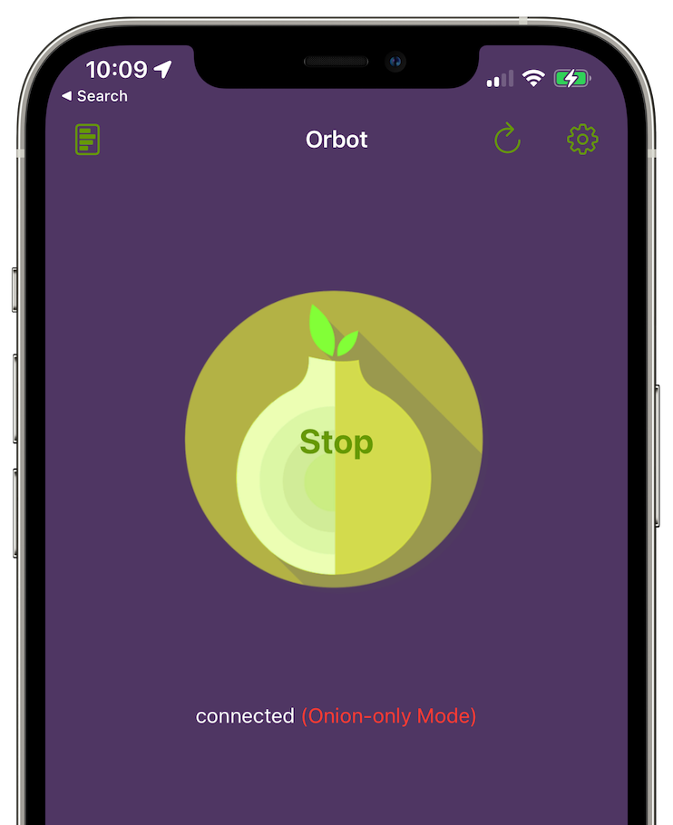
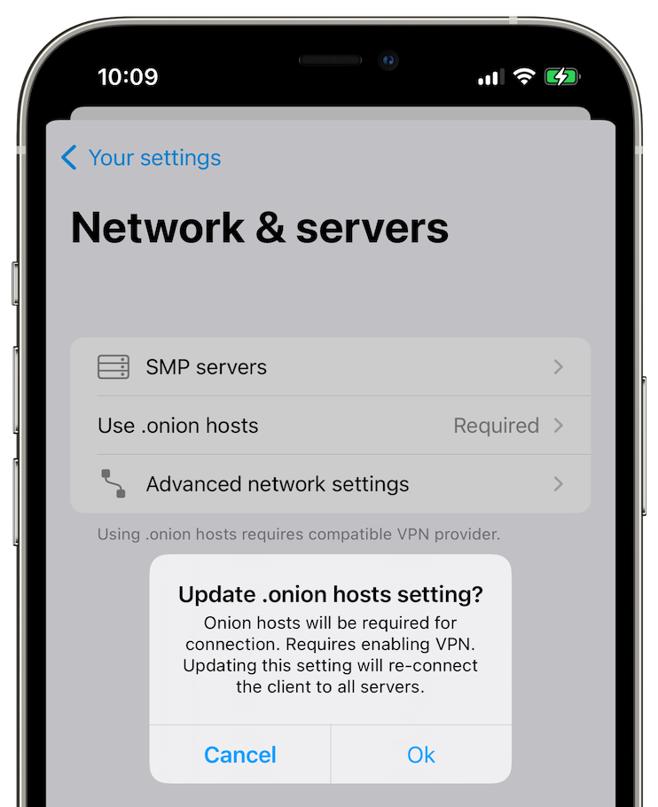

# App Settings

## Contents

- [Opening app settings](#opening-app-settings)
- [Your chat profile settings](#your-chat-profile-settings)
- [Your app settings](#your-app-settings)

## Opening app settings

#### To open app settings:

1. Open the app.
2. Tap on your profile picture in the top-left corner of the screen.
3. If you have more than one chat profile, tap on your selected chat profile or choose **Settings**.

## Your chat profile settings

This section is labelled **"You"** in the app settings.

### Your active chat profile

Tap on your avatar/name to update your current display name, full name, and profile picture.

Display names cannot have any spaces. It is recommended to use Latin characters and numbers to make it easier for users who use [SimpleX Chat for the terminal (CLI)](../CLI.md) to type them.

**Please note**: When you save edits to your chat profile, they will be sent to all your contacts (excluding those you've shared your incognito profiles with). If you have a large number of contacts, this can take several seconds.

### Your chat profiles

This screen allows you to manage your chat profiles and configure them. Please visit the [Your chat profiles](./chat-profiles.md) page for more details.

### Your SimpleX address

    

This screen allows you to create a temporary SimpleX address that can be used by other people to connect with you. Please visit the [Making connections](./making-connections.md#simplex-address) page for more details.

### Chat preferences

This screen allows you to configure your default set of chat preferences for all your contacts. 

#### Disappearing messages

- `on` - to allow your contact to send you disappearing messages only if they allow it to you
- `off (default)` - to prohibit you and your contact from sending each other disappearing messages

#### Delete for everyone

- `always` - to allow your contact to irreversibly delete their messages
- `yes` - to allow your contact to irreversibly delete their messages only if they allow it to you
- `no (default)` - To prohibit your contact from irreversibly deleting their messages. Instead they will be allowed to only mark their messages as deleted, allowing you to reveal them. 

#### Message reactions

- `always` - to allow your contact to react to your messages
- `yes (default)` - to allow your contact to react to your messages only if they allow it to you
- `no` - to prohibit your contact from reacting to your messages

#### Voice messages

- `always` - to allow your contact to send you voice messages. 
- `yes (default)` - to allow your contact to send you voice messages only if they allow it to you
- `no` - to prohibit your contact from sending you voice messages.

#### Audio/Video Calls

- `always` - to allow your contact to make audio/video calls.
- `yes (default)` - to allow your contact to make audio/video calls only if they allow it to you. 
- `no`  - to prohibit your contact from making audio/video calls. 

## Your app settings

This section is labelled **"Settings"** in the app settings.

### Notifications

This screen allows you to configure how you want to receive push notifications: instant, periodic, or only when the app is running. There are some differences in how these options work on iOS and Android. Please read [this blog post](../../blog/20220404-simplex-chat-instant-notifications.md) for more details.

You can also configure how notifications look when a new message arrives via the following options:

- `message text (default)` - show both contact name and message.
- `contact name` - show only contact name.
- `hidden` - hide both contact name and message.

**Please note**: For instant and periodic notifications to work on Android, you need to disable power optimization when prompted by the app, or later via the app settings. Also, some variants of Android require additional settings. For example, MIUI on Xiaomi phones require you to enable "Auto start" for the notification service to work. Please read the [Don't kill my app](https://dontkillmyapp.com/) guide for any additional settings that may be required on your device. Also, instant notifications have the highest battery consumption - we are working to reduce it to be less or the same as for periodic notifications.

### Network & servers

This screen allows you to configure your own SMP servers, XFTP servers, WebRTC ICE servers, and other network settings.

#### SMP servers

        

By default, the app has preset relays configured – you can change them to your own. You can also test your connection to your configured servers. Please read [this blog post](../../blog/20221206-simplex-chat-v4.3-voice-messages.md#smp-servers-configuration-and-password) for more details.

#### Use SOCKS proxy (Android only)

This option allows the app to connect via a SOCKS proxy that should be provided by some other app running on your device. The most typical use case for this is to run Orbot app that provides a SOCKS proxy to connect via Tor network, but it can be some other app that can proxy connections via some other overlay network.

#### Use .onion hosts

##### Android

**Use .onion hosts** option is only available when **Use SOCKS proxy** is enabled. You can choose:

- `no` - choose this option if your SOCKS proxy does not connect via Tor network.
- `when available (default)` - when SOCKS proxy is enabled, the app assumes that it provides connections via Tor network and use .onion host addresses when SMP relays include them in their configuration.
- `required` - Choose this option if your SOCKS proxy connects via Tor network and you want to avoid connections without Tor. In this case, if the SMP relay address does not include .onion host, the connection will fail.

##### iOS

   

While iOS does not support SOCKS proxies, you can install Orbot app that works as VPN provider. You can choose:

- `no (default)` -  choose this option if you do not use Orbot or if you use VPN that proxies connections via some other overlay network.
- `when available` - use .onion host addresses when SMP relays include them in their configuration. Orbot VPN must be enabled for this option to work.
- `required` - Choose this option if you use Orbot VPN and you want to avoid connections without Tor. In this case, if the SMP relay address does not include .onion host, the connection will fail. If you use this option, you can enable "Disable Orbot for non-onion traffic" option in Orbot settings making the rest of your device traffic to not use Tor.

**Please note**: VPN on iOS can send some traffic to the usual network, if, for example, VPN app crashes. You can configure enable always-on VPN mode on managed iOS devices, but this is not applicable to most individual devices.

#### Transport isolation (BETA)

This option is only available if you have enabled developer tools.

Please read [this blog post](../../blog/20230204-simplex-chat-v4-5-user-chat-profiles.md#transport-isolation) for more details.

#### Advanced network settings

If your network is slow, and your connections to the servers keep failing (you would see a spinner on your contacts), please increase TCP and protocol timeouts on this screen.

### Privacy and security

#### SimpleX Lock

SimpleX Lock protects your chats from unauthorised access. You can secure the app either with your device credentials or a separate app passcode altogether. When toggled on, SimpleX Lock requires you to confirm your device credentials or app passcode when you open or resume the app after the lockout timeout expires in the background, or use some security- or privacy-sensitive features. If you've installed the app for the first time, you will be offered to enable SimpleX Lock after you open the app a few times.

To enable it later:

1. [Open app settings](#opening-app-settings).
2. Tap **Privacy & security**.
3. Tap **SimpleX Lock**.
4. Choose the lock mode:
   - System
   - Passcode 
6. Toggle **SimpleX Lock** on.
7. If you've set the lock mode to **System**, you'll be prompted to confirm your device credentials. If you've set the lock mode to **Passcode**, you'll be prompted to create and confirm your app passcode.
8. (Optional) From the **Lock after** drop-down menu, choose how long until the app remains unlocked in the background. 

Done! Now you will be required to authenticate when you start or resume the app after the lockout timer expires in background.

#### Protect app screen

This option hides the app's screen in the recent apps list - it's enabled by default. It also prevents screenshots on Android.

#### Auto-accept Images

As the name implies, you automatically accept images when you receive them from your contacts. However, enabling this option may reduce privacy because it will inform your contacts that you are online.

#### Send Link Previews

When you send a link to your contact or group, it will generate a preview of the website. However, enabling this option may reduce privacy because it might expose your IP address to your contacts. 

#### Show last messages

Your last messages are shown in your chats. However, enabling this option may reduce privacy because someone could be shoulder-surfing your device and see them without your consent. 

#### Message draft

However, enabling this option may reduce privacy because someone could be shoulder-surfing your device and see your message draft without your consent. 

#### SimpleX Links

This option affects how the links to connect to other SimpleX users or to join groups are shown in the conversations. You can choose between:

- `description (default)` - Only the link description and server host name are shown. The link won't be opened in the browser, however.
- `full link` - The full link is shown. The link will still not be opened in the browser, however.
- `via browser` - The full link is shown, and it will be opened in the browser. In this case, if the link domain is different from simplex.chat, the link will be shown in red color, as it might be malicious.

Please read [this blog post](../../blog/20221206-simplex-chat-v4.3-voice-messages.md#privacy-and-security-of-simplex-invitation-links) for more details.

#### Send Delivery Receipts to Contacts

Enabling this option allows you to send delivery receipts to your contacts. 

#### Send Delivery Receipts to Small Groups (Max 20)

Enabling this option allows you to send delivery receipts to your groups with 20 members or less. 

### Appearance

This screen allows you to configure the app language, app icon, app theme, and accent color.

### Database passphrase & export

This screen allows you to change the app's database passphrase, export and import the database, and configure the message retention period.

Please visit the [Managing Data](./managing-data.md) page for more details.

## Help & feedback

This section has information on how to use the app and the links to connect with the team. Please tap [Send questions and ideas](https://simplex.chat/contact#/?v=1&smp=smp%3A%2F%2FPQUV2eL0t7OStZOoAsPEV2QYWt4-xilbakvGUGOItUo%3D%40smp6.simplex.im%2FK1rslx-m5bpXVIdMZg9NLUZ_8JBm8xTt%23%2F%3Fv%3D1%26dh%3DMCowBQYDK2VuAyEALDeVe-sG8mRY22LsXlPgiwTNs9dbiLrNuA7f3ZMAJ2w%253D%26srv%3Dbylepyau3ty4czmn77q4fglvperknl4bi2eb2fdy2bh4jxtf32kf73yd.onion) to connect with us via the chat to ask any questions, make any suggestions, and report any issues.

## Support SimpleX Chat

This section has information on how to support the project. 

- `contribute` - the link to the information about how to contribute and to donate to the project.
- `rate the app` - rate and review it on the App Store or Play Store - your feedback helps a lot.
- `star on GitHub` - this also helps us grow.

Thank you for your support!

## Developer tools

This screen has options that are only needed for app developers and can be used to debug the app in case something is not working.

### Chat console

Here you can see and use console commands with the chat core. None of this information is sent over the network; this is an internal communication between different parts of the app.

**WARNING:** Some of the console commands can stop the app from functioning! Only use them if you know what you are doing or were instructed by the team.

**Please note**: The chat console can contain what looks like errors. Unless you experience any issues in the app's UI, these "errors" should not be considered a sign of app malfunction - they are likely to be normal and expected behavior.

### Confirm database upgrades

This option is toggled off by default - the app's database is migrated to the new version without any confirmations. Starting from v4.6.2 these migrations are reversible - you can rollback to the previous version(s) of the app (not earlier than v4.6.1). If you want to be asked a confirmation every time the app's database is upgraded, you may enable this option - this is not recommended, as it happens almost on every app update, and should not cause any concerns.

### Show developer options

This option currently enables [Transport isolation mode](#transport-isolation-beta) option and also enables showing database IDs in contacts, groups and group members to simplify debugging via console commands.