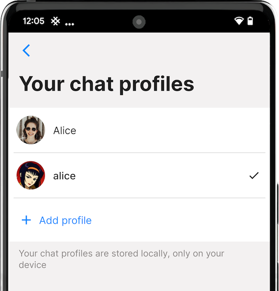

# App settings

All of the app settings can be found here. Click or tap on the following sections to learn more:

- [Opening the app settings menu](#opening-the-app-settings-menu)
- [You](#you)
- [Settings](#settings)
- [Help](#help)
- [Support SimpleX Chat](#support-simplex-chat)
- [App](#app)

## Opening the app settings menu

#### To open the app settings menu:

1. Open the app.
2. Click or tap on your profile picture in the top-left corner of the **Chats** screen. If you have more than one chat profile, tap or click **Settings**.

## You

Here in this section: you can make edits to your active chat profile, manage your chat profiles, manage your SimpleX address, set your default chat preferences for all your contacts, link your mobile device to your PC and migrate your SimpleX Chat data to a new device. 

### Your active chat profile

For more details on how to edit your active chat profile, please visit the [Chat Profiles page](./chat-profiles.md). 

### Your chat profiles

For more details on how to manage your chat profiles, please visit the [Chat Profiles page](./chat-profiles.md).

### Your SimpleX address

 &nbsp;&nbsp; 

For more details on what a SimpleX address is, how you can set it up and what it can be used for, please visit the [Making Connections page](./making-connections.md#simplex-address). 

### Chat preferences

For more details on how to configure your chat preferences, please visit the [Chat preferences page](./chat-preferences.md). 

### Use from desktop (or Link a mobile on desktop app)

This screen allows you to link your mobile device to your desktop, so that you can continue conversing with your contacts and groups on there.  

#### Prerequisite(s):

- Both your mobile device and desktop must be on the same network. For example, if your mobile device is connected to Wi-Fi and your desktop is connected to Ethernet, then they won't link up. 

#### To link your mobile device to your desktop:

1. Download and install the [SimpleX Chat desktop app](https://simplex.chat/downloads/#desktop-app), if you haven't already. 

2. Open SimpleX Chat on your desktop. 

3. If you don't have any chat profiles setup on the desktop app, click **Link a mobile**. 

4. Options:
   
   - Set a new database passphrase.
   
   - Use a randomly generated passphrase.  

5. Set **This Device Name** to whatever you want.

6. On your mobile device, [open the app settings menu](./app-settings.md#opening-the-app-settings-menu).

7. Click or tap **Use from desktop**. 

8. Scan the QR code on your desktop.  

### Migrate to another device

This screen allows you to migrate your SimpleX Chat data from your old device to your new device. For more details, please visit the [Chat profiles page](./chat-profiles.md#upload-archive-to-simplex-file-servers-and-scan-qr-codepaste-file-link-to-download).

## Settings

Here in this section: you can configure notifications, configure connections to servers (including SMP servers, XFTP servers and WebRTC ICE servers) and network settings, configure audio and video calls, configure privacy and security, change the app's appearance and manage your SimpleX Chat data.

### Notifications

This screen allows you to configure notifications and notification previews. For more details on how notifications work in Android versus iOS, please read [this blog post](../../blog/20220404-simplex-chat-instant-notifications.md).

#### To configure notifications on Android:

1. [Open the app settings menu](#opening-the-app-settings-menu).
2. Click or tap **Notifications**.
3. Click or tap **Notification service**. 
4. Choose from the following options:
   - `Runs when app is open` - The app will receive notifications only when it's running.
   - `starts periodically` - The app will periodically check for new notifications every 10 minutes for up to 1 minute.
   - `always on` - The app will always check for new notifications, even when it's closed. 

**Please note**: For instant and periodic notifications to work on Android, you need to disable power optimization when prompted by the app, or later via the app settings. Also, some variants of Android require additional settings to be configured. For example, MIUI on Xiaomi phones require you to enable "Auto start" for the notification service to work. Please read the [Don't kill my app](https://dontkillmyapp.com/) guide for any additional settings that may be required on your device. Also, instant notifications have the highest battery consumption - we are working to reduce it to be less or the same as for periodic notifications.

#### To configure notifications on iOS:

1. [Open the app settings menu](#opening-the-app-settings-menu).
2. Click or tap **Notifications**.
3. Click or tap **Send notifications**.
4. Choose from the following options:
   - `Instantly (Recommended)` - device token and notifications are sent to SimpleX Chat's notification server, but not the message content, size or who it is from. 
   - `Periodically (More private)` - check new messages every 20 minutes. Device token is shared with SimpleX Chat server, but not how many contacts or messages you have. 
   - `Local (Most private)` - do not use SimpleX chat notifications server, check messages periodically in the background (depends on how often you use the app). 

#### To configure notification preview:

1. [Open the app settings menu](#opening-the-app-settings-menu). 
2. Click or tap **Notifications**. 
3. Click or tap **Show preview**.
4. Choose from the following options:
   - `message text` - show contact name and message.
   - `contact name` - show only contact name.
   - `hidden` - hide both contact name and message.

### Network & servers

Here you can configure SimpleX Chat to use your self-hosted messaging, file and WebRTC ICE servers and change other network settings. For more details, please visit the [Network & servers page](./network-and-servers.md).

### Audio & video calls

Here you can configure SimpleX Chat to use your self-hosted WebRTC servers for your audio/video calls, lock screen notifications for calls and the option to use a relay to protect your IP address. For more details, please visit the [Audio & video calls page](./audio-video-calls.md). 

### Privacy and security

Here you can configure all the privacy and security settings available in SimpleX Chat to suit your needs. For more details, please visit the [Privacy & Security page](./privacy-security.md). 

### Appearance

Here you can change the app language, customize the app theme, profile image shapes, and app icon. For more details, please visit the [Changing Appearance page](./changing-appearance.md).

### Database passphrase & export

Here you can change the app's database passphrase, export and import the database, and configure the message retention period. For more details, please visit the [Managing Data page](./managing-data.md).

## Help

Here is this section are links on how to use the app, view the latest release notes and connect with the SimpleX Chat team. Please tap [Send questions and ideas](https://simplex.chat/contact#/?v=1&smp=smp%3A%2F%2FPQUV2eL0t7OStZOoAsPEV2QYWt4-xilbakvGUGOItUo%3D%40smp6.simplex.im%2FK1rslx-m5bpXVIdMZg9NLUZ_8JBm8xTt%23%2F%3Fv%3D1%26dh%3DMCowBQYDK2VuAyEALDeVe-sG8mRY22LsXlPgiwTNs9dbiLrNuA7f3ZMAJ2w%253D%26srv%3Dbylepyau3ty4czmn77q4fglvperknl4bi2eb2fdy2bh4jxtf32kf73yd.onion) to connect with us via the chat to ask any questions, make any suggestions and report any issues.

## Support SimpleX Chat

Here in this section are links to support the project. You can:

- `contribute` - the link to the information about how to contribute and to donate to the project.
- `rate the app` - rate and review it on the App Store or Play Store - your feedback helps a lot.
- `star on GitHub` - this also helps us grow.

Thank you for your support!

## App

Here in this section are the Restart and Shutdown buttons (only available on Android and Desktop) and developer tools. 

### Restart and Shutdown Buttons (Android and Desktop only)

You can use these buttons to manually restart or shutdown the app. 

### Developer tools

This screen has options that are only needed for app developers and can be used to debug the app in case something is not working.

#### Chat console

Here you can see and use console commands with the chat core. None of this information is sent over the network; this is an internal communication between different parts of the app.

**WARNING:** some of the console commands can stop the app from functioning; only use them if you know what you are doing or were instructed by the team.

**Please note**: The chat console can contain what looks like errors. Unless you experience any issues in the app's UI, these "errors" should not be considered a sign of app malfunction - they are likely to be normal and expected behavior.

#### Show developer options

This option affects the visiblity of developer options in the UI. These include: [transport isolation](./network-and-servers.md#transport-isolation-beta); showing database IDs for contacts, groups and group members; confirm database upgrades; show console in new window (desktop only); show internal errors and show slow API calls. 

#### Confirm database upgrades

This option affects the ability to confirm database upgrades - it is toggled off by default. The app's database is migrated to the new version without any confirmations. Starting from v4.6.2, these migrations are reversible - you can rollback to the previous version(s) of the app (not earlier than v4.6.1). If you want to be asked a confirmation every time the app's database is upgraded, you may enable this option - this is not recommended, as it happens almost on every app update, and should not cause any concerns.

#### Show console in new window (Desktop app only)

This option affects the ability to open the chat console in a new window - it is toggled on by default. 

#### Show internal errors

This option affects the visibility of internal errors - it is toggled off by default. 

#### Show slow API calls

This option affects the visibility of slow API calls - it is toggled off by default. 
