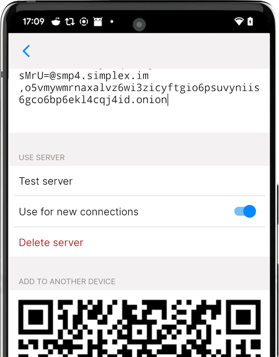
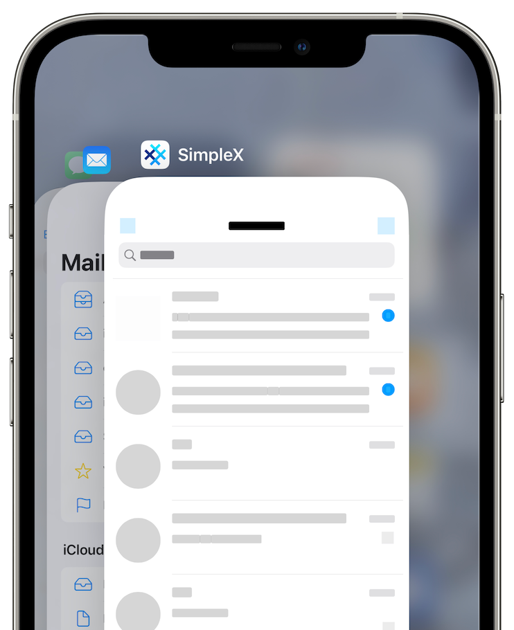

# App Settings

## Opening app settings 

To open app settings:

1. Open the app.
2. Tap on your chat profile picture in the upper left-hand corner of the screen.
3. If you have more than one profile, tap the current profile again or choose **Settings**.

## Your profile settings

This section is labelled **"You"** in the app settings.

### Your active profile

Tap on your avatar/name to update your current display name, full name, and profile picture.

Display names cannot have any spaces. It is recommended to use latin characters and numbers to make it easier to type these names to users who use [SimpleX Chat for the terminal](../CLI.md) (CLI).

**Please note**: When you save edits to your profile, they will be broadcasted to all your contacts (excluding contacts who you've shared your incognito profiles with). If you have a large number of contacts, this can take several seconds.

### Your chat profiles

This page allows for adding and configuring your chat profiles. Please read [Your chat profiles](./chat-profiles.md) for more details.

### Incognito mode

This feature is unique to SimpleX Chat – it is independent from chat profiles.

When **Incognito** mode is turned on, your current profile name and picture are NOT shared with your new contacts. Instead a new random profile name will be generated for each connection you make, allowing you to have as many anonymous connections with other people without any shared data between them. This features comes in handy when you want to protect the privacy of your real profile picture and name from contacts you don't know or trust. 

Please read [this blog post](../../blog/20220901-simplex-chat-v3.2-incognito-mode.md#incognito-mode) for more details.

### Your SimpleX contact address

 &nbsp;&nbsp; 

This page allows you to create a long term address that can be used by other people to connect with you. Unlike one-time invitations: it can be used many times, making it very useful for publishing on your personal website or social media platforms for example.

When people connect with you via this address, you will receive a connection request that you can either accept or reject. Optionally, you can configure your address to automatically accept future connection requests with a welcome message that will be sent to new contacts.

If you start receiving too many connection requests via this address, you can always delete it. All connections made via this address will remain active, as it is not used to send messages.

Please read [this blog post](../../blog/20221108-simplex-chat-v4.2-security-audit-new-website.md#auto-accept-contact-requests) for more details.

**Please note:** You can only generate one contact address per chat profile. 

### Chat preferences

This page allows you to configure your default set of chat preferences for all your contacts. These can also be adjusted individually for each contact.

- **Disappearing messages** - To allow disappearing messages in your conversation, only if your contacts allow them.
- **Delete for everyone** - To allow irreversible message deletion (by default messages are marked as deleted, not fully deleted). "Yes" setting would allow it only if they allow it for you, and "Always" - even if they don't allow.
- **Voice messages** - To allow sending voice messages.

#### To set chat preferences for each contact:

1. Tap on your contact.
2. Tap on your contact's name on top of the screen
3. Tap **Contact preferences**.

Group owners can set similar preferences for their groups. 

#### To set chat preferences for your group:

1. Tap on your group.
2. Tap on your group's name on top of the screen
3. Tap **Group preferences**. 

## Your app settings

This section is labelled **"Settings"** in the app settings.

### Notifications

This page allows you to configure the app's notifications mode: instant, periodic or only when the app is running. There are some differences in how these options work on iOS and Android. Please read more in [this blog post](../../blog/20220404-simplex-chat-instant-notifications.md) about how notifications work.

You can also configure how notifications look when a new message arrives via the following options:

- **Message text** - Show contact name and message.
- **Contact name** - Show only contact name.
- **Hidden** - Hide both contact name and message.

**Please note**: For instant and periodic notifications to work on Android, you need to disable power optimization when prompted by the app, or later via the app settings. Also, some variants of Android system require additional settings, for example MIU system on Xiaomi phones requires to enable "Auto start" for the app for the notification service to work. Please read [Don't kill my app](https://dontkillmyapp.com/) guide for any settings that may be required on your device.

Also, currently instant notifications have the highest battery consumption - we are working to reduce it to be less or the same as for periodic notifications.

### Network & servers

This page allows you to configure your own SMP relays and change other network settings.

#### SMP servers

 &nbsp;&nbsp;  &nbsp;&nbsp; 

By default, the app has preset relays configured – you can change them to your own. You can also test your connection to your configured servers.Please read [this blog post](../../blog/20221206-simplex-chat-v4.3-voice-messages.md#smp-servers-configuration-and-password) for more details.

#### Use SOCKS proxy (Android only)

This option allows the app to connect via a SOCKS proxy that should be provided by some other app running on your device. The most typical use case for this is to run Orbot app that provides a SOCKS proxy to connect via Tor network, but it can be some other app and it can proxy connections via some other overlay network.

#### Use .onion hosts

##### Android

**Use .onion hosts** option is only available when **Use SOCKS proxy** is enabled. You can choose:

- **No**: Choose this option if your SOCKS proxy does not connect via Tor network.
- **When available (default)**: When SOCKS proxy is enabled, the app assumes that it provides connections via Tor network and use .onion host addresses when SMP relays include them in their configuration.
- **Required:** Choose this option if your SOCKS proxy connects via Tor network and you want to avoid connections without Tor. In this case, if the SMP relay address does not include .onion host, the connection will fail.

##### iOS

 &nbsp; 

While iOS does not support SOCKS proxies, you can install Orbot app that works as VPN provider. You can choose:

- **No (default):** Choose this option if you do not use Orbot or if you use VPN that proxies connections via some other overlay network.
- **When available:** Use .onion host addresses when SMP relays include them in their configuration. Orbot VPN must be enabled for this option to work.
- **Required:** Choose this option if you use Orbot VPN and you want to avoid connections without Tor. In this case, if the SMP relay address does not include .onion host, the connection will fail. If you use this option, you can enable "Disable Orbot for non-onion traffic" option in Orbot settings making the rest of your device traffic to not use Tor.

**Please note** VPN on iOS can send some traffic to the usual network, if, for example, VPN app crashes. You can configure enable always-on VPN mode on managed iOS devices, but this is not applicable to most individual devices.

#### Transport isolation (BETA)

This option is only available if you have enabled developer tools.

Please read [this blog post](../../blog/20230204-simplex-chat-v4-5-user-chat-profiles.md#transport-isolation) for more details.

#### Advanced network settings

If your network is slow, and your connections to the servers keep failing (you would see a spinner on your contacts), please increase TCP and protocol timeouts in this page.

### Privacy and security

#### SimpleX Lock

When enabled, SimpleX Lock requires to pass the device authentication when you open the app or use some security- or privacy-sensitive features.

You will be offered to enable it after you open the app a few times.

To enable it later:

1. [Open the app settings](#opening-the-app-settings).
2. Tap on **Privacy & security**.
3. Toggle on the **SimpleX Lock** slider.
4. Confirm your phone credentials.

Done! Now you will be required to authenticate when you either start or resume the app after 30 seconds in background.

#### Protect app screen

This option hides the app's screen in recent apps. It is enabled by default. It also prevents screenshots on Android.

#### Auto Accept Images

Auto-accepting images may reduce privacy – your contacts will know you are online.

1. [Open the app settings](#opening-the-app-settings).
2. Tap on **Privacy & security**.
3. Toggle on **Auto-accept images**.

#### Send Link Previews

Enabling sending link previews may reduce privacy – your app will be loading link preview from the website.

1. [Open the app settings](#opening-the-app-settings).
2. Tap **Privacy & security**.
3. Toggle on "Send link previews".

#### SimpleX Links

This option affects how the links to connect to other SimpleX users or to join groups are shown in the conversations. You can choose between:

- **Description (default):** Only the link description and server host name are shown. The link won't be opened in the browser.
- **Full link:** The full link is shown. The link will still not be opened in the browser.
- **Via browser:** The full link is shown, and it will be opened in the browser. In this case, if the link domain is different from simplex.chat, the link will be shown in red color, as it might be malicious.

Please read [this blog post](../../blog/20221206-simplex-chat-v4.3-voice-messages.md#privacy-and-security-of-simplex-invitation-links) for more details.

### Appearance

This page allows you to configure the app's appearance via the following options:

- Language
- App icon
- Theme
- Accent color

### Database passphrase & export

This page allows you to change the app's database passphrase, export and import the database and configure the message retention period.

Please read [Managing Data](./managing-data.md) for more details.

## Help & feedback

This section has information on how to use the app and the links to connect to the team. Please use [Send questions and ideas](https://simplex.chat/contact#/?v=1&smp=smp%3A%2F%2FPQUV2eL0t7OStZOoAsPEV2QYWt4-xilbakvGUGOItUo%3D%40smp6.simplex.im%2FK1rslx-m5bpXVIdMZg9NLUZ_8JBm8xTt%23%2F%3Fv%3D1%26dh%3DMCowBQYDK2VuAyEALDeVe-sG8mRY22LsXlPgiwTNs9dbiLrNuA7f3ZMAJ2w%253D%26srv%3Dbylepyau3ty4czmn77q4fglvperknl4bi2eb2fdy2bh4jxtf32kf73yd.onion) to connect to us via the chat to ask any questions, make any suggestions and report any issues.

## Support SimpleX Chat

- **Contribute** - The link to the information about how to contribute and to donate to the project.
- **Rate the app** - Rate and review it on the App Store or Play Store - your feedback helps a lot.
- **Star on GitHub** - This also helps us grow.

Thank you for your support!

## Developer tools

This page has options that are only needed for app developers and can be used to debug the app in case something is not working.

### Chat console

Here you can see and use console commands with the chat core. None of this information is sent over the network; this is an internal communication between different parts of the app.

Please be careful: some of the commands can stop the app from functioning. Only use them if you know what you are doing or were instructed by the team.

**Please note**: The log in console can contain what looks like errors. Unless you experience any issues in the app UI, these errors should not be considered as the app malfunction - they are likely to be normal and expected behavior.

### Confirm database upgrades

This option is turned off by default - the app's database is migrated to the new version without any confirmations. Starting from v4.6.2 these migrations are reversible - you can rollback to the previous version(s) of the app (not earlier than v4.6.1). If you want to be asked a confirmation every time database is upgraded you may enable this option - this is not recommended, as it happens almost on every app update, and should not cause any concerns.

### Show developer options

This option currently enables [Transport isolation mode](#transport-isolation-beta) option and also enables showing database IDs in contacts, groups and group members to simplify debugging via console commands.
