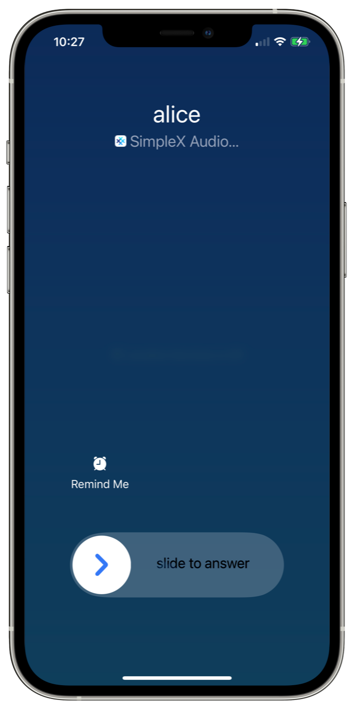
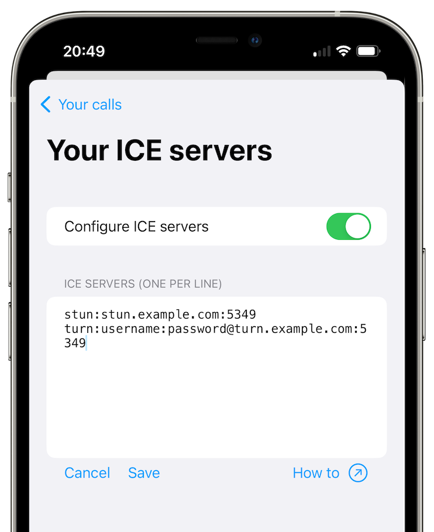

# Audio and Video Calls

SimpleX Chat allows you to make end-to-end encrypted audio and video calls with your contacts via WebRTC. Please note that group calls are not supported at this time.

## Contents

- [Making and accepting calls](#making-and-accepting-calls)
- [Advanced call settings](#advanced-call-settings)

## Making and accepting calls

### How to make an audio call

1. Tap on a contact from your list of chats.
2. Tap on the phone icon to the right of your contact's name at the top of the screen.

### How to make a video call

1. Tap on a contact from your list of chats.
2. Tap on the three vertical dots in the top-right corner of the screen to access more options.
3. Choose **Video call**.

### Accepting calls

When there is an incoming call, you have three options:

- `accept` - to accept the call.
- `reject` - to reject the call without notifying the caller.
- `ignore` - To temporarily ignore the call, so that it can be accepted later. If the caller is still waiting, tap the **Answer call** message in your conversation with them.

There is no time limit for the call invitation to remain active - as long as the caller is still waiting, you can accept the call at any time.

Calls can be accepted from the lock screen, both on Android (it needs to be enabled via options) and on iOS (by default, using the native iOS call interface that can be disabled).

### Calls on lock screen on Android

SimpleX Chat shows an incoming call on your device's lock screen by default. However, you can change this behavior in the app settings menu.

1. [Open app settings](./app-settings.md#opening-app-settings).
2. Tap **Audio and Video calls**.
3. On the **Calls on lock screen** drop-down list, choose from the following three options:
   - `disable` - the incoming call will show as a notification.
   - `show` - The incoming call will show on the lock screen. You need to unlock both the device and the app to accept it.
   - `accept` - the incoming call can be accepted or rejected directly from the lock screen. 

**Please note**: some Android systems/devices prohibit full screen views on lock screen - in this case the incoming call will show as a usual notification.

### Calls on lock screen on iOS

By default, SimpleX Chat uses the native iOS call interface, where allowed, to show incoming calls on the lock screen. You can disable it:

1. [Open app settings](./app-settings.md#opening-app-settings).
2. Tap **Audio and Video calls**.
3. Toggle **Use iOS call interface** off.

**Please note**: iOS call interface allows accepting incoming calls without having to unlock the device and the app. If this behavior is undesirable, please disable it – the incoming calls will show as notifications in this case.

Please read [this blog post](../../blog/20230328-simplex-chat-v4-6-hidden-profiles.md#improved-audiovideo-calls) for more details.

## Advanced call settings

### WebRTC ICE servers

SimpleX Chat uses a preset relay server to hide your IP address from your contacts by default, but it can also observe the duration of your calls. If you don't want that, you can configure and use your self-hosted WebRTC relay servers instead for further control of your calls.

1. [Open app settings](./app-settings.md#opening-app-settings).
2. Tap **Audio and Video calls**.
3. Tap **WebRTC ICE servers**.
4. Toggle **Configure ICE servers** on.
5. Enter your ICE server addresses (one per line).
6. Tap **Save**.

**Please note**: Unlike messaging relays (SMP servers), the configuration of WebRTC ICE servers is stored on the current device, not in the chat database. If you migrate your chat database to another device, you will need to manually update this configuration again.

### Always use relay

Audio and video calls on SimpleX Chat are routed via a TURN relay server by default. Optionally you can disable this and use peer-to-peer (P2P) instead, when it is supported by your network. However, your IP address will be known to your contacts.

1. [Open app settings](./app-settings.md#opening-app-settings).
2. Tap **Audio and Video calls**.
3. Toggle **Always use relay** on to use a relay server or off for P2P.

**Please note**: Disabling this option allows P2P calls, but it does not prohibit the use of TURN relays – in case your network providers block P2P connections, the call will still use relays if they are available. To prohibit the use of relays you need to change WebRTC ICE server configuration to only include STUN servers.