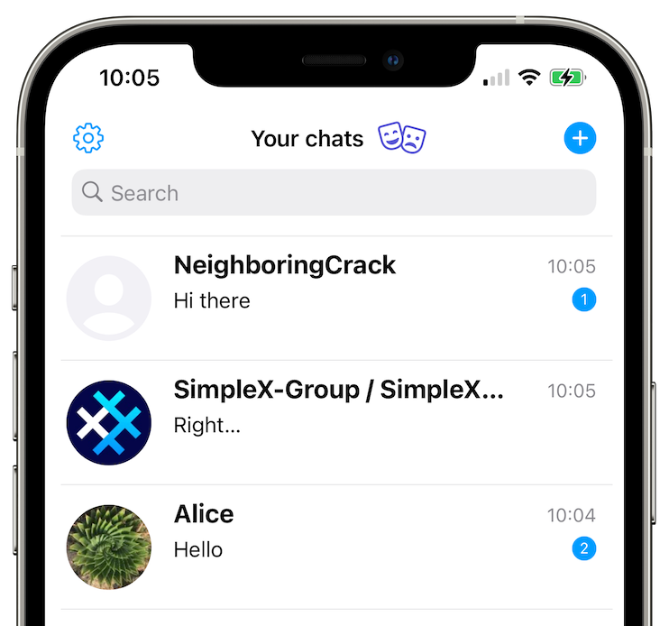

# Your chat profiles

## Creating additional chat profiles

SimpleX Chat allows creating as many chat profiles as you like. Same as the first profile, they are only stored locally on your device.

To create an additional SimpleX Chat profile:

- [Open the app settings](./app-settings.md#opening-the-app-settings).
- Select "Your chat profiles".
- Tap on "+ Add profile".
- Create a new profile by with your name.
- Tap on "Create profile".

## Hiding and muting chat profiles

v4.6 added the ability to mute and to hide chat profiles.

 &nbsp;&nbsp;  &nbsp;&nbsp; 

These actions are available via long-press (Android) or swipe (iOS) on the profile in the list.

To unhide hidden profiles, enter the full password in the search bar.

## Switching between profiles

- Tap on your user profile image in the upper right-hand of the screen.
- Select which profile you want to use.

You can also switch profile via Your chat profiles in the settings.

  

This feature is unique to SimpleX Chat – it is independent from chat profiles.

When you click on "Accept Incognito" for contact requests, your current profile name and image are NOT shared with your new contacts. It allows connections with other people without any shared data – when you make new connections or join groups via a link a new random profile name will be generated for each contact or group.

Please read more in [this post](../../blog/20220901-simplex-chat-v3.2-incognito-mode.md#incognito-mode).

## Edit your profile

To edit your profile:

- [Open the app settings](./app-settings.md#opening-the-app-settings).
- Select your profile.
- Tap on "Edit".
- You can change your display name.
- You can also set and change profile image.
- Tap on "Save and notify contacts".

## Move your chat profiles to another device

SimpleX Chat stores all user data only on client devices using a portable encrypted database format that can be exported and transferred to any supported device.

To export your SimpleX Chat data:

- [Open the app settings](./app-settings.md#opening-the-app-settings).
- Select "Database passphrase & export".
- If you didn't set a passphrase before, [set a passphrase](./managing-data.md#database-passphrase) in "Database passphrase". Initially, the database is encrypted with a random passphrase that is stored in KeyChain (iOS) or with KeyStore (Android).
- Tap on "Export database" - it won't allow exporting unless you have set a passphrase.
- Save the file on your device or share it via any available option.

To import your SimpleX Chat data in the app on another device:

- Transfer the database file to the new device.
- Install SimpleX Chat app.
- Tap "Migrate from another device"
- Tap "Import Database"
- Choose your database file from device.
- Finish importing by typing your passphrase.
- Restart the app.

**Please note**:

1. Currently you cannot move some of the profiles, only the whole database containing all profiles can be moved.

2. You must NOT use the exported database on more than one device at a time, as it may disrupt some of the connections. You must always use the latest version of the chat database - using the old one is also likely to disrupt your connections.

3. There is no way to recover lost passphrase - make sure to store it securely.