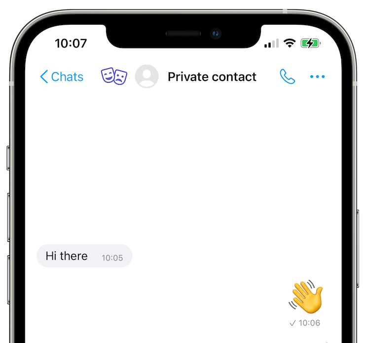

# Your chat profiles

Since SimpleX Chat does not require any user ID's, there are no user accounts required to use it. Instead, you use chat profiles. A name is all you need to create one. They're stored locally on your device and only shared with your contacts. SimpleX servers have zero knowledge of them. Tap or click on the following sections to learn more:

- [Creating additional chat profiles](#creating-additional-chat-profiles)
- [Editing chat profiles](#editing-chat-profiles)
- [Hiding chat profiles](#hiding-chat-profiles)
- [Muting chat profiles](#muting-chat-profiles)
- [Switching between chat profiles](#switching-between-chat-profiles)
- [Migrating your chat profiles to another device](#migrating-your-chat-profiles-to-another-device)
- [Incognito mode](#incognito-mode)

## Creating additional chat profiles

You can create as many chat profiles as you like. You can create one for your friends, one for your work colleagues, one for your family, and so on.

#### To create an additional chat profile:

1. [Open the app settings menu](./app-settings.md#opening-the-app-settings-menu).
2. Tap or click **Your chat profiles**.
3. Confirm your device credentials or SimpleX Lock passcode, if you have [SimpleX Lock](./privacy-security.md#simplex-lock) toggled on.
4. Tap or click **+ Add profile**.
5. Enter a profile name.
6. Tap or click **Create profile**.

## Editing chat profiles

You can edit your chat profiles whenever you like.  

#### To edit your active chat profile:

1. [Open the app settings menu](./app-settings.md#opening-the-app-settings-menu).
2. Tap or click on your avatar/name.
3. Options:
   - Choose a new profile name.
   - Choose a new profile picture. 
4. Tap or click **Save and notify contacts**.

#### To edit another chat profile:

1. [Switch to another chat profile](#to-switch-between-chat-profiles).
2. [Open the app settings menu](./app-settings.md#opening-the-app-settings-menu).
3. Tap or click on your avatar/name. 
4. Options:
   - Choose a new display name.
   - Choose a new profile picture.
5. Tap or click **Save and notify contacts**. 

## Hiding chat profiles

      

You can hide chat profiles from view with a password.

#### To hide a chat profile:

1. [Open the app settings menu](./app-settings.md#opening-the-app-settings-menu).
2. Tap or click **Your chat profiles**.
3. Confirm your device credentials or SimpleX Lock passcode, if you have [SimpleX Lock](./privacy-security.md#simplex-lock) toggled on.
4. Tap and hold (on Android) or swipe (on iOS) or right-click ( on desktop) on a chat profile.
5. Tap or click **Hide**. 
6. Create a password for your chat profile. 
7. Tap or click **Save profile password**. 

#### To reveal a hidden chat profile:

1. [Open the app settings menu](./app-settings.md#opening-the-app-settings-menu).
2. Tap or click **Your chat profiles**.
3. Confirm your device credentials or SimpleX Lock passcode, if you have [SimpleX Lock](./privacy-security.md#simplex-lock) toggled on.
4. Type in the chat profile password into the search bar, and your hidden chat profile should become visible.

## Muting chat profiles

You can mute chat profiles to prohibit notifications of new messages arriving on your device, as long as you don't switch to them. 

#### To mute a chat profile:

1. [Open the app settings menu](./app-settings.md#opening-the-app-settings-menu).
2. Tap or click **Your chat profiles**.
3. Confirm your device credentials or SimpleX Lock passcode, if you have [SimpleX Lock](./privacy-security.md#simplex-lock) toggled on.
4. Tap and hold (on Android) or swipe (on iOS) on a chat profile.
5. Tap or click **Mute**.

## Switching between chat profiles

You can switch between chat profiles. 

#### To switch between chat profiles:

1. Tap or click on your profile picture in the top-left corner of the **Chats** screen.
2. Select which chat profile you want to use.

**Tip:** you can also switch between chat profiles via the **Your chat profiles** screen from the app settings menu.

## Migrating your chat profiles to another device

There are two methods to migrate your chat profiles from your old device to another device:

- Upload Archive to SimpleX File Servers and Scan QR Code/Paste File Link To Download
- Manually Export and Import Archive

### Upload Archive to SimpleX File Servers and Scan QR Code/Paste File Link To Download

This method is recommended for most users. The app creates a zipped archive containing all your data and uploads it in chunks across several SimpleX file servers. A QR code and file link are generated afterwards for you to start downloading it onto your new device. 

#### On your old device:

1. [Open the app settings menu](./app-settings.md#opening-the-app-settings-menu).
2. Tap or click **Migrate to another device**.
3. If you haven't setup a database passphrase yet, you'll be prompted to set one. Once you're done, tap or click **Set passphrase**. A window will appear confirming that your database is now encrypted. Tap or click **Ok**. If you already have a database passphrase, enter it and click or tap **Verify passphrase**.
4. Tap or click **Archive and upload**. 
5. Show QR code or share file link to your new device. 

#### On your new device:

1. Download and install SimpleX Chat. 
2. Open the app. 
3. Tap or click **Migrate from another device**. 
4. Scan QR code or paste the file link from the old device. 

#### On your old device:

1. Tap or click **Finalize migration**.
2. Options:
   - `Start chat (Not recommended)` - using SimpleX Chat with the same database on multiple devices is currently unsupported and will cause message delivery failures.
   - `Delete database from this device (Recommended)` - deleting the database from your old device will avoid message delivery failures on your new device.

### Manually Export and Import Archive

This method is recommended for advanced users.

#### On your old device:

1. [Open the app settings menu](./app-settings.md#opening-the-app-settings-menu).
2. Tap or click **Database passphrase & export**.
3. Toggle **Chat is running** off to stop SimpleX Chat from running.
4. Tap or click **Stop** in the confirmation dialog.
5. Confirm it with a fingerprint or PIN, in case you have [SimpleX Lock](./privacy-security.md#simplex-lock) toggled on.
6. If you didn't set it before, [set a passphrase](./managing-data.md#database-passphrase) in "Database passphrase". Initially, the database is encrypted with a random passphrase that is stored in KeyChain (iOS) or with KeyStore (Android).
7. Tap or click **Export database** - it won't allow exporting unless you have set a passphrase.
8. Save the file on your device or share it via any available option.

#### On your new device:

1. [Install SimpleX Chat](./README.md#install-simplex-chat).
2. Migrate the exported .zip file over to the new device.
3. Create a chat profile with any name by following the steps in [Create your first chat profile](./README.md#create-your-first-chat-profile) – you will replace it soon.
4. [Open app settings](./app-settings.md#opening-app-settings).
5. Tap or click **Database passphrase & export**.
6. Toggle **Chat is running** off to stop chat.
7. Tap or click **Stop** in the confirmation dialog.
8. Tap or click **Import database**.
9. Select the .zip file containing your exported SimpleX Chat data.
10. Tap or click **Import** in the confirmation dialog.
11. Toggle **Chat is running** on to start the chat or close and restart the app – you will be prompted to enter a passphrase for your chat database.

**Please note:**

1. You can't migrate your chat profiles individually; only the whole database containing all your chat profiles can be migrated.

2. To avoid disrupting your connections, you must NOT use your exported database on more than one device at a time, and you must always use the most recent backup of your database. 

3. There is no way to recover a lost or stolen database passphrase. Please make sure to store it safely and securely.

## Incognito mode

   

With incognito mode, you can protect the privacy of your chat profile from new contacts you don't know or trust by sharing a random name and empty profile picture instead. This allows you to have as many anonymous connections without any shared data between them in a single chat profile. You can enable it at the point of connection when someone shares a 1-time link, SimpleX address or a group link with you.

#### To share an incognito profile with a one-time invitation:

1. On Android, tap on the 🖉 (floating pencil) button in the bottom-right corner of the screen. On iOS, tap on the 🖉 (pencil) button in the top-right corner of the screen.
2. Tap or click **Add contact**.
3. Toggle **Incognito** on.
4. Tap or click **Share 1-time link** to share with your contact from a distance. Or, you can show your QR code in person for your contact to scan.

#### To share an incognito profile with a SimpleX address:

1. [Open the app settings menu](./app-settings.md#opening-the-app-settings-menu).
2. Tap or click **Your SimpleX address**. 
3. Tap or click **Create SimpleX address**, if it hasn't been created already. 
4. Toggle **Auto-accept** on. 
5. Toggle **Accept Incognito** on. 

#### To create a group with an incognito profile:

1. On Android, tap on the 🖉 (floating pencil) button in the bottom-right corner of the screen. On iOS, tap on the 🖉 (pencil) button in the top-right corner of the screen.
2. Tap or click **Create group**.
3. Enter group name. 
4. Toggle **Incognito** on.
5. Tap or click **Create group**. 

**Please note**: you won't be able to directly invite your contacts; they can only join your group via your group link. 

#### To share an incognito profile when connecting via link or QR code:

- Tap or click on the QR code symbol in the right-hand side of the search bar on the **Chats** screen. Scan QR code or paste link you received from your contact to connect with them. Tap or click **Use new incognito profile**. 

- Copy the SimpleX Link received from your contact. Paste it into the searchbar towards the top of the **Chats** screen. Tap or click **Use new incognito profile**.

- Tap or click on the SimpleX link you received from them inside the app. Then click or tap **Use new incognito profile**.
