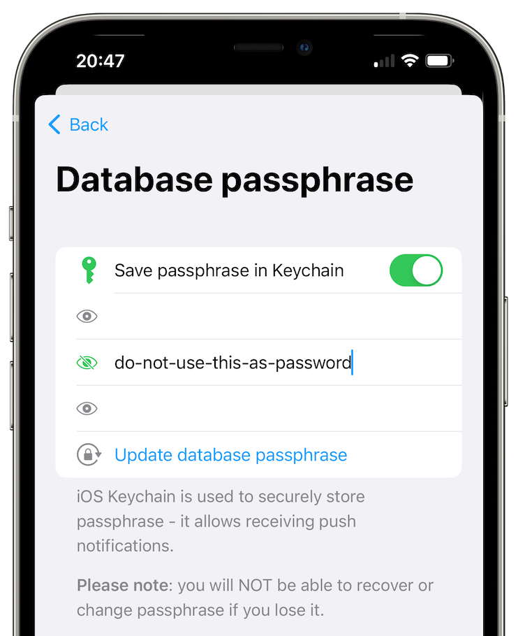

# Managing Your Data

## Automatic message deletion

Here you can choose to delete messages from your local chat database after a set period of time.

**Please note**: This option does not delete messages for other users, only for you. This option is set independently for each chat profile.

## Chat Database

To open your chat database settings:

- [Open the app settings](./app-settings.md#opening-the-app-settings).
- Tap on "Database passphrase & export" button.

### Database passphrase

By default, database passphrase is random, you have to set it manually to be able to export it.

### App data backup

Here you can allow the system to back up app data, wherever it is configured. A database passphrase must be set to use this.

### Export database

Here you can export the chat database to a file.

### Import database

Here you can import the chat database from a file.

### Delete database

Here you can delete your chat database. WARNING: Results in a loss of all your SimpleX Chat data! Unless you have just exported the chat database.

## Delete files and media

You can delete all sent and received files and media stored in the app via this option, without deleting the messages.
