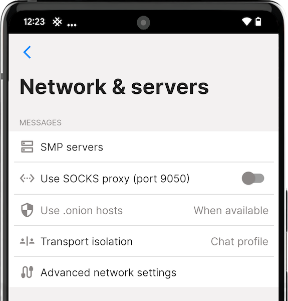

# Network & servers

You can adjust your network and server settings in SimpleX Chat. Tap or click on the following sections to learn more:

- [Messages and Files](#messages-and-files)
- [Private Message Routing](#private-message-routing)
- [Calls](#calls)

## Messages and Files

Here you can configure your own self-hosted SMP relays and change other network settings.

### SMP servers

 &nbsp;&nbsp;  &nbsp;&nbsp; 

By default, the app has preset relays configured – you can change them to your own self-hosted ones. You can also test your connection to your them. For more details, please read [this blog post](../../blog/20221206-simplex-chat-v4.3-voice-messages.md#smp-servers-configuration-and-password).

### XFTP Servers

By default, the app has preset relays configured – you can change them to your own self-hosted ones. You can also test your connection to them.

### Use SOCKS proxy (Android and Desktop only)

This option allows the app to connect via a SOCKS proxy that should be provided by some other app running on your device. The most typical use case for this is to run Orbot app that provides a SOCKS proxy to connect via Tor network, but it can be some other app that can proxy connections via some other overlay network.

### Use .onion hosts

#### Android

**Use .onion hosts** option is only available when **Use SOCKS proxy** is enabled. You can choose:

- `no` - choose this option if your SOCKS proxy does not connect via Tor network.
- `when available (default)` - when SOCKS proxy is enabled, the app assumes that it provides connections via Tor network and use .onion host addresses when SMP relays include them in their configuration.
- `required` - Choose this option if your SOCKS proxy connects via Tor network and you want to avoid connections without Tor. In this case, if the SMP relay address does not include .onion host, the connection will fail.

#### iOS

 &nbsp; 

Although iOS does not support SOCKS proxies, you can install Orbot app that works as a VPN provider. You can choose:

- `no (default)` -  choose this option if you do not use Orbot or if you use another VPN that proxies connections via some other overlay network.
- `when available` - use .onion host addresses when SMP relays include them in their configuration. Orbot VPN must be enabled for this option to work.
- `required` - Choose this option if you use Orbot VPN and you want to avoid connections without Tor. In this case, if the SMP relay address does not include .onion host, the connection will fail. If you use this option, you can enable "Disable Orbot for non-onion traffic" option in Orbot settings making the rest of your device traffic to not use Tor.

**Please note**: VPN on iOS can send some traffic to the usual network, if, for example, VPN app crashes. You can configure enable always-on VPN mode on managed iOS devices, but this is not applicable to most individual devices.

### Transport isolation (BETA)

**Please note**: This option is only available if you have toggled **Developer tools** on. For more details, please read [this blog post](../../blog/20230204-simplex-chat-v4-5-user-chat-profiles.md#transport-isolation).

#### Advanced network settings

If your network is slow, and your connections to the servers keep failing (you would see a spinner on your contacts), please increase TCP and protocol timeouts on this screen.

## Private Message Routing

SimpleX Chat offers IP address protection for users who need it. It's enabled when your IP address is unprotected while connecting to unknown servers by default. For more technical details on how private message routing works, please read [this blog post](../../blog/20240604-simplex-chat-v5.8-private-message-routing-chat-themes.html#private-message-routing).

#### To configure private routing:

1. [Open the app settings menu](./app-settings.md#opening-the-app-settings-menu).
2. Tap or click **Network and servers**.
3. From the **Private routing** dropdown, choose one of the following options:
   - `always` - Always use private routing.
   - `unknown relays` - Use private routing with unknown servers.
   - `unprotected (default)` - Use private routing with unknown servers when IP address is not protected.
   - `never` - Do not use private routing.
4. From the **Allow downgrade** dropdown, choose one of the following options:
   - `Yes (default)` - Send messages directly when your or destination server does not support private routing.
   - `When IP hidden` - Send messages directly when IP address is protected and your or destination server does not support private routing.
   - `No` - Do NOT send messages directly, even if your or destination server does not support private routing.
5. (Optional) Toggle **Show message status** on to show that your messages have been privately routed.

## Calls

Here you can configure your WebRTC ICE servers for your audio and video calls. For more details, please visit the [Audio & video calls page](./audio-video-calls.md#call-settings).
